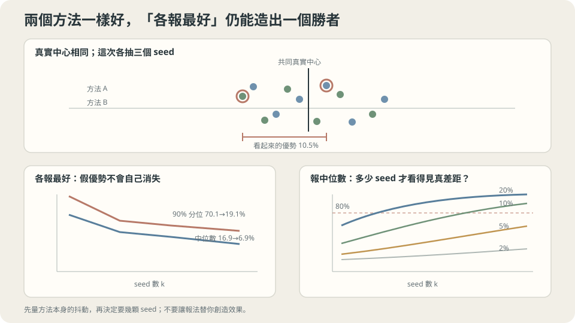

import Objectives from '../../../components/Objectives.astro';
import Ask from '../../../components/Ask.astro';
import Prereq from '../../../components/Prereq.astro';
import Question from '../../../components/Question.astro';
import Answer from '../../../components/Answer.astro';
import QuizBlock from '../../../components/QuizBlock.astro';
import Option from '../../../components/Option.astro';
import Explanation from '../../../components/Explanation.astro';
import VizPlan from '../../../components/VizPlan.astro';
import Remark from '../../../components/Remark.astro';
import Bridge from '../../../components/Bridge.astro';
import UsedBy from '../../../components/UsedBy.astro';
import Ref from '../../../components/Ref.astro';

# 同一個實驗跑三次結果都不同，該報哪一個？

<Objectives>
- **量出「取最好的那一次」能無中生有多大的差距。** 用兩個完全相同的方法各跑 $k$ 次的模擬，說出 $k=3$ 時那個假差距有多大。
- **用差值的標準誤規劃重複次數。** 分清單次散佈、平均的不確定性與檢定 power；不把一個 toy 的次數搬到其他任務。
- **說出該報什麼。** 中位數與範圍、種子數、以及 <Ref to="ml-nested-validation" mode="title"/> 的那個 $m$——並說出為什麼配對比較比各自獨立比更省種子。
</Objectives>

<Prereq items={frontmatter.prereqs} />

## 三次結果都不一樣

你把同一份程式跑了三次，只換了 random seed。測試準確率是 $0.831$、$0.847$、$0.822$。

**該報哪一個？**

「報最好的 $0.847$」聽起來有點心虛但很常見——畢竟那確實是你跑出來的。「報平均 $0.833$」比較誠實。「三個都報」看起來很囉唆。

而真正的問題還在後面：你的同事用 baseline 跑了三次，得到 $0.818$、$0.835$、$0.809$，報了 $0.835$。**你比他好 $1.2$ 個百分點。這代表什麼？**

看那六個數字就知道：兩組的範圍幾乎完全重疊。$1.2$ 個百分點的「優勢」小於任何一組自己的散佈。

這一篇要把這件事變成兩張可以直接使用的表：**取最好的那一次能無中生有多大的差距**，以及**要幾個種子才分得出一個真實的差距**。

<Ask>
同一個實驗跑三次結果都不同，該報哪一個？<br />
如果兩個方法其實一樣好，<br />
「各跑三次、各報最好」會讓贏家看起來好多少？
</Ask>

<Question id="Q1">
把「該報哪一個」翻成統計問題：你在估的是什麼？「取最好的 $k$ 次」與「取中位數」各是那個量的什麼估計？以及，為什麼兩個方法**各自**跑 $k$ 次再比最好的，會系統性地製造差距？

<Answer>
**在估什麼。** 一次實驗的結果 $X$ 是一個隨機變數，隨機性來自初始化、minibatch 順序、資料增強的抽樣、以及非確定性的 GPU 運算。你真正想知道的是這個方法的**典型表現**——也就是 $X$ 的分布的一個中心位置（平均或中位數）。

**兩種報法估的不是同一個東西。**

- **平均**在獨立同分布、期望有限時無偏；若變異數有限，標準誤為 $\sigma/\sqrt{k}$。樣本中位數不一般無偏；在唯一中位數附近密度正且夠平滑時，才有常見的 $1/\sqrt{k}$ 漸近尺度。
- **最好的那一次**估的是**分布的極值**，不是中心。而且它隨 $k$ **系統性地往好的方向漂**：$k$ 越大，$\max$ 越大。它不是「比較樂觀的中心估計」，它根本不是中心的估計。

兩個同分布方法獨立取最好結果，兩者的有號差在期望上仍為零；但事後把較好的叫作贏家，報的便是非負的絕對差。這會出現表面優勢，卻不代表取極值一定放大變異數；本篇表中的差距反而隨 $k$ 縮小。

於是「贏家」一定存在——只要有兩個數字，其中一個就比較大。問題不是「誰贏」，而是**贏多少才算有意義**。而那個門檻由那個差的散佈決定，下一節把它量出來。
</Answer>
</Question>

## 先量抖動本身

任何關於「差多少才有意義」的判斷，都要先知道單一次實驗的抖動有多大。

沿用 <Ref to="ml-loss-landscape" mode="title"/> 那組設定（$1\to32\to32\to1$ 的 $\tanh$ 網路、Adam $\eta=0.01$、4000 步、共用 toy），200 個 seed 的最終訓練 MSE：

```
中位數 0.0034   標準差 0.0010   範圍 [0.0023, 0.0085]
```

**標準差是中位數的 $29\%$。** 這個比例是後面每一個判斷的基礎——它告訴你「一次實驗」這個量測工具的解析度有多粗。

真實任務上這個比例差異很大：影像分類的準確率可能只有 $0.3\%$ 的抖動，強化學習可能超過 $50\%$。**所以這個數字要在自己的專案上量一次**，它比任何通用的建議都有用，而且只要跑五到十個 seed 就估得出來。



**圖說：** 只報每個方法最好的 seed 會憑空造出優勢；seed 數也決定能辨識多小的真實差距。

## 第一張表：取最好的能無中生有多少

模擬：兩個方法的結果**都**從那 200 個 seed 的分布裡抽，也就是它們真實品質完全相同。各抽 $k$ 個，各取自己最好的那一個，看「贏家」比「輸家」好多少（相對值）。重複兩萬次：

```
  k=  1  「贏家」比「輸家」好的幅度  中位數 16.9%   90 百分位 70.1%
  k=  3  「贏家」比「輸家」好的幅度  中位數 10.5%   90 百分位 26.8%
  k=  5  「贏家」比「輸家」好的幅度  中位數  8.9%   90 百分位 23.3%
  k= 10  「贏家」比「輸家」好的幅度  中位數  6.9%   90 百分位 19.1%
```

這次重抽實驗中，$k=3$ 的假優勢**中位數**是 $10.5\%$，不是平均值。數字只描述這個訓練 MSE 分布，不能拿來校正另一個任務的準確率。

> **只報各自最好的一次，不能把看起來的優勢直接當成方法的典型改善。**

這裡增加 $k$ 後差距變小，但最好結果仍不是中心估計。若分布有有限下界，樣本最小值可以收斂到支撐的下端點；所以不能說「極值不會收斂」。問題是它收斂的物件不是平均或中位數。

**所以問題不在種子數，在報法。** 換成中位數之後，$k$ 增加就真的在買精度（$1/\sqrt k$），這是下一張表的前提。

<Remark label="注意" summary="隨機性的來源不只有 seed，而且有些不在你的控制裡">
上面模擬的隨機性來自初始化與訓練過程。真實實驗還有幾層：

- **資料切分的隨機**：換一個 train/val 切法，結果會變（<Ref to="ml-cross-validation" mode="title"/> 量過單次留出的估計標準差是 $0.4069$ 而 5-fold 是 $0.0304$）。這一層常常比 seed 更大，卻更少被重複。
- **資料增強、dropout、shuffle 的抽樣**：通常和 seed 綁在一起。
- **非確定性的硬體運算**：GPU 上的浮點加法順序不固定，所以**同一個 seed 也可能給不同的結果**。這一層無法用固定 seed 消除，只能用確定性模式（通常更慢）或接受它。

實務上的建議是：**重複的時候把能重抽的都重抽**（seed 與資料切分一起換），因為你要估的是「這整套流程的表現」，不是「在這個特定切分上的表現」。只固定切分而換 seed，會系統性地低估抖動。
</Remark>

## 要跑幾次，先看我們要比較的差值

讓第 $i$ 次配對結果為 $D_i=X_i^A-X_i^B$。若各次重複獨立，差值有有限變異數 $\sigma_D^2$，則

$$
\bar D=\frac1k\sum_{i=1}^kD_i,
\qquad\operatorname{SE}(\bar D)=\frac{\sigma_D}{\sqrt{k}}.
$$

這比只知道 A 自己的抖動更有用：我們要辨識的是 A 與 B 的差。想讓標準誤縮小一半，大約要四倍次數；想辨識更小的差距，也需要更多次。若使用近似信賴區間，還要選信心水準；若問檢定 power，還要指定真實差距、顯著水準與檢定方式。**只知道相對抖動是 $29\%$，不能推出固定的種子數。**

> **在花掉算力之前，先問自己這個實驗有沒有能力回答我要問的問題。**

**配對為什麼可能省次數？** 因為 $\operatorname{Var}(X^A-X^B)=\operatorname{Var}(X^A)+\operatorname{Var}(X^B)-2\operatorname{Cov}(X^A,X^B)$。共用資料切分等因素若造成正協方差，就會減少差值的變異數；若沒有正相關，便沒有這個好處。相同 seed 編號也不自動代表兩個不同架構用了相同隨機量。

## 該報什麼

把最好結果與中心估計的差別，整理成報告時要交代的項目：

1. **報中位數與範圍（或四分位距），加上種子數。** 「$0.833$（5 seeds，範圍 $0.822$–$0.847$）」比「$0.847$」誠實，而且資訊量更大——讀者可以自己判斷一個差距有沒有意義。
2. **做配對比較**：兩個方法共用同一組 seed 與同一組資料切分，報**差值**的分布而不是兩個分布。
3. **報 $m$**：你總共比較過幾組設定（<Ref to="ml-nested-validation" mode="title"/> 的那個數字）。它和種子數是兩件不同的事，而且兩個都影響該怎麼讀你的數字。
4. **不要用「取最好的」當成績**，除非你明確說明那是最好的一次、並同時報中位數。
5. **測試集只讀一次**，而且是在所有種子都跑完、決定都做完之後。

報告時要交代：重複的是固定資料上的訓練，還是重新抽資料的整個流程。兩種問題的隨機來源不同；表中的 MSE 也不能直接換成準確率的相對百分比。範圍、四分位距描述單次散佈，信賴區間則描述某個估計量的不確定性。

## 把那個 $29\%$ 量成自己的數字

先量單次實驗的散佈，才能知道評估的不確定性有多大；比較兩個方法時，再記錄逐次配對差值。下面的程式先示範第一步。

做法只要五到十次重複：

```python
res = [run_everything(seed=s) for s in range(8)]     # seed 與資料切分一起換
med = np.median(res); spread = np.std(res)
print(f"中位數 {med:.4f}   標準差 {spread:.4f}   相對抖動 {spread/med*100:.0f}%")
```

少量重複提供初步線索，對長尾分布的標準差估計仍可能不穩。比較方法時，最好同時保留逐次配對差值；需要的次數還取決於這些差值的分布，不能只縮放一個標準差就宣稱極值表形狀不變。

## 改變重複次數，觀察兩種報法

<iframe loading="lazy" src="/personal_website/notes/research_areas/machine-learning-foundations/l3-experimental-method/l3-3-2.html" class="demo-frame" title="比較最好結果與中位數報法：互動 demo" style="height: 923px; width: 100%; border: none;"></iframe>

**互動 demo：** 用指定的右偏分布比較最好結果與中位數；圖中的正確率是兩組中位數排名正確的比例，不是有顯著水準控制的檢定 power，也不是其他任務需要多少次的答案。

## 檢查理解

<QuizBlock id="ml-l3-3-a">
一篇報告寫「我們的方法達到 $0.847$，優於 baseline 的 $0.835$」，兩者各跑了三次並各報最好的一次。根據本篇的模擬（相對抖動 $29\%$），最合適的評論是：
<Option>$1.4\%$ 的改善雖小但真實，因為兩者用同樣的流程比較。</Option>
<Option correct>只報最好結果不足以判斷典型表現；應報所有重複與配對差異。也不能用這篇 MSE 的假差距表直接判斷另一個準確率任務。</Option>
<Option>應該改用更大的模型來拉開差距。</Option>
<Explanation>
取最好結果改變了我們正在估的量，也丟掉配對差值的資訊。這個 toy 的 $10.5\%$ 是特定 MSE 分布下的模擬結果，不是其他任務的顯著性門檻。配對比較要讓資料切分與相關隨機來源盡量對齊；只使用相同 seed 編號，也不保證兩個訓練流程真的配對。
</Explanation>
</QuizBlock>

<QuizBlock id="ml-l3-3-b">
在第一張表裡，假優勢從 $k=1$ 的 $16.9\%$ 只降到 $k=10$ 的 $6.9\%$。為什麼增加種子數對它幫助這麼小？
<Option>因為 10 個種子還是太少，$k=100$ 就會趨近零。</Option>
<Option correct>最好結果與中心是不同物件。增加次數可能讓最好結果靠近支撐端點，卻不是在估典型表現；應先選定要估的量。</Option>
<Option>因為兩個方法的真實品質其實有微小差距。</Option>
<Explanation>
更多重複讓平均或中位數的估計更穩，但也讓最好結果更接近分布的有利端點。兩組最好結果的差可能趨近零，也可能不會，要看分布；無論如何，它不是在估兩個方法的典型差距。
</Explanation>
</QuizBlock>

<QuizBlock id="ml-l3-3-c">
一個團隊的相對抖動是 $29\%$，想驗證預期 $2\%$ 的改善。規劃重複次數時，還需要什麼？
<Option>跑 100 個種子，這樣就能確認。</Option>
<Option correct>定義要估的差值、其變異數、信心水準或檢定方式，以及可用預算。單次相對抖動不足以決定固定次數。</Option>
<Option>直接跑三個種子，如果有改善就採用。</Option>
<Explanation>
先定義想辨識的差距，再估計配對差值的變異數，才有辦法安排重複次數。固定說要跑 100 次，沒有交代 effect size、信心水準或預算，還不能回答這個問題；換成 CV 也不是所有訓練隨機性的通用解法。
</Explanation>
</QuizBlock>

<QuizBlock id="ml-l3-3-d">
下列哪一句**不對**？
<Option>配對結果若正相關，可以降低差值的變異數。</Option>
<Option>若要估重新抽資料後整個流程的表現，需要把資料抽樣或切分也納入重複；固定資料的問題則可以固定它。</Option>
<Option correct>只要固定 random seed，同一份程式在同一台機器上就一定會給出完全相同的結果。</Option>
<Explanation>
第三句在 GPU 上通常不成立：浮點加法不滿足結合律，而許多平行歸約的順序是不確定的，所以同一個 seed 也可能給出略微不同的結果。多數框架提供「確定性模式」可以關掉這個來源，代價是速度。知道這一層存在很重要——否則你會在追一個根本不存在的 bug，或者以為自己的實驗比實際更可重現。
</Explanation>
</QuizBlock>

<UsedBy slug={frontmatter.slug} />

<Bridge to="ml-mlp">
前四個 class 談的都是**流程**：定義要最小化的量、確認它真的被降下來、誠實地比較不同的設定。它們對「模型長什麼樣」幾乎沒有意見——所有的實驗都用一個多項式或一個小 MLP 就跑完了。

接下來的單元 換一個角度：**把什麼結構寫進模型裡**。每一個架構都是一個關於資料長什麼樣的宣告——平移過去還是同一件事、遠處的東西可以先不看、這一組輸入沒有順序——而那些宣告如果對得上資料，同樣的參數量就能學得更好。起點是最沒有宣告的那一個：一個夠寬的 MLP 可以逼近任何連續函數，而這件事為什麼幾乎沒有實務意義。
</Bridge>

## 參考文獻

1. Dodge, J. et al. [*Show Your Work: Improved Reporting of Experimental Results.*](https://aclanthology.org/D19-1224/) EMNLP 2019.（把「調了多少、跑了幾次」當成結果的一部分報告，並給出一個隨預算變化的表現曲線。）
2. Bouthillier, X. et al. [*Accounting for Variance in Machine Learning Benchmarks.*](https://proceedings.mlsys.org/paper_files/paper/2021/hash/cfecdb276f634854f3ef915e2e980c31-Abstract.html) MLSys 2021.（系統性地拆開各層隨機性的貢獻，並指出只換 seed 會低估抖動。）
3. Henderson, P. et al. [*Deep Reinforcement Learning that Matters.*](https://arxiv.org/abs/1709.06560) AAAI 2018.（在抖動特別大的領域裡，把「取最好的幾次」造成的假結論量出來。）
