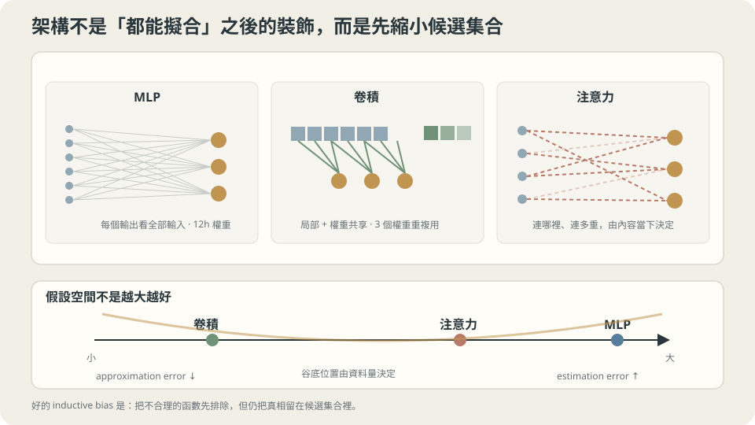

import Objectives from '../../../components/Objectives.astro';
import Ask from '../../../components/Ask.astro';
import Prereq from '../../../components/Prereq.astro';
import Question from '../../../components/Question.astro';
import Answer from '../../../components/Answer.astro';
import QuizBlock from '../../../components/QuizBlock.astro';
import Option from '../../../components/Option.astro';
import Explanation from '../../../components/Explanation.astro';
import VizPlan from '../../../components/VizPlan.astro';
import Remark from '../../../components/Remark.astro';
import Bridge from '../../../components/Bridge.astro';
import UsedBy from '../../../components/UsedBy.astro';
import Ref from '../../../components/Ref.astro';

# 什麼都能擬合，那為什麼還需要別的架構？

<Objectives>
- **universal approximation 保證的是「存在」，不是「學得到」。** 說出那個定理的三個缺口（要多寬、學不學得到、泛不泛化），並在共用 toy 上量出「表達得出來但學不到」的樣子。
- **同一個網路對不同頻率的目標，難度差好幾個數量級。** 用固定預算下的訓練曲線說出「低頻先學」這件事，以及它為什麼是一種歸納偏置。
- **說出 MLP 的歸納偏置是什麼——以及它少了什麼。** 在小影像 toy 上量出「打亂像素順序不影響 MLP」與「換一個位置就不會了」，並用它解釋後面每一個架構在加什麼。
</Objectives>

<Prereq items={frontmatter.prereqs} />

## 一台夠多層的計算機

前幾個單元處理了目標、訓練與評估，現在回頭問模型要長什麼樣子。像用積木搭一座橋：給足夠多的積木，也許能拼出來，但若事先有適合橋梁的零件，找出搭法就可能容易得多。**模型架構能不能也先放進我們知道的結構？**

Cybenko [1] 的 universal approximation 給了一個起點：使用適當的連續 sigmoidal 激發函數，一個夠寬的隱藏層可以在 $[0,1]^d$ 上一致逼近連續函數。不是任意非線性都適用，也不是一個固定寬度就能解所有問題。

這句話讀起來像是把問題關掉了：既然一種架構什麼都能做，剩下的就只是把它放大。

但真實世界完全不是這樣走的。過去十幾年真正推動進展的幾乎都是**架構**——卷積、殘差、注意力——而不是「把 MLP 加寬」。如果 MLP 什麼都能擬合，這些東西在買什麼？

<Ask>
一個夠寬的 MLP 能逼近任何函數，<br />
那為什麼幾乎沒有人拿純 MLP 去做影像？<br />
那個定理少講了什麼？
</Ask>

<Question id="Q1">
把 universal approximation 寫清楚：它到底保證了什麼？把它和我們真正要的東西逐項對照——哪幾件事它沒說？

<Answer>
**定理說的。** 對任何連續的 $f:[0,1]^d\to\mathbb R$ 與任何 $\varepsilon>0$，存在一個寬度 $h$ 與一組參數 $\theta$，使得

$$
\sup_{x\in[0,1]^d}\big|f_\theta(x)-f(x)\big|<\varepsilon .
$$

注意那兩個字：**存在**。它是一個關於假設空間 $\mathcal F$ 有多大的敘述——用 <Ref to="ml-learning-from-examples" mode="title"/> 的語言，它說的是 **approximation error 可以被壓到任意小**。

**它沒說的三件事，剛好就是 L0 到 L2 整段的內容。**

1. **要多寬。** 這個存在性敘述沒有提供適合手上目標與精度的實用寬度。需求會隨函數、維度與激發函數改變；不能只因為目標高頻就宣稱寬度一定隨精度指數成長。
2. **學不學得到。** 定理是一個存在性敘述，它不說梯度下降會不會找到那組參數。<Ref to="ml-loss-landscape" mode="title"/> 已經看過：能表示不等於能走到。本篇會把這個缺口量出來——同一個網路、同一組超參數，只換目標的頻率，訓練 MSE 從 $0.0000$ 變成 $0.3875$。
3. **泛不泛化。** 定理中的那組理想參數對整個區域都好；但有限訓練資料並沒有直接告訴我們它在哪裡。訓練點上誤差小，不保證找到的是那組參數。

**所以定理關掉的只是三個問題裡的第一個。** 而架構真正在做的事，是把後兩個變容易——它不是在擴大 $\mathcal F$，多半是在**縮小**它，只是縮得剛好把真相留在裡面。
</Answer>
</Question>

## 架構就是一個先驗

把架構想成一句話：**「我事先相信答案長這樣。」**

- **MLP**：沒有預先指定輸入座標的鄰近關係或平移共享；但深度、激發函數、初始化與訓練仍帶有偏好。
- **卷積**：我相信「局部」與「平移之後還是同一件事」。
- **注意力**：我相信「哪些位置彼此相關，要由內容決定」。
- **殘差**：我相信「這一層多半只需要對前一層做小修正」。

這些相信是有代價的：相信錯了，真相就不在 $\mathcal F$ 裡（bias 變大）。相信對了，回報很大——同樣的資料量能學到的東西多得多，因為**候選函數少了，資料就更能把它們區分開**（<Ref to="ml-overfitting-underfitting" mode="title"/> 說過那正是過擬合的來源）。

MLP 在這個座標上是一個端點：它的先驗幾乎是空的。而「幾乎沒有先驗」聽起來很中立，其實不是——本篇最後會看到它其實內建了一個相當強的先驗（對頻率的偏好），只是那個先驗和影像、語言的結構沒什麼關係。



**圖說：** 架構以不同方式縮小假設空間；歸納偏置把真相留在較小的候選集合裡，才會幫助學習。

## 加寬買到什麼、付出什麼

先把 universal approximation 的第一個缺口量掉：加寬到底買到多少 approximation error？

共用 toy（$n=30$）、$1\to h\to h\to1$ 的 $\tanh$ 網路、Adam $\eta=0.01$ 跑 4000 步，每個寬度 5 個 seed 取中位數：

```
  h=   2  參數     13  訓練 0.0140   真實風險 0.0285
  h=   4  參數     33  訓練 0.0132   真實風險 0.0286
  h=   8  參數     97  訓練 0.0084   真實風險 0.0443
  h=  16  參數    321  訓練 0.0039   真實風險 0.0447
  h=  32  參數   1153  訓練 0.0033   真實風險 0.0454
  h=  64  參數   4353  訓練 0.0030   真實風險 0.0478
  h= 128  參數 16897  訓練 0.0026   真實風險 0.0440
```

這次實驗加寬後訓練誤差下降，真實風險卻沒有一起改善。$h=2$ 是每個隱藏層兩個**單元**，不是只有兩個參數；有限步結果也不能直接拆成 approximation error 與 variance。它示範的是「訓練得更準不等於泛化更好」。

這正是 <Ref to="ml-overfitting-underfitting" mode="title"/> 的 U 形，只是設定從多項式次數換成網路寬度。**universal approximation 保證的那個「夠寬」，在只有 30 筆資料的時候是一個你不會想去的地方。**

> **定理保證某組參數存在；實際問題仍要分開檢查表示能力、最佳化與泛化。**

<Remark label="補充" summary="為什麼「一層就夠」的定理在實務上沒有人用一層">
Cybenko 的定理只需要**一個**隱藏層。但實務上幾乎所有網路都是深的，理由不在表達力而在**效率**：有一類函數，用深度 $D$ 的網路需要 $O(h)$ 個單元，用一層則需要 $O(h^{D})$ 個。深度讓「組合」變便宜——每一層可以重用前一層算好的中間結果。

這件事的一般形狀在 L4 會反覆出現：**同樣一個函數，不同的寫法所需要的參數量差好幾個數量級**，而架構的工作就是挑一種對你的資料便宜的寫法。卷積是「重用同一組權重掃過所有位置」，注意力是「重用同一組投影處理所有 token」，都是同一種便宜。
</Remark>

## 同一個網路，換一個頻率就學不到了

第二個缺口——學不學得到——需要一個能把「表達力」與「可學性」分開的實驗。做法是**固定網路與超參數，只換目標函數**。

目標取 $\sin(2\pi k x)$，$k$ 是週期數。三件事要先講清楚：資料是無噪聲的（$n=200$ 均勻取樣），$k\le32$ 的函數對一個 $64\times64$ 的網路來說**表達力綽綽有餘**（它有 4353 個參數），而 $0.5$ 是「輸出恆為零」的 MSE——也就是完全沒學到的水準。

```
同一個 64×64 網路、同一組超參數，只換目標的頻率（2 seed 中位數）
   k        200 步      1,000 步      5,000 步
   1        0.0100        0.0000        0.0000
   4        0.4630        0.0003        0.0004
  16        0.4962        0.4717        0.0015
  32        0.4972        0.4960        0.3875
```

**橫著讀是時間，直著讀是難度。** $k=1$ 在 200 步就幾乎學完；$k=4$ 要 1000 步；$k=16$ 要 5000 步；$k=32$ 跑完 5000 步仍然停在 $0.3875$——**離「什麼都沒學到」（$0.5$）比離「學會了」近得多**。

結果和 Rahaman 等人 [2] 分析的 spectral bias 相呼應：某些網路與訓練條件下，低頻較容易先學到。不過同一組超參數在低頻成功，不能排除它對高頻不適合；參數數量也不是固定網路表示能力足夠的證明。這個實驗提供現象，不唯一辨認原因。

> **「什麼都能擬合」與「在你的預算內學得到」之間，隔著一個和目標長什麼樣子有關的鴻溝。**

關鍵是：**這本身就是一個先驗**。MLP 並不是「沒有偏見」的——它偏好平滑、低頻的解。在很多任務上這個偏好剛好是對的（真實世界的函數多半平滑），這也解釋了為什麼 MLP 在表格資料上還是很有用。它壞在**那個偏好和影像、語言的結構無關**，下一節就是這件事。

## MLP 對「哪些像素相鄰」一無所知

**系列的第二個 toy。** L4 的三篇架構筆記需要一個有空間結構的資料。原本的計畫是用 MNIST 的子集，但那需要下載；改用一個**自己造的小影像 toy**，好處是結構完全已知、完全可重現，而且我們可以隨意控制「線出現在哪裡」——那正是要量的東西。

```python
IMG = 12
def toy_img(n=600, size=IMG, noise=0.15, seed=0, x_range=(0, 1.0)):
    """size×size 的二元影像分類：class 0 = 一條橫線，class 1 = 一條直線。
    線的位置隨機；x_range 限制線的中心可以落在畫面的哪一段。"""
    rng = np.random.default_rng(seed)
    X = np.zeros((n, size, size)); y = np.zeros(n, dtype=int)
    lo, hi = x_range
    for i in range(n):
        cls = i % 2; y[i] = cls
        L = 6
        c = int(rng.uniform(lo, hi) * (size - L))     # 沿著線的方向的位置
        r = rng.integers(0, size)                     # 另一個方向的位置
        if cls == 0: X[i, r, c:c+L] = 1.0             # 橫線
        else:        X[i, c:c+L, r] = 1.0             # 直線
    X += noise * rng.standard_normal(X.shape)
    return X.reshape(n, -1), y*2 - 1                  # 標籤是 ±1
```

任務是「這張圖裡的線是橫的還是直的」。人類看一眼就知道，而且**換一個位置完全不影響判斷**——這正是要檢驗的性質。模型是 $144\to64\to64\to1$ 的 MLP，Adam 訓 3000 步，三個 seed 取中位數。

**第一段：先確認它學得會。**

```
  訓練 1.000   測試 0.968
```

沒問題。$4$ 千多個參數、600 筆資料，MLP 把這個任務做得很好。

**第二段：只在左半邊訓練，測右半邊。**

```
  訓練(左) 1.000   測試(右) 0.625
```

**訓練集上完美，換一個位置就掉到 $0.625$**（亂猜是 $0.5$）。同樣是「橫線 vs 直線」，只是線出現在畫面的另一半，模型就幾乎不會了。

原因很直接：MLP 的第一層是 $144$ 個獨立的權重連到每個隱藏單元。它學到的是「第 37 號與第 38 號像素同時亮」這種**和位置綁死**的規則。右半邊的像素編號它從來沒有學過，那裡的權重還停在初始值。**「線」這個概念從來沒有被學到，被學到的是「某些編號的像素會一起亮」。**

**第三段：刻意違反——把像素順序整個打亂。**

取一個固定的隨機排列，套在**所有**影像上（訓練與測試都用同一個），再重跑第一段：

```
  訓練 1.000   測試 0.975
```

**和沒有打亂時一模一樣**（$0.968$ 對 $0.975$，差在 seed 的抖動裡）。把一張圖剪成 144 塊、按同一個亂序重排，人類完全認不出那是什麼，MLP 卻毫無感覺。

令 $P$ 是固定置換，輸入改為 $Px$ 時，可把第一層改成 $WP^{-1}$，保留原來的函數。因此是**整個假設空間對重新編號封閉**，不是同一個已訓練 MLP 滿足 $f(Px)=f(x)$。

> **MLP 可以表示局部結構，但沒有預先給相鄰像素較特殊的關係；卷積會把這個偏好直接寫進架構。**

這三個數字合起來就是整個 L4 的動機。後面每一個架構都是在把某一個「人類早就知道的結構」寫進假設空間裡：卷積寫進局部與平移（它會讓第二段的 $0.625$ 變高，而且會讓第三段的打亂**真的**造成傷害——那才是「模型看得到結構」的證據）；注意力寫進「由內容決定要看誰」；殘差寫進「每一層只做小修正」。

## 加寬、換頻率、打亂像素：三個把定理掏空的實驗

<iframe loading="lazy" src="/personal_website/notes/research_areas/machine-learning-foundations/l4-architectures/l4-0-2.html" class="demo-frame" title="加寬、換頻率、打亂像素：三個把定理掏空的實驗：互動 demo" style="height: 871px; width: 100%; border: none;"></iframe>

**互動 demo：同一個網路、同樣的步數，目標從 1 個週期換到 32 個，訓練誤差差好幾個數量級。**

## 檢查理解

<QuizBlock id="ml-l4-0-a">
一個團隊引用 universal approximation 主張「我們的 MLP 表達力足夠，所以問題一定出在資料或最佳化」。根據本篇的三個實驗，這個推論：
<Option>成立，定理保證表達力足夠。</Option>
<Option correct>定理連這個固定寬度的表示能力都沒有直接保證；它說某個足夠寬的網路存在，仍要分開檢查手上的容量、最佳化與泛化。</Option>
<Option>不成立，因為 MLP 其實沒有 universal approximation 的性質。</Option>
<Explanation>
存在某個足夠寬的網路，不等於手上的固定網路已經夠寬。表示能力、最佳化與泛化要分開檢查；不能直接用存在性定理排除容量問題。
</Explanation>
</QuizBlock>

<QuizBlock id="ml-l4-0-b">
把影像的像素順序用一個固定的隨機排列打亂之後，MLP 的測試準確率從 $0.968$ 變成 $0.975$。最準確的解讀是：
<Option>打亂像素其實讓任務變簡單了一點。</Option>
<Option correct>固定置換可以透過第一層權重重新編號，因此表示的函數集合沒有改變；但某個固定網路不一定對輸入置換不變，兩次有限步結果也不必完全相同。</Option>
<Option>說明這個 toy 太簡單，換成真實影像就不會這樣。</Option>
<Explanation>
把固定像素置換吸收到第一層權重，能證明 MLP 的函數集合不變；這不等於同一組權重對置換不變。實驗中的差異還會受到初始化、最佳化與資料影響；卷積的局部共享則明確使用了原來的鄰接結構。
</Explanation>
</QuizBlock>

<QuizBlock id="ml-l4-0-c">
在「只在左半訓練、測右半」的實驗裡準確率是 $0.625$（亂猜 $0.5$）。若把訓練資料量從 600 筆加到 6000 筆（仍然只有左半），最可能的結果是：
<Option correct>只增加左半資料不保證解決位置轉移；可以加入右半資料、平移增強或共享權重的架構，再用實驗比較。</Option>
<Option>一定會明顯改善，因為更多資料總是有幫助。</Option>
<Option>會變差，因為模型會更加過擬合左半。</Option>
<Explanation>
右半仍有背景噪聲，對應權重不是完全收不到梯度；MLP 也能表示平移規則。問題是有限資料與訓練沒有保證它會學到這種共享，而非假設空間完全不含答案。
</Explanation>
</QuizBlock>

<QuizBlock id="ml-l4-0-d">
下列哪一句**不對**？
<Option>寬度掃描裡訓練誤差單調下降而真實風險在 $h=4$ 之後變差，是 <Ref to="ml-overfitting-underfitting" mode="title"/> 那條 U 形換一個設定的版本。</Option>
<Option>spectral bias 本身就是一種歸納偏置：MLP 偏好平滑、低頻的解。</Option>
<Option correct>MLP 沒有歸納偏置，所以它在所有任務上都是一個中性的起點。</Option>
<Explanation>
第三句的前半就錯了：頻率實驗證明 MLP 有一個很強的偏好（低頻先學、高頻可能學不到）。後半也不成立——「沒有偏置」在有限資料下不是優點而是缺點，因為 <Ref to="ml-overfitting-underfitting" mode="title"/> 說過，候選函數太多、資料分不出來，就是過擬合的來源。正確的說法是：MLP 的偏置**和影像、語言的結構無關**，不是它沒有偏置。
</Explanation>
</QuizBlock>

<UsedBy slug={frontmatter.slug} />

<Bridge to="ml-backprop">
架構要能被討論，前提是它們都能訓練。而「一個任意接起來的計算圖要怎麼算梯度」這件事，到目前為止一直被當成理所當然——`mlp.py` 裡那三十行反向的程式碼從來沒被解釋過。接著補上：鏈式法則的向量形式、計算圖，以及為什麼**反向**比正向便宜得多（實測 2497 個參數時是 840 倍）。
</Bridge>

## 參考文獻

1. Cybenko, G. [*Approximation by Superpositions of a Sigmoidal Function.*](https://doi.org/10.1007/BF02551274) Mathematics of Control, Signals and Systems 1989.（universal approximation 的原始論文；注意它的敘述是存在性的。）
2. Rahaman, N. et al. [*On the Spectral Bias of Neural Networks.*](https://proceedings.mlr.press/v97/rahaman19a.html) ICML 2019.（低頻先被學到的系統性實驗與理論分析，本篇頻率實驗的原型。）
3. Bronstein, M., Bruna, J., Cohen, T., Veličković, P. [*Geometric Deep Learning.*](https://arxiv.org/abs/2104.13478) 2021.（把「架構＝寫進假設空間的對稱性」當成統一框架；本篇「架構是一個先驗」那一節的來源。）
