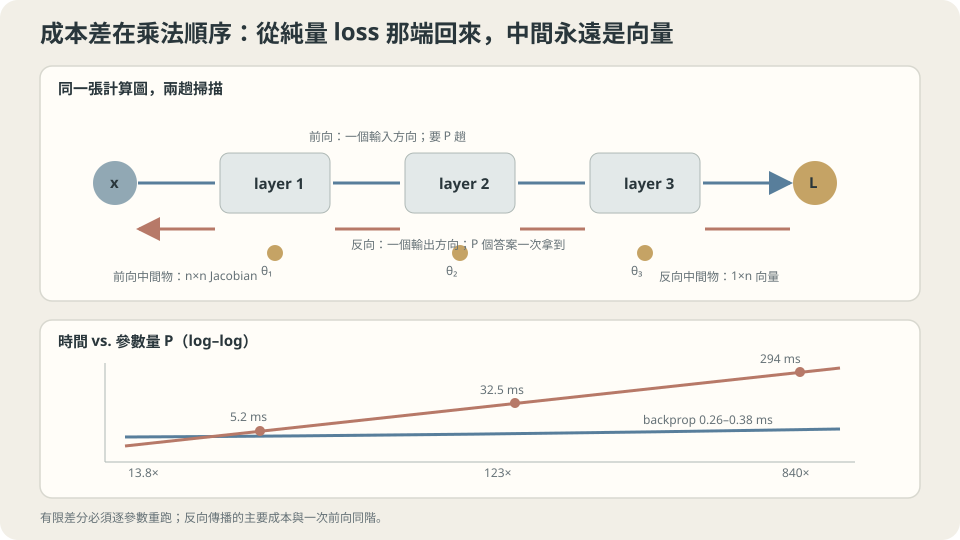

import Objectives from '../../../components/Objectives.astro';
import Ask from '../../../components/Ask.astro';
import Prereq from '../../../components/Prereq.astro';
import Question from '../../../components/Question.astro';
import Answer from '../../../components/Answer.astro';
import QuizBlock from '../../../components/QuizBlock.astro';
import Option from '../../../components/Option.astro';
import Explanation from '../../../components/Explanation.astro';
import VizPlan from '../../../components/VizPlan.astro';
import Remark from '../../../components/Remark.astro';
import Bridge from '../../../components/Bridge.astro';
import UsedBy from '../../../components/UsedBy.astro';
import Ref from '../../../components/Ref.astro';

# 生產線出了瑕疵，怎麼知道是哪一站的責任？

<Objectives>
- **寫出局部敏感度如何沿計算圖組合。** 分清一個輸入方向的 JVP、一個輸出方向的 VJP，以及求整個 Jacobian 的成本。
- **說出反向模式為什麼適合純量損失。** 成本通常是前向運算的常數倍，不是絕對時間與參數個數無關。
- **判斷什麼時候該用數值梯度。** 量出中央差分誤差對步長的 U 形，並說出 gradient checking 的正確用法與它的極限。
</Objectives>

<Prereq items={frontmatter.prereqs} />

## 一條長長的生產線

前面每個更新都需要梯度，但參數很多時要怎麼算？想像一條有 50 站的生產線，最後成品被扣了 3 分。我們問的不是誰應受責備，而是敏感度：**第 17 站的溫度改一點，扣分會變多少？**

有一個笨辦法：**把第 17 站調高一點，整條線重跑一次，看扣分差多少。** 這行得通，但 50 站就要重跑 50 次；如果每一站有 20 個參數，就是 1000 次。

而這正是我們的處境。<Ref to="ml-gradient-descent" mode="title"/> 以來每一個方法都需要 $\nabla_\theta L$，而 $\theta$ 有幾萬、幾百萬、幾十億個分量。逐個試一遍是不可能的。

<Ask>
一條長長的生產線出了瑕疵，<br />
怎麼一次算出每一站的責任，<br />
而不是每一站各重跑一次？
</Ask>

<Question id="Q1">
把「每一站的責任」翻成數學。鏈式法則給了一串連乘——那為什麼還會有「便宜」與「貴」的差別？兩種乘法順序各是什麼，各要多少運算？

<Answer>
**先寫下來。** 一個 $D$ 層的網路是一串函數的合成：

$$
L=\ell\big(h_D\big),\quad h_\ell=f_\ell(h_{\ell-1};\theta_\ell),\quad h_0=x .
$$

鏈式法則（<Ref to="math-total-derivative" mode="title"/>）給

$$
\frac{\partial L}{\partial \theta_\ell}
=\underbrace{\frac{\partial L}{\partial h_D}}_{1\times n_D}
\underbrace{\frac{\partial h_D}{\partial h_{D-1}}\cdots\frac{\partial h_{\ell+1}}{\partial h_\ell}}_{\text{一串 Jacobian}}
\underbrace{\frac{\partial h_\ell}{\partial \theta_\ell}}_{n_\ell\times|\theta_\ell|}.
$$

**式子本身沒有歧義，但「先乘哪一對」有。** 矩陣連乘滿足結合律，所以答案一樣；**成本不一樣**。

**從左往右（反向模式）。** 先算最左邊那個 $1\times n_D$ 的列向量，再一路往右乘：

$$
\big(\underbrace{(\,(\,\text{列向量}\times J_D)\times J_{D-1}\,)\cdots}_{\text{每一步都是「向量 × 矩陣」}}\big)
$$

每一步的成本是 $O(n^2)$（一個長度 $n$ 的向量乘一個 $n\times n$ 的矩陣），走完 $D$ 層是 $O(Dn^2)$——**和一次前向傳播同一個量級**。而且走這一趟的過程中，每一層的 $\partial L/\partial h_\ell$ 都被算出來了，所以**所有**層的參數梯度一次拿齊。

若先把中間 Jacobian 全部乘成矩陣，等寬情況可能要 $O(Dn^3)$；但**這不是前向模式必須做的事**。前向模式可以只傳一個方向 $\dot h_\ell=J_\ell\dot h_{\ell-1}$，一次也只需和前向相近的成本。差別是：要對全部 $P$ 個參數求導，它通常需要 $P$ 個方向；純量損失的反向模式只需一個輸出方向。

**關鍵是損失是純量。** 最左邊那一項是 $1\times n_D$ 的**列向量**，右邊則是 $n_\ell\times|\theta_\ell|$ 的**大矩陣**。從窄的那一端開始乘，中間產物一直是向量；從寬的那一端開始，中間產物是矩陣。

用生產線的話說：**從成品往回問「這一站多影響一點會怎樣」，一次就把整條線的責任分完；從每一站往前推「我動一下會怎樣」，每一站都要推一遍。**

因此反向模式省掉的是「為每個參數各重跑一次」的倍數。$P$ 並沒有從絕對成本消失：模型越大，前向與反向本身通常也越貴。
</Answer>
</Question>

## 兩個方向，兩種問句

自動微分的兩種模式，可以用它們各自回答的問句記住：

- **前向模式（JVP，Jacobian-vector product）**：「**輸入沿著這個方向動一點，輸出會怎麼動？**」一次前向掃描，成本 $\approx$ 一次前向，回答**一個輸入方向**。輸入有 $P$ 個維度就要掃 $P$ 次。
- **反向模式（VJP，vector-Jacobian product）**：「**輸出的這個組合，對每一個輸入各有多敏感？**」一次反向掃描，成本 $\approx$ 常數倍的前向，回答**一個輸出方向**，但一次給出**全部** $P$ 個輸入的答案。

於是規則很簡單：

$$
f:\mathbb R^{P}\to\mathbb R^{m}
\quad\Longrightarrow\quad
\text{前向的成本}\propto P,\qquad
\text{反向的成本}\propto m .
$$

訓練時 $m=1$（損失是一個純量）而 $P$ 是幾百萬，所以反向壓倒性地便宜。**但這個結論會隨著問題翻轉**：如果你要的是一整個 Jacobian（$m$ 很大），或者輸入只有兩三個維度，前向模式反而便宜。

「反向傳播」就是「把反向模式自動微分用在 $m=1$ 的損失上」，沒有多一分神秘。



**圖說：** 純量損失的反向模式讓中間量保持為向量，一次掃描即可取得所有參數梯度。

## 一次反向就把全部拿到

把上面的成本算式驗證一次。同一個網路、同一個位置、同一個梯度，兩種算法：

```python
# 反向傳播：一次前向 + 一次反向
G, _ = mlp.grads(P, X, y)

# 有限差分：每個參數各擾動兩次，重跑整個前向
for i in range(n_params):
    vp = v0.copy(); vp[i] += eps
    vm = v0.copy(); vm[i] -= eps
    g_fd[i] = (loss(unflat(P, vp)) - loss(unflat(P, vm))) / (2*eps)
```

```
  參數     33  反向傳播   0.38 ms   有限差分     5.2 ms   倍數  13.8×   相對差 2.22e-10
  參數    321  反向傳播   0.26 ms   有限差分    32.5 ms   倍數 123.0×   相對差 4.29e-10
  參數   2497  反向傳播   0.35 ms   有限差分   294.3 ms   倍數 840.5×   相對差 8.07e-10
```

**三件事同時被證實了。**

這些小模型的反向時間相近，可能受固定開銷與量測噪聲影響；不能推論大模型的時間也不增加。要驗證常數倍關係，應比較同一模型的前向與反向成本，再觀察它們隨規模如何變化。

**有限差分線性成長**（$5.2\to32.5\to294$ ms，參數約 $10\times$／$8\times$，時間約 $6\times$／$9\times$），倍數因此一路長到 $840\times$。真實網路的 $P$ 是 $10^6$ 到 $10^{11}$，那個倍數就是同樣的數量級——**不是「慢一點」，是「不可能」。**

**兩者算出來的是同一個梯度**（相對差 $10^{-10}$）。這一欄很重要：它說明反向傳播不是近似，是**精確**的導數（在浮點誤差之內）。它和有限差分的差別純粹是算法，不是精度取捨。

> **反向傳播不是一個近似技巧，是同一個導數的一種便宜算法。**

<Remark label="補充" summary="代價是記憶體：activation 要留著">
反向那一趟需要每一層的中間值（前向算出來的 $h_\ell$），因為 Jacobian 依賴它們。所以反向傳播用**時間換記憶體**：時間是一次前向的常數倍，記憶體是 $O(D\times\text{每層的大小})$。

因此可以用 gradient checkpointing：只存部分中間值，反向時重算其餘部分，以更多計算換較少記憶體。改善比例取決於切點、架構與實作；混合精度則是另一種降低儲存量的做法。

可以直接記成：反向傳播把「$P$ 次前向」換成了「一次前向 + 一次反向 + 一份 activation」。前兩項是時間，第三項是記憶體——而深度學習框架的工程史，有一大半是在管理第三項。
</Remark>

## 什麼時候還是要用數值梯度

反向傳播全面勝出之後，有限差分只剩一個用途，但那個用途很重要：**檢查你自己寫的反向對不對**（gradient checking）。手寫一層新的運算時，反向的公式很容易差一個轉置、一個因子或一個和的軸。

做法是挑幾十個座標，比對兩者。而這時步長 $h$ 要選對——它有一個 U 形：

```
中央差分的相對誤差對步長（48 寬的網路，和反向傳播比）
  h=1e-01   1.087e-03
  h=1e-03   1.091e-07
  h=1e-05   1.671e-11      ← 最好
  h=1e-07   1.449e-09
  h=1e-09   1.343e-07
  h=1e-11   1.223e-05
```

**兩邊各有一個誤差來源，方向相反。**

**左邊是截斷誤差。** 中央差分的 Taylor 展開（<Ref to="math-taylor" mode="title"/> 的三階項）給

$$
\frac{L(\theta+h)-L(\theta-h)}{2h}=L'(\theta)+\frac{h^2}{6}L'''(\theta)+O(h^4),
$$

誤差 $\propto h^2$。實測從 $h=10^{-1}$ 到 $10^{-3}$ 誤差掉了約 $10^{4}$ 倍（$1.1\times10^{-3}\to1.1\times10^{-7}$）——**正好是 $h^2$。**

**右邊是捨入誤差。** 分子是兩個接近的數相減，雙精度浮點只有約 16 位有效數字，所以分子的絕對誤差大約是 $|L|\times10^{-16}$，除以 $2h$ 之後是 $\propto1/h$。實測從 $h=10^{-7}$ 到 $10^{-11}$ 誤差長了約 $10^{4}$ 倍——**正好是 $1/h$。**

這次例子的最佳 $h$ 約為 $10^{-5}$，不是通用常數。檢查時可用雙精度掃幾個步長，固定隨機性，避開不可微點，並同時看絕對與相對誤差；梯度很接近零時，單看相對誤差尤其容易誤判。

> **有限差分的精度有一個下限，而且那個下限不在 $h\to0$。**

<Remark label="注意" summary="用單精度做 gradient checking 會失敗">
上面的 U 形谷底位置由浮點的有效位數決定。雙精度（`float64`）約 16 位，谷底在 $h\approx10^{-5}$、誤差 $\approx10^{-11}$；**單精度（`float32`）只有約 7 位**，谷底移到 $h\approx10^{-2}$ 附近而且谷底的誤差只到 $10^{-3}$ 量級。

後果是：在單精度下做 gradient checking，**正確的實作也會「失敗」**——你看到 $10^{-3}$ 的相對誤差，分不出那是捨入還是真的寫錯。所以規則是：**gradient checking 一律在雙精度下做**，而且只檢查那一層的運算，不要連著整個大模型一起檢查（層數越多，$L$ 的量級越大，捨入誤差跟著放大）。
</Remark>

## 每一站的責任怎麼被分下去

回到那條生產線。反向那一趟在做的事，逐站來看是：

1. **最後一站**：成品扣了 3 分，$\partial L/\partial h_D$ 是「輸出每動一單位，扣分動多少」。
2. **往前一站**：拿到後面傳來的「你的輸出有多重要」（一個向量），乘上這一站的 Jacobian，得到「**我的輸入**有多重要」——傳給更前面一站。
3. **同時**：把那個向量乘上 $\partial h_\ell/\partial\theta_\ell$，得到這一站自己的參數該怎麼更新。

**每一站只需要知道兩件事**：自己的局部導數，以及後面傳回來的那個向量。它完全不需要知道整條線長什麼樣子。這就是為什麼深度學習框架可以讓你任意接一張計算圖——**每個運算只要實作自己的前向與 VJP，組合的事情框架會處理。**

**這一切依賴什麼。** 一，每一站可微（實務上「幾乎處處可微」就夠了，ReLU 在 0 的那一點框架直接指定一個值）。二，計算圖是有向無環的——有迴圈就要展開（這正是 RNN 的 backpropagation through time，展開之後記憶體隨序列長度成長）。三，中間值留得住；留不住就要重算（見上面的 Remark）。

## `mlp.py` 裡那三十行

<Ref to="ml-loss-landscape" mode="title"/> 用的那個 numpy MLP，反向那一段現在可以逐行讀了：

```python
def grads(P, X, y, skip=False):
    out, hs = fwd(P, X, skip)          # 前向：順便把每一層的中間值 hs 留著
    g = 2*(out - y[:,None])/len(y)     # ∂L/∂h_D：損失對最後一層輸出的導數
    G = []
    for i in range(len(P)-1, -1, -1):  # 從最後一層往前走
        W, b = P[i]; h = hs[i]
        G.append((h.T @ g, g.sum(0)))  # 這一站自己的責任：∂L/∂W_i、∂L/∂b_i
        if i > 0:
            d = g @ W.T                # 往前傳：∂L/∂h_{i-1} 的線性部分
            z = hs[i-1] @ P[i-1][0] + P[i-1][1]
            d = d * (1 - np.tanh(z)**2)  # 再乘上 tanh 的導數
            g = d
    return list(reversed(G)), ((out - y[:,None])**2).mean()
```

`hs` 保存前向中間值；`g` 是每筆資料的上游梯度，batch 放在一起時是一個矩陣，而不是整個參數 Jacobian。每圈同時收集本層參數梯度、把敏感度往前傳。這段程式示範普通 MLP，雖有 `skip` 參數，並未包含殘差分支的反向公式。

`h.T @ g` 這一行要分開看：它同時完成了「對 batch 求和」與「$\partial h/\partial W$ 的乘法」。因為 $h_{\ell}=h_{\ell-1}W$，所以 $\partial L/\partial W=h_{\ell-1}^\top\,\partial L/\partial h_\ell$——**前向用到的那個中間值，在反向時變成乘數**。這就是為什麼 activation 非留不可。

**刻意違反：把那一行 $1-\tanh^2(z)$ 拿掉。** 這是手寫反向最常見的錯誤之一（忘記乘激發函數的導數）。這種 bug 不會讓程式崩潰，也不會讓損失完全不降——它給出的是一個「方向大致對但比例錯掉」的向量，訓練看起來還在動，只是慢很多、而且對學習率異常敏感。

這正是 gradient checking 存在的理由：上面的 U 形告訴你，用 $h=10^{-5}$ 比對幾十個座標，正確的實作會給 $10^{-11}$ 量級的相對誤差，漏乘一項會給 $10^{-1}$ 量級——兩者差十個數量級，不可能看錯。

## 兩個方向的掃描，與有限差分的 U 形

<iframe loading="lazy" src="/personal_website/notes/research_areas/machine-learning-foundations/l4-architectures/l4-1-2.html" class="demo-frame" title="兩個方向的掃描，與有限差分的 U 形：互動 demo" style="height: 880px; width: 100%; border: none;"></iframe>

**互動 demo：反向傳播那條線幾乎水平，有限差分那條線性往上；下面的 V 形谷底大約在 h = 10⁻⁵。**

## 檢查理解

<QuizBlock id="ml-l4-1-a">
一個團隊說「我們的模型只有 5000 個參數，用有限差分算梯度就好，不必實作反向傳播」。最合理的評論是：
<Option>合理，5000 個參數不多。</Option>
<Option correct>成本差距在這個規模已經是三個數量級（實測 2497 個參數是 $840\times$，而且倍數隨 $P$ 線性成長）。每一步訓練都要算一次梯度，$840\times$ 表示同樣的預算下只能走千分之一的步數——這不是「慢一點」的差別。</Option>
<Option>不合理，因為有限差分算出來的梯度不準。</Option>
<Explanation>
第三個選項容易混淆的是：有限差分在 $h$ 選對時是**很準的**（實測相對誤差 $1.7\times10^{-11}$），問題純粹是成本。把「精度」與「成本」分開，才能正確地保留它唯一有價值的用途——gradient checking，那裡你只檢查幾十個座標，$840\times$ 的成本無關緊要。
</Explanation>
</QuizBlock>

<QuizBlock id="ml-l4-1-b">
關於「前向模式（JVP）沒有用」這個說法：
<Option>正確，反向模式在所有情況下都比較便宜。</Option>
<Option correct>不正確。成本規則是「前向 $\propto$ 輸入維度、反向 $\propto$ 輸出維度」。訓練時輸出是一個純量所以反向壓倒性地贏，但若要算一整個 Jacobian、或輸入只有兩三個維度（例如對一個純量時間參數微分），前向模式反而便宜。</Option>
<Option>不正確，因為前向模式算出來的不是真正的導數。</Option>
<Explanation>
兩種模式算的都是精確導數，差的只是「一次回答一個輸入方向」還是「一次回答一個輸出方向」。把規則記成 $\propto P$ 與 $\propto m$，就能在遇到非標準情形時自己判斷——例如需要 $\nabla^2 L$ 乘一個向量時，常見的做法正是「對反向的結果再做一次前向」，混用兩種模式。
</Explanation>
</QuizBlock>

<QuizBlock id="ml-l4-1-c">
在中央差分的 U 形裡，$h$ 從 $10^{-5}$ 再往下調到 $10^{-11}$，相對誤差從 $1.7\times10^{-11}$ 變成 $1.2\times10^{-5}$。原因是：
<Option>$h$ 太小時 Taylor 展開不再成立。</Option>
<Option correct>分子是兩個很接近的數相減，浮點的有效位數有限，所以分子的絕對誤差大致固定；除以 $2h$ 之後，誤差 $\propto1/h$。這是捨入誤差，與 Taylor 的截斷誤差方向相反，兩者交會處就是最佳的 $h$。</Option>
<Option>因為梯度本身在那個位置很小。</Option>
<Explanation>
第一個選項把兩種誤差搞反了：Taylor 的截斷誤差是 $\propto h^2$，$h$ 越小它越小——實測從 $10^{-1}$ 到 $10^{-3}$ 掉了 $10^4$ 倍就是它。真正在 $h$ 很小時接管的是浮點。這個 U 形在任何「用差商近似導數」的場合都會出現（數值積分、數值 ODE 的驗證），可以記住的形狀與谷底的位置由什麼決定。
</Explanation>
</QuizBlock>

<QuizBlock id="ml-l4-1-d">
下列哪一句**不對**？
<Option>反向傳播需要保留前向的中間值，所以它用記憶體換時間；gradient checkpointing 是把這個交換反過來調一點。</Option>
<Option>反向傳播算出來的是精確導數（在浮點誤差之內），不是近似。</Option>
<Option correct>反向傳播之所以便宜，是因為它用了比鏈式法則更聰明的微分公式。</Option>
<Explanation>
反向傳播仍使用鏈式法則，只是沿計算圖重用局部導數並累加貢獻。純量輸出的一次 VJP 能給出全部輸入梯度；一次 JVP 也不必建立完整矩陣，但只回答一個輸入方向。成本差異來自要回答多少個方向，不是前向微分必定做 $O(n^3)$ 矩陣連乘。
</Explanation>
</QuizBlock>

<UsedBy slug={frontmatter.slug} />

<Bridge to="ml-convolution">
現在知道接起來的運算如何一起學習，就能回到架構問題：若同一條線移到另一個位置，我們希望模型不用重新學一次。下一篇把局部運算與共享權重寫成卷積，再檢查這種平移關係成立的條件。
</Bridge>

## 參考文獻

1. Rumelhart, D., Hinton, G., Williams, R. [*Learning representations by back-propagating errors.*](https://doi.org/10.1038/323533a0) Nature 1986.（把反向傳播帶進神經網路的那篇；它的貢獻不是鏈式法則，是把它組織成一個可以套在任意深度上的演算法。）
2. Griewank, A., Walther, A. [*Evaluating Derivatives.*](https://doi.org/10.1137/1.9780898717761) 2nd ed. SIAM 2008.（自動微分的標準參考：前向／反向模式的成本分析、checkpointing 的理論。）
3. Baydin, A. et al. [*Automatic Differentiation in Machine Learning: a Survey.*](https://jmlr.org/papers/v18/17-468.html) JMLR 2018.（把 AD 與數值微分、符號微分分清楚；本篇「反向傳播不是近似」那一節的來源。）
