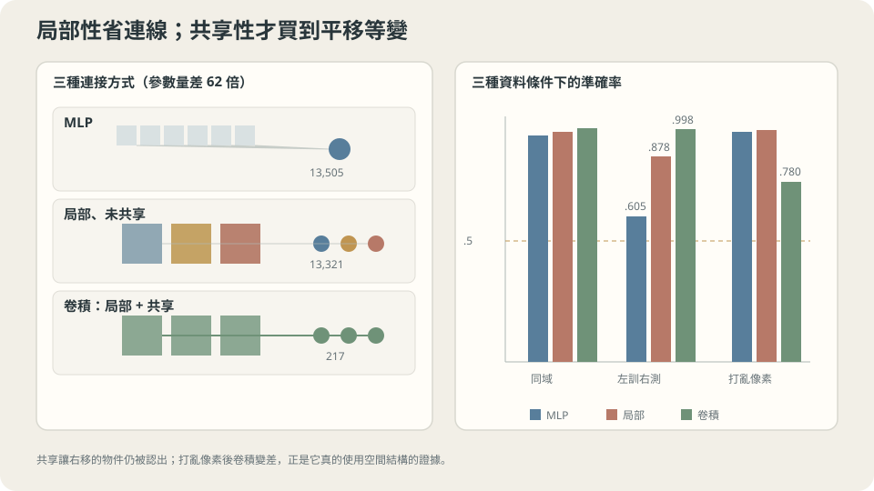

import Objectives from '../../../components/Objectives.astro';
import Ask from '../../../components/Ask.astro';
import Prereq from '../../../components/Prereq.astro';
import Question from '../../../components/Question.astro';
import Answer from '../../../components/Answer.astro';
import QuizBlock from '../../../components/QuizBlock.astro';
import Option from '../../../components/Option.astro';
import Explanation from '../../../components/Explanation.astro';
import VizPlan from '../../../components/VizPlan.astro';
import Remark from '../../../components/Remark.astro';
import Details from '../../../components/Details.astro';
import Bridge from '../../../components/Bridge.astro';
import UsedBy from '../../../components/UsedBy.astro';
import Ref from '../../../components/Ref.astro';

# 同一個東西換個位置出現，要怎麼讓模型知道那還是同一個東西？

<Objectives>
- **把卷積拆成兩個互相獨立的宣告（局部、共享），並分別量出各自買到什麼。** 用三個模型、三個條件的實測表指認哪一個宣告在做事。
- **區分等變（equivariance）與不變（invariance），並說出哪一個該放在哪一層。** 用實測確認等變是精確成立的，不是近似。
- **判斷「寫進去的對稱性」什麼時候只是近似成立，以及模型會怎麼利用那個縫隙。** 用一個刻意違反的任務把它量出來。
</Objectives>

<Prereq items={frontmatter.prereqs} />

## 概念與位置

<Ref to="ml-mlp" mode="title"/> 在小影像 toy 上留下三個數字：MLP 學得會這個任務（測試 $0.982$）；換一個位置就不會了（左半訓練、右半測試 $0.605$，亂猜是 $0.5$）；而把像素順序整個打亂，它毫無感覺（$0.980$）。

那一篇也給了解釋：MLP 學到的是「第 37 號與第 38 號像素會一起亮」這種和位置綁死的規則。**「橫線」這個概念從來沒有被學到。**

而我們**知道**答案應該長什麼樣。一條橫線出現在畫面的左邊或右邊，是同一條橫線；一隻貓在照片的左上角或右下角，是同一隻貓。這不是模型要從資料裡發現的東西——這是我們一開始就知道的事實。問題只是：**怎麼把它寫進模型裡。**

<Ask>
「橫線」這個概念和它出現在哪裡無關，<br />
可是模型學到的是「第 37 號和第 38 號像素會一起亮」——<br />
要怎麼讓「換個位置還是同一件事」變成模型的一部分，而不是它要自己發現的東西？
</Ask>

<Question id="Q1">
「平移之後還是同一件事」有兩種寫法：讓輸出**完全不變**（invariance，$f(Tx)=f(x)$），或讓輸出**跟著平移**（equivariance，$f(Tx)=Tf(x)$）。一個網路有很多層，這兩種各該放在哪一層？如果第一層就用不變，會失去什麼？

<Answer>
**先看不變放在第一層會怎樣。** 假設第一層輸出一個對所有平移都不變的向量。那麼「線在左邊」和「線在右邊」這兩張圖，在第一層之後就**變成同一個東西**了——位置資訊被永久刪除。

這對「橫的還是直的」這個任務剛好沒差。但只要任務需要用到位置——兩個物件的相對位置、線的長度、邊界在哪裡——後面的層就再也做不到了，因為那個資訊已經不在了。

**不變是有損的。** 它丟掉一個自由度來換一個保證，而那個保證只在你確定不需要那個自由度時才划算。

**等變不丟東西。** $f(Tx)=Tf(x)$ 說的是：輸入平移，輸出**原封不動地跟著平移**。位置資訊完整保留，只是被搬到輸出的座標上。所以等變可以一層一層疊下去——兩個等變的映射合成起來還是等變的。

**於是分工很清楚**：中間每一層用等變（保留位置，同時保證「同一個特徵在哪裡都用同一套規則偵測」），最後一步才用不變（把位置積掉，換成一個和位置無關的答案）。這最後一步通常就是 pooling——對所有位置取最大或取平均，而那正是把等變轉成不變的操作。

**那要怎麼造一個等變的層？** 這裡有一個很強的結果：**一個和所有平移交換的線性映射，一定是卷積。** 不是「卷積是一種選擇」，而是「在線性映射裡，卷積是唯一的選擇」。（下方的 `<Details>` 有兩行推導。）

所以卷積不是一個從影像處理借來的技巧，它是「我要一個對平移等變的線性層」這個要求的**唯一解**。
</Answer>
</Question>

<Details summary="為什麼平移等變的線性映射一定是卷積">
設 $f$ 是線性的，寫成 $(fx)_i=\sum_j W_{ij}x_j$。設 $T_s$ 是平移 $s$ 格的算子，$(T_sx)_i=x_{i-s}$。等變要求 $f T_s=T_s f$ 對每一個 $s$ 成立。

把兩邊都作用在基底向量 $e_j$ 上，比較第 $i$ 個分量：

$$
W_{i,j-s}=W_{i-s,j}\quad\text{對所有 } i,j,s .
$$

取 $s=j$：$W_{i,0}=W_{i-j,j}$，也就是 $W_{i-j,j}$ 只依賴 $i-j$。寫成 $W_{ij}=w(i-j)$，代回去：

$$
(fx)_i=\sum_j w(i-j)\,x_j,
$$

這正是卷積的定義。**整個矩陣由一個向量 $w$ 決定**——這就是權重共享，它不是額外加上去的節省手段，它是等變這個要求逼出來的。

（「只看附近」則是另一件事：它對應 $w$ 在距離超過 $K$ 之後為零。等變不蘊含局部，局部也不蘊含等變——本篇第一節把兩者分開量。）
</Details>

## 兩個獨立的宣告

卷積層通常被當成一個整體介紹，但它其實把兩件**可以分開**的事綁在一起：

- **局部**（local）：一個輸出只看輸入的一小塊（本篇是 $5\times5$）。宣告的是「有用的模式是局部的」。
- **共享**（shared）：每一個位置用**同一組**權重。宣告的是「一個模式在哪裡出現都算數」。

這兩件事可以拆開。**局部但不共享**是一個真實存在的層（locally connected layer）：每個位置有自己獨立的 $5\times5$ 權重。它滿足局部，但完全不共享。

三個模型放在一起，就可以把兩個宣告各自的貢獻分開量：

| | 局部 | 共享 | 參數量 |
| --- | --- | --- | --- |
| MLP（$144\to64\to64\to1$） | ✗ | ✗ | $13{,}505$ |
| 局部未共享（$5\times5\times8$，每位置自己的權重） | ✓ | ✗ | $13{,}321$ |
| 卷積（$5\times5\times8$） | ✓ | ✓ | $217$ |

**兩個對照組的參數量刻意排得很接近**（$13{,}505$ 對 $13{,}321$），而卷積少了 $62$ 倍。三個模型後面都接同一個 global max-pool 與一個線性輸出，訓練流程完全相同（Adam $\eta=0.01$、3000 步、三個 seed 取中位數）。

## 三個條件，九個數字

沿用 <Ref to="ml-mlp" mode="title"/> 的三個條件：**全位置**（訓練與測試的線都可能出現在任何地方）、**左訓右測**（訓練集的線只出現在左半，測試集只出現在右半）、**打亂像素**（一個固定的隨機排列套在所有影像上）。

```
                        參數     全位置    左訓右測   打亂像素
  MLP                  13505     0.982     0.605      0.980
  局部未共享            13321     1.000     0.878      0.998
  卷積                    217     1.000     0.998      0.780
```

**先看第二欄。** 從 $0.605$ 到 $0.878$ 到 $0.998$——這是「換一個位置還算不算同一件事」的能力，而它隨著宣告加進去而單調上升。卷積的 $0.998$ 幾乎是滿分：它**從來沒有看過右半邊的線**，卻做得和看過一樣好。

而它只用了 $217$ 個參數。**這是整個 L4 想說的事的第一個乾淨證據**：把正確的結構寫進假設空間，可以同時讓模型變小、變好、而且泛化到訓練分布之外。<Ref to="ml-bias-variance" mode="title"/> 說過加資料只壓 variance；這裡壓掉的是 bias，而那是加資料做不到的。

> **正確的歸納偏置不是在「更少參數」和「更好表現」之間取捨，它同時買到兩個。**

**第三欄才是真正有意思的那一欄，而且它和直覺相反。**

打亂像素順序，等於把「哪些像素相鄰」這個結構整個摧毀。直覺上，一個「利用空間結構」的模型應該會受傷。實測：

- MLP：$0.982\to0.980$。**完全沒感覺**，這是 <Ref to="ml-mlp" mode="title"/> 已經解釋過的——打亂等於把第一層權重乘上一個置換矩陣，假設空間沒變。
- 卷積：$1.000\to0.780$。**真的受傷了。** 這是「它在用空間結構」的證據——結構被破壞，它就做不好。
- 局部未共享：$1.000\to0.998$。**也完全沒感覺。**

**第三列才是關鍵。** 「局部」聽起來像是在使用空間結構，但它在這個實驗裡完全不受打亂影響。

原因是：局部未共享的層有 $64$ 個位置、每個位置一組**自由的** $5\times5$ 權重，而這些接受域互相重疊、合起來覆蓋整張圖。打亂之後，每個 $5\times5$ 視窗裡裝的是 $25$ 個任意的像素——但每個視窗的權重是自由的，所以它照樣可以學出一個能區分兩類的偵測器。**它有「局部」這個形狀，但那個形狀沒有對它造成任何真正的限制。**

卷積不行，因為它必須**在每個位置用同一個** $5\times5$ 濾波器。打亂之後，「同一個局部模式會在很多地方重複出現」這件事不再成立，於是一個共享的濾波器就失去了立足點。

> **受傷的那個模型才是真的在用結構——而那個傷來自共享，不是來自局部。**



**圖說：** 局部連接與權重共享大幅減少參數並帶來平移等變；打亂像素則顯示這項偏置的代價。

## 等變是精確的，不是「大致成立」

上面都是訓練出來的結果，會受最佳化與 seed 影響。但等變性本身是一個**結構性質**，和訓練完全無關——它在隨機初始化的網路上就已經成立，而且是精確成立。

實測：取一個隨機初始化的 $5\times5$ 卷積層，把輸入影像整體往右平移一格，比較「平移後的特徵圖」與「原特徵圖平移一格」：

```
  卷積層    max |f(平移 x) - 平移 f(x)| （避開邊界） = 0.000e+00
  參考：特徵圖本身的量級 max|f| = 0.9530
```

**是精確的零，不是很小的數。** 這不是一個近似成立的性質，它是卷積這個運算的定義的直接後果。

對照 MLP 的隱藏層（同一批影像、同樣平移一格）：

```
  MLP 隱藏層   平均 |h(平移 x) - h(x)| = 0.2148   （量級 0.1818）
```

**差異比訊號本身還大。** 平移一格之後，MLP 的內部表示變成一個完全不同的東西。而且注意：對 MLP 我們連「把輸出也平移一下再比」都做不到——它的隱藏層沒有空間座標，$64$ 個隱藏單元不構成一張圖，「平移特徵圖」這個操作在那裡沒有定義。

**這是「結構性保證」與「學出來的近似」之間的差別。** 前者不需要資料、不需要訓練、不會因為 seed 而改變；後者需要你相信訓練過程把它學到了，而且要用實驗去驗證。

<Remark label="補充" summary="pooling 是把等變換成不變的那一步">
上面三個模型最後都接了一個 global max-pool。這一步在做的事，正是 Q1 說的「最後一步才用不變」。

如果 $f$ 對平移等變，$g$ 是對所有位置取最大，那麼

$$
g(f(T_sx))=g(T_s f(x))=g(f(x)),
$$

因為「所有位置的最大值」本來就不管那些值排在哪裡。**等變 + pooling = 不變**，而這個組合就是卷積網路能做到「換位置還算同一件事」的全部機制。

這也解釋了 pooling 的取捨：它每用一次就丟掉一次位置資訊。用得太早，後面就沒有位置可以用；用得太晚，不變性就沒有被建立起來。實務上的做法是**逐步**丟——每隔幾層降取樣一次，讓位置資訊以受控的速度換成語意資訊。<Ref to="ml-unet" mode="title"/> 會把那個交換量出來。
</Remark>

## 刻意違反：當「不變」只是近似，模型會去利用那個縫隙

到這裡為止，「平移不變」都是好事。但它是一個**宣告**，而宣告可以是錯的——如果任務的答案本身就取決於位置（醫學影像裡器官的位置、文件版面裡欄位的位置），那麼一個對平移不變的模型在定義上就答不出來。

做一個這樣的任務：同一批橫線／直線影像，但標籤改成「**線出現在前半還是後半**」（線一律保持在畫面內部，不碰邊）。預期是：MLP 應該做得不錯（它本來就和位置綁死），卷積應該接近亂猜（它對平移不變）。

```
  MLP    訓練 1.000   測試 0.893
  卷積   訓練 0.998   測試 0.935
```

**卷積不但沒有掉到 $0.5$，還比 MLP 好。** 預期完全落空，而理由關鍵是。

**那個「不變」只是近似的。** 上一節的等變測試刻意「避開邊界」——因為在邊界附近，等變根本不成立：一個 $5\times5$ 的視窗在影像中央有很多種對齊方式，在邊緣只有少數幾種。於是「一條線靠近上緣」和「一條線在中間」給出的 pooling 結果**確實不同**，而那個不同和標籤相關。

**模型找到了這個縫隙並用了它。** 這不是 bug，這是最佳化在做它該做的事：<Ref to="ml-hyperparameters" mode="title"/> 以來反覆出現的同一件事——**只要某個訊號和標籤相關，梯度下降就會去用它，不管你希不希望**。

**三個實務上的推論。**

1. **「我寫進去的對稱性」和「模型實際遵守的對稱性」是兩件事。** 邊界、padding 的選擇、pooling 的方式都會在對稱性上開縫。要知道有多大，就量一次（上一節那個 $0.000$ 是**內部**的數字）。
2. **需要位置的時候，把位置明確餵進去**，而不是指望模型從邊界效應裡偷。實務上的做法是加上座標通道（CoordConv）或位置編碼——後者正是 <Ref to="ml-attention" mode="title"/> 會用到的東西。
3. **這也是一個評估的教訓。** 如果只看這個任務的準確率，會得出「卷積比 MLP 更會判斷位置」這個結論，而那是錯的——它做對的理由和你以為的完全不同。

> **寫進假設空間的對稱性，只在你沒有留縫的地方成立；而模型一定會找到縫。**

## 局部、共享、等變：三個開關

<iframe loading="lazy" src="/personal_website/notes/research_areas/machine-learning-foundations/l4-architectures/l4-2-2.html" class="demo-frame" title="局部、共享、等變：三個開關：互動 demo" style="height: 959px; width: 100%; border: none;"></iframe>

**互動 demo：切換模型看等變誤差：卷積是精確的 0，局部未共享是 10⁻¹ 的量級——等變來自共享，不來自局部。**

## 什麼時候該用它

**它宣告了什麼。** 兩件事：有用的模式是局部的；一個模式在哪裡出現都算數。**兩個都是關於資料的斷言**，而它們對影像、聲音、時間序列大致成立，對表格資料（欄位之間沒有「相鄰」可言）、對一般的集合（沒有位置）不成立。

**這一切依賴什麼。**

一，**「相鄰」要有意義**。打亂像素那一欄就是這個前提被拿掉時的樣子——卷積從最好的模型變成最差的。如果你的特徵順序是任意的（例如一張 CSV 的欄位），卷積不會有任何幫助，而且會比 MLP 差。

二，**平移要真的是一個對稱性**。刻意違反那一節是它不成立時的樣子；而更麻煩的是，它常常是**部分**成立的（影像的上下不對稱：天空在上、地面在下），那時候純粹的卷積會浪費容量去表達「不需要不變的那部分」。

三，**尺度**。這一篇的線一律是 $6$ 個像素長，所以一個 $5\times5$ 的核就夠了。真實的物件有各種大小，而一個固定大小的核只覆蓋一個尺度——這就是下一篇的起點。

## 檢查理解

<QuizBlock id="ml-l4-2-a">
表裡「打亂像素」那一欄：MLP $0.982\to0.980$、局部未共享 $1.000\to0.998$、卷積 $1.000\to0.780$。最準確的解讀是：
<Option>卷積比較脆弱，所以在真實資料上要小心使用。</Option>
<Option correct>只有卷積真的在利用「哪些像素相鄰」，所以只有它會因為那個結構被破壞而受傷。前兩個模型沒有受傷，正是因為它們本來就沒在用那個結構——受傷是好消息，不是壞消息。而造成這個差別的是**共享**（局部未共享同樣沒受傷），不是局部。</Option>
<Option>局部未共享的模型比卷積更穩健，因此是更好的選擇。</Option>
<Explanation>
第三個選項是這題最想擋的推論。「打亂像素之後仍然很好」不是優點——它等於「這個模型在原始資料上也沒在用空間結構」，而那正好對應它在「左訓右測」那一欄只有 $0.878$、參數量是卷積的 $61$ 倍。一個指標好不好，要看它好的理由。
</Explanation>
</QuizBlock>

<QuizBlock id="ml-l4-2-b">
Q1 說中間層要用等變、最後才用不變。如果把不變放在第一層（例如第一層就對所有位置取最大），最直接的後果是：
<Option>訓練會變慢，但最終表現差不多。</Option>
<Option correct>位置資訊在第一層之後被永久刪除，所以任何需要位置的判斷（兩個物件的相對位置、物件的大小、邊界在哪）後面都做不了。等變之所以可以一層層疊，正是因為它保留資訊而不是丟掉資訊。</Option>
<Option>模型會變得對平移更不變，泛化更好。</Option>
<Explanation>
第三個選項的方向聽起來合理但把「不變」當成越多越好。不變是**有損**的：它用一個自由度換一個保證。整個網路只需要在最後做一次這個交換，做太早就是在還不知道會不會用到的時候先把資訊丟掉。這也是 <Ref to="ml-unet" mode="title"/> 那個「逐步降取樣」設計的理由。
</Explanation>
</QuizBlock>

<QuizBlock id="ml-l4-2-c">
在「線在前半還是後半」的任務上，卷積拿到 $0.935$、比 MLP 的 $0.893$ 還高。最合理的結論是：
<Option>卷積的歸納偏置其實也涵蓋位置判斷，所以它在這個任務上更好。</Option>
<Option correct>卷積在邊界附近並不是真的平移不變（視窗的對齊方式在邊緣比較少），而那個邊界效應和標籤相關，所以最佳化找到並利用了它。這個分數不能拿來說「卷積會判斷位置」——它做對的理由和任務的本意無關。</Option>
<Option>這個實驗有 bug，因為對平移不變的模型在定義上不可能超過 $0.5$。</Option>
<Explanation>
第三個選項對了一半：**精確**平移不變的模型確實不可能超過亂猜。錯在假設這個模型精確不變——valid 卷積加 global pooling 只在「圖案完全落在內部、而且每種對齊方式都可用」時不變，邊界破壞了這個前提。這題想建立的習慣是：當一個模型在它「不該會」的任務上表現很好時，先去找你以為自己寫進去的性質在哪裡漏了。
</Explanation>
</QuizBlock>

<QuizBlock id="ml-l4-2-d">
下列哪一句**不對**？
<Option>一個與所有平移交換的線性映射必然是卷積，所以權重共享不是額外加上去的節省手段，而是等變這個要求逼出來的。</Option>
<Option>卷積層的等變性在隨機初始化時就精確成立（實測內部誤差 $0.000\mathrm{e}{+}00$），不需要訓練也不受 seed 影響。</Option>
<Option correct>卷積用 $217$ 個參數勝過 MLP 的 $13{,}505$ 個，說明參數越少的模型泛化越好。</Option>
<Explanation>
第三句把一個條件結論講成了無條件結論。卷積贏的原因不是「參數少」，是「剩下的那些參數所張出的假設空間，恰好包含正確答案而排除了大量錯誤答案」。同樣把參數砍到 $217$ 但砍錯地方（例如把 MLP 的寬度縮到 $1$），結果只會更差。<Ref to="ml-overfitting-underfitting" mode="title"/> 的 U 形講的就是這件事：有用的是**形狀**，不是大小。
</Explanation>
</QuizBlock>

<UsedBy slug={frontmatter.slug} />

<Bridge to="ml-unet">
但整篇都在同一個尺度上工作：線長 $6$ 個像素，核是 $5\times5$，一層就看得完。真實的資料不是這樣——一張影像同時有紋理（幾個像素）、物件（幾十個像素）和場景（整張圖），而一個 $5\times5$ 的核要看到相隔 $64$ 個位置的兩個東西，需要疊 $16$ 層。

接著處理這件事，而答案有三個零件：降取樣讓接受域指數成長（每兩層降一次，$10$ 層就到 $249$）、skip connection 把降取樣丟掉的高頻接回來（實測週期 $8$ 個取樣點的成分只剩 $0.8536$、週期 $2.7$ 個只剩 $0.1464$），以及讓深網路還訓練得起來的殘差——實測深度 $32$ 時，無殘差的網路訓練 MSE 停在 $0.7399$，加了殘差是 $0.0000$。而「正規化要不要跟著加」會是那一篇的刻意違反：同一個 toy 在深度 $64$，加了 LayerNorm 反而訓練不起來。
</Bridge>

## 參考文獻

1. LeCun, Y. et al. [*Backpropagation Applied to Handwritten Zip Code Recognition.*](https://doi.org/10.1162/neco.1989.1.4.541) Neural Computation 1(4), 1989.（局部連接與權重共享的原始論證，以及兩者在參數量上的效果。）
2. Cohen, T. & Welling, M. [*Group Equivariant Convolutional Networks.*](https://arxiv.org/abs/1602.07576) ICML 2016.（把「等變的線性層」這個要求推廣到平移以外的群，本篇 Q1 那個唯一性結論的一般版本。）
3. Liu, R. et al. [*An Intriguing Failing of Convolutional Neural Networks and the CoordConv Solution.*](https://arxiv.org/abs/1807.03247) NeurIPS 2018.（當任務需要位置時卷積的失敗模式，以及把座標明確餵進去的做法。）
