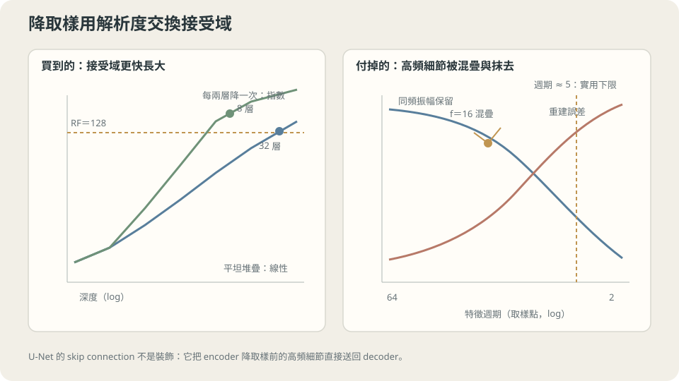

import Objectives from '../../../components/Objectives.astro';
import Ask from '../../../components/Ask.astro';
import Prereq from '../../../components/Prereq.astro';
import Question from '../../../components/Question.astro';
import Answer from '../../../components/Answer.astro';
import QuizBlock from '../../../components/QuizBlock.astro';
import Option from '../../../components/Option.astro';
import Explanation from '../../../components/Explanation.astro';
import VizPlan from '../../../components/VizPlan.astro';
import Remark from '../../../components/Remark.astro';
import Details from '../../../components/Details.astro';
import Bridge from '../../../components/Bridge.astro';
import UsedBy from '../../../components/UsedBy.astro';
import Ref from '../../../components/Ref.astro';

# 一張圖裡同時有紋理、物件和整個場景，一個固定大小的核怎麼辦？

<Objectives>
- **把「接受域」算成一個可以規劃的數字，並說出降取樣讓它從線性成長變成指數成長。** 用兩張表比較疊深與降取樣的成本。
- **量出降取樣毀掉的是什麼，以及為什麼 skip connection 不是可有可無的裝飾。** 用逐頻率的實測說出哪些成分回得來、哪些回不來。
- **判斷殘差與正規化各自解決什麼問題，以及它們什麼時候不該一起用。** 用初始化時的訊號與四個深度的訓練結果把兩者分開。
</Objectives>

<Prereq items={frontmatter.prereqs} />

## 一個核只看得到一個尺度

<Ref to="ml-convolution" mode="title"/> 的整個實驗都在同一個尺度上：線是 $6$ 個像素長，核是 $5\times5$，一層就看得完。

真實的資料不是這樣。一張照片裡同時有**紋理**（幾個像素的週期性）、**物件**（幾十個像素）、和**整個場景的構圖**（整張圖）。而「這是貓還是狗」這個判斷可能需要同時用到毛的質感和耳朵的形狀，兩者差了兩個數量級的尺度。

一個 $K\times K$ 的核只看 $K$ 個像素。要看得更遠只有一條路：疊。疊 $d$ 層之後，最終的輸出受到多大一塊輸入的影響？這塊區域叫**接受域**（receptive field），而它的大小是

$$
\mathrm{RF}=1+d\,(K-1).
$$

$K=5$ 時：

```
  depth   1   RF =    5
  depth   2   RF =    9
  depth   4   RF =   17
  depth   8   RF =   33
  depth  16   RF =   65
  depth  32   RF =  129
```

**接受域隨深度線性成長。** 要看到相隔 $128$ 個位置的兩件事，要疊 $32$ 層——而且那 $32$ 層每一層都在**原始解析度**上跑，每一層都是全尺寸的計算。

<Ask>
一個 $5\times5$ 的核要看到相隔 $128$ 個位置，得疊 $32$ 層；<br />
只要每兩層把解析度砍半，$10$ 層就能看到 $249$——<br />
那被砍掉的東西去哪裡了？
</Ask>

<Question id="Q1">
降取樣（把解析度砍半）讓接受域便宜了非常多。先算清楚便宜多少，再問代價：**被丟掉的具體是什麼資訊？而它回得來嗎？**

<Answer>
**先算便宜多少。** 降取樣之後，同樣一個 $K\times K$ 的核在**原始座標**上覆蓋的範圍加倍了。所以接受域的成長從「每層加 $K-1$」變成「每層加 $(K-1)\times$ 目前的 stride」，而 stride 每降一次就乘二。實測（每兩層降一次）：

```
  depth   1   RF =    5   （stride 1）
  depth   2   RF =    9   （stride 2）
  depth   4   RF =   25   （stride 4）
  depth   6   RF =   57   （stride 8）
  depth   8   RF =  121   （stride 16）
  depth  10   RF =  249   （stride 32）
```

**$10$ 層到 $249$，而平的堆疊要 $62$ 層。** 而且計算量還更少——第 $k$ 次降取樣之後，每一層的位置數只剩原來的 $1/4$（二維）。**兩件事同時變好，所以降取樣不是一個折衷，它在「看得遠」這個目標上是純賺。**

**代價是什麼。** 降取樣把相鄰的幾個值合成一個。一個在**兩三個取樣點的尺度上**變化的東西——一條細線、一個邊界的確切位置、一段高頻紋理——在合併之後就不見了。

**而且它回不來。** 升取樣（把一個值複製成兩個、或內插）只能造出「在這個尺度上平滑」的東西，它沒有任何資訊可以用來重建那些細節。這不是實作不夠好，是資訊已經被刪掉了。

**所以問題變成：這個代價要不要付？**

- 如果**輸出是低維的**（一個類別、一個分數），那細節本來就要被丟掉，降取樣只是提早做了這件事。這就是分類網路的形狀：一路降到底。
- 如果**輸出和輸入一樣大而且需要細節**（分割的邊界、去噪後的影像、生成的圖），那丟掉就是致命的——你要輸出的正是那些被刪掉的東西。

**第二種情況的解法只有一個形狀**：讓細節**不要經過**那個瓶頸。編碼側一路降取樣去取得大的接受域，解碼側一路升回來，而每一層的細節從編碼側**直接橫跨過去**接到對應的解碼層。那條橫跨的連線就是 skip connection，而那個形狀畫出來是一個 U。
</Answer>
</Question>

## 降取樣毀掉的到底是什麼

上面說「高頻回不來」是定性的。把它量出來。

做法很單純：拿一個純頻率的訊號（長度 $64$ 的餘弦），做一次 $2\times$ 平均池化再用最近鄰升回原長度，然後問兩件事——**同一個頻率剩下多少振幅**，以及**整條訊號還差多遠**。

```
    f   週期（取樣點）   保留下來的同頻振幅   整體重建誤差
    1        64.0             0.9976            0.0491
    2        32.0             0.9904            0.0980
    4        16.0             0.9619            0.1951
    8         8.0             0.8536            0.3827
   12         5.3             0.6913            0.5556
   16         4.0             0.7071            0.7071
   24         2.7             0.1464            0.9239
   31         2.1             0.0024            0.9988
   32         2.0             0.0000            1.0000
```

**最後一列是乾淨的零。** 週期剛好是兩個取樣點的成分（$+1,-1,+1,-1,\dots$）在 $2\times$ 平均之後每一組都變成 $0$——**完全消失**，不是變小。

**中間幾列是實務上真正會遇到的區域。** 週期 $8$ 個取樣點還剩 $0.85$，週期 $5.3$ 個剩 $0.69$，週期 $2.7$ 個只剩 $0.15$。也就是說，**只要一個特徵的尺度小於大約五、六個取樣點，一次降取樣就會吃掉它一半以上**。

而右邊那一欄說得更直接：週期 $8$ 個取樣點的訊號，降一次再升回來，整體誤差已經是 $38\%$。降兩次就是在對已經模糊的東西再模糊一次。

> **降取樣不是把細節壓縮，是把細節刪掉；升取樣造得出平滑的東西，造不出被刪掉的東西。**

**這張表也給了一個可以直接用的設計規則。** 要保留一個尺度為 $s$ 個像素的特徵，降取樣的總倍數不能超過大約 $s/5$。細胞邊界寬 $3$ 個像素？那一層都不能降——或者就必須用 skip 把它繞過去。

<Remark label="注意" summary="表裡有一列不是單調的，而那是混疊">
仔細看會發現 $f=16$（週期 $4$）的保留振幅是 $0.7071$，比 $f=12$（週期 $5.3$）的 $0.6913$ **還高**。這不是量測誤差。

原因是**混疊**（aliasing）：降取樣不只是把高頻變弱，它還把高頻**搬到別的頻率去**。$f=16$ 在 $2\times$ 降取樣之後正好落在新取樣率的奈奎斯特頻率上，於是它的能量以一個特殊的方式保留下來；而 $f=12$ 的能量有一部分被搬到 $f=20$ 那裡去，變成一個**原本不存在的低頻成分**。

右邊那一欄（整體重建誤差 $0.5556$ 對 $0.7071$）就沒有這個非單調——因為它把「搬到別處去」也算成誤差。

實務上的後果是：**降取樣之前通常要先低通濾波**（先模糊再取樣），否則高頻會偽裝成低頻混進來。這也是為什麼在生成模型裡，單純用 stride-2 的升降取樣容易產生棋盤狀的假紋理，而加上平滑就好很多。
</Remark>



**圖說：** 降取樣用更少層數快速擴大接受域，但小於約五、六個取樣點的細節會因混疊而流失。

## 那條橫跨的線

Q1 已經把 skip connection 的動機推出來了：如果輸出需要細節，細節就不能經過瓶頸。

但要把這件事和另一個常被混在一起的東西分開。**深度學習裡有兩種「skip」，它們解決的是完全不同的問題**：

- **U-Net 的 skip**（長跳接）：從編碼側第 $k$ 層接到解碼側對應的第 $k$ 層，通常是**串接**（concatenate）。它解決的是**資訊被降取樣刪掉**的問題，跨越的是整個瓶頸。
- **殘差連接**（短跳接）：$h_{l+1}=h_l+F(h_l)$，跨越一兩層，通常是**相加**。它解決的是**深度本身讓網路難以訓練**的問題。

兩者都叫 skip，但一個是為了資訊、一個是為了梯度。下一節處理第二個。

## 深度本身的代價

把網路疊深有一個獨立於接受域的問題：**它會變得訓練不起來**。這件事在 <Ref to="ml-loss-landscape" mode="title"/> 已經用 gain 掃過一次；這裡換一個角度，直接量深度。

設定：一個 $144\to32\to32\to\cdots\to1$ 的 tanh 堆疊，深度從 $8$ 到 $64$，三種接法——**無殘差**（$h\leftarrow\tanh(hW+b)$）、**殘差**（$h\leftarrow h+\tanh(hW+b)$）、**殘差後接 LayerNorm**。Adam $\eta=0.003$、1200 步、三個 seed 取中位數。

**先看初始化時每一層輸出的大小（深度 $32$）：**

```
              L1       L4       L8       L16      L32
  無殘差     0.2418   0.2265   0.1695   0.1513   0.0928
  殘差       0.2418   0.5845   1.2501   2.5496   4.3765
  殘差+LN    0.2418   1.0000   1.0000   1.0000   1.0000
```

三種行為完全不同。**無殘差在收縮**（$0.24\to0.09$，因為 $\tanh$ 是壓縮的）；**殘差在膨脹**（$0.24\to4.38$，因為每一層都在往上加東西）；**加了 LayerNorm 之後是精確的常數 $1$**——那正是 LayerNorm 的定義在做的事。

**再看梯度能不能傳回去**（第一層與最後一個隱藏層的梯度大小比，$1$ 表示兩端一樣強）：

```
  depth   4   無殘差 2.87e-01   殘差 1.41e+01   殘差+LN 2.71e-02
  depth   8   無殘差 7.05e-01   殘差 5.61e+00   殘差+LN 6.59e-02
  depth  16   無殘差 7.60e-02   殘差 1.18e+00   殘差+LN 1.74e-01
  depth  32   無殘差 6.47e-02   殘差 7.64e-01   殘差+LN 1.38e-01
  depth  64   無殘差 7.33e-02   殘差 4.97e-01   殘差+LN 1.29e-01
```

**看深度 $64$ 那一列**：無殘差是 $0.073$（前面的層收到的梯度只有後面的十四分之一），殘差是 $0.497$（只差兩倍）。**殘差把梯度的路徑從「每一層都要乘一次」變成「有一條直達的路」**——因為 $\partial h_{l+1}/\partial h_l = I + \partial F/\partial h_l$，那個 $I$ 讓梯度可以不經過任何權重矩陣就傳到前面。

**最後看真的訓練得起來嗎：**

```
  depth   8   無殘差 0.0000   殘差 0.0000   殘差+LayerNorm 0.0000
  depth  16   無殘差 0.0000   殘差 0.0000   殘差+LayerNorm 0.0000
  depth  32   無殘差 0.7399   殘差 0.0000   殘差+LayerNorm 0.0000
  depth  64   無殘差 0.9915   殘差 0.0000   殘差+LayerNorm 0.9096
```

**深度 $32$ 那一列就是整個殘差連接存在的理由**：同一個容量、同一個資料、同一個最佳化器，沒有殘差的版本停在 $0.7399$（幾乎等於「輸出常數」的水準），有殘差的版本降到 $0.0000$。

> **殘差不是讓網路變強，是讓已經存在的容量變得訓練得到。**

<Details summary="為什麼「$I$ 加上一個小修正」是一個好的預設行為">
把一層寫成 $h_{l+1}=h_l+F(h_l)$。在初始化時 $F$ 的輸出很小，所以這一層大約就是**恆等映射**。疊一百層，整個網路大約還是恆等映射。

這件事有兩個好處。

**一，起點是一個合理的函數。** 一個無殘差的深網路在初始化時算出來的東西，和輸入幾乎沒有關係（上表的 $0.0928$：訊號已經被壓掉大半）。殘差網路的起點是「把輸入原樣送出去」，那至少是一個有意義的函數，而訓練從那裡開始只需要學**修正**。

**二，加深不會變差。** 如果第 $L+1$ 層學到 $F\approx0$，那整個網路就退化成 $L$ 層。所以「更深」在假設空間上包含「更淺」——這在無殘差的堆疊上是不成立的，因為每一層都必須做點什麼。

代價是上表中間那一行：**輸出的大小隨深度成長**（$0.24\to4.38$），因為每一層都在往上加。真實的架構用兩種方式處理它——在殘差分支上乘一個小係數（例如 $1/\sqrt2$ 或一個學出來的接近零的初值），或在每一層之後做正規化。下一節是後者。
</Details>

## 刻意違反：正規化不是免費的保險

前一節的最後一列有一個沒有被解釋的數字：**深度 $64$，殘差是 $0.0000$，殘差加 LayerNorm 是 $0.9096$**。

加了正規化反而訓練不起來。這和「正規化讓深網路更好訓練」這個常見說法是反的，所以需要解釋。

**線索在梯度比那張表**：殘差在深度 $64$ 是 $0.497$，殘差加 LN 是 $0.129$——**LN 讓梯度比變差了**。原因是 LayerNorm 在每一層都把訊號投影到一個固定的尺度上，而那個投影會把梯度裡「改變整體大小」的成分消掉（見下面那個精確的量測）。在這個特定的 toy 上，殘差造成的那個成長本來就沒有失控到需要處理，而 LN 的那點損失就變成純虧。

**但 LayerNorm 也真的在做一件很具體、很有價值的事。** 量出來：

```
  W 乘以   0.01 :  max|LN(XWc) - LN(XW)| = 6.853e-03
  W 乘以   1.00 :  max|LN(XWc) - LN(XW)| = 0.000e+00
  W 乘以 100.00 :  max|LN(XWc) - LN(XW)| = 6.874e-07
```

**一層的輸出對自己權重的大小完全免疫。** 把 $W$ 放大一百倍，正規化之後的輸出一模一樣（$10^{-7}$ 是浮點誤差；$c=0.01$ 那個 $10^{-3}$ 是 $\varepsilon=10^{-5}$ 造成的，把 $\varepsilon$ 調小它也會消失）。

而這件事對梯度的後果是精確的：

```
  W 乘以  0.1 :  對 W 的梯度範數 = 178.238   （× c = 17.824）
  W 乘以  1.0 :  對 W 的梯度範數 =  17.824   （× c = 17.824）
  W 乘以 10.0 :  對 W 的梯度範數 =   1.782   （× c = 17.824）
```

**梯度精確地正比於 $1/c$**（第三欄四位數完全相同）。也就是說，權重越大、梯度越小，所以**相對**的更新量 $\eta\lVert g\rVert/\lVert W\rVert$ 自動維持穩定。這正是「正規化讓學習率比較好調」這個經驗的機制：它把一個原本要人工對齊的尺度變成自動的。

> **正規化買的是「對尺度免疫」，賣的是「梯度裡關於尺度的那一部分」；在尺度本來就沒失控的時候，那是純付出。**

**所以這兩件事的關係不是「都加上去比較安全」。** 殘差解決梯度路徑，正規化解決尺度漂移。真實的深網路兩個都需要，因為它們在寬度、深度、非線性、學習率都放大之後，殘差造成的成長會真的失控。但在這個 $32$ 寬、$\tanh$、小學習率的 toy 上，第二個問題不存在，於是只剩成本。

**這件事在自己的專案上怎麼判斷**：量一次每一層輸出的 RMS。如果它隨深度穩定，正規化大概只是在收費；如果它像上表那樣一路爬到幾十幾百，那就是它要解決的問題。

## 接受域、頻率、深度：三個設定

<iframe loading="lazy" src="/personal_website/notes/research_areas/machine-learning-foundations/l4-architectures/l4-3-2.html" class="demo-frame" title="接受域、頻率、深度：三個設定：互動 demo" style="height: 880px; width: 100%; border: none;"></iframe>

**互動 demo：降取樣次數、skip、深度、接法四個設定，對應三個互相獨立的問題。**

## 一個 U 形要怎麼設計

把三節的結論合成一組可以照做的決定。

1. **先算你需要多大的接受域。** 這是一個關於**任務**的問題：判斷要用到的最遠的兩個東西相隔多少個像素？算出來之後，用第一節的兩張表決定「疊深」與「降取樣」怎麼配。
2. **再算你能降幾次。** 用第二節的規則：要保留尺度為 $s$ 的特徵，總降取樣倍數不要超過 $s/5$。如果這兩個數字打架（要看得很遠，又要保留很細的東西），那就是需要 U 形的訊號——降下去取得脈絡，用 skip 把細節帶回來。
3. **決定 skip 接什麼、怎麼接。** 串接保留兩邊的完整資訊但讓通道數變多；相加比較省但要求兩邊的語意可以直接疊加。輸出需要精確定位（分割、去噪、生成）時，通常串接比較穩。
4. **深度超過大約二三十層才需要煩惱殘差。** 第四節的表在深度 $16$ 以下三種接法完全沒有差別。
5. **正規化要看訊號有沒有在漂。** 量一次各層的 RMS 再決定，不要當成預設配備——第五節那個 $0.9096$ 就是預設加上去的代價。

**這一切依賴什麼。** 一，**資料真的有多尺度結構**；如果沒有（例如所有有用的模式都是同一個大小），一個平的堆疊更簡單也更好。二，**降取樣的對象要是空間上平滑的**；對於本來就沒有「相鄰」概念的輸入，降取樣沒有意義。三，第四、五節的數字是在一個 $32$ 寬的 $\tanh$ 堆疊上量的——**深度的門檻和正規化的必要性都會隨寬度、非線性與學習率而變**，所以那兩個結論要在自己的設定上重量一次，而重量的方法就在上面第 4、5 點。

## 檢查理解

<QuizBlock id="ml-l4-3-a">
第二節的表裡，$f=32$（週期 $2$ 個取樣點）降取樣後的保留振幅是精確的 $0.0000$。這說明：
<Option>量測精度不夠，實際上還有一點殘留。</Option>
<Option correct>$+1,-1,+1,-1,\dots$ 這個訊號在每一對相鄰值取平均之後恆為零——不是變小，是被完全消滅。這是降取樣最極端的情形，也是「升取樣救不回來」的最清楚證據：要重建它需要的資訊已經不存在了。</Option>
<Option>因為用的是平均池化，換成最大池化就不會消失。</Option>
<Explanation>
第三個選項容易漏掉的是：最大池化確實不會給出零（它會給出恆為 $+1$ 的常數），但那同樣不是原訊號——它把一個振盪變成一個常數，資訊一樣沒了。任何把兩個值變成一個值的操作都會丟掉一個自由度；差別只在丟掉的是哪一個。
</Explanation>
</QuizBlock>

<QuizBlock id="ml-l4-3-b">
一個任務要判斷相隔約 $100$ 個像素的兩個物件的關係，同時要輸出寬度只有 $3$ 個像素的邊界。最合適的設計方向是：
<Option>用平的堆疊疊到接受域夠大（$K=5$ 時約 $25$ 層），完全不降取樣。</Option>
<Option correct>需要 U 形。接受域的需求（$100$）要靠降取樣才划算，但邊界的尺度（$3$ 像素）連一次降取樣都撐不住（第二節：尺度小於五六個取樣點的東西一次就掉一半以上）。兩個需求打架時的解法就是讓細節從瓶頸外面繞過去。</Option>
<Option>把核放大到 $101\times101$，一層解決。</Option>
<Explanation>
第一個選項可行但貴：$25$ 層全部在原解析度上跑，計算量是降取樣版本的好幾倍，而且深度本身帶來第四節那些問題。第三個選項的參數量是 $101^2=10201$ 個（單通道），而且失去了「局部」這個宣告——它幾乎退化回 <Ref to="ml-mlp" mode="title"/>。這題想練的是把兩個獨立的需求（接受域、輸出解析度）分開算，再看它們衝不衝突。
</Explanation>
</QuizBlock>

<QuizBlock id="ml-l4-3-c">
深度 $64$ 時，殘差的訓練 MSE 是 $0.0000$ 而殘差加 LayerNorm 是 $0.9096$。最準確的解讀是：
<Option>這個實驗有問題，正規化不可能讓訓練變差。</Option>
<Option correct>正規化解決的是「訊號尺度隨深度漂掉」這個問題，而在這個 $32$ 寬的 $\tanh$ 堆疊上那個問題沒有嚴重到需要處理（殘差版本長到 $4.38$ 仍可訓練）。與此同時 LN 把梯度裡關於尺度的成分消掉，讓第一層/最後一層的梯度比從 $0.497$ 降到 $0.129$——問題不存在時，那個成本就是純虧。</Option>
<Option>說明 LayerNorm 只適合 Transformer，不適合卷積或 MLP。</Option>
<Explanation>
第三個選項是一個常見但錯誤的歸納。決定要不要正規化的不是「哪一類架構」，是**這個網路的訊號尺度有沒有在漂**——而那是可以量的（各層輸出的 RMS）。這題想建立的習慣是：每一個「標準配備」都對應一個具體的問題，先確認問題存在再付成本。
</Explanation>
</QuizBlock>

<QuizBlock id="ml-l4-3-d">
下列哪一句**不對**？
<Option>U-Net 的長跳接解決的是「資訊被降取樣刪掉」，殘差的短跳接解決的是「深度讓梯度傳不回去」；兩者同名但目的不同。</Option>
<Option>LayerNorm 之後，一層的輸出對自己權重的縮放完全免疫，而對權重的梯度精確地正比於 $1/c$——所以相對更新量會自動維持穩定。</Option>
<Option correct>每兩層降取樣一次可以讓接受域指數成長，所以只要層數夠多，任何尺度的細節都看得到。</Option>
<Explanation>
第三句把「看得到」和「還在」混為一談。接受域說的是「輸出受到哪一塊輸入影響」，但降取樣已經把那一塊裡的高頻**刪掉**了——影響的是一個模糊過的版本。這正是為什麼接受域大並不能取代 skip connection：前者管範圍，後者管解析度，而第二節那張表說的就是範圍換來的東西正是解析度。
</Explanation>
</QuizBlock>

<UsedBy slug={frontmatter.slug} />

<Bridge to="ml-attention">
但這一整套都建立在同一個前提上：**要看得遠，就得一層一層傳過去**。$5\times5$ 的核要連接相隔 $256$ 個位置的兩個東西，即使用上降取樣也要好幾層，而每經過一層，那個訊號就要再穿過一次非線性與一次加權平均。

接著問一個不同的問題：**如果不要傳，直接讓任意兩個位置在一層之內互相看到呢？** 答案是自注意力，而它的性質幾乎是卷積的反面——它對位置一無所知（實測置換等變，誤差 $6.66\times10^{-16}$，所以位置要另外餵進去），它的成本隨長度成長（$L$ 從 $64$ 到 $2048$，一次前向從 $0.88$ ms 到 $348$ ms），而它決定「要看誰」的方式不是位置，是內容。
</Bridge>

## 參考文獻

1. Ronneberger, O., Fischer, P. & Brox, T. [*U-Net: Convolutional Networks for Biomedical Image Segmentation.*](https://arxiv.org/abs/1505.04597) MICCAI 2015.（編碼–解碼加長跳接的原始設計，以及它為什麼在需要精確定位的任務上是必要的。）
2. He, K., Zhang, X., Ren, S. & Sun, J. [*Deep Residual Learning for Image Recognition.*](https://arxiv.org/abs/1512.03385) CVPR 2016.（殘差連接、以及「更深不該更差」這個論證。）
3. Ba, J., Kiros, J. & Hinton, G. [*Layer Normalization.*](https://arxiv.org/abs/1607.06450) 2016.（本篇第五節那個尺度免疫性質的出處與推導。）
