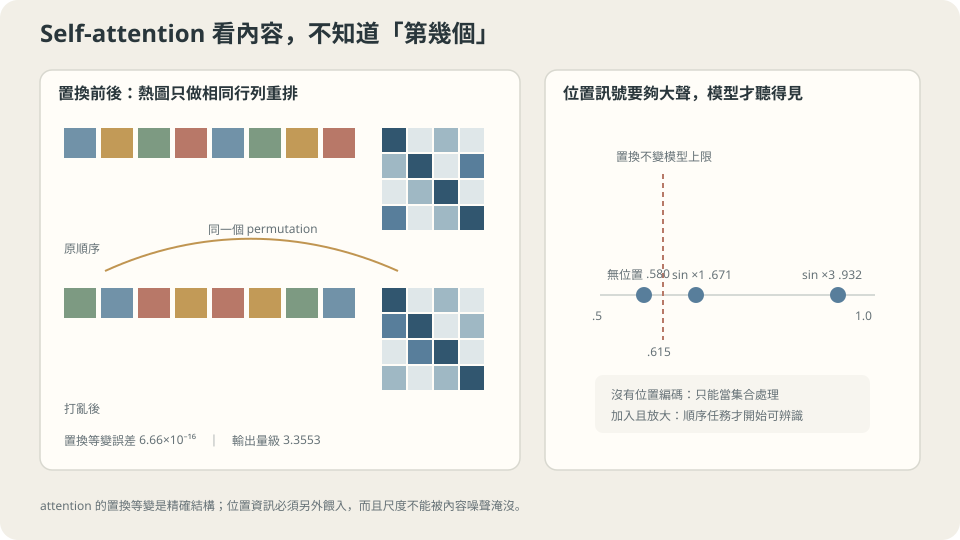

import Objectives from '../../../components/Objectives.astro';
import Ask from '../../../components/Ask.astro';
import Prereq from '../../../components/Prereq.astro';
import Question from '../../../components/Question.astro';
import Answer from '../../../components/Answer.astro';
import QuizBlock from '../../../components/QuizBlock.astro';
import Option from '../../../components/Option.astro';
import Explanation from '../../../components/Explanation.astro';
import VizPlan from '../../../components/VizPlan.astro';
import Remark from '../../../components/Remark.astro';
import Details from '../../../components/Details.astro';
import Bridge from '../../../components/Bridge.astro';
import UsedBy from '../../../components/UsedBy.astro';
import Ref from '../../../components/Ref.astro';

# 要看哪裡，能不能由內容決定，而不是由位置決定？

<Objectives>
- **寫出自注意力，並說出它保留了什麼、丟掉了什麼。** 用實測確認置換等變是精確成立的，並量出「位置要另外餵、而且要餵得夠大聲」。
- **說出 $1/\sqrt d$ 那個係數在防什麼。** 用五個維度的注意力熵與最大權重把「softmax 飽和」量成數字。
- **把注意力的成本與卷積放在同一張表上比較。** 用實測的時間與「連接距離 $d$ 需要幾層」兩個角度說出它買到什麼、賣掉什麼。
</Objectives>

<Prereq items={frontmatter.prereqs} />

## 鄰居是誰，可以事後才知道嗎

<Ref to="ml-convolution" mode="title"/> 和 <Ref to="ml-unet" mode="title"/> 建立的整套機制，都建立在同一個決定上：**要看誰，由位置決定**。一個 $5\times5$ 的核看的永遠是周圍那 $24$ 個鄰居，不管那些鄰居裡裝的是什麼。

對影像，這個決定大致是對的——相鄰的像素通常屬於同一個東西。但很多問題不是這樣：

- 「它」這個代名詞指的是哪個名詞？可能在三個字之前，也可能在三十個字之前。
- 這個像素屬於哪個物件？和它同色、同紋理的像素可能離它很遠。
- 這個分子裡的兩個原子會不會交互作用？取決於它們的種類，不是它們在序列裡的編號。

這些問題有一個共同的形狀：**要看哪裡，必須先看過內容才知道**。而一個事先畫好的鄰域，在定義上做不到這件事。

<Ask>
卷積的鄰域是寫程式的時候就畫好的，<br />
可是「該看哪裡」常常要看過內容才知道——<br />
能不能讓模型自己決定要看誰？
</Ask>

<Question id="Q1">
造一個「由內容決定要看誰」的層。要求三件事：一，每個位置的輸出是**所有位置的加權平均**；二，權重由內容決定；三，權重非負且和為一（這樣輸出才和輸入在同一個尺度上）。寫出來之後，檢查它**保留了什麼、丟掉了什麼**。

<Answer>
**三個要求幾乎把式子逼出來。**

要「權重由內容決定」，就要有一個函數把一對位置 $(i,j)$ 的內容映到一個分數。最省的做法是先各自做一次線性投影，再取內積：

$$
s_{ij}=\frac{(x_iW_Q)\cdot(x_jW_K)}{\sqrt d}.
$$

兩個投影不共用權重，因為「我在找什麼」（query）和「我提供什麼」（key）是兩個不同的角色。分母那個 $\sqrt d$ 是本篇第三節的主題。

要「非負且和為一」，就用 softmax：$a_{ij}=\mathrm{softmax}_j(s_{ij})$。

最後，被平均的東西不必是 $x_j$ 本身——再做一次投影，讓「拿來比對的內容」和「拿來傳遞的內容」分開：

$$
\mathrm{out}_i=\sum_j a_{ij}\,(x_jW_V).
$$

三個投影、一個內積、一個 softmax，就是自注意力的全部。

**保留了什麼。** 每個位置都保留一個輸出，所以位置的**數量**和對應關係還在——它是一個序列到序列的映射，可以一層層疊。

**丟掉了什麼——而這是這一篇的重點。** 式子裡的每一個東西都只依賴 $x_i$ 和 $x_j$ 的**內容**，沒有任何地方用到 $i$ 和 $j$ 這兩個數字。所以如果把所有 token 重新排列，每一個 $s_{ij}$、每一個 $a_{ij}$ 都只是跟著換編號，輸出也只是跟著換編號：

$$
\mathrm{Attn}(Px)=P\,\mathrm{Attn}(x)\quad\text{對任何置換 }P.
$$

**這叫置換等變**，而它比 <Ref to="ml-convolution" mode="title"/> 的平移等變強得多——平移是置換的一個很小的子集。

強的對稱性是強的假設。**注意力宣告的是「位置完全不重要」**，而那對文字、影像、時間序列都是錯的。所以位置一定要另外餵進去，而下一節就是量這件事。
</Answer>
</Question>

## 它對位置真的一無所知

先確認那個對稱性不是「大致成立」。取一個隨機初始化的自注意力層，把 token 的順序用一個固定的排列打亂：

```
  max |Attn(打亂 x) - 打亂 Attn(x)| = 6.661e-16
  參考：輸出本身的量級 max|Attn(x)| = 3.3553
```

**$10^{-16}$ 是浮點數的解析度，也就是精確為零。** 和 <Ref to="ml-convolution" mode="title"/> 那個 $0.000\mathrm{e}{+}00$ 一樣，這是結構性質而不是學出來的近似。

接一個平均池化之後，等變變成不變：

```
  max |y(打亂 x) - y(x)| = 1.665e-16
```

**所以一個不加位置資訊的注意力模型，計算出來的一定是輸入的一個「集合函數」**——它看得到有哪些 token，看不到它們的順序。

**這值多少錢？** 造一個必須知道順序的任務：$L=8$ 個 token，每個是一個 $16$ 維的隨機向量，標籤是「**第 0 個位置**的 token 的第 0 維是正還是負」。模型是一個學出來的 query 對這 $8$ 個 token 做一次注意力池化，再接一個線性輸出。

先算一個基準：一個置換不變的模型能做到多好？它看得到的只有那個多重集，而多重集裡最接近答案的統計量是平均值；平均值和 $x_0[0]$ 的相關係數是 $1/\sqrt L$，於是符號一致的機率是 $\tfrac12+\tfrac1\pi\arcsin(1/\sqrt8)=0.6150$。**這是理論上限，不是實驗結果。**

```
  置換不變模型的理論上限                       0.6150

  無位置編碼            訓練 0.640   測試 0.580
  正弦位置編碼 ×1        訓練 0.698   測試 0.671
  正弦位置編碼 ×3        訓練 0.927   測試 0.932
```

**第一列貼著那個上限**（$0.580$，訓練 $0.640$）。模型沒有做錯任何事——它把能做的都做了，而能做的就只有這麼多。

**第三列是加了位置編碼之後**：$0.932$。同一個架構、同一份資料、同一個訓練預算，差別只在輸入上加了一組和位置有關的常數向量。

**而第二列是這張表最實用的一行。** 標準的正弦編碼直接加上去，只到 $0.671$——比沒有好，但離 $0.932$ 還很遠。把同一組編碼**乘以三倍**才真的有用。

理由是信噪比：注意力的 logit 是 $(x_i+p_i)W_Q\cdot(x_j+p_j)W_K$，裡面同時有位置的成分和內容的成分。內容是 $\mathcal N(0,1)$ 的隨機向量，位置編碼的每個分量在 $[-1,1]$ 之間——兩者量級相當，於是位置訊號被內容的噪聲蓋掉。放大三倍之後它才壓得過。

> **位置編碼不是「加上去就有」，它要大聲到能在 logit 裡被聽見。**

這件事在 <Ref to="ml-conditioning" mode="title"/> 已經以另一個形式出現過：一個純量 $t$ 直接當成輸入的一維時，網路學不好（$0.0018$ 對正弦嵌入的 $0.0004$）。**兩次都是同一個教訓——要讓網路用到某個訊息，光是「有把它放進去」不夠，還要讓它在那一層的運算裡有足夠的份量。**



**圖說：** 沒有位置資訊時，attention 對 token 置換精確等變；位置編碼必須夠強，才能蓋過內容尺度。

## 那個 $1/\sqrt d$ 在防什麼

Q1 的式子裡有一個沒有解釋的分母。它看起來像一個美觀問題，實際上是一個會讓訓練整個停住的東西。

$q$ 和 $k$ 是 $d$ 維的向量。如果它們的分量大致獨立、大致是 $\mathcal N(0,1)$，那麼 $q\cdot k$ 是 $d$ 個獨立項的和，標準差是 $\sqrt d$。**維度越高，logit 的散佈越大**，而 softmax 對輸入的散佈極度敏感。

實測（每個 query 對 $16$ 個 key，均勻分布的熵是 $\ln 16=2.7726$ nats）：

```
  d=   4  不縮放   logit 標準差  1.779   注意力熵 1.8090   最大權重 0.4222
  d=   4  除以 √d  logit 標準差  0.889   注意力熵 2.4237   最大權重 0.2298
  d=  16  不縮放   logit 標準差  4.101   注意力熵 0.8689   最大權重 0.6956
  d=  16  除以 √d  logit 標準差  1.025   注意力熵 2.3428   最大權重 0.2483
  d=  64  不縮放   logit 標準差  7.759   注意力熵 0.4317   最大權重 0.8367
  d=  64  除以 √d  logit 標準差  0.970   注意力熵 2.3808   最大權重 0.2373
  d= 256  不縮放   logit 標準差 15.789   注意力熵 0.2051   最大權重 0.9177
  d= 256  除以 √d  logit 標準差  0.987   注意力熵 2.3692   最大權重 0.2426
  d=1024  不縮放   logit 標準差 32.126   注意力熵 0.0886   最大權重 0.9639
  d=1024  除以 √d  logit 標準差  1.004   注意力熵 2.3571   最大權重 0.2453
```

**不縮放的那幾列，logit 標準差就是 $\sqrt d$**（$4.101\approx4$、$7.759\approx8$、$15.789\approx16$、$32.126\approx32$）。而後果是注意力塌掉：$d=1024$ 時熵只剩 $0.0886$ nats（均勻是 $2.7726$），最大權重 $0.9639$——**在隨機初始化時，每個 query 就已經幾乎只看一個 key 了**。

**為什麼這是災難。** softmax 在飽和的時候梯度趨近零：如果 $a\approx(1,0,\dots,0)$，那麼 $\partial a/\partial s$ 的每一項都含有 $a_k(1-a_k)$ 這樣的因子，全部接近零。所以模型**卡在它隨機猜的那個注意力模式上**，而且沒有梯度可以爬出來。這和 <Ref to="ml-loss-declaration" mode="title"/> 裡 sigmoid 飽和的情形是同一件事，只是換了一個地方。

**除以 $\sqrt d$ 之後，右邊三欄在五個數量級的 $d$ 上幾乎不動**（標準差 $0.889$–$1.025$、熵 $2.34$–$2.42$、最大權重 $0.23$–$0.25$）。這正是一個好的縮放該有的樣子：**它讓一個設計選擇（維度）不再影響另一個東西（初始的注意力有多集中）**。

<Remark label="補充" summary="這也解釋了多頭為什麼要把維度切開">
多頭注意力把 $d$ 維切成 $h$ 個 $d/h$ 維的頭，各自做一次注意力再串接。常見的解釋是「不同的頭可以關注不同的東西」，那是對的但不完整。

從上表可以看到第二個理由：**每個頭的 $d$ 變小了**。而 $d$ 小的時候，即使有 $1/\sqrt d$，logit 的分布也比較容易被學出來的權重塑形——一個 $64$ 維的頭要學出「只看某一個 key」比一個 $1024$ 維的空間容易，因為它需要對齊的方向少得多。

還有第三個理由是純粹的算術：$h$ 個 $d/h$ 維的頭，總計算量和一個 $d$ 維的頭相同（$h\times(d/h)=d$），但你得到 $h$ 組獨立的注意力模式。**同樣的預算買到更多的模式**，這是多頭幾乎沒有代價的原因。

要注意的是這三個理由都不保證「不同的頭真的學到不同的東西」。實務上有相當比例的頭是冗餘的，而那是另一個獨立的觀察。
</Remark>

## 代價：長度的二次式

注意力買到的是**路徑長度**。任意兩個位置在**一層之內**就互相看得到，不管它們相隔多遠。對照 <Ref to="ml-unet" mode="title"/> 那張接受域的表：

```
  要讓相隔 d 個位置互相影響：
    d =   16    卷積(K=5) 需要    4 層     自注意力 1 層
    d =   64    卷積(K=5) 需要   16 層     自注意力 1 層
    d =  256    卷積(K=5) 需要   64 層     自注意力 1 層
    d = 1024    卷積(K=5) 需要  256 層     自注意力 1 層
```

（降取樣可以把左欄降到對數，代價是 <Ref to="ml-unet" mode="title"/> 量過的高頻損失。）

**而賣掉的是計算量。** 注意力要算出 $L\times L$ 個分數，所以它的成本是長度的二次式。實測（單頭、$d=64$、batch $=4$）：

```
  L =   64     0.88 ms     相對 1.0     （純 L² 的預測 1.0）
  L =  128     2.34 ms     相對 2.6     （4.0）
  L =  256     7.36 ms     相對 8.3     （16.0）
  L =  512    33.29 ms     相對 37.6    （64.0）
  L = 1024   105.15 ms     相對 118.8   （256.0）
  L = 2048   348.42 ms     相對 393.8   （1024.0）
```

**每把長度加倍，時間大約乘以 $3.3$ 倍**（純線性是 $2$ 倍，純二次是 $4$ 倍）。落在中間是因為有兩項成本：三個投影是 $L\cdot d^2$，注意力本身是 $L^2\cdot d$。在 $L\approx d$ 附近兩者相當，$L$ 再大時二次項才主導——這也是為什麼「注意力太貴」這個問題在短序列上根本感覺不到，而在長序列上會突然變成唯一的瓶頸。

**這條曲線決定了很多架構決定。** 為什麼影像要先切成 $16\times16$ 的 patch 再送進 Transformer？因為 $224\times224=50176$ 個像素的注意力矩陣有 $2.5\times10^9$ 個元素，而切成 patch 之後 $L=196$。切 patch 不是一個細節，它是讓這條曲線落在可負擔的區間裡的必要條件。

> **卷積用層數換距離，注意力用計算量換距離；哪一個划算，完全取決於你的 $L$ 和你需要的距離。**

## 內容決定看誰，位置另外餵

<iframe loading="lazy" src="/personal_website/notes/research_areas/machine-learning-foundations/l4-architectures/l4-4-2.html" class="demo-frame" title="內容決定看誰，位置另外餵：互動 demo" style="height: 929px; width: 100%; border: none;"></iframe>

**互動 demo：按「打亂順序」看置換等變誤差停在 10⁻¹⁶；關掉 1/√d 再把 d 拉大，熵一路掉向 0。**

## 它其實是這個 class 裡假設最少的架構

把 L4 的四個架構按「宣告了多少關於資料的事」排一次：

| 架構 | 宣告 |
| --- | --- |
| 卷積 | 有用的模式是局部的；一個模式在哪裡出現都算數 |
| U-Net | 以上，加上「資料有多個尺度，而細節要能繞過瓶頸」 |
| 自注意力 | **位置完全不重要**（然後被位置編碼部分撤回） |
| MLP | 沒有任何關於輸入座標的宣告 |

**注意力在這張表上靠近 MLP 那一端，不是靠近卷積那一端。** 它的置換等變是一個很強的對稱性，而強的對稱性意味著**很少的限制**——一個對所有置換都等變的模型，能表達的東西比一個只對平移等變的模型多得多。

而 <Ref to="ml-mlp" mode="title"/> 已經說過這件事的另一面：**在有限資料下，沒有偏置不是中性，是缺點。** 候選函數越多，資料越難把它們分開，所以這正是 <Ref to="ml-overfitting-underfitting" mode="title"/> 那條 U 形右半邊的來源。

**這解釋了一個常見的觀察**：在中小規模的影像資料上，卷積網路通常勝過純 Transformer；資料規模夠大之後，順序才反過來。這不是誰「比較先進」的問題，它就是 bias–variance 換一個外衣——卷積用一個（大致正確的）假設換掉一部分需要用資料去學的東西，而那個交換在資料少的時候划算、在資料多的時候變成束縛。

**這一切依賴什麼。**

一，**位置資訊要被真的餵進去而且夠大聲**。第二節那個 $0.671$ 對 $0.932$ 就是「餵了但不夠大聲」的樣子，而這在自己的專案上是可以量的：把位置編碼的強度掃一遍，看指標有沒有平台。

二，**$L$ 要在可負擔的範圍**。第四節那條曲線是硬的；超過之後所有的變通（切 patch、稀疏注意力、線性近似）都在恢復某種局部性——也就是把卷積放棄掉的那個假設部分地加回來。

三，**資料量要對得起這個假設空間的大小**。這一點沒有捷徑，而 <Ref to="ml-learning-curves" mode="title"/> 那條曲線是判斷它的工具：如果學習曲線還在陡降，加資料比換架構有用；如果已經平了，換一個假設更強的架構才是對的方向。

## 檢查理解

<QuizBlock id="ml-l4-4-a">
沒有位置編碼時，模型的測試準確率是 $0.580$，而「置換不變模型的理論上限」是 $0.6150$。這個上限的意義是：
<Option>模型訓練得不夠久，再訓練下去會超過它。</Option>
<Option correct>一個對 token 置換不變的模型只看得到那個多重集，而多重集裡和答案相關性最高的統計量是平均值（相關係數 $1/\sqrt L$）。$0.6150$ 是任何這類模型的天花板，和容量、訓練時間都無關——$0.580$ 貼著它，表示模型已經把能做的都做了。</Option>
<Option>$0.6150$ 是這個特定架構的極限，換一個更大的注意力模型就能突破。</Option>
<Explanation>
第三個選項是這題想擋的。這個上限來自**對稱性**而不是容量：任何置換不變的函數都受它限制，把模型放大一萬倍也一樣。要突破只有一條路——破壞那個對稱性，也就是把位置資訊加進去。這和 <Ref to="ml-bias-variance" mode="title"/> 的 bias 是同一種東西：假設空間裡根本沒有正確答案。
</Explanation>
</QuizBlock>

<QuizBlock id="ml-l4-4-b">
第三節的表裡，$d=1024$ 不縮放時注意力熵是 $0.0886$ nats、最大權重 $0.9639$。這在訓練上的後果是：
<Option>模型會學得特別快，因為注意力已經很明確。</Option>
<Option correct>softmax 在飽和時梯度趨近零（因子含 $a_k(1-a_k)$），所以模型會卡在**隨機初始化時碰巧選到**的那個注意力模式上，而且沒有梯度把它推開。這是「學不到」而不是「學得快」。</Option>
<Option>沒有影響，因為 Adam 會自動把梯度放大回來。</Option>
<Explanation>
第三個選項容易漏掉的是。Adam 確實會按座標做尺度正規化（<Ref to="ml-optimizers" mode="title"/>），但它處理的是「梯度很小但方向正確」的情形；softmax 飽和時梯度不只是小，它攜帶的**訊息**也少——所有 key 的相對比較都被壓平了。把一個接近零的、方向也不太對的梯度放大，不會變成一個好的更新。
</Explanation>
</QuizBlock>

<QuizBlock id="ml-l4-4-c">
第四節的實測中，$L$ 從 $64$ 加倍到 $2048$，時間的倍數是 $1.0/2.6/8.3/37.6/118.8/393.8$，而純 $L^2$ 的預測是 $1/4/16/64/256/1024$。最準確的解讀是：
<Option>實測不符合理論，說明注意力其實不是二次成本。</Option>
<Option correct>成本有兩項：三個投影是 $L\cdot d^2$（線性），注意力矩陣是 $L^2\cdot d$（二次）。在 $L\approx d=64$ 附近兩者相當，所以成長比純二次慢；$L$ 越大二次項越主導，每次加倍的倍數也就從 $2.6$ 往 $4$ 靠（實測 $2.6\to3.2\to4.5\to3.2\to3.3$）。</Option>
<Option>因為 numpy 的實作沒有最佳化，換成 GPU 就會變成線性。</Option>
<Explanation>
第三個選項混淆了「常數因子」與「複雜度」。GPU 會把每一個點都往下拉，但 $L^2$ 的形狀不變——這正是為什麼長序列的注意力是一個架構層級的問題，而不是一個實作層級的問題。順帶一提，這也是為什麼各種「線性注意力」的工作要改變的是那個 $L\times L$ 矩陣本身，而不是它怎麼算。
</Explanation>
</QuizBlock>

<QuizBlock id="ml-l4-4-d">
下列哪一句**不對**？
<Option>自注意力的置換等變是精確成立的結構性質（實測 $6.66\times10^{-16}$），不是訓練學出來的近似。</Option>
<Option>把影像切成 $16\times16$ 的 patch 再送進 Transformer，主要是為了把 $L$ 從五萬降到兩百，讓二次成本落在可負擔的範圍。</Option>
<Option correct>因為注意力可以在一層之內連接任意兩個位置，所以它在任何任務上都優於卷積，只是比較貴。</Option>
<Explanation>
第三句把「表達能力」直接當成「表現」。注意力的假設更少，所以它需要更多資料才能把那個更大的假設空間收斂下來——這就是為什麼在中小規模影像資料上卷積通常更好。<Ref to="ml-mlp" mode="title"/> 的結論在這裡再一次成立：**沒有偏置在有限資料下是缺點，不是中性**。判斷該用哪一個的工具是 <Ref to="ml-learning-curves" mode="title"/> 的學習曲線，不是表達能力的比較。
</Explanation>
</QuizBlock>

<UsedBy slug={frontmatter.slug} />

<Bridge to="ml-conditioning">
最後要問處理一個橫跨所有架構的問題：**同一台機器要依指令做不同的事，那個指令從哪裡餵進去？** 它會和本篇第二節接上——把一個純量直接當成輸入的一維，和把位置編碼原樣加進去一樣，是「放進去了但不夠大聲」的同一種錯誤，而那一篇把它量成了 $0.0018$ 對 $0.0004$。
</Bridge>

## 參考文獻

1. Vaswani, A. et al. [*Attention Is All You Need.*](https://arxiv.org/abs/1706.03762) NeurIPS 2017.（自注意力、多頭、$1/\sqrt d$ 縮放與正弦位置編碼的出處。）
2. Dosovitskiy, A. et al. [*An Image is Worth 16x16 Words.*](https://arxiv.org/abs/2010.11929) ICLR 2021.（把影像切成 patch 的理由，以及「資料量夠大之前卷積的歸納偏置仍然划算」的實證。）
3. Tay, Y., Dehghani, M., Bahri, D. & Metzler, D. [*Efficient Transformers: A Survey.*](https://arxiv.org/abs/2009.06732) ACM Computing Surveys 55(6), 2022.（各種降低 $L^2$ 成本的做法，以及它們各自恢復了哪一種局部性。）
