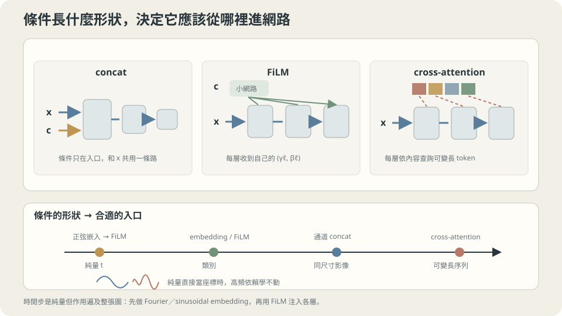

import Objectives from '../../../components/Objectives.astro';
import Ask from '../../../components/Ask.astro';
import Prereq from '../../../components/Prereq.astro';
import Question from '../../../components/Question.astro';
import Answer from '../../../components/Answer.astro';
import QuizBlock from '../../../components/QuizBlock.astro';
import Option from '../../../components/Option.astro';
import Explanation from '../../../components/Explanation.astro';
import VizPlan from '../../../components/VizPlan.astro';
import Remark from '../../../components/Remark.astro';
import Bridge from '../../../components/Bridge.astro';
import UsedBy from '../../../components/UsedBy.astro';
import Ref from '../../../components/Ref.astro';

# 同一台機器要依指令做不同的事，指令從哪裡餵進去？

<Objectives>
- **說出「把條件接成一個輸入維度」為什麼在純量條件上特別吃虧，並量出嵌入買到多少。** 對照同一個預算下純量、正弦嵌入、加寬兩倍三者的誤差。
- **分清三種注入方式各自改變了什麼。** concat 改輸入、FiLM 改每一層的尺度與偏移、cross-attention 改「要看哪裡」——說出它們各自適合什麼形狀的條件。
- **說出「沒有條件」必須是一個被訓練過的輸入。** 量出條件 dropout 從 $0$ 改成 $0.1$ 時，null token 的誤差差幾倍。
</Objectives>

<Prereq items={frontmatter.prereqs} />

## 同一台機器，不同的指令

前幾篇介紹了怎麼處理內容，但同一張照片可以要求修亮，也可以要求變成夜景。只看照片本身，不知道該做哪一種。**額外的指令要在哪裡進入網路？** 我們把它記成條件 $c$：

- 「把這張圖**修成夜景**」——條件是一個類別。
- 「照這段文字生成」——條件是一串 token。
- 「現在是流程的**第 300 步**，請做這一步該做的事」——條件是一個純量。

最後一種不同的是，因為它不是使用者給的指令，而是**演算法自己的狀態**。同一組權重要在很多個不同的階段各做一件不同的事，於是「現在是第幾步」必須被餵進去。

接法看起來很自由：接在輸入、接在中間某一層、或讓網路自己去查。但這幾種接法**不是同一件事的幾種寫法**——它們對不同形狀的條件有非常不同的成本。

<Ask>
指令要從哪裡餵進去？<br />
接在輸入的一個維度上就好了嗎？<br />
如果那個指令是一個純量，會不會特別吃虧？
</Ask>

<Question id="Q1">
把「依指令做不同的事」翻成數學：條件模型和無條件模型差在哪裡？把一個純量條件接成輸入的第二個維度，網路必須自己長出什麼東西——那件事對它來說容易嗎？

<Answer>
**先固定學習目標。** 若 label $Y$ 有有限二階矩、使用 L2 regression，理想條件模型學的是

$$
f_\theta(x,c)\ \approx\ \mathbb E[Y\mid X=x,\,C=c].
$$

多了一個條件，把輸入分得更細。條件變異數**取期望後**不會增大，但某一個特定桶子仍可能比原本更分散；有限模型與資料也不保證誤差一定下降。

**接成輸入維度之後，網路要自己長出什麼。** 若 $f$ 對 $c$ 的依賴是高頻的——例如流程的第 3 步和第 4 步該做的事差很多——那麼把 $c$ 當成一個普通的輸入座標，就是要求網路在那個座標上表現出高頻的變化。

而 <Ref to="ml-mlp" mode="title"/> 的頻率實驗量過這件事：同一個 $64\times64$ 的網路，目標從 1 個週期換到 32 個週期，訓練 MSE 從 $0.0000$ 變成 $0.3875$。**MLP 對高頻很不友善，而這個不友善不分輸入座標**——$x$ 這一維吃虧，$c$ 這一維一樣吃虧。

**兩條出路，方向不同。**

- **把頻率直接給它**：不要接 $c$，接 $\big(\sin(2\pi f_j c),\cos(2\pi f_j c)\big)_j$ 這一組不同頻率的特徵。網路要高頻時，它已經在輸入裡了，只需要線性組合。
- **不要讓 $c$ 走同一條路**：讓它去改變**每一層的行為**（尺度與偏移），而不是當成一個和 $x$ 平起平坐的座標。

本篇會把第一條量出來（嵌入比加寬便宜也有效），並說清楚第二條在什麼形狀的條件上才划算。
</Answer>
</Question>

## 三種注入方式，三種「改變什麼」

把接法按照「它改變了網路的哪一部分」排開：

- **concat（接在輸入）**：$f([x,c])$。最簡單，而且在條件和輸入是同一種東西時很自然（例如都是影像的像素）。缺點是條件的影響必須一路經過所有層才擴散開，而且它和 $x$ 共用同一條路。
- **FiLM（每一層的尺度與偏移）**：由 $c$ 算出一組 $(\gamma_\ell,\beta_\ell)$，在第 $\ell$ 層做 $h\leftarrow\gamma_\ell\odot h+\beta_\ell$。條件不再是一個座標，而是**直接調整每一層的行為**。這對「全域性、影響整張圖」的條件特別合適——類別、時間步、風格。
- **cross-attention**：由目前特徵提供 query，條件 token 提供 key 與 value，讓不同位置參考不同的條件部分。其他接法也能配合編碼器處理變長輸入，但 cross-attention 提供了直接的內容配對方式。

三者不互斥，實務上常常同時出現（時間用 FiLM、文字用 cross-attention、低階的輔助輸入用 concat）。挑的依據是**條件的形狀**：

| 條件長什麼樣 | 適合的注入方式 |
| --- | --- |
| 一個純量（時間、強度） | 嵌入 → FiLM（或 concat 嵌入） |
| 一個類別（有限選項） | 查一個 embedding 表 → FiLM |
| 一張同尺寸的圖（遮罩、邊緣圖） | concat 在通道上 |
| 一串長度可變的 token | cross-attention |



**圖說：** 三種接法改變的運算不同；時間嵌入則是提供純量條件的一種表示選擇。

## 為什麼純量條件要先做嵌入

正弦嵌入把一個純量 $c\in[0,1]$ 換成一組不同頻率的三角函數：

$$
\mathrm{emb}(c)=\big(\sin(2\pi f_jc),\ \cos(2\pi f_jc)\big)_{j=0}^{J-1},
\qquad f_j=2^{\,j}.
$$

**它在做的事可以用一句話說清楚：把「網路要自己長出高頻」換成「高頻已經在輸入裡，只需要把它們線性組合起來」。**

例如需要 $\sin(16\pi c)$ 時，若這個頻率已在輸入裡，後面的線性層便能直接選用，不必先從原始純量形成這個振盪。這是 Tancik 等人 [2] 研究 Fourier features 的動機之一；不代表任意網路的第一層權重都必須是 $O(k)$。

還有一個要檢查的限制：這裡全是整數頻率，所以 $\operatorname{emb}(0)=\operatorname{emb}(1)$。若兩端需要不同答案，應另保留 $c$、加入非整數頻率或使用其他能區分端點的嵌入，不能直接照搬這組示範頻率。

$f_j=2^j$ 這個幾何級數也不是隨便挑的：它讓不同尺度的變化都被覆蓋到，而且只要 $J$ 個維度就涵蓋 $2^{J}$ 倍的頻率範圍。

<Remark label="補充" summary="這和 Transformer 的位置編碼是同一個東西">
Transformer 的位置編碼用的是同一條式子（$\sin/\cos$ 配上幾何級數的頻率），解決的也是同一個問題：**位置是一個純量，而網路需要對它有多尺度的敏感度**。差別只在那裡的純量是「第幾個 token」，這裡是「第幾步」或「條件的強度」。

同一個技巧在座標型網路（用網路表示一張圖或一個 3D 場景）上叫 **Fourier features**（參考文獻 2），那篇論文把「為什麼沒有嵌入就學不到高頻」用 neural tangent kernel 講清楚了：沒有嵌入時，網路的等效核對高頻成分的響應以指數衰減，於是那些成分在任何合理的訓練時間內都學不到。

三個名字、三個領域、同一件事——可以把它記成一個通用的手法：**當一個純量需要高頻的影響力時，先把它展開成多個頻率。**
</Remark>

## 三種接法在同一個任務上

任務刻意設計成「對條件的依賴是高頻的」：

$$
y=\sin\big(2\pi x+2\pi\cdot 8\cdot t\big),\qquad x,t\sim U(0,1),\ n=800 .
$$

對 $x$ 的依賴是 1 個週期（很容易），對 $t$ 的依賴是 **8 個週期**（照 <Ref to="ml-mlp" mode="title"/> 的頻率表，這是要花點力氣的區域）。三個設定跑同樣的 6000 步、同樣的 Adam $\eta=0.01$：

```
  concat 純量 t            輸入維度   2  h= 64  訓練 MSE 0.0018
  concat 正弦嵌入 t         輸入維度  13  h= 64  訓練 MSE 0.0004
  concat 純量 t（寬兩倍）    輸入維度   2  h=128  訓練 MSE 0.0010
```

**嵌入把誤差降到四分之一（$0.0018\to0.0004$），而它只多了 11 個輸入維度。** 對照組更有說服力：把網路加寬兩倍（參數變成約四倍）只從 $0.0018$ 改善到 $0.0010$——**四倍的參數買到的，還不如 11 個不需要學的輸入維度。**

> **固定嵌入不需要學自己的頻率，但它仍改變輸入表示、後續參數數量與可表示的函數。改善來自哪裡，需用對照實驗確認。**

這也解釋了為什麼幾乎每一個需要「時間步」的模型都有一個正弦嵌入層，而且那一層通常沒有參數：它不是模型的一部分，是**輸入的一種座標選擇**——和 <Ref to="ml-gradient-descent" mode="title"/> 裡「標準化改的是碗的形狀」是同一類的動作。

## 「沒有條件」也必須被訓練過

條件模型有一個很容易被忽略的需求：有時候你要它**不要**依照條件做事。

- 想知道模型在「什麼都不指定」時的預設行為。
- 想比較「有條件」與「無條件」的輸出差在哪裡（很多引導式的取樣做法都需要這兩個）。
- 使用者就是沒有給條件。

直覺的做法是留一個 **null token**：一個代表「沒有條件」的特殊輸入（例如把 one-hot 全部設成零）。問題是——**如果訓練時條件永遠都在，那個 null token 從來沒有出現在訓練資料裡。**

任務是 $y=\sin(2\pi x)+0.8c$，$c$ 與 $x$ 獨立且兩類等機率。L2 的無條件最佳答案因此是 $\mathbb E[Y\mid X=x]=\sin(2\pi x)+0.4$。訓練時以獨立機率 $p$ 將條件換成 null，才能讓 null 分支看到這個邊際化的目標；一般情況要按 $p(c\mid x)$ 平均，不一定是各類一半。

```python
def feats(x, c, mask):                      # mask=0 表示這一筆的條件被丟掉
    oh = np.zeros((len(x), 2)); oh[np.arange(len(x)), c] = 1.0
    return np.c_[x, oh*mask[:,None]]

mask = (rng.random(N) > p).astype(float)    # p 是條件 dropout 的機率
```

```
  條件 dropout p=0.0   用 null token 預測「兩類平均」的 MSE 中位數 1.3908
  條件 dropout p=0.1   用 null token 預測「兩類平均」的 MSE 中位數 0.0660
  條件 dropout p=0.3   用 null token 預測「兩類平均」的 MSE 中位數 0.0225
  （對照：直接輸出 0 的 MSE = 0.6575）
```

這次 $p=0$ 的 null 表現很差，因為訓練目標沒有約束這個輸入的答案。函數仍有定義，只是沒有保證它等於兩類平均；其他初始化或模型不一定同樣差。

**只要 $10\%$ 的條件 dropout，誤差就掉到 $0.066$——二十一倍。** $p=0.3$ 再降到 $0.0225$，但代價是三成的訓練樣本沒有用到條件資訊，條件本身的品質會開始下降。實務上 $10\%$ 左右是常見的折衷。

> **「沒有條件」不是一個預設狀態，它是一個要被訓練的輸入。**

**刻意違反：把 null token 換成一個「沒用過的」向量。** 如果不是用全零，而是隨便挑一個訓練時沒出現過的向量（例如 one-hot 的第三格），結果和 $p=0$ 那一列一樣糟——**問題不在「用哪個向量代表沒有條件」，而在「那個向量有沒有被訓練過」。** 這也是為什麼實務上一律用「訓練時真的餵過的那個」當 null，而不是任何看起來比較中性的東西。

**這一切依賴什麼。** 一，上面的數字是在一個純量／類別條件、小網路上量的；條件是長序列時 dropout 的做法不同（丟整串、還是丟其中幾個 token，會影響模型學到的東西）。二，$p$ 是一個要調的超參數，而它同時影響「無條件有多準」與「有條件有多準」——兩者用同一組權重。三，這裡量的是「無條件輸出對不對」，不是「有條件輸出有沒有變差」；完整的評估要兩個都看。

## 三種接法、一個頻率設定、一個 dropout 設定

<iframe loading="lazy" src="/personal_website/notes/research_areas/machine-learning-foundations/l4-architectures/l4-5-2.html" class="demo-frame" title="三種接法、一個頻率設定、一個 dropout 設定：互動 demo" style="height: 914px; width: 100%; border: none;"></iframe>

**互動 demo：把條件頻率 k 拉大，「純量」那條訓練曲線整條抬高而「嵌入」那條幾乎不動。**

## 檢查理解

<QuizBlock id="ml-l4-5-a">
一個模型需要知道「現在是流程的第幾步」，團隊把步數除以總步數變成一個 $[0,1]$ 的純量接在輸入上，發現模型在相鄰步數之間的行為幾乎一樣。最直接的處方是：
<Option>把網路加寬，讓它有足夠容量區分不同的步數。</Option>
<Option correct>先確認相鄰步真的需要不同答案、時間確實進入計算，再比較原始純量與可區分端點的嵌入。相鄰輸出接近不一定代表學不到高頻。</Option>
<Option>把步數改成整數直接接進去，不要正規化。</Option>
<Explanation>
第一個選項不是完全沒用（加寬確實從 $0.0018$ 改善到 $0.0010$），但它的性價比差很多——這正是本篇實測的重點。第三個選項更糟：不正規化的大數值輸入會直接撞上 <Ref to="ml-gradient-descent" mode="title"/> 那個「換單位就毀掉訓練」的問題。真正對症的是把頻率搬到輸入裡。
</Explanation>
</QuizBlock>

<QuizBlock id="ml-l4-5-b">
一個條件模型在訓練時每一筆資料都有條件。上線後有人問「不給條件時模型會輸出什麼」，團隊把條件向量設成全零去問。根據本篇的實測，最可能的結果是：
<Option>得到兩個類別的平均，因為全零在幾何上是中點。</Option>
<Option correct>沒有保證得到兩類平均。null 沒在目標中受約束；獨立條件 dropout 是讓同一個模型學習這個分支的一種做法。</Option>
<Option>會得到其中一個類別的輸出，因為模型會挑一個。</Option>
<Explanation>
網路對 null token 通常仍有輸出，只是訓練目標沒有約束這個輸入。非線性也不保證輸入中點會對應輸出平均；若希望 null 分支學到特定答案，就要把它納入訓練目標。
</Explanation>
</QuizBlock>

<QuizBlock id="ml-l4-5-c">
關於 FiLM（用條件算出每一層的 $\gamma_\ell,\beta_\ell$）與 concat，下列哪一個判斷比較合理？
<Option>FiLM 永遠比 concat 好，因為它影響每一層。</Option>
<Option correct>要看條件的形狀。全域性、影響整個輸出的條件（類別、時間步、風格）適合 FiLM，因為它要改變的正是「每一層怎麼做事」；而和輸入同尺寸、位置對位置對應的條件（遮罩、邊緣圖）適合 concat 在通道上，那裡的空間對應關係是要保留的資訊。</Option>
<Option>concat 永遠比較好，因為它最簡單而且不增加參數。</Option>
<Explanation>
把選擇的依據放在「條件的形狀」而不是「哪個比較先進」，是這一篇想留下的判斷方式。順帶一提第三個選項的後半也不對：concat 會讓第一層的權重矩陣變大，所以它也增加參數，只是增加得少。實務上三種方式常常同時出現在同一個模型裡，各自處理一種形狀的條件。
</Explanation>
</QuizBlock>

<QuizBlock id="ml-l4-5-d">
下列哪一句**不對**？
<Option>固定正弦嵌入的頻率不需學習，但它會改變輸入表示與後續可表示的函數。</Option>
<Option>Transformer 的位置編碼與座標型網路的 Fourier features 解決的是同一個問題：一個純量需要多尺度的影響力。</Option>
<Option correct>條件 dropout 的 $p$ 越大越好，因為模型能更準地給出無條件的輸出。</Option>
<Explanation>
提高 dropout 機率，會改變有條件與 null 分支的訓練比例，但不保證其中哪一側必然改善或變差。這次只量了 null 誤差，還不足以支持「越大越好」；完整比較要同時檢查兩個分支。
</Explanation>
</QuizBlock>

<UsedBy slug={frontmatter.slug} />

<Bridge to="ml-maximum-likelihood">
條件與架構都有了，但預測一個平均答案還不足以描述所有可能結果。若要生成多種合理的圖片或文字，我們需要學一個 distribution。下一單元先問：資料已經抽出來了，要用什麼目標評價一個機率模型？
</Bridge>

## 參考文獻

1. Perez, E. et al. [*FiLM: Visual Reasoning with a General Conditioning Layer.*](https://arxiv.org/abs/1709.07871) AAAI 2018.（把「條件改變每一層的尺度與偏移」抽象成一個通用層，並比較它與 concat 的差別。）
2. Tancik, M. et al. [*Fourier Features Let Networks Learn High Frequency Functions in Low Dimensional Domains.*](https://arxiv.org/abs/2006.10739) NeurIPS 2020.（用 NTK 說明沒有嵌入時高頻為什麼學不到——本篇 Remark 的來源。）
3. Ho, J., Salimans, T. [*Classifier-Free Diffusion Guidance.*](https://arxiv.org/abs/2207.12598) 2022.（條件 dropout 與 null token 的標準做法；本篇最後一段實驗的實務對應。）
