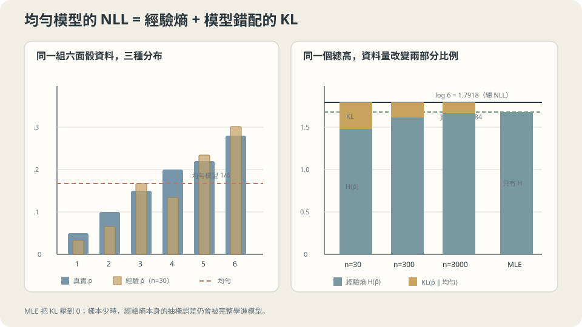

import Objectives from '../../../components/Objectives.astro';
import Ask from '../../../components/Ask.astro';
import Prereq from '../../../components/Prereq.astro';
import Question from '../../../components/Question.astro';
import Answer from '../../../components/Answer.astro';
import QuizBlock from '../../../components/QuizBlock.astro';
import Option from '../../../components/Option.astro';
import Explanation from '../../../components/Explanation.astro';
import VizPlan from '../../../components/VizPlan.astro';
import Remark from '../../../components/Remark.astro';
import Details from '../../../components/Details.astro';
import Bridge from '../../../components/Bridge.astro';
import UsedBy from '../../../components/UsedBy.astro';
import Ref from '../../../components/Ref.astro';

# 要怎麼替「這個模型有多符合資料」打一個分數？

<Objectives>
- **從「獨立事件的分數要可加」推出平均負對數似然，並說出它為什麼等於交叉熵。** 用六個符號的實測把「NLL = 熵 + KL」這個分解看成兩個可以分開讀的數字。
- **把最小平方與最小絕對值各自還原成一個噪聲假設。** 在有離群點與沒有離群點的兩份資料上，量出這個選擇的代價。
- **說出最大似然在小樣本會犯什麼錯，以及那個錯隨 $n$ 怎麼縮。** 區分「偏誤」與「抖動」兩件不同的事，並判斷什麼時候該擔心哪一個。
</Objectives>

<Prereq items={frontmatter.prereqs} />

## 換一個問題

前面五個 class 都在做同一件事：給一個 $x$，猜一個 $y$，然後用某個損失檢查那個猜測有多準。<Ref to="ml-empirical-risk" mode="title"/> 把「準」定義成風險，<Ref to="ml-data-splits" mode="title"/> 說明那個數字要在哪份資料上讀，<Ref to="ml-seeds-and-reporting" mode="title"/> 說明它自己也會抖。

現在換一個目標。不是「給 $x$ 猜一個 $y$」，而是**把整份資料是從哪裡來的寫下來**——一個分布 $p_\theta$。

這個換法會立刻遇到一個問題。猜 $y$ 的時候，「猜得準不準」有現成的意思：$y$ 就在那裡，比一下就知道。但一個**分布**要怎麼跟資料比？資料只是一堆點，它沒有附上一條密度曲線讓你對照。

<Ask>
一個模型說「這件事的機率是 $0.7$」，另一個說 $0.9$，<br />
而這件事發生了——後者一定比較好嗎？<br />
如果有一個模型說機率是 $0$，它該被扣多少分？
</Ask>

<Question id="Q1">
把「這個模型有多符合資料」翻成一個可以最小化的數字。要求兩件事：一，$n$ 筆獨立資料的總分應該可以由每一筆的分數**加起來**；二，分數只能用「模型給實際觀測到的那個值多少機率密度」算。在這兩個要求下，那個分數幾乎沒有選擇餘地——為什麼？

<Answer>
**從可加性開始。** 如果 $x_1,\dots,x_n$ 獨立，模型給這整份資料的機率是乘積：

$$
p_\theta(x_1,\dots,x_n)=\prod_{i=1}^n p_\theta(x_i).
$$

這個量叫**似然**（likelihood）。它已經是一個合理的分數了——模型給實際發生的事越高的機率，這個乘積越大。但它有兩個毛病。

**第一個毛病是數值。** 一千筆資料、每筆機率 $0.1$，乘起來是 $10^{-1000}$，浮點數直接變成 $0$。任何比較都做不下去。

**第二個毛病是形狀。** 我們想要的是可加的分數，這樣它才能跟 <Ref to="ml-empirical-risk" mode="title"/> 的經驗風險長得一樣、才能用 <Ref to="ml-minibatch-noise" mode="title"/> 的小批次無偏估計、才能丟給 <Ref to="ml-gradient-descent" mode="title"/>。

**兩個毛病同一個解法**：取對數。乘積變加總，$10^{-1000}$ 變成 $-2302.6$：

$$
\log p_\theta(x_{1:n})=\sum_{i=1}^n \log p_\theta(x_i).
$$

**而「取對數」不只是一個方便的技巧，它是唯一的選擇。** 如果你要一個把機率映到分數、而且滿足「獨立事件的分數相加」的函數 $f$，那就是要求 $f(ab)=f(a)+f(b)$；在連續性的假設下，這個方程式的解只有 $f(t)=c\log t$。所以對數不是眾多選項裡比較好用的一個，**它是「可加」這個要求本身的形狀**。

**最後加一個負號與除以 $n$**，把它變成一個要最小化的、和樣本數無關的量——**平均負對數似然**（average negative log-likelihood，NLL）：

$$
\mathcal L(\theta)=-\frac1n\sum_{i=1}^n \log p_\theta(x_i).
$$

**回到 Ask 的第三問。** 如果模型說某個實際發生的事機率是 $0$，那一項是 $-\log 0=+\infty$——**整份資料的分數變成無限大，一筆就毀掉全部**。這不是公式的意外，這是「可加」這個要求的必然後果，而且它是一個實質的宣告：*我的模型認為這件事不可能發生。* 一個宣告不可能的事真的發生了，那個模型就被證偽了，沒有「稍微扣一點分」這種中間地帶。這一點在本篇最後會變成一個很具體的工程問題。
</Answer>
</Question>

## 那個數字其實是兩個數字

平均 NLL 有一個分解，而那個分解把「模型好不好」拆成兩件可以分開讀的事。

把資料寫成**經驗分布** $\hat p$（每一筆資料佔 $1/n$ 的機率，這正是 <Ref to="ml-empirical-risk" mode="title"/> 那個「把積分換成平均」的同一個對象）。那麼

$$
\mathcal L(\theta)=-\sum_x \hat p(x)\log p_\theta(x)
=\underbrace{-\sum_x \hat p(x)\log \hat p(x)}_{\text{經驗分布的熵 } H(\hat p)}
+\underbrace{\sum_x \hat p(x)\log\frac{\hat p(x)}{p_\theta(x)}}_{\mathrm{KL}(\hat p\,\Vert\,p_\theta)}.
$$

左邊是你能算的、會拿去最小化的數字。右邊拆成兩項：

- **$H(\hat p)$ 完全不含 $\theta$。** 它是資料本身的不確定性，你動不了它。
- **$\mathrm{KL}(\hat p\Vert p_\theta)$ 是唯一可以動的部分**，而它 $\ge 0$，等號只在 $p_\theta=\hat p$ 時成立（<Ref to="math-kl" mode="title"/>）。

實測。六個符號、真實機率 $(0.05,0.10,0.15,0.20,0.22,0.28)$，抽 $n$ 筆之後算三個數字：

```
n=  30   MLE 的平均 NLL 1.4752 = 經驗分布的熵 1.4752
         均勻模型的平均 NLL 1.7918 = 熵 1.4752 + KL(經驗‖均勻) 0.3165 = 1.7918
n= 300   MLE 的平均 NLL 1.6942 = 經驗分布的熵 1.6942
         均勻模型的平均 NLL 1.7918 = 熵 1.6942 + KL(經驗‖均勻) 0.0975 = 1.7918
n=3000   MLE 的平均 NLL 1.6782 = 經驗分布的熵 1.6782
         均勻模型的平均 NLL 1.7918 = 熵 1.6782 + KL(經驗‖均勻) 0.1136 = 1.7918
```

**MLE 那一列的 KL 恰好是零。** 因為六個符號的模型族包含所有分布，所以「模型族裡 KL 最近的成員」就是經驗分布本身，NLL 就等於經驗熵，一位小數都不差。

**均勻模型的 NLL 永遠是 $\log 6=1.7918$，和 $n$ 完全無關。** 它不看資料，所以資料再多也不會變。

**$n$ 增加時經驗熵在往真實熵 $1.6784$ 爬。** $n=30$ 的 $1.4752$ 明顯偏低——三十筆資料撒在六個格子裡，有些格子會意外地空或意外地滿，那讓經驗分布看起來**比真實分布更集中**，也就是熵更低。這是本篇第三節的主題的第一個徵兆。

> **最大似然不是在找「對的分布」，而是在模型族裡找一個離經驗分布 KL 最近的成員。**

這句話把兩個限制同時講清楚了。**模型族**是一個限制：如果真實分布不在族裡，最好的成員也只是最好的近似（這就是 <Ref to="ml-bias-variance" mode="title"/> 的 bias 換一個外衣）。**經驗分布**是另一個限制：你逼近的是手上這 $n$ 筆資料算出來的分布，不是真實分布（這就是同一篇的 variance）。



**圖說：** 均勻模型的 NLL 總高固定；MLE 把 KL 壓成零，也會完整吸收有限樣本造成的經驗熵誤差。

## Gaussian 假設就是最小平方

<Ref to="ml-loss-declaration" mode="title"/> 說過：**選一個損失就是在宣告你在乎什麼**。那一篇把這句話停在直覺的層次。似然把它講完整了——那個宣告有一個具體的身分：**你假設噪聲長什麼樣**。

回到監督式的設定。假設

$$
y = f_\theta(x)+\varepsilon,\qquad \varepsilon\sim\mathcal N(0,\sigma^2),
$$

那麼 $p_\theta(y\mid x)=\mathcal N(y;f_\theta(x),\sigma^2)$，把負對數似然寫開（<Ref to="math-gaussian" mode="title"/>）：

$$
-\log p_\theta(y\mid x)=\frac{(y-f_\theta(x))^2}{2\sigma^2}+\frac12\log(2\pi\sigma^2).
$$

第二項不含 $\theta$。所以**最小化負對數似然，和最小化平方誤差，是同一件事**——整個系列從 <Ref to="ml-learning-from-examples" mode="title"/> 用到現在的 MSE，其實一直是一個 Gaussian 假設。

換一個噪聲假設就換一個損失。拉普拉斯分布 $p(\varepsilon)\propto e^{-|\varepsilon|/b}$ 給出

$$
-\log p_\theta(y\mid x)=\frac{|y-f_\theta(x)|}{b}+\text{const},
$$

也就是**最小絕對值誤差**。而最小平方的解是平均數、最小絕對值的解是中位數——兩個大家都知道、看起來只是「不同的統計量」的東西，在這裡變成同一個框架下的兩個不同宣告。

實測。真實位置是 $0$，資料是 $95\%$ 的 $\mathcal N(0,1)$ 加上 $5\%$ 偏移到 $+20$ 的離群點，$n=200$，重複 2000 次：

```
95% N(0,1) + 5% 離群點 :
  Gaussian 假設 → 最小平方 → 平均數 :   估計 +0.9965 ± 0.3165   均方誤差 1.0932
  拉普拉斯假設 → 最小絕對值 → 中位數 : 估計 +0.0661 ± 0.0965   均方誤差 0.0137

純 N(0,1)，沒有離群點 :
  平均數  均方誤差 0.005007
  中位數  均方誤差 0.007799      （比值 1.5578，理論 π/2 = 1.5708）
```

**上半是「假設錯了」的代價**：$5\%$ 的離群點讓最小平方的估計整整偏了 $+1.00$，均方誤差差了 **80 倍**。原因不難看——Gaussian 的尾巴掉得像 $e^{-t^2/2}$，一個 $+20$ 的點在這個假設下幾乎不可能存在，所以模型寧可把整條曲線拉過去，也不願意承認那個點。

**下半是「假設對了」的回報**：沒有離群點時，反而是最小平方比較好，比值 $1.5578$ 幾乎正中理論值 $\pi/2$。那 $57\%$ 的額外均方誤差是你為了防範離群點而付的保險費。

> **你選的不是損失，是噪聲模型；而那個假設錯得越離譜，代價越大。**

<Remark label="補充" summary="這也解釋了為什麼分類用交叉熵而不是 MSE">
分類的輸出是一個類別分布。把「模型給正確類別的機率」取負對數，就是大家熟知的**交叉熵損失**——它就是本篇的平均 NLL，只是換了一個名字。

那為什麼不能用 MSE 去配 one-hot 標籤？可以，但那是在宣告「標籤的噪聲是 Gaussian 的」，而標籤是 $0$ 或 $1$，這個宣告明顯不對。實際的後果在梯度上：softmax 配交叉熵時，對 logit 的梯度恰好是 $\hat p - y$（見下方推導），乾淨且不會飽和；softmax 配 MSE 則會多乘一個 softmax 的雅可比，在模型信心很高但答錯的時候梯度反而趨近零——**錯得越離譜、學得越慢**，正好是反過來的。
</Remark>

<Details summary="softmax + 交叉熵對 logit 的梯度">
設 logit 為 $z\in\mathbb R^K$，$\hat p_k=e^{z_k}/\sum_j e^{z_j}$，標籤是類別 $c$。損失 $\mathcal L=-\log\hat p_c$。

$$
\frac{\partial \mathcal L}{\partial z_k}
=-\frac{\partial}{\partial z_k}\Big(z_c-\log\textstyle\sum_j e^{z_j}\Big)
=-\big(\mathbb 1[k=c]-\hat p_k\big)=\hat p_k-\mathbb 1[k=c].
$$

也就是 $\nabla_z\mathcal L=\hat p-y$（$y$ 是 one-hot）。這個式子沒有任何會飽和的因子：**預測錯得越多，梯度越大**。<Ref to="ml-backprop" mode="title"/> 提到的「把 softmax 和交叉熵合成一個節點」指的就是直接實作這一行，而不是分兩層各自微分——後者在數值上會經過 $\log$ 和除法，容易溢位。
</Details>

## $n$ 小的時候，最大似然會說謊

前面兩節都在講 MLE 對的地方。這一節講它錯的地方，而且錯得比多數人預期的嚴重。

**第一個實驗：一枚真實機率 $p=0.3$ 的硬幣。** MLE 就是樣本比例。丟 $n$ 次，重複很多次：

```
n=   5   MLE 說「這枚硬幣永遠不會出正面」的比例  16.61%    MLE 的標準差 0.2043
n=  10   MLE 說「這枚硬幣永遠不會出正面」的比例   2.79%    MLE 的標準差 0.1445
n=  50   MLE 說「這枚硬幣永遠不會出正面」的比例   0.00%    MLE 的標準差 0.0652
n= 500   MLE 說「這枚硬幣永遠不會出正面」的比例   0.00%    MLE 的標準差 0.0205
```

**丟五次，有 $16.61\%$ 的機率最大似然會告訴你「正面的機率是零」。** 而根據第一節，「機率是零」是一個會讓 NLL 變成 $+\infty$ 的宣告——這個模型在下一次看到正面的時候會被無限扣分。它不是「有點不準」，它是**在一個它其實會發生的事件上宣告不可能**。

這不是 MLE 沒算好。$0$ 確實是那五次資料的最大似然解——如果五次都是反面，「正面機率為零」給那份資料的似然是 $1$，任何其他值都更低。**問題在於「最符合手上的資料」和「最接近真相」是兩件不同的事**，而這正是 <Ref to="ml-overfitting-underfitting" mode="title"/> 的主題換一個場景出現。

**第二個實驗：模型離真相有多遠。** 同一枚硬幣，量 $\mathrm{KL}(\text{真實}\Vert\text{MLE})$ 的中位數：

```
n=   10   KL 中位數 0.08015
n=  100   KL 中位數 0.00732
n= 1000   KL 中位數 0.00070
n=10000   KL 中位數 0.00007
```

**每把 $n$ 乘十，KL 就掉大約十倍。** 這是 $O(1/n)$，不是 $O(1/\sqrt n)$——注意這和標準差那一欄不一樣（$0.2043\to0.0205$ 是十倍 $n$ 換 $\sqrt{10}$ 倍）。原因是 KL 在最小值附近是**二次**的：參數偏了 $\delta$，KL 大約是 $\delta^2$ 乘上一個常數（那個常數就是 Fisher 資訊）。而 $\delta\sim1/\sqrt n$，所以 $\delta^2\sim1/n$。

**第三個實驗：系統性的偏誤。** 估計 $\mathcal N(0,1)$ 的變異數，MLE 是 $\hat\sigma^2=\frac1n\sum(x_i-\bar x)^2$：

```
n=  3   E[σ²_MLE] = 0.6646    理論 (n-1)/n = 0.6667
n=  5   E[σ²_MLE] = 0.8014    理論 (n-1)/n = 0.8000
n= 10   E[σ²_MLE] = 0.9042    理論 (n-1)/n = 0.9000
n=100   E[σ²_MLE] = 0.9915    理論 (n-1)/n = 0.9900
```

**MLE 系統性地低估變異數**，而且這不是抖動——重複再多次，平均值仍然是 $0.9$ 而不是 $1$。理由很直白：$\bar x$ 是**從同一份資料算出來的**，它會往資料的方向靠，所以資料到 $\bar x$ 的距離必然比到真實均值的距離短。這是「同一份資料用了兩次」的又一個版本，和 <Ref to="ml-hyperparameters" mode="title"/> 講的是同一件事。

<Remark label="注意" summary="偏誤與抖動是兩件事，而且縮得不一樣快">
把上面三個實驗的縮放整理成一張表，會看到三個不同的速度：

| 量 | $n=10$ | $n=100$ | 速度 |
| --- | --- | --- | --- |
| MLE 的標準差 | $0.1445$ | $\approx0.046$ | $O(1/\sqrt n)$ |
| 變異數估計的偏誤 | $10\%$ | $1\%$ | $O(1/n)$ |
| $\mathrm{KL}(\text{真}\Vert\text{MLE})$ | $0.08015$ | $0.00732$ | $O(1/n)$ |

**偏誤比抖動縮得快**，所以在 $n$ 稍大之後，MLE 的誤差幾乎全部來自抖動。這就是為什麼「MLE 有偏」在實務上通常不是重點——$n=1000$ 時那 $0.1\%$ 的偏誤，遠小於 $3\%$ 的抖動。真正要擔心的是 $n$ 小的時候，而那時候該做的不是換一個無偏估計量，是**換一個限制更多的模型族**，或者加先驗。

（把 $n$ 換成 $n-1$ 的那個「無偏變異數估計」確實存在，但它不是 MLE，而且它無偏的只有 $\sigma^2$——$\sqrt{\cdot}$ 之後的 $\sigma$ 仍然有偏。無偏性不是在函數變換下保持的性質。）
</Remark>

## 似然曲面、樣本數，與零機率的懸崖

<iframe loading="lazy" src="/personal_website/notes/research_areas/machine-learning-foundations/l5-probabilistic-modeling/l5-0-2.html" class="demo-frame" title="似然曲面、樣本數，與零機率的懸崖：互動 demo" style="height: 850px; width: 100%; border: none;"></iframe>

**互動 demo：母體交叉熵與 KL 永遠平行、最小值同一個 μ；你手上只有抖動的那條經驗 NLL。**

## 零機率在訓練裡長什麼樣

第一節那個「$-\log 0=+\infty$」看起來像一個理論上的邊角，但它是實務上最常見的幾個 NaN 來源之一。

**它會在哪裡出現。** 一，語言模型遇到訓練時沒見過的 token；二，離散模型在 softmax 之前的 logit 太極端，數值上把某個機率壓成 $0$；三，連續模型把密度集中到一個點（<Ref to="ml-regularization" mode="title"/> 提過的那種塌陷），那時候 NLL 可以往 $-\infty$ 跑，方向相反但一樣是發散。

**三個標準對策，各自在宣告什麼。**

- **平滑**（Laplace / add-$\alpha$）：在每個計數上加一個小常數。這等價於**加一個先驗**——你在說「我不相信任何事件的機率真的是零」，而 $\alpha$ 是這個不信的強度。它把 $n=5$ 那 $16.61\%$ 的災難直接消掉。
- **在 log 空間算**：不要先算出機率再取對數，直接用 `log_softmax`、`logsumexp` 這一類函式。這不改變數學，只是不讓浮點數在中途把一個很小的數變成零。
- **限制模型族**：不給模型表達「機率為零」的能力（例如輸出層加一個下界，或用一個尾巴夠厚的分布族）。這是三個裡最強的宣告，也最容易在別的地方付出代價。

**這一切依賴什麼。** 一，$n$ 筆資料**獨立**——這是把乘積拆開的那一步用到的，而時間序列、同一位病患的多次量測、同一張圖片的多個 crop 都不滿足它。二，**模型族裡有東西接近真相**；不然 MLE 收斂到的是「族裡 KL 最近的成員」，而那可能離真相很遠，且第三節那些「隨 $n$ 消失」的保證一個都不適用。三，**似然本身算得出來**——下一篇整篇就在處理算不出來的情況。

> **最大似然給你的保證是「$n$ 夠大時會收斂到模型族裡 KL 最近的成員」；它從來沒有保證那個成員是好的。**

## 檢查理解

<QuizBlock id="ml-l5-0-a">
第二節的實測裡，均勻模型在 $n=30$、$300$、$3000$ 的平均 NLL 都是 $1.7918$，完全沒有變。最能解釋這件事的是：
<Option>三次抽樣剛好都很接近均勻分布。</Option>
<Option correct>均勻模型給每個符號的機率恆為 $1/6$，所以每一筆資料的 $-\log p$ 都是 $\log 6=1.7918$，平均起來與抽到什麼、抽多少筆都無關。變動的是那個 NLL 怎麼拆成「熵 + KL」兩段。</Option>
<Option>因為 $n$ 還不夠大，$n=10^6$ 時它會開始下降。</Option>
<Explanation>
這題想釘住的是「NLL = 熵 + KL」這個分解的兩邊各自受什麼影響。左邊（均勻模型的 NLL）只由模型決定；右邊兩段都隨資料變，只是加起來必須維持那個定值。第三個選項的方向也錯了：$n\to\infty$ 時經驗分布趨近真實分布，$\mathrm{KL}(\hat p\Vert\text{均勻})$ 趨近 $\log 6-1.6784=0.1134$，那個和恆為 $\log 6$。
</Explanation>
</QuizBlock>

<QuizBlock id="ml-l5-0-b">
在 $95\%$ Gaussian 加 $5\%$ 離群點的資料上，最小平方給出 $+0.9965$、最小絕對值給出 $+0.0661$。下列哪一句最準確？
<Option>最小絕對值是比較好的損失，應該預設使用。</Option>
<Option correct>兩個損失各自對應一個噪聲假設，這份資料的噪聲比 Gaussian 厚尾，所以拉普拉斯的假設比較接近真相。反過來在純 Gaussian 資料上，最小平方的均方誤差是 $0.005007$、最小絕對值是 $0.007799$，比值 $1.5578\approx\pi/2$——那 $57\%$ 是防範離群點的保險費。</Option>
<Option>最小平方失敗是因為 $n=200$ 太小，$n$ 夠大就會收斂到 $0$。</Option>
<Explanation>
第三個選項是這題真正想擋的誤解。$+0.9965$ 不是抖動，是**偏誤**——真實平均數確實是 $0.95\times0+0.05\times20=1.0$，最小平方精確地估到了它要估的東西。錯的是「這份資料的位置參數應該用平均數來定義」這個假設本身，而那個錯不會隨 $n$ 消失（標準差 $0.3165$ 會縮，$+1.0$ 的偏移不會）。這和 <Ref to="ml-bias-variance" mode="title"/> 的 bias 是同一種東西。
</Explanation>
</QuizBlock>

<QuizBlock id="ml-l5-0-c">
$p=0.3$ 的硬幣丟五次，有 $16.61\%$ 的機率 MLE 給出 $\hat p=0$。這代表：
<Option>最大似然在伯努利模型上算錯了，應該改用別的估計式。</Option>
<Option correct>$\hat p=0$ 確實是那五次資料的最大似然解（五次都是反面時，$p=0$ 給的似然是 $1$，任何其他值都更低）。問題是「最符合手上的資料」不等於「最接近真相」，而似然沒有任何機制能區分這兩者。修正的方向是加先驗或平滑，也就是引入資料以外的資訊。</Option>
<Option>只要改用交叉驗證選 $\hat p$ 就不會發生。</Option>
<Explanation>
$0.7^5=0.16807$，模擬給的 $16.61\%$ 就是它。第三個選項容易漏掉的是：交叉驗證（<Ref to="ml-cross-validation" mode="title"/>）是用來選超參數的，而這裡 $\hat p$ 是參數；更根本的是，如果五次都是反面，任何只看這份資料的程序都不會告訴你正面存在。這裡真正缺的是資料以外的資訊——也就是先驗。
</Explanation>
</QuizBlock>

<QuizBlock id="ml-l5-0-d">
下列哪一句**不對**？
<Option>用 MSE 訓練一個回歸模型，等價於假設噪聲是變異數固定的 Gaussian 分布並做最大似然。</Option>
<Option>$\mathrm{KL}(\text{真}\Vert\text{MLE})$ 隨 $n$ 以 $O(1/n)$ 縮小，比 MLE 自己的標準差（$O(1/\sqrt n)$）快，因為 KL 在最小值附近是二次的。</Option>
<Option correct>把樣本變異數的分母從 $n$ 換成 $n-1$ 之後，$\sqrt{\hat\sigma^2}$ 也會是 $\sigma$ 的無偏估計。</Option>
<Explanation>
第三句是無偏性一個很容易踩的陷阱：$\mathbb E[\hat\sigma^2]=\sigma^2$ 並不推出 $\mathbb E[\sqrt{\hat\sigma^2}]=\sigma$，因為 $\sqrt\cdot$ 是凹的，由 Jensen（<Ref to="math-jensen" mode="title"/>）可知 $\mathbb E[\sqrt X]\le\sqrt{\mathbb E[X]}$——標準差會被系統性低估。**無偏性在非線性變換下不保持**，而這也是為什麼實務上很少特別去追求它：它不是一個穩健的性質，而且如同上面的 Remark 所說，在 $n$ 稍大之後它帶來的差別遠小於抖動。
</Explanation>
</QuizBlock>

<UsedBy slug={frontmatter.slug} />

<Bridge to="ml-latent-variables-elbo">
但這個框架有一個前提被悄悄用掉了：**$p_\theta(x)$ 要算得出來**。一旦模型裡有一個沒被觀測到的變數——一個群集標籤、一個潛在編碼、一個加噪聲的中間狀態——$p_\theta(x)$ 就變成一個對那個變數的積分，而那個積分通常沒有封閉解。接著處理這件事，答案是一個下界：與其算那個積分，不如找一個猜得夠好的分布，把它變成一個可以最佳化、而且和真值的差距有明確身分的量。
</Bridge>

## 參考文獻

1. Cover, T. & Thomas, J. [*Elements of Information Theory*, 2nd ed.](https://onlinelibrary.wiley.com/doi/book/10.1002/047174882X) Wiley 2006, Ch. 2, 11.（熵、交叉熵與 KL 的標準處理，以及「NLL = 熵 + KL」這個分解的資訊論讀法。）
2. Bishop, C. [*Pattern Recognition and Machine Learning.*](https://www.microsoft.com/en-us/research/publication/pattern-recognition-machine-learning/) Springer 2006, Ch. 1.2, 2.3.（把最小平方還原成 Gaussian 似然，以及變異數 MLE 的偏誤來源。）
3. Murphy, K. [*Probabilistic Machine Learning: An Introduction.*](https://probml.github.io/pml-book/book1.html) MIT Press 2022, Ch. 4.（MLE 的一致性與漸近性質，以及平滑／先驗在小樣本的作用。）
