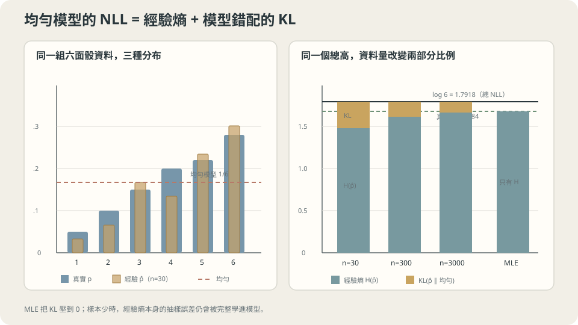

import Objectives from '../../../components/Objectives.astro';
import Ask from '../../../components/Ask.astro';
import Prereq from '../../../components/Prereq.astro';
import Question from '../../../components/Question.astro';
import Answer from '../../../components/Answer.astro';
import QuizBlock from '../../../components/QuizBlock.astro';
import Option from '../../../components/Option.astro';
import Explanation from '../../../components/Explanation.astro';
import VizPlan from '../../../components/VizPlan.astro';
import Remark from '../../../components/Remark.astro';
import Details from '../../../components/Details.astro';
import Bridge from '../../../components/Bridge.astro';
import UsedBy from '../../../components/UsedBy.astro';
import Ref from '../../../components/Ref.astro';

# 要怎麼替「這個模型有多符合資料」打一個分數？

<Objectives>
- **從觀測資料的 likelihood 寫出平均 NLL。** 在離散情況拆成經驗熵與 KL；說明為什麼連續資料不能直接套用同一個經驗 KL 分解。
- **推導固定尺度的 Gaussian 與 Laplace likelihood 分別給出 MSE 與 L1。** 分清「可以用 likelihood 解釋這個 loss」和「必須相信真實噪聲就是這個分布」。
- **解釋有限樣本的 MLE 為什麼可能給出零機率。** 用硬幣比例與 Gaussian 變異數分清抽樣波動、偏誤，以及漸近結果需要的條件。
</Objectives>

<Prereq items={frontmatter.prereqs} />

## 沒有真實分布，怎麼比較機率模型？

前面五個 class 都在做同一件事：給一個 $x$，猜一個 $y$，然後用某個損失檢查那個猜測有多準。<Ref to="ml-empirical-risk" mode="title"/> 把「準」定義成風險，<Ref to="ml-data-splits" mode="title"/> 說明那個數字要在哪份資料上讀，<Ref to="ml-seeds-and-reporting" mode="title"/> 說明它自己也會抖。

現在換一個目標。想像要預測明天會收到哪一類訂單，我們不只報出最可能的類別，還想給每一類一個機率。模型給出的就是一個分布 $p_\theta$。

這個換法會立刻遇到一個問題。猜 $y$ 的時候，「猜得準不準」有現成的意思：$y$ 就在那裡，比一下就知道。但一個**分布**要怎麼跟資料比？資料只是一堆點，它沒有附上一條密度曲線讓你對照。

<Ask>
一個模型說「這件事的機率是 $0.7$」，另一個說 $0.9$，<br />
而這件事發生了——後者一定比較好嗎？<br />
如果有一個模型說機率是 $0$，它該被扣多少分？
</Ask>

<Question id="Q1">
先用模型給這整份資料的 likelihood 比較模型。如果還希望把乘積轉成可加、且不改變大小排序的分數，取對數為什麼是自然的做法？

<Answer>
**從可加性開始。** 如果 $x_1,\dots,x_n$ 獨立，模型給這整份資料的機率是乘積：

$$
p_\theta(x_1,\dots,x_n)=\prod_{i=1}^n p_\theta(x_i).
$$

這個量叫**似然**（likelihood）。它已經是一個合理的分數了——模型給實際發生的事越高的機率，這個乘積越大。但它有兩個毛病。

**第一個毛病是數值。** 一千筆資料、每筆機率 $0.1$，乘起來是 $10^{-1000}$，浮點數直接變成 $0$。任何比較都做不下去。

**第二個毛病是形狀。** 我們想要的是可加的分數，這樣它才能跟 <Ref to="ml-empirical-risk" mode="title"/> 的經驗風險長得一樣、才能用 <Ref to="ml-minibatch-noise" mode="title"/> 的小批次無偏估計、才能丟給 <Ref to="ml-gradient-descent" mode="title"/>。

**兩個毛病同一個解法**：取對數。乘積變加總，$10^{-1000}$ 變成 $-2302.6$：

$$
\log p_\theta(x_{1:n})=\sum_{i=1}^n \log p_\theta(x_i).
$$

更具體地說，如果對 likelihood 的連續轉換 $f$ 要滿足 $f(ab)=f(a)+f(b)$，它就是 $f(t)=c\log t$；要保持大小排序，再取 $c>0$。這是對「likelihood 如何轉換」的限制，不代表所有逐筆相加的評分方式都只能是 log loss。

**最後加一個負號與除以 $n$**，把它變成一個要最小化的、和樣本數無關的量——**平均負對數似然**（average negative log-likelihood，NLL）：

$$
\mathcal L(\theta)=-\frac1n\sum_{i=1}^n \log p_\theta(x_i).
$$

**回到 Ask 的第三問。** 對離散事件，模型若給觀測到的類別零機率，那一項就是 $-\log0=+\infty$。Log loss 對這種「把會發生的事判成不可能」的預測給出無限懲罰。
</Answer>
</Question>

<Remark label="補充" summary="連續情況代入的是 density，不是某一點的機率">
若 $X$ 連續，$P(X=x)=0$ 並不代表模型出錯；likelihood 代入的是 density $p_\theta(x)$。它描述附近小區間的機率約為 $p_\theta(x)\,\mathrm dx$，可以大於 $1$，所以連續資料的 NLL 也可以是負的。比較時要使用相同的變數與單位。
</Remark>

## 那個數字其實是兩個數字

平均 NLL 有一個分解，而那個分解把「模型好不好」拆成兩件可以分開讀的事。

先看離散資料。把資料寫成**經驗分布** $\hat p$，也就是各類別出現的比例。加上再減掉 $\sum_x\hat p(x)\log\hat p(x)$，得到

$$
\mathcal L(\theta)=-\sum_x \hat p(x)\log p_\theta(x)
=\underbrace{-\sum_x \hat p(x)\log \hat p(x)}_{\text{經驗分布的熵 } H(\hat p)}
+\underbrace{\sum_x \hat p(x)\log\frac{\hat p(x)}{p_\theta(x)}}_{\mathrm{KL}(\hat p\,\Vert\,p_\theta)}.
$$

左邊是你能算的、會拿去最小化的數字。右邊拆成兩項：

- **$H(\hat p)$ 完全不含 $\theta$。** 它是資料本身的不確定性，你動不了它。
- **$\mathrm{KL}(\hat p\Vert p_\theta)$ 是唯一可以動的部分**，而它 $\ge 0$，等號只在 $p_\theta=\hat p$ 時成立（<Ref to="math-kl" mode="title"/>）。

實測。六個符號、真實機率 $(0.05,0.10,0.15,0.20,0.22,0.28)$，抽 $n$ 筆之後算三個數字：

```
n=  30   MLE 的平均 NLL 1.4752 = 經驗分布的熵 1.4752
         均勻模型的平均 NLL 1.7918 = 熵 1.4752 + KL(經驗‖均勻) 0.3165 = 1.7918
n= 300   MLE 的平均 NLL 1.6942 = 經驗分布的熵 1.6942
         均勻模型的平均 NLL 1.7918 = 熵 1.6942 + KL(經驗‖均勻) 0.0975 = 1.7918
n=3000   MLE 的平均 NLL 1.6782 = 經驗分布的熵 1.6782
         均勻模型的平均 NLL 1.7918 = 熵 1.6782 + KL(經驗‖均勻) 0.1136 = 1.7918
```

**MLE 那一列的 KL 恰好是零。** 因為六個符號的模型族包含所有分布，所以「模型族裡 KL 最近的成員」就是經驗分布本身，NLL 就等於經驗熵，一位小數都不差。

**均勻模型的 NLL 永遠是 $\log 6=1.7918$，和 $n$ 完全無關。** 它不看資料，所以資料再多也不會變。

這三次抽樣的經驗熵逐漸接近真實熵 $1.6784$，但單次抽樣的數值不必隨 $n$ 單調上升。有限樣本的 plug-in entropy 在期望下偏低：它把機率估計的波動也算成了資料的集中程度。

> **最大似然不是在找「對的分布」，而是在模型族裡找一個離經驗分布 KL 最近的成員。**

這句話在上面的離散模型中成立，也提醒我們兩個限制：模型族能表達什麼，以及這批資料能代表真實分布到什麼程度。兩者分別對應模型限制與抽樣誤差，但不等於直接完成了一個 bias–variance decomposition。

<Remark label="補充" summary="連續資料要分清 population 與 empirical objective">
對有共同基準測度、且各項有限的真實 density $p$，仍有
$$
\mathbb E_{X\sim p}[-\log p_\theta(X)]
=H(p)+\mathrm{KL}(p\Vert p_\theta).
$$
樣本平均 NLL 是左邊的估計。但連續資料的 empirical distribution 是點質量，而 $p_\theta$ 通常有連續 density；兩者之間的 KL 是無限大。因此不能把有限的 sample NLL 直接寫成「連續 empirical entropy 加 empirical KL」。
</Remark>



**圖說：** 均勻模型的 NLL 總高固定；MLE 把 KL 壓成零，也會完整吸收有限樣本造成的經驗熵誤差。

## Gaussian 假設就是最小平方

<Ref to="ml-loss-declaration" mode="title"/> 說過：**選一個損失就是在宣告你在乎什麼**。那一篇把這句話停在直覺的層次。似然把它講完整了——那個宣告有一個具體的身分：**你假設噪聲長什麼樣**。

回到監督式的設定。假設

$$
y = f_\theta(x)+\varepsilon,\qquad \varepsilon\sim\mathcal N(0,\sigma^2),
$$

那麼 $p_\theta(y\mid x)=\mathcal N(y;f_\theta(x),\sigma^2)$，把負對數似然寫開（<Ref to="math-gaussian" mode="title"/>）：

$$
-\log p_\theta(y\mid x)=\frac{(y-f_\theta(x))^2}{2\sigma^2}+\frac12\log(2\pi\sigma^2).
$$

若 $\sigma^2>0$ 固定，第二項不含 $\theta$，所以**最小化這個 NLL 和最小化平方誤差是同一件事**。這給 MSE 一個 likelihood 解釋，但不是使用 MSE 的必要前提：只要二次動差有限，即使噪聲不是 Gaussian，L2 的理想最佳解仍是 conditional mean。

換一個噪聲假設就換一個損失。拉普拉斯分布 $p(\varepsilon)\propto e^{-|\varepsilon|/b}$ 給出

$$
-\log p_\theta(y\mid x)=\frac{|y-f_\theta(x)|}{b}+\text{const},
$$

也就是**最小絕對值誤差**。而最小平方的解是平均數、最小絕對值的解是中位數——兩個大家都知道、看起來只是「不同的統計量」的東西，在這裡變成同一個框架下的兩個不同宣告。

實測。這次要估的是未受污染那群資料的中心 $0$；觀測資料則是 $95\%$ 的 $\mathcal N(0,1)$ 加上 $5\%$ 位於 $+20$ 的離群點。取 $n=200$，重複 2000 次：

```
95% N(0,1) + 5% 離群點 :
  Gaussian 假設 → 最小平方 → 平均數 :   估計 +0.9965 ± 0.3165   均方誤差 1.0932
  拉普拉斯假設 → 最小絕對值 → 中位數 : 估計 +0.0661 ± 0.0965   均方誤差 0.0137

純 N(0,1)，沒有離群點 :
  平均數  均方誤差 0.005007
  中位數  均方誤差 0.007799      （比值 1.5578，理論 π/2 = 1.5708）
```

上半的平均數接近 $1$，因為污染後的分布平均就是 $0.95\times0+0.05\times20=1$。它沒有算錯，而是在估另一個量。若目標是原來那群人的中心 $0$，中位數受少數離群點的影響較小。

**下半是「假設對了」的回報**：沒有離群點時，反而是最小平方比較好，比值 $1.5578$ 幾乎正中理論值 $\pi/2$。那 $57\%$ 的額外均方誤差是你為了防範離群點而付的保險費。

> **選 loss 時，要先決定想估哪個量；likelihood 則讓我們看見這個選擇對應的機率模型。**

<Remark label="補充" summary="這也解釋了為什麼分類用交叉熵而不是 MSE">
分類的輸出是一個類別分布。把「模型給正確類別的機率」取負對數，就是大家熟知的**交叉熵損失**——它就是本篇的平均 NLL，只是換了一個名字。

MSE 配 one-hot 也可以用：對機率向量而言，它就是 Brier score，理想最佳解同樣是真實類別機率，不必把標籤解讀成 Gaussian。差別之一在最佳化：softmax 配交叉熵對 logit 的梯度是 $\hat p-y$；配 MSE 則多乘 softmax Jacobian。模型信心很高卻答錯時，後者的梯度可能很小，前者仍保留明顯的修正訊號。
</Remark>

<Details summary="softmax + 交叉熵對 logit 的梯度">
設 logit 為 $z\in\mathbb R^K$，$\hat p_k=e^{z_k}/\sum_j e^{z_j}$，標籤是類別 $c$。損失 $\mathcal L=-\log\hat p_c$。

$$
\frac{\partial \mathcal L}{\partial z_k}
=-\frac{\partial}{\partial z_k}\Big(z_c-\log\textstyle\sum_j e^{z_j}\Big)
=-\big(\mathbb 1[k=c]-\hat p_k\big)=\hat p_k-\mathbb 1[k=c].
$$

也就是 $\nabla_z\mathcal L=\hat p-y$（$y$ 是 one-hot）。這個式子沒有任何會飽和的因子：**預測錯得越多，梯度越大**。<Ref to="ml-backprop" mode="title"/> 提到的「把 softmax 和交叉熵合成一個節點」指的就是直接實作這一行，而不是分兩層各自微分——後者在數值上會經過 $\log$ 和除法，容易溢位。
</Details>

## 沒看過，不代表不會發生

想像只問過五位顧客，沒有人選某一道餐點。我們能因此說，下一位顧客也絕對不會選嗎？把觀測比例直接當成機率，就可能遇到這個問題。

**第一個實驗：一枚真實機率 $p=0.3$ 的硬幣。** MLE 就是樣本比例。丟 $n$ 次，重複很多次：

```
n=   5   MLE 說「這枚硬幣永遠不會出正面」的比例  16.61%    MLE 的標準差 0.2043
n=  10   MLE 說「這枚硬幣永遠不會出正面」的比例   2.79%    MLE 的標準差 0.1445
n=  50   MLE 說「這枚硬幣永遠不會出正面」的比例   0.00%    MLE 的標準差 0.0652
n= 500   MLE 說「這枚硬幣永遠不會出正面」的比例   0.00%    MLE 的標準差 0.0205
```

五次都沒有正面的機率是 $0.7^5=16.807\%$；表中的 $16.61\%$ 是模擬比例。這時 MLE 給出 $\hat p=0$，下一次若看到正面，log loss 就是無限大。

這不是 MLE 沒算好。$0$ 確實是那五次資料的最大似然解——如果五次都是反面，「正面機率為零」給那份資料的似然是 $1$，任何其他值都更低。**問題在於「最符合手上的資料」和「最接近真相」是兩件不同的事**，而這正是 <Ref to="ml-overfitting-underfitting" mode="title"/> 的主題換一個場景出現。

**第二個實驗：模型離真相有多遠。** 同一枚硬幣，量 $\mathrm{KL}(\text{真實}\Vert\text{MLE})$ 的中位數：

```
n=   10   KL 中位數 0.08015
n=  100   KL 中位數 0.00732
n= 1000   KL 中位數 0.00070
n=10000   KL 中位數 0.00007
```

表中量的是 KL 的**中位數**。在內部真值 $p=0.3$ 附近，$\hat p-p=O_p(n^{-1/2})$，而
$$
\mathrm{KL}(\operatorname{Bern}(p)\Vert\operatorname{Bern}(p+\delta))
=\frac{\delta^2}{2p(1-p)}+O(\delta^3).
$$
因此典型 KL 的尺度是 $O_p(1/n)$。但這不是期望 KL 的結論：任何有限 $n$ 都有正機率抽到全反面或全正面，令這個 KL 無限大，所以未平滑 MLE 的期望 KL 仍是無限大。

**第三個實驗：系統性的偏誤。** 估計 $\mathcal N(0,1)$ 的變異數，MLE 是 $\hat\sigma^2=\frac1n\sum(x_i-\bar x)^2$：

```
n=  3   E[σ²_MLE] = 0.6646    理論 (n-1)/n = 0.6667
n=  5   E[σ²_MLE] = 0.8014    理論 (n-1)/n = 0.8000
n= 10   E[σ²_MLE] = 0.9042    理論 (n-1)/n = 0.9000
n=100   E[σ²_MLE] = 0.9915    理論 (n-1)/n = 0.9900
```

當均值也由資料估計時，MLE 會系統性低估變異數。用
$$
\sum_i(x_i-\bar x)^2=\sum_i(x_i-\mu)^2-n(\bar x-\mu)^2
$$
取期望，右邊是 $n\sigma^2-\sigma^2$，因此 $\mathbb E\hat\sigma^2=(n-1)\sigma^2/n$。少掉的部分來自先用資料估計均值；這和拿 validation 反覆選模型並不是同一個程序。

<Remark label="注意" summary="偏誤與抖動是兩件事，而且縮得不一樣快">
把上面三個實驗的縮放整理成一張表，會看到三個不同的速度：

| 量 | $n=10$ | $n=100$ | 速度 |
| --- | --- | --- | --- |
| MLE 的標準差 | $0.1445$ | $\approx0.046$ | $O(1/\sqrt n)$ |
| 變異數估計的偏誤 | $10\%$ | $1\%$ | $O(1/n)$ |
| $\mathrm{KL}(\text{真}\Vert\text{MLE})$ 的中位數 | $0.08015$ | $0.00732$ | 典型尺度 $O(1/n)$ |

在這些固定維度、正則的例子裡，偏誤可比標準差縮得更快；這不是所有 MLE 的通則。是否修正偏誤、限制模型或加入先驗，仍要依目標、樣本數與評估 loss 決定。

（把 $n$ 換成 $n-1$ 的那個「無偏變異數估計」確實存在，但它不是 MLE，而且它無偏的只有 $\sigma^2$——$\sqrt{\cdot}$ 之後的 $\sigma$ 仍然有偏。無偏性不是在函數變換下保持的性質。）
</Remark>

## 似然曲面、樣本數，與零機率的懸崖

<iframe loading="lazy" src="/personal_website/notes/research_areas/machine-learning-foundations/l5-probabilistic-modeling/l5-0-2.html" class="demo-frame" title="似然曲面、樣本數，與零機率的懸崖：互動 demo" style="height: 850px; width: 100%; border: none;"></iframe>

**互動 demo：母體交叉熵與 KL 永遠平行、最小值同一個 μ；你手上只有抖動的那條經驗 NLL。**

## 零機率在訓練裡長什麼樣

第一節那個「$-\log 0=+\infty$」看起來像一個理論上的邊角，但它是實務上最常見的幾個 NaN 來源之一。

零機率可能來自計數模型把未出現的類別設為零，或浮點運算把極小的 softmax 機率壓成零。有限 logit 的 softmax 在數學上仍給每個類別正機率；「token 沒出現過」不會自動令它的機率為零。另一種方向相反的問題，是過度靈活的連續模型讓 density 無限集中，例如 Gaussian mixture 的一個 component 縮在單一觀測點上，sample NLL 就可能往 $-\infty$ 跑。

**三個標準對策，各自在宣告什麼。**

- **平滑**（Laplace / add-$\alpha$）：在 $K$ 個類別的計數各加 $\alpha>0$，得到 $(n_k+\alpha)/(n+K\alpha)$。它是對稱 Dirichlet prior 下的 posterior predictive probability，不是一般的 MAP 公式；即使某一類沒出現，預測機率仍是正的。
- **在 log 空間算**：不要先算出機率再取對數，直接用 `log_softmax`、`logsumexp` 這一類函式。這不改變數學，只是不讓浮點數在中途把一個很小的數變成零。
- **限制模型族**：不給模型表達「機率為零」的能力（例如輸出層加一個下界，或用一個尾巴夠厚的分布族）。這是三個裡最強的宣告，也最容易在別的地方付出代價。

上面的乘積用到了 iid 假設；相依資料也能做 MLE，但應使用正確的 joint likelihood，不能直接當成 iid。MLE 的一致性還需要可識別性、適當正則條件與可求得的最佳解；若模型設定錯誤，在相應條件下可能收斂到 population KL 最近的成員，而不是真實分布。

> **Likelihood 衡量模型如何解釋資料；要從有限樣本推到真實分布，還需要模型與統計上的條件。**

## 檢查理解

<QuizBlock id="ml-l5-0-a">
第二節的實測裡，均勻模型在 $n=30$、$300$、$3000$ 的平均 NLL 都是 $1.7918$，完全沒有變。最能解釋這件事的是：
<Option>三次抽樣剛好都很接近均勻分布。</Option>
<Option correct>均勻模型給每個符號的機率恆為 $1/6$，所以每一筆資料的 $-\log p$ 都是 $\log 6=1.7918$，平均起來與抽到什麼、抽多少筆都無關。變動的是那個 NLL 怎麼拆成「熵 + KL」兩段。</Option>
<Option>因為 $n$ 還不夠大，$n=10^6$ 時它會開始下降。</Option>
<Explanation>
這題想釘住的是「NLL = 熵 + KL」這個分解的兩邊各自受什麼影響。左邊（均勻模型的 NLL）只由模型決定；右邊兩段都隨資料變，只是加起來必須維持那個定值。第三個選項的方向也錯了：$n\to\infty$ 時經驗分布趨近真實分布，$\mathrm{KL}(\hat p\Vert\text{均勻})$ 趨近 $\log 6-1.6784=0.1134$，那個和恆為 $\log 6$。
</Explanation>
</QuizBlock>

<QuizBlock id="ml-l5-0-b">
在 $95\%$ Gaussian 加 $5\%$ 離群點的資料上，最小平方給出 $+0.9965$、最小絕對值給出 $+0.0661$。下列哪一句最準確？
<Option>最小絕對值是比較好的損失，應該預設使用。</Option>
<Option correct>若想估未污染那群資料的中心 $0$，中位數較不受少數離群點影響；但平均數正在估污染後的均值 $1$，不能只因它遠離 $0$ 就說 L2 算錯了。</Option>
<Option>最小平方失敗是因為 $n=200$ 太小，$n$ 夠大就會收斂到 $0$。</Option>
<Explanation>
污染後的真實均值是 $1$，所以增加資料不會讓平均數回到 $0$。兩種 loss 對應不同的估計目標；先指定要估的是污染後均值，還是原來那群資料的中心，才能判斷哪個結果合適。
</Explanation>
</QuizBlock>

<QuizBlock id="ml-l5-0-c">
$p=0.3$ 的硬幣丟五次，有約 $16.8\%$ 的機率 MLE 給出 $\hat p=0$。這代表：
<Option>最大似然在伯努利模型上算錯了，應該改用別的估計式。</Option>
<Option correct>$\hat p=0$ 確實是那五次資料的最大似然解（五次都是反面時，$p=0$ 給的似然是 $1$，任何其他值都更低）。問題是「最符合手上的資料」不等於「最接近真相」，而似然沒有任何機制能區分這兩者。修正的方向是加先驗或平滑，也就是引入資料以外的資訊。</Option>
<Option>只要改用交叉驗證選 $\hat p$ 就不會發生。</Option>
<Explanation>
$0.7^5=0.16807$，模擬給的 $16.61\%$ 就是它。第三個選項容易漏掉的是：交叉驗證（<Ref to="ml-cross-validation" mode="title"/>）是用來選超參數的，而這裡 $\hat p$ 是參數；更根本的是，如果五次都是反面，任何只看這份資料的程序都不會告訴你正面存在。這裡真正缺的是資料以外的資訊——也就是先驗。
</Explanation>
</QuizBlock>

<QuizBlock id="ml-l5-0-d">
下列哪一句**不對**？
<Option>用 MSE 訓練一個回歸模型，等價於假設噪聲是變異數固定的 Gaussian 分布並做最大似然。</Option>
<Option>對內部真值的 Bernoulli 模型，未平滑 MLE 的典型 KL 可有 $O_p(1/n)$ 尺度，但有限樣本的期望 KL 仍可能無限大。</Option>
<Option correct>把樣本變異數的分母從 $n$ 換成 $n-1$ 之後，$\sqrt{\hat\sigma^2}$ 也會是 $\sigma$ 的無偏估計。</Option>
<Explanation>
第三句是無偏性一個很容易踩的陷阱：$\mathbb E[\hat\sigma^2]=\sigma^2$ 並不推出 $\mathbb E[\sqrt{\hat\sigma^2}]=\sigma$，因為 $\sqrt\cdot$ 是凹的，由 Jensen（<Ref to="math-jensen" mode="title"/>）可知 $\mathbb E[\sqrt X]\le\sqrt{\mathbb E[X]}$——標準差會被系統性低估。**無偏性在非線性變換下不保持**，而這也是為什麼實務上很少特別去追求它：它不是一個穩健的性質，而且如同上面的 Remark 所說，在 $n$ 稍大之後它帶來的差別遠小於抖動。
</Explanation>
</QuizBlock>

<UsedBy slug={frontmatter.slug} />

<Bridge to="ml-latent-variables-elbo">
現在有了比較機率模型的 loss，但還有一個計算問題：**$p_\theta(x)$ 算得出來嗎？** 若模型先抽一個沒被觀測到的 latent variable，再產生資料，likelihood 就要把所有可能的 latent values 平均掉。下一篇從這個積分出發，看看能不能用一個可訓練的下界來處理它。
</Bridge>

## 參考文獻

1. Cover, T. & Thomas, J. [*Elements of Information Theory*, 2nd ed.](https://onlinelibrary.wiley.com/doi/book/10.1002/047174882X) Wiley 2006, Ch. 2, 11.（熵、交叉熵與 KL 的標準處理，以及「NLL = 熵 + KL」這個分解的資訊論讀法。）
2. Bishop, C. [*Pattern Recognition and Machine Learning.*](https://www.microsoft.com/en-us/research/publication/pattern-recognition-machine-learning/) Springer 2006, Ch. 1.2, 2.3.（把最小平方還原成 Gaussian 似然，以及變異數 MLE 的偏誤來源。）
3. Murphy, K. [*Probabilistic Machine Learning: An Introduction.*](https://probml.github.io/pml-book/book1.html) MIT Press 2022, Ch. 4.（MLE 的一致性與漸近性質，以及平滑／先驗在小樣本的作用。）
