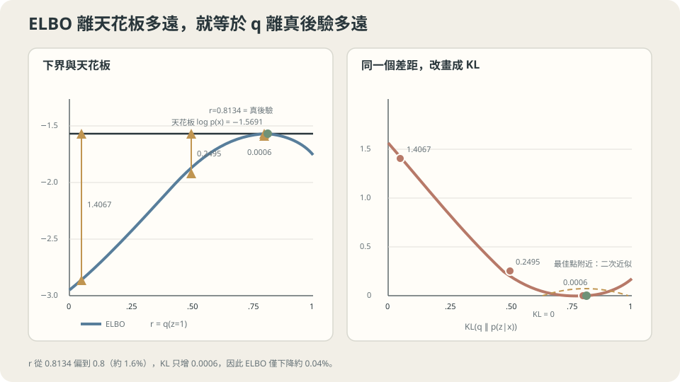

import Objectives from '../../../components/Objectives.astro';
import Ask from '../../../components/Ask.astro';
import Prereq from '../../../components/Prereq.astro';
import Question from '../../../components/Question.astro';
import Answer from '../../../components/Answer.astro';
import QuizBlock from '../../../components/QuizBlock.astro';
import Option from '../../../components/Option.astro';
import Explanation from '../../../components/Explanation.astro';
import VizPlan from '../../../components/VizPlan.astro';
import Remark from '../../../components/Remark.astro';
import Details from '../../../components/Details.astro';
import Bridge from '../../../components/Bridge.astro';
import UsedBy from '../../../components/UsedBy.astro';
import Ref from '../../../components/Ref.astro';

# 當那個要加總的量算不出來，可以退到哪裡？

<Objectives>
- **寫出 $\log p_\theta(x)=\text{ELBO}(q)+\mathrm{KL}(q\Vert p_\theta(z\mid x))$，並說出為什麼這個等式比 Jensen 不等式有用。** 用實測驗證那個差確實逐位吻合。
- **把 EM 讀成「交替最大化同一個下界」。** 從六輪的實測讀出 E-step 與 M-step 各自把哪個量抬起來，並說出單調性從哪裡來。
- **判斷 $\mathrm{KL}(q\Vert p)$ 這個方向帶來什麼系統性偏差。** 在雙峰目標上量出它與反方向的差別，並說出這在實務上會怎麼出現。
</Objectives>

<Prereq items={frontmatter.prereqs} />

## 一個多出來的變數

<Ref to="ml-maximum-likelihood" mode="title"/> 給了一個乾淨的分數：把模型給實際資料的機率取對數。那一篇悄悄用掉一個前提——**$p_\theta(x)$ 要算得出來**。

很多有用的模型都不滿足它，而且理由都一樣：模型裡有一個**你沒看到的變數**。

- 一堆點看起來分成幾群，但每個點屬於哪一群沒有寫在資料上。
- 一張圖片背後有一組「內容編碼」，但資料只有像素。
- 一段語音背後有一串音素狀態，但錄音只有波形。

把那個看不到的變數叫 $z$。模型是 $p_\theta(x,z)=p_\theta(z)\,p_\theta(x\mid z)$——聯合機率通常很好寫，因為它就是「先抽一個 $z$，再依 $z$ 生出 $x$」這個故事。但你要的分數需要的是 $x$ 的邊際機率：

$$
p_\theta(x)=\int p_\theta(z)\,p_\theta(x\mid z)\,\mathrm dz .
$$

**這個積分幾乎總是沒有封閉解。** 兩個群集的時候它只是兩項相加，還好；但 $z$ 是一串 $T$ 個離散狀態時是 $K^T$ 項，$z$ 是一個 $64$ 維的連續向量時是一個 $64$ 維積分。而每一步梯度下降都要算一次。

<Ask>
一個要對所有可能的隱藏狀態加總的量算不出來，<br />
但我們其實只需要它變大——<br />
有沒有一個算得出來、而且保證不會高估它的替身？
</Ask>

<Question id="Q1">
造一個 $\log p_\theta(x)$ 的下界。有兩條路：一條用 Jensen 不等式，三行就到；另一條繞得遠一點，但會**順便算出那個下界差了多少**。兩條走一次，然後說明為什麼第二條才是這一篇真正的主角。

<Answer>
**第一條路（Jensen）。** 引進任何一個 $z$ 上的分布 $q(z)$，只要它在 $p_\theta(z)$ 有質量的地方都有質量：

$$
\log p_\theta(x)=\log\int q(z)\frac{p_\theta(x,z)}{q(z)}\mathrm dz
=\log\mathbb E_{q}\!\left[\frac{p_\theta(x,z)}{q(z)}\right]
\;\ge\;\mathbb E_{q}\!\left[\log\frac{p_\theta(x,z)}{q(z)}\right].
$$

最後一步是 Jensen（<Ref to="math-jensen" mode="title"/>）：$\log$ 是凹的，所以 $\log\mathbb E\ge\mathbb E\log$。右邊那個量就是 **ELBO**（evidence lower bound）：

$$
\mathcal F(q,\theta)=\mathbb E_{q(z)}\big[\log p_\theta(x,z)-\log q(z)\big].
$$

它算得出來——裡面只有聯合機率（好寫）和 $q$（你自己選的），沒有積分不掉的東西。三行結束。

**但這條路只告訴你「$\ge$」，沒告訴你差多少。** 而「差多少」正是你最需要知道的：如果差距是 $0.001$，最大化 ELBO 就幾乎等於最大化 log-likelihood；如果差距是 $5$ 而且會隨 $\theta$ 亂跑，那最大化 ELBO 可能把你帶到完全錯的地方。

**第二條路（直接算差）。** 不用不等式，寫一個恆等式。注意 $p_\theta(x,z)=p_\theta(x)\,p_\theta(z\mid x)$，代進 ELBO：

$$
\mathcal F(q,\theta)=\mathbb E_q\!\left[\log\frac{p_\theta(x)\,p_\theta(z\mid x)}{q(z)}\right]
=\log p_\theta(x)-\mathbb E_q\!\left[\log\frac{q(z)}{p_\theta(z\mid x)}\right],
$$

也就是

$$
\boxed{\;\log p_\theta(x)=\mathcal F(q,\theta)+\mathrm{KL}\big(q(z)\,\big\Vert\,p_\theta(z\mid x)\big).\;}
$$

**這是一個等式，不是不等式。** 它比第一條路多給了三件事：

1. **下界成立的理由變成 $\mathrm{KL}\ge0$**，Jensen 只是這件事的一個影子。
2. **鬆緊有了名字**：ELBO 差 log-likelihood 多少，完全等於你選的 $q$ 離**真後驗** $p_\theta(z\mid x)$ 多遠。
3. **緊的條件是可判斷的**：$q=p_\theta(z\mid x)$ 時等號成立，此時 ELBO **精確等於** log-likelihood。

第三點會在第三節直接變成一個演算法。
</Answer>
</Question>

## 那個差真的就是 KL

先把等式當成一個可以驗的宣稱。

設定：兩個成分的一維 Gaussian 混合，$p(z=1)=0.7$、$\mu_0=-1.0$、$\mu_1=1.5$、$\sigma=1$。這個模型小到 $\log p(x)$ 可以精確算出來（兩項相加），所以 ELBO 的每一分鬆緊都看得見。

取 $x=0.5$。真後驗是 $p(z=1\mid x)=0.8134$，而 $\log p(x)=-1.5691$。讓 $q$ 是一個 $q(z=1)=r$ 的伯努利，掃 $r$：

```
  r = 0.0500   ELBO = -2.9758   gap = 1.4067   KL(q‖p(z|x)) = 1.4067
  r = 0.2000   ELBO = -2.4530   gap = 0.8840   KL           = 0.8840
  r = 0.5000   ELBO = -1.8186   gap = 0.2495   KL           = 0.2495
  r = 0.8134   ELBO = -1.5691   gap = 0.0000   KL           = 0.0000   ← q = 真後驗
  r = 0.8000   ELBO = -1.5697   gap = 0.0006   KL           = 0.0006
  r = 0.9500   ELBO = -1.6507   gap = 0.0816   KL           = 0.0816
```

換三個不同的 $x$、兩個不同的 $r$，逐位仍然吻合：

```
  x = -2.0   r = 0.3   gap = 0.830826   KL = 0.830826
  x = -2.0   r = 0.6   gap = 2.201990   KL = 2.201990
  x =  0.0   r = 0.3   gap = 0.132907   KL = 0.132907
  x =  0.0   r = 0.6   gap = 0.004070   KL = 0.004070
  x = +2.0   r = 0.3   gap = 3.050125   KL = 3.050125
  x = +2.0   r = 0.6   gap = 1.421288   KL = 1.421288
```

> **下界的鬆緊不是一個模糊的「近似誤差」，它有一個名字：你猜的後驗離真後驗的 KL。**

第一張表裡有一列最能看出問題的是：**$r=0.8$ 比最佳的 $0.8134$ 偏了 $1.6\%$，但 ELBO 只掉了 $0.0006$**，也就是相對誤差 $0.04\%$。原因是 KL 在最小值附近是二次的（和 <Ref to="ml-maximum-likelihood" mode="title"/> 第三節那個 $O(1/n)$ 同一個理由）：偏了 $\delta$，代價是 $O(\delta^2)$。

**這件事是整個變分方法能用的根本原因。** 真後驗算不出來、只能用一個受限的家族去近似——但只要近似「大致對」，下界就已經很緊了。反過來，$r=0.05$ 那一列（偏得離譜）掉了 $1.41$，那就不是小事。



**圖說：** ELBO 與 log-likelihood 的差正是後驗 KL；最佳點附近的二次形狀讓小偏差只付二階代價。

## EM：交替把兩個東西抬起來

第二節的等式對**任何** $q$ 都成立。把它當成一個有兩組變數的最佳化問題——$q$ 和 $\theta$——立刻得到一個演算法：輪流固定一個、最大化另一個。

- **E-step**：固定 $\theta$，對 $q$ 最大化 $\mathcal F$。由等式，$\log p_\theta(x)$ 不含 $q$，所以最大化 $\mathcal F$ 等於最小化 $\mathrm{KL}(q\Vert p_\theta(z\mid x))$，答案是 $q=p_\theta(z\mid x)$，而此時 **ELBO 精確等於 log-likelihood**。
- **M-step**：固定 $q$，對 $\theta$ 最大化 $\mathcal F$。$q$ 固定時 $\mathcal F=\mathbb E_q[\log p_\theta(x,z)]+\text{const}$，而聯合機率是好寫的，所以這一步通常有封閉解。

實測。$n=500$ 筆從上面那個混合抽出來的資料，故意從一個很差的起點（$\mu=(-0.2,0.2)$、$\pi=(0.5,0.5)$）開始：

```
  init        ELBO = -1119.412                       log-lik = -1094.282
  iter 1   E 後 ELBO = -1094.282 （= log-lik -1094.282）   M 後 ELBO =  -998.819   mu = -0.113, +0.966
  iter 2   E 後 ELBO =  -978.036 （= log-lik  -978.036）   M 後 ELBO =  -949.100   mu = -0.271, +1.268
  iter 3   E 後 ELBO =  -923.753 （= log-lik  -923.753）   M 後 ELBO =  -906.253   mu = -0.594, +1.475
  iter 4   E 後 ELBO =  -898.532 （= log-lik  -898.532）   M 後 ELBO =  -894.940   mu = -0.762, +1.517
  iter 5   E 後 ELBO =  -893.098 （= log-lik  -893.098）   M 後 ELBO =  -891.803   mu = -0.854, +1.500
  iter 6   E 後 ELBO =  -890.823 （= log-lik  -890.823）   M 後 ELBO =  -890.030   mu = -0.919, +1.475
  真值 mu = -1.000, +1.500
```

三件事直接從表上讀得出來。

**一，每一個 E 後的 ELBO 精確等於當時的 log-likelihood**（$-1094.282$、$-978.036$、$-923.753$…，一位小數都不差）。這就是「E-step 把 KL 壓成零」的實測。

**二，ELBO 從頭到尾單調不減**：$-1119.4\to-1094.3\to-998.8\to-978.0\to\dots$。兩種 step 都在最大化同一個 $\mathcal F$，所以它只能上升。

**三，log-likelihood 也單調不減**，而且這是推論不是巧合：E 後 $\mathcal F=\log p$；接下來的 M-step 讓 $\mathcal F$ 上升；而 $\log p\ge\mathcal F$ 恆成立。所以下一輪 E 後的 $\log p$ 一定不低於這一輪。

> **E-step 把下界頂到天花板，M-step 把天花板抬高；兩步都在推同一個量，所以它不會倒退。**

**但要注意這個保證有多弱。** 單調不減不等於收斂到全域最佳——上表跑到第六輪 $\mu$ 是 $(-0.919,+1.475)$，還在往真值 $(-1.0,+1.5)$ 爬；而換一個更糟的起點，EM 可以停在一個把兩個成分都放在同一個地方的局部解。這是 <Ref to="ml-loss-landscape" mode="title"/> 那件事在機率模型上的版本，初始化一樣重要。

<Details summary="為什麼 M-step 常常有封閉解，而直接對 log p 做梯度下降沒有">
直接最大化 $\log p_\theta(x)=\log\sum_z p_\theta(z)p_\theta(x\mid z)$ 時，那個 $\log$ 卡在加總的外面，微分會產生一個帶分母的式子，把所有成分耦合在一起。

M-step 最大化的是 $\mathbb E_q[\log p_\theta(x,z)]=\sum_z q(z)\big[\log p_\theta(z)+\log p_\theta(x\mid z)\big]$——**$\log$ 在加總裡面**。於是每個成分的參數各自獨立，而且如果 $p_\theta(x\mid z)$ 是指數族，那就是一個加權的最大似然，有封閉解。以 Gaussian 混合為例：

$$
\mu_k\leftarrow\frac{\sum_i q_i(k)\,x_i}{\sum_i q_i(k)},\qquad
\pi_k\leftarrow\frac1n\sum_i q_i(k).
$$

也就是「用後驗當權重的加權平均」。上表的 M-step 就是這兩行。

關鍵是：**這個好處不是免費的**。ELBO 把 $\log$ 搬進加總裡，代價正是那個 $\mathrm{KL}$ 項——你換掉的是「精確但難算」，換來的是「好算但有一個已知大小的缺口」。
</Details>

## 後驗也算不出來的時候

EM 假設 E-step 做得到，也就是真後驗 $p_\theta(z\mid x)$ 寫得出來。$z$ 是離散且不多的時候可以（上面就是），但 $z$ 是一個連續向量、$p_\theta(x\mid z)$ 是一個神經網路的時候，後驗完全沒有封閉形式。

這時候退一步：**不要求 $q$ 等於後驗，只在一個可參數化的家族裡找最近的那個**。而且不要對每個 $x$ 各解一次最佳化，改成**訓練一個網路 $q_\phi(z\mid x)$ 直接把 $x$ 映到那個 $q$ 的參數**（這叫 amortized inference——把每個資料點的推論成本攤提到一次訓練裡）。整個目標變成對 $\theta$ 和 $\phi$ 同時做梯度上升：

$$
\mathcal F(\phi,\theta)=\underbrace{\mathbb E_{q_\phi(z\mid x)}\big[\log p_\theta(x\mid z)\big]}_{\text{重建：}z\text{ 要能還原 }x}
-\underbrace{\mathrm{KL}\big(q_\phi(z\mid x)\,\Vert\,p_\theta(z)\big)}_{\text{編碼:}z\text{ 不能離先驗太遠}} .
$$

（這只是把 ELBO 裡的 $\log p_\theta(x,z)-\log q$ 重新分組，不是新的東西。）

兩項的拉鋸很好讀：第一項要 $z$ 帶足夠的資訊去還原 $x$，第二項要 $z$ 的分布貼著先驗。**而第二項可以被壓到零**——如果 $p_\theta(x\mid z)$ 強到不需要 $z$ 就能生出 $x$，那最省事的解是讓 $q_\phi(z\mid x)$ 完全不看 $x$、直接等於先驗。這叫 **posterior collapse**：ELBO 看起來還不錯，但 $z$ 什麼都沒學到。

這件事在上面那個混合模型裡就能量出來——把兩個成分的距離慢慢縮小，$z$ 能承載的資訊量（也就是那個 KL 項在 $x$ 上的期望）跟著塌：

```
  |μ₁-μ₀| = 4.00    E_x[KL(p(z|x) ‖ p(z))] = 0.556150 nats
  |μ₁-μ₀| = 2.00                             0.291858
  |μ₁-μ₀| = 1.00                             0.094910
  |μ₁-μ₀| = 0.50                             0.025576
  |μ₁-μ₀| = 0.20                             0.004182
  |μ₁-μ₀| = 0.05                             0.000262
  |μ₁-μ₀| = 0.00                             0.000000
```

**注意它掉得多快**：距離減半，資訊量掉到四分之一以下（$0.5562\to0.2919\to0.0949\to0.0256$）。也就是說，「$z$ 有用」和「$z$ 完全沒用」之間沒有一段平坦的過渡帶——一旦訓練往「不靠 $z$」的方向走一點，那個方向的回報就更小，於是走得更遠。**這是一個正回饋，而正回饋通常需要外力才停得下來**，實務上的對策（KL 退火、在 KL 項上設下界、削弱 decoder）全都是在提供那個外力。

<Remark label="注意" summary="$\mathrm{KL}(q\Vert p)$ 這個方向會挑一個 mode 就停">
變分法用的是 $\mathrm{KL}(q\Vert p)$（把你猜的放在前面），這個順序不是隨便選的——它是第二節那個恆等式自然給出的，也是唯一一個期望對 $q$ 取、因而抽得出樣本的方向。但它有一個系統性的偏好。

實測：目標 $p$ 是 $0.5\,\mathcal N(-2,0.5^2)+0.5\,\mathcal N(2,0.5^2)$（雙峰，標準差 $2.0616$），用單一 Gaussian $q$ 去逼近：

```
  最小化 KL(q‖p) ：mu = +1.9998   sigma = 0.5004   值 0.6931
  最小化 KL(p‖q) ：mu = -0.0000   sigma = 2.0616   值 0.7236
```

**前者挑了一個峰、寬度精確等於那個峰的寬度（$0.5004$ 對真值 $0.5$），另一個峰整個放棄**（它付的代價正好是 $\ln 2=0.6931$，也就是丟掉一半質量）。後者把兩個峰一起蓋住，標準差 $2.0616$ 剛好是真實分布的標準差，但中間那塊機率其實是零的區域被它填滿了。

兩個方向各自在避免不同的災難：$\mathrm{KL}(q\Vert p)$ 罰的是「$q$ 有質量但 $p$ 沒有」（所以它不敢跨過空隙），$\mathrm{KL}(p\Vert q)$ 罰的是「$p$ 有質量但 $q$ 沒有」（所以它不敢漏掉任何一塊）。<Ref to="math-kl" mode="title"/> 的不對稱性在這裡不是一個技術細節，它直接決定你會得到哪一種錯誤。

實務上的後果：用 ELBO 訓練出來的模型，傾向**低估真實分布的散佈**。這在生成的時候看得見——樣本偏保守、偏典型。
</Remark>

## 拖動 $q$，看下界和那塊 KL 一起動

<iframe loading="lazy" src="/personal_website/notes/research_areas/machine-learning-foundations/l5-probabilistic-modeling/l5-1-2.html" class="demo-frame" title="拖動 $q$，看下界和那塊 KL 一起動：互動 demo" style="height: 872px; width: 100%; border: none;"></iframe>

**互動 demo：一次走半步：E-step 把縫補成精確的 0，M-step 把貼好的下界往上推。**

## 這套東西什麼時候可靠

**這一切依賴什麼。**

一，**聯合機率 $p_\theta(x,z)$ 要好寫**。整個方法的立足點就是「聯合好寫、邊際難算」；如果連聯合都寫不出來，ELBO 沒有著力點。

二，**$q$ 的家族要罩得住真後驗的形狀**。上面的 Remark 已經量過代價：家族不夠時，缺口不只是變大，它還會**往特定方向偏**。而且這個缺口是**看不見的**——你能算 ELBO，但算不出 $\log p_\theta(x)$，所以你無從得知自己差多遠。

三，**「ELBO 變大」不等於「模型變好」**。因為 $\log p=\mathcal F+\mathrm{KL}$，ELBO 上升可能是 $\log p$ 上升，也可能只是 $q$ 變準了。比較兩個**不同架構**的 ELBO 尤其危險：缺口大小不同，比較的不是同一個東西。

> **ELBO 是一個你算得出來的量，$\log p_\theta(x)$ 是一個你想要的量，而兩者的差是一個你通常量不到的量——這三句話要一起記。**

## 檢查理解

<QuizBlock id="ml-l5-1-a">
第二節的實測裡，$r=0.8$ 的 ELBO 是 $-1.5697$，而最佳的 $r=0.8134$ 是 $-1.5691$。這個「偏了 $1.6\%$ 只掉 $0.04\%$」最好的解釋是：
<Option>$q$ 的選擇其實不太重要，隨便取一個都可以。</Option>
<Option correct>$\mathrm{KL}(q\Vert p(z\mid x))$ 在最小值處為零且可微，所以在附近是二次的——偏離 $\delta$ 的代價是 $O(\delta^2)$。這正是變分近似可行的根本原因；但它只在「附近」成立，$r=0.05$ 時缺口是 $1.4067$，就不是小事了。</Option>
<Option>因為這個混合模型太簡單，真實模型上這個性質不成立。</Option>
<Explanation>
第一個選項是這題想擋的過度推論。「最佳點附近平坦」和「隨便取都行」差很遠——表上 $r$ 從 $0.8134$ 走到 $0.5$（偏 $39\%$）缺口就到 $0.2495$ 了。這個二次性是一般的（任何在內點取到最小值的可微散度都有），所以第三個選項也不對；真實模型上不成立的通常是別的事：$q$ 的家族根本罩不住後驗的形狀，那時最佳的 $q$ 本身就離後驗很遠，「附近」這個前提就不適用。
</Explanation>
</QuizBlock>

<QuizBlock id="ml-l5-1-b">
EM 的實測表裡，每一個 E 後的 ELBO 都精確等於當時的 log-likelihood。為什麼？
<Option>因為 $n=500$ 夠大，兩者漸近相等。</Option>
<Option correct>因為 $\log p_\theta(x)=\mathcal F(q,\theta)+\mathrm{KL}(q\Vert p_\theta(z\mid x))$ 對任何 $q$ 都成立，而 E-step 把 $q$ 設成真後驗、把那個 KL 壓成零。這與 $n$ 無關，$n=1$ 也一樣。</Option>
<Option>因為 Gaussian 混合的 ELBO 剛好沒有近似誤差。</Option>
<Explanation>
這題的重點是「E-step 做了什麼」。它不是在近似，它是**精確地**解了「對 $q$ 最大化 $\mathcal F$」這個子問題，而那個解讓缺口歸零。第三個選項的錯在於把性質歸給模型：對任何模型，只要後驗算得出來，E-step 就會讓 ELBO 等於 log-likelihood；Gaussian 混合的特別之處只是後驗算得出來而已。
</Explanation>
</QuizBlock>

<QuizBlock id="ml-l5-1-c">
一個團隊比較兩個不同架構的 VAE，A 的 ELBO 是 $-95.2$、B 是 $-97.8$，結論「A 的 log-likelihood 比較高」。這個結論：
<Option>成立，ELBO 是 log-likelihood 的下界，下界高就是 log-likelihood 高。</Option>
<Option correct>不成立。$\log p=\mathcal F+\mathrm{KL}$，兩個模型的缺口大小不同且都量不到，所以 B 完全可能有更高的 $\log p$ 但更鬆的下界。要比較 log-likelihood 需要別的工具（例如重要性抽樣的多樣本下界），或至少確認兩者的推論網路容量相當。</Option>
<Option>不成立，因為應該用測試集而不是訓練集的 ELBO。</Option>
<Explanation>
「下界高」不推出「被界住的量高」——這是本篇最實用的一個提醒。第三個選項是對的做法但答非所問：就算兩邊都用測試集，缺口不同的問題一模一樣地存在。順帶一提，同一個模型在訓練過程中比較自己的 ELBO 是相對安全的（架構固定、缺口的變化比較可控），問題主要出在跨架構比較。
</Explanation>
</QuizBlock>

<QuizBlock id="ml-l5-1-d">
下列哪一句**不對**？
<Option>把 $\log$ 從加總外面搬進加總裡面，是 M-step 常常有封閉解的原因；代價就是那個 $\mathrm{KL}$ 缺口。</Option>
<Option>最小化 $\mathrm{KL}(q\Vert p)$ 時，$q$ 傾向縮到單一個 mode 上；實測在雙峰目標上它給出 $\sigma=0.5004$，而真實分布的標準差是 $2.0616$。</Option>
<Option correct>posterior collapse 發生時 ELBO 會明顯變差，所以只要監看 ELBO 就抓得到。</Option>
<Explanation>
第三句正好相反：collapse 之所以難纏，就是因為它是 ELBO 找到的一個**不錯的**解——放棄 $z$ 可以把 KL 項壓到零，如果 decoder 本身夠強，重建項的損失又不大。實務上的監看指標是那個 KL 項本身（或 $z$ 與 $x$ 的互資訊），不是 ELBO 總值。本篇量過那個 KL 項塌得多快：成分距離減半，它掉到四分之一以下。
</Explanation>
</QuizBlock>

<UsedBy slug={frontmatter.slug} />

<Bridge to="ml-autoregressive">
還有第二條路，而且它不需要退讓任何東西。如果把 $x$ 拆成一串座標 $x_1,\dots,x_L$，機率的乘法定則說

$$
p(x)=p(x_1)\,p(x_2\mid x_1)\cdots p(x_L\mid x_{1:L-1}),
$$

**這是恆等式，沒有近似**。於是 $\log p(x)$ 變成 $L$ 個條件對數機率相加，每一項都是一個普通的分類或回歸問題——前面五個 class 的所有工具直接可用，似然精確算得出來。

代價當然存在，而且接著會把它量出來：這個分解強迫你選一個順序，而且抽樣必須**序列地**跑 $L$ 次。想省那個時間就得付錢——實測一條長度 16 的鏈，呼叫次數從 16 次砍到 8 次（只省一半的時間），就丟掉了 $53.3\%$ 的結構。而順序也不是免費的：同一個聯合分布、同一個受限的模型族，好的順序 KL 是 $0.000000$，壞的順序是 $0.368064$，和完全不看條件一樣爛。
</Bridge>

## 參考文獻

1. Jordan, M., Ghahramani, Z., Jaakkola, T. & Saul, L. [*An Introduction to Variational Methods for Graphical Models.*](https://link.springer.com/article/10.1023/A:1007665907178) Machine Learning 37, 1999.（把 ELBO 與 EM 放在同一個變分框架下的經典整理。）
2. Kingma, D. & Welling, M. [*Auto-Encoding Variational Bayes.*](https://arxiv.org/abs/1312.6114) ICLR 2014.（amortized inference 與重參數化技巧，本篇第四節那個目標函數的出處。）
3. Blei, D., Kucukelbir, A. & McAuliffe, J. [*Variational Inference: A Review for Statisticians.*](https://arxiv.org/abs/1601.00670) JASA 112, 2017.（$\mathrm{KL}$ 方向的不對稱性、mean-field 近似的偏差，以及變分法與 MCMC 的取捨。）
