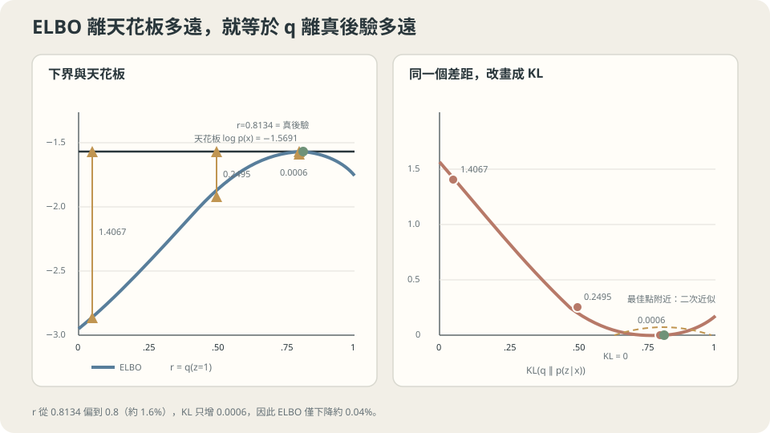

import Objectives from '../../../components/Objectives.astro';
import Ask from '../../../components/Ask.astro';
import Prereq from '../../../components/Prereq.astro';
import Question from '../../../components/Question.astro';
import Answer from '../../../components/Answer.astro';
import QuizBlock from '../../../components/QuizBlock.astro';
import Option from '../../../components/Option.astro';
import Explanation from '../../../components/Explanation.astro';
import VizPlan from '../../../components/VizPlan.astro';
import Remark from '../../../components/Remark.astro';
import Details from '../../../components/Details.astro';
import Bridge from '../../../components/Bridge.astro';
import UsedBy from '../../../components/UsedBy.astro';
import Ref from '../../../components/Ref.astro';

# 當那個要加總的量算不出來，可以退到哪裡？

<Objectives>
- **推導 $\log p_\theta(x)=\text{ELBO}(q)+\mathrm{KL}(q\Vert p_\theta(z\mid x))$。** 說清楚 q 是我們選的近似後驗，以及下界何時精確。
- **把 EM 讀成「交替最大化同一個下界」。** 從六輪的實測讀出 E-step 與 M-step 各自把哪個量抬起來，並說出單調性從哪裡來。
- **解釋受限的近似後驗與 posterior collapse 是什麼問題。** 用雙峰例子理解 KL 方向，但不把個別例子的結果當成所有 VAE 的保證。
</Objectives>

<Prereq items={frontmatter.prereqs} />

## 一個多出來的變數

<Ref to="ml-maximum-likelihood" mode="title"/> 給了一個乾淨的分數：把模型給實際資料的機率取對數。那一篇悄悄用掉一個前提——**$p_\theta(x)$ 要算得出來**。

想像收到一張手寫數字，資料上只有像素，沒有記下它出自哪一種筆跡。若模型先選筆跡，再畫出圖片，我們要評估這張圖的機率，就不能只猜一種筆跡；必須把各種可能來路都加起來。這類**沒被觀測到的變數**，就是 latent variable。

- 一堆點看起來分成幾群，但每個點屬於哪一群沒有寫在資料上。
- 一張圖片背後有一組「內容編碼」，但資料只有像素。
- 一段語音背後有一串音素狀態，但錄音只有波形。

把那個看不到的變數叫 $z$。模型是 $p_\theta(x,z)=p_\theta(z)\,p_\theta(x\mid z)$——聯合機率通常很好寫，因為它就是「先抽一個 $z$，再依 $z$ 生出 $x$」這個故事。但你要的分數需要的是 $x$ 的邊際機率：

$$
p_\theta(x)=\int p_\theta(z)\,p_\theta(x\mid z)\,\mathrm dz .
$$

兩個群集時只是兩項相加；但複雜模型的積分可能難算。長度 $T$、每格 $K$ 種值的 latent sequence 有 $K^T$ 種組合，雖然某些結構能用 dynamic programming 降低成本；高維連續 latent 則通常需要近似。我們要找的是一個更容易估計、可以拿來訓練的 objective。

<Ask>
一個要對所有可能的隱藏狀態加總的量算不出來，<br />
但我們其實只需要它變大——<br />
有沒有一個算得出來、而且保證不會高估它的替身？
</Ask>

<Question id="Q1">
造一個 $\log p_\theta(x)$ 的下界。有兩條路：一條用 Jensen 不等式，三行就到；另一條繞得遠一點，但會**順便算出那個下界差了多少**。兩條走一次，然後說明為什麼第二條才是這一篇真正的主角。

<Answer>
**第一條路（Jensen）。** 固定觀測 x，引入一個容易抽樣、容易算 density 的分布 $q(z)$，用它猜 x 可能來自哪個 z。先假設 q 在 $p_\theta(x,z)>0$ 的地方也是正的，便能乘除 q，改寫原來的積分：

$$
\log p_\theta(x)=\log\int q(z)\frac{p_\theta(x,z)}{q(z)}\mathrm dz
=\log\mathbb E_{q}\!\left[\frac{p_\theta(x,z)}{q(z)}\right]
\;\ge\;\mathbb E_{q}\!\left[\log\frac{p_\theta(x,z)}{q(z)}\right].
$$

最後一步是 Jensen（<Ref to="math-jensen" mode="title"/>）：$\log$ 是凹的，所以 $\log\mathbb E\ge\mathbb E\log$。右邊那個量就是 **ELBO**（evidence lower bound）：

$$
\mathcal F(q,\theta)=\mathbb E_{q(z)}\big[\log p_\theta(x,z)-\log q(z)\big].
$$

它仍是一個期望，不一定有 closed form；但若 joint density 和 q 都好算，就能從 q 抽樣估計它，不必直接算原來的 marginal likelihood。

**但這條路只告訴你「$\ge$」，沒告訴你差多少。** 而「差多少」正是你最需要知道的：如果差距是 $0.001$，最大化 ELBO 就幾乎等於最大化 log-likelihood；如果差距是 $5$ 而且會隨 $\theta$ 亂跑，那最大化 ELBO 可能把你帶到完全錯的地方。

**第二條路（直接算差）。** 不用不等式，寫一個恆等式。注意 $p_\theta(x,z)=p_\theta(x)\,p_\theta(z\mid x)$，代進 ELBO：

$$
\mathcal F(q,\theta)=\mathbb E_q\!\left[\log\frac{p_\theta(x)\,p_\theta(z\mid x)}{q(z)}\right]
=\log p_\theta(x)-\mathbb E_q\!\left[\log\frac{q(z)}{p_\theta(z\mid x)}\right],
$$

也就是

$$
\boxed{\;\log p_\theta(x)=\mathcal F(q,\theta)+\mathrm{KL}\big(q(z)\,\big\Vert\,p_\theta(z\mid x)\big).\;}
$$

**這是一個等式，不是不等式。** 它比第一條路多給了三件事：

1. **下界也能由 $\mathrm{KL}\ge0$ 看出來**，和 Jensen 的推導一致。
2. **鬆緊有了名字**：ELBO 差 log-likelihood 多少，完全等於你選的 $q$ 離**真後驗** $p_\theta(z\mid x)$ 多遠。
3. **緊的條件是可判斷的**：$q=p_\theta(z\mid x)$ 時等號成立，此時 ELBO **精確等於** log-likelihood。

第三點會在第三節直接變成一個演算法。
</Answer>
</Question>

## 那個差真的就是 KL

先把等式當成一個可以驗的宣稱。

設定：兩個成分的一維 Gaussian 混合，$p(z=1)=0.7$、$\mu_0=-1.0$、$\mu_1=1.5$、$\sigma=1$。這個模型小到 $\log p(x)$ 可以精確算出來（兩項相加），所以 ELBO 的每一分鬆緊都看得見。

取 $x=0.5$。真後驗是 $p(z=1\mid x)=0.8134$，而 $\log p(x)=-1.5691$。讓 $q$ 是一個 $q(z=1)=r$ 的伯努利，掃 $r$：

```
  r = 0.0500   ELBO = -2.9758   gap = 1.4067   KL(q‖p(z|x)) = 1.4067
  r = 0.2000   ELBO = -2.4530   gap = 0.8840   KL           = 0.8840
  r = 0.5000   ELBO = -1.8186   gap = 0.2495   KL           = 0.2495
  r = 0.8134   ELBO = -1.5691   gap = 0.0000   KL           = 0.0000   ← q = 真後驗
  r = 0.8000   ELBO = -1.5697   gap = 0.0006   KL           = 0.0006
  r = 0.9500   ELBO = -1.6507   gap = 0.0816   KL           = 0.0816
```

換三個不同的 $x$、兩個不同的 $r$，逐位仍然吻合：

```
  x = -2.0   r = 0.3   gap = 0.830826   KL = 0.830826
  x = -2.0   r = 0.6   gap = 2.201990   KL = 2.201990
  x =  0.0   r = 0.3   gap = 0.132907   KL = 0.132907
  x =  0.0   r = 0.6   gap = 0.004070   KL = 0.004070
  x = +2.0   r = 0.3   gap = 3.050125   KL = 3.050125
  x = +2.0   r = 0.6   gap = 1.421288   KL = 1.421288
```

> **下界的鬆緊不是一個模糊的「近似誤差」，它有一個名字：你猜的後驗離真後驗的 KL。**

例如 $r=0.8$ 距離最佳值 $0.8134$ 不遠，缺口只有約 $0.0006$。在這個內部、平滑的 Bernoulli 例子裡，KL 的 Taylor expansion 從二次項開始，所以小偏差的代價是 $O(\delta^2)$。

但「參數看起來接近」不普遍保證 KL 小；漏掉 support 或尾端也可能造成大缺口。表中的 $r=0.05$ 已經相差 $1.41$，提醒我們近似後驗的品質確實重要。



**圖說：** ELBO 與 log-likelihood 的差正是後驗 KL；最佳點附近的二次形狀讓小偏差只付二階代價。

## EM：交替把兩個東西抬起來

第二節的等式對**任何** $q$ 都成立。把它當成一個有兩組變數的最佳化問題——$q$ 和 $\theta$——立刻得到一個演算法：輪流固定一個、最大化另一個。

- **E-step**：固定 $\theta$，對 $q$ 最大化 $\mathcal F$。由等式，$\log p_\theta(x)$ 不含 $q$，所以最大化 $\mathcal F$ 等於最小化 $\mathrm{KL}(q\Vert p_\theta(z\mid x))$，答案是 $q=p_\theta(z\mid x)$，而此時 **ELBO 精確等於 log-likelihood**。
- **M-step**：固定 $q$，對 $\theta$ 最大化 $\mathcal F$。$q$ 固定時 $\mathcal F=\mathbb E_q[\log p_\theta(x,z)]+\text{const}$；在這裡的 Gaussian mixture，它能用加權平均求解，其他模型則可能還需要 numerical optimization。

實測。$n=500$ 筆從上面那個混合抽出來的資料，故意從一個很差的起點（$\mu=(-0.2,0.2)$、$\pi=(0.5,0.5)$）開始：

```
  init        ELBO = -1119.412                       log-lik = -1094.282
  iter 1   E 後 ELBO = -1094.282 （= log-lik -1094.282）   M 後 ELBO =  -998.819   mu = -0.113, +0.966
  iter 2   E 後 ELBO =  -978.036 （= log-lik  -978.036）   M 後 ELBO =  -949.100   mu = -0.271, +1.268
  iter 3   E 後 ELBO =  -923.753 （= log-lik  -923.753）   M 後 ELBO =  -906.253   mu = -0.594, +1.475
  iter 4   E 後 ELBO =  -898.532 （= log-lik  -898.532）   M 後 ELBO =  -894.940   mu = -0.762, +1.517
  iter 5   E 後 ELBO =  -893.098 （= log-lik  -893.098）   M 後 ELBO =  -891.803   mu = -0.854, +1.500
  iter 6   E 後 ELBO =  -890.823 （= log-lik  -890.823）   M 後 ELBO =  -890.030   mu = -0.919, +1.475
  真值 mu = -1.000, +1.500
```

三件事直接從表上讀得出來。

**一，每一個 E 後的 ELBO 精確等於當時的 log-likelihood**（$-1094.282$、$-978.036$、$-923.753$…，一位小數都不差）。這就是「E-step 把 KL 壓成零」的實測。

**二，ELBO 從頭到尾單調不減**：$-1119.4\to-1094.3\to-998.8\to-978.0\to\dots$。兩種 step 都在最大化同一個 $\mathcal F$，所以它只能上升。

**三，log-likelihood 也單調不減**，而且這是推論不是巧合：E 後 $\mathcal F=\log p$；接下來的 M-step 讓 $\mathcal F$ 上升；而 $\log p\ge\mathcal F$ 恆成立。所以下一輪 E 後的 $\log p$ 一定不低於這一輪。

> **E-step 把下界頂到天花板，M-step 把天花板抬高；兩步都在推同一個量，所以它不會倒退。**

**單調不減不等於全域最佳，也不等於逼近真實參數的距離每輪都減少。** 我們在最佳化 sample likelihood；有限樣本的最優參數未必就是真值，EM 也可能受到初始化與局部解影響。

把單調性寫完整：對整份資料的 log-likelihood $\ell$ 與 ELBO $\mathcal F$，精確 E-step 給 $q^{(k)}$，而 M-step 只要不降低同一個下界，就有
$$
\ell(\theta^{(k+1)})\ge\mathcal F(q^{(k)},\theta^{(k+1)})
\ge\mathcal F(q^{(k)},\theta^{(k)})=\ell(\theta^{(k)}).
$$

<Details summary="為什麼 M-step 常常有封閉解，而直接對 log p 做梯度下降沒有">
直接最大化 $\log p_\theta(x)=\log\sum_z p_\theta(z)p_\theta(x\mid z)$ 時，那個 $\log$ 卡在加總的外面，微分會產生一個帶分母的式子，把所有成分耦合在一起。

M-step 最大化的是 $\mathbb E_q[\log p_\theta(x,z)]=\sum_z q(z)\big[\log p_\theta(z)+\log p_\theta(x\mid z)\big]$——**$\log$ 在加總裡面**。Gaussian mixture 因而變成各 component 的加權估計：

$$
\mu_k\leftarrow\frac{\sum_i q_i(k)\,x_i}{\sum_i q_i(k)},\qquad
\pi_k\leftarrow\frac1n\sum_i q_i(k).
$$

也就是「用後驗當權重的加權平均」。上表的 M-step 就是這兩行。

在精確 E-step 後，缺口是零；M-step 改了模型參數，缺口又可能出現。一般變分近似則不一定能消掉缺口。我們知道它的數學身分，但未必能算出它的數值。
</Details>

## 後驗也算不出來的時候

EM 假設 E-step 做得到，也就是真後驗 $p_\theta(z\mid x)$ 寫得出來。$z$ 是離散且不多的時候可以（上面就是），但 $z$ 是一個連續向量、$p_\theta(x\mid z)$ 是一個神經網路的時候，後驗完全沒有封閉形式。

這時候退一步：**不要求 q 等於後驗，只在可參數化的家族裡近似它**。還可以訓練一個網路 $q_\phi(z\mid x)$，由 x 直接給出 q 的參數，不必每筆資料各解一次最佳化；這叫 amortized inference。Kingma 與 Welling [2] 的 VAE 採用這個做法，同時最佳化 $\theta$ 與 $\phi$：

$$
\mathcal F(\phi,\theta)=\underbrace{\mathbb E_{q_\phi(z\mid x)}\big[\log p_\theta(x\mid z)\big]}_{\text{重建：}z\text{ 要能還原 }x}
-\underbrace{\mathrm{KL}\big(q_\phi(z\mid x)\,\Vert\,p_\theta(z)\big)}_{\text{編碼:}z\text{ 不能離先驗太遠}} .
$$

（這只是把 ELBO 裡的 $\log p_\theta(x,z)-\log q$ 重新分組，不是新的東西。）

兩項的拉鋸很好讀：第一項要 $z$ 帶足夠的資訊去還原 $x$，第二項要 $z$ 的分布貼著先驗。**而第二項可以被壓到零**——如果 $p_\theta(x\mid z)$ 強到不需要 $z$ 就能生出 $x$，那最省事的解是讓 $q_\phi(z\mid x)$ 完全不看 $x$、直接等於先驗。這叫 **posterior collapse**：ELBO 看起來還不錯，但 $z$ 什麼都沒學到。

先看一個能精確計算的類比：若混合模型的兩個 component 越來越相像，觀察 x 就越難判斷 z。當使用模型自己的真後驗時，$\mathbb E_x\mathrm{KL}(p(z\mid x)\Vert p(z))$ 正是 mutual information：

```
  |μ₁-μ₀| = 4.00    E_x[KL(p(z|x) ‖ p(z))] = 0.556150 nats
  |μ₁-μ₀| = 2.00                             0.291858
  |μ₁-μ₀| = 1.00                             0.094910
  |μ₁-μ₀| = 0.50                             0.025576
  |μ₁-μ₀| = 0.20                             0.004182
  |μ₁-μ₀| = 0.05                             0.000262
  |μ₁-μ₀| = 0.00                             0.000000
```

距離接近零時，這裡的資訊量大約隨距離平方縮小。但這張表沒有描述 VAE 的訓練動態，不能單靠它證明 collapse 的正回饋。實際上會觀察 KL、重建品質與 latent 的用途，再考慮 KL annealing、free bits 或調整 decoder。

<Remark label="補充" summary="VAE 的平均 KL 不只量 mutual information">
令 $q(x,z)=p_{\mathrm{data}}(x)q_\phi(z\mid x)$，aggregate posterior 為 $q(z)$。適當可積條件下，
$$
\mathbb E_x\mathrm{KL}(q_\phi(z\mid x)\Vert p_\theta(z))
=I_q(X;Z)+\mathrm{KL}(q(z)\Vert p_\theta(z)).
$$
第一項量 z 帶了多少 x 的資訊；第二項量整體編碼分布與 prior 的差距。只有第二項為零時，平均 KL 才恰好等於 mutual information。
</Remark>

<Remark label="補充" summary="受限的 q 遇到雙峰後驗，可能只蓋住其中一個峰">
這裡的 $\mathrm{KL}(q\Vert p)$ 是 ELBO 恆等式給出的方向，期望也對我們能抽樣的 q 取。若 q 的家族受限，它可能為了避免在 p 很小的地方放質量，而漏掉部分峰；Blei 等人 [3] 討論了這種變分近似的限制。

實測：目標 $p$ 是 $0.5\,\mathcal N(-2,0.5^2)+0.5\,\mathcal N(2,0.5^2)$（雙峰，標準差 $2.0616$），用單一 Gaussian $q$ 去逼近：

```
  最小化 KL(q‖p) ：mu = +1.9998   sigma = 0.5004   值 0.6931
  最小化 KL(p‖q) ：mu = -0.0000   sigma = 2.0616   值 0.7236
```

前者的 numerical solution 貼近一個峰，成本約為 $\log2$；後者的最佳 Gaussian 匹配整體均值與變異數，但也在兩峰中間放了較多質量。這個 Gaussian mixture 的 density 處處為正，中間是低密度，不是零機率區域。

兩個方向各自在避免不同的災難：$\mathrm{KL}(q\Vert p)$ 罰的是「$q$ 有質量但 $p$ 沒有」（所以它不敢跨過空隙），$\mathrm{KL}(p\Vert q)$ 罰的是「$p$ 有質量但 $q$ 沒有」（所以它不敢漏掉任何一塊）。<Ref to="math-kl" mode="title"/> 的不對稱性在這裡不是一個技術細節，它直接決定你會得到哪一種錯誤。

這是**近似後驗 q** 的例子，不能直接推出生成模型 $p_\theta(x)$ 必然低估資料散布。後者還取決於 decoder、變分家族、訓練與資料。
</Remark>

## 拖動 $q$，看下界和那塊 KL 一起動

<iframe loading="lazy" src="/personal_website/notes/research_areas/machine-learning-foundations/l5-probabilistic-modeling/l5-1-2.html" class="demo-frame" title="拖動 $q$，看下界和那塊 KL 一起動：互動 demo" style="height: 872px; width: 100%; border: none;"></iframe>

**互動 demo：一次走半步：E-step 把縫補成精確的 0，M-step 把貼好的下界往上推。**

## 這套東西什麼時候可靠

**這一切依賴什麼。**

一，**聯合機率 $p_\theta(x,z)$ 要好寫**。整個方法的立足點就是「聯合好寫、邊際難算」；如果連聯合都寫不出來，ELBO 沒有著力點。

二，**$q$ 的家族要罩得住真後驗的形狀**。上面的 Remark 已經量過代價：家族不夠時，缺口不只是變大，它還會**往特定方向偏**。而且這個缺口是**看不見的**——你能算 ELBO，但算不出 $\log p_\theta(x)$，所以你無從得知自己差多遠。

三，**「ELBO 變大」不等於「模型變好」**。因為 $\log p=\mathcal F+\mathrm{KL}$，ELBO 上升可能是 $\log p$ 上升，也可能只是 $q$ 變準了。比較兩個**不同架構**的 ELBO 尤其危險：缺口大小不同，比較的不是同一個東西。

> **ELBO 是一個你算得出來的量，$\log p_\theta(x)$ 是一個你想要的量，而兩者的差是一個你通常量不到的量——這三句話要一起記。**

## 檢查理解

<QuizBlock id="ml-l5-1-a">
第二節的實測裡，$r=0.8$ 的 ELBO 是 $-1.5697$，而最佳的 $r=0.8134$ 是 $-1.5691$。這個「偏了 $1.6\%$ 只掉 $0.04\%$」最好的解釋是：
<Option>$q$ 的選擇其實不太重要，隨便取一個都可以。</Option>
<Option correct>在這個內部且二次可微的 Bernoulli 例子裡，KL 的一階項為零，Taylor expansion 從二次項開始；小偏差的缺口約為 $O(\delta^2)$，但不能推到任意形狀與任意距離的 q。</Option>
<Option>因為這個混合模型太簡單，真實模型上這個性質不成立。</Option>
<Explanation>
表中 r 從 $0.8134$ 改成 $0.5$，缺口已到 $0.2495$。局部二次近似需要平滑性與附近這兩個前提；「可微且取最小值」本身只保證一階項為零，不足以保證二次尺度。
</Explanation>
</QuizBlock>

<QuizBlock id="ml-l5-1-b">
EM 的實測表裡，每一個 E 後的 ELBO 都精確等於當時的 log-likelihood。為什麼？
<Option>因為 $n=500$ 夠大，兩者漸近相等。</Option>
<Option correct>因為 $\log p_\theta(x)=\mathcal F(q,\theta)+\mathrm{KL}(q\Vert p_\theta(z\mid x))$ 對任何 $q$ 都成立，而 E-step 把 $q$ 設成真後驗、把那個 KL 壓成零。這與 $n$ 無關，$n=1$ 也一樣。</Option>
<Option>因為 Gaussian 混合的 ELBO 剛好沒有近似誤差。</Option>
<Explanation>
這題的重點是「E-step 做了什麼」。它不是在近似，它是**精確地**解了「對 $q$ 最大化 $\mathcal F$」這個子問題，而那個解讓缺口歸零。第三個選項的錯在於把性質歸給模型：對任何模型，只要後驗算得出來，E-step 就會讓 ELBO 等於 log-likelihood；Gaussian 混合的特別之處只是後驗算得出來而已。
</Explanation>
</QuizBlock>

<QuizBlock id="ml-l5-1-c">
一個團隊比較兩個不同架構的 VAE，A 的 ELBO 是 $-95.2$、B 是 $-97.8$，結論「A 的 log-likelihood 比較高」。這個結論：
<Option>成立，ELBO 是 log-likelihood 的下界，下界高就是 log-likelihood 高。</Option>
<Option correct>不成立。兩個模型的後驗 KL 缺口可能不同；B 可能有更高的 log-likelihood，只是下界更鬆。需要額外的 likelihood 估計或缺口控制，不能只比較 ELBO。</Option>
<Option>不成立，因為應該用測試集而不是訓練集的 ELBO。</Option>
<Explanation>
即使使用同一份 held-out data、甚至相同 inference architecture，缺口也不一定一樣。同一模型的 ELBO 上升，同樣可能主要來自 q 變準；只有像精確 EM 那樣讓舊參數的下界貼緊，再提高下界，才能由上述不等式保證 likelihood 不下降。
</Explanation>
</QuizBlock>

<QuizBlock id="ml-l5-1-d">
下列哪一句**不對**？
<Option>把 $\log$ 從加總外面搬進加總裡面，是 M-step 常常有封閉解的原因；代價就是那個 $\mathrm{KL}$ 缺口。</Option>
<Option>最小化 $\mathrm{KL}(q\Vert p)$ 時，$q$ 傾向縮到單一個 mode 上；實測在雙峰目標上它給出 $\sigma=0.5004$，而真實分布的標準差是 $2.0616$。</Option>
<Option correct>posterior collapse 發生時 ELBO 會明顯變差，所以只要監看 ELBO 就抓得到。</Option>
<Explanation>
若 decoder 能在不使用 z 的情況下解釋資料，放棄 z 未必讓 ELBO 明顯變差。應另外觀察 KL 與 latent 的用途；平均 KL 與 mutual information 也要依上面的分解區分。
</Explanation>
</QuizBlock>

<UsedBy slug={frontmatter.slug} />

<Bridge to="ml-autoregressive">
ELBO 處理的是 latent variable 積分難算的情況。能不能換一種模型設計，讓 likelihood 本來就容易算？把 x 拆成一串座標，機率的 chain rule 給出

$$
p(x)=p(x_1)\,p(x_2\mid x_1)\cdots p(x_L\mid x_{1:L-1}),
$$

**這是恆等式，沒有近似**。於是 $\log p(x)$ 變成 $L$ 個條件對數機率相加，每一項都是一個普通的分類或回歸問題——前面五個 class 的所有工具直接可用，似然精確算得出來。

但模型要選擇順序，一般生成時也得逐步抽樣。下一篇看看這個精確分解怎麼變成 autoregressive model，以及順序和相依結構會带來什麼限制。
</Bridge>

## 參考文獻

1. Jordan, M., Ghahramani, Z., Jaakkola, T. & Saul, L. [*An Introduction to Variational Methods for Graphical Models.*](https://link.springer.com/article/10.1023/A:1007665907178) Machine Learning 37, 1999.（把 ELBO 與 EM 放在同一個變分框架下的經典整理。）
2. Kingma, D. & Welling, M. [*Auto-Encoding Variational Bayes.*](https://arxiv.org/abs/1312.6114) ICLR 2014.（amortized inference 與重參數化技巧，本篇第四節那個目標函數的出處。）
3. Blei, D., Kucukelbir, A. & McAuliffe, J. [*Variational Inference: A Review for Statisticians.*](https://arxiv.org/abs/1601.00670) JASA 112, 2017.（$\mathrm{KL}$ 方向的不對稱性、mean-field 近似的偏差，以及變分法與 MCMC 的取捨。）
