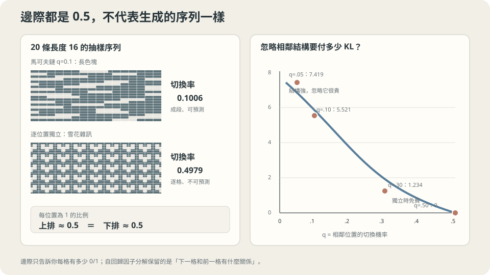

import Objectives from '../../../components/Objectives.astro';
import Ask from '../../../components/Ask.astro';
import Prereq from '../../../components/Prereq.astro';
import Question from '../../../components/Question.astro';
import Answer from '../../../components/Answer.astro';
import QuizBlock from '../../../components/QuizBlock.astro';
import Option from '../../../components/Option.astro';
import Explanation from '../../../components/Explanation.astro';
import VizPlan from '../../../components/VizPlan.astro';
import Remark from '../../../components/Remark.astro';
import Details from '../../../components/Details.astro';
import Bridge from '../../../components/Bridge.astro';
import UsedBy from '../../../components/UsedBy.astro';
import Ref from '../../../components/Ref.astro';

# 一個高維的機率，能不能拆成一串一維的機率？

<Objectives>
- **說出自回歸分解為什麼不是近似，以及它把哪一個具體的困難解掉了。** 把「正規化」這件事在兩種模型上各算一次成本。
- **用二元 Markov chain 量出忽略相依關係的 KL。** 分清逐位置獨立、塊內獨立與精確的 block joint sampling。
- **判斷順序在什麼情況下有差、在什麼情況下沒差。** 用同一個聯合分布、同一個受限模型族的兩個順序把那個差量出來。
</Objectives>

<Prereq items={frontmatter.prereqs} />

## 不對 latent variable 積分，還能怎麼建模？

上一篇用 ELBO 處理 latent variable 積分難算的問題。現在換一種模型設計：想像寫訊息時，先寫第一個字，再依照前文接下一個字。每一步只需要回答「已經寫了這些字，下一個字可能是什麼？」

把這個直覺寫成機率，正是**乘法定則**（chain rule）。對一組變數 $x=(x_1,\dots,x_L)$，選定順序後有：

$$
p(x_1,\dots,x_L)=p(x_1)\,p(x_2\mid x_1)\,p(x_3\mid x_{1:2})\cdots p(x_L\mid x_{1:L-1}).
$$

**分解本身是恆等式，不是近似。** 在有正機率的前綴上，反覆使用 conditional probability 的定義，便得到

$$
\log p(x)=\sum_{l=1}^{L}\log p(x_l\mid x_{1:l-1}),
$$

一個高維的對數機率變成 $L$ 個一維的對數機率相加。每一項都是一個普通的「給定一堆東西、預測下一個」的問題，也就是前面五個 class 的全部工具直接可用。

我們還是要學這些 conditional distributions。Bengio 等人 [1] 的 neural language model 就用網路做下一個詞的預測；van den Oord 等人 [2] 則把同一個做法用在像素上。

<Ask>
乘法定則沒有任何近似，<br />
可是它把一個做不到的問題變成了做得到的——<br />
那個「變簡單」是從哪裡來的，代價又付在哪？
</Ask>

<Question id="Q1">
$p(x)$ 難在哪？具體地說：如果不用分解，直接讓一個網路輸出 $x$ 的機率，你會卡在哪一步？而分解之後那一步為什麼變得可行？把兩種做法的成本各算一次。

<Answer>
**卡在正規化。** 一個網路很容易輸出一個「分數」$s_\theta(x)\in\mathbb R$——越像真的資料分數越高。但分數不是機率。要變成機率必須除以一個總和：

$$
p_\theta(x)=\frac{e^{s_\theta(x)}}{Z_\theta},\qquad Z_\theta=\sum_{x'} e^{s_\theta(x')}.
$$

**$Z_\theta$ 是對所有可能的 $x$ 加總。** $L$ 個位置、每個位置 $K$ 種取值，那是 $K^L$ 項。$L=16$、$K=2$ 已經是 $65536$ 項；$L=1000$、$K=50000$（一段文字）是一個沒有名字的數。而且 $Z_\theta$ 依賴 $\theta$，所以**每一步梯度下降都要重算一次**。這就是能量模型難訓練的根本原因。

**分解把這個和拆成 $L$ 個小和。** 每一項 $p_\theta(x_l\mid x_{1:l-1})$ 是**單一個座標**上的分布，正規化只要對那一個座標的 $K$ 種取值加總：

$$
p_\theta(x_l\mid x_{1:l-1})=\frac{e^{s_\theta(x_l\mid x_{1:l-1})}}{\sum_{k=1}^{K}e^{s_\theta(k\mid x_{1:l-1})}}.
$$

這就是 softmax。**正規化項**由一個 $K^L$ 項的和，變成 L 個 K 項的和；網路處理上下文的成本則要另外算，不能把整個模型的總成本都寫成 $LK$。

乘積也自動正規化：先對最後一個座標加總，得到 1，再逐層往前加總。因此只要各 conditional density 能精確計算，這個模型的 joint likelihood 就能精確計算，不需要 ELBO。

**代價在哪。** 三個，本篇三節各處理一個。

1. **每一項的條件是全部的前文**。真的做到要 $L$ 個不同大小的輸入，實務上要嘛截斷（只看前 $k$ 個），要嘛用一個能吃變長輸入的架構。截斷就是丟掉結構，而那是有價的（第二節）。
2. **抽樣要跑 $L$ 次**，而且是**序列的**——$x_5$ 要等 $x_4$ 算完。訓練可以平行（前文都是已知的真實資料），抽樣不行。這是自回歸模型最貴的地方（第三節）。
3. **你必須選一個順序**。理論上任何順序都對，實務上不是（第四節）。
</Answer>
</Question>

## 丟掉條件，就是丟掉結構

先把「丟掉條件的代價」量出來。

設定：長度 $L=16$ 的二元序列，由一條馬可夫鏈生出來（<Ref to="math-markov-chain" mode="title"/>）——第一位是公平的，之後每一位有機率 $q$ 翻面、$1-q$ 維持。$q$ 小表示序列傾向一整段一整段同色。

拿一個**逐位置獨立**的模型去配它：$p(x)=\prod_l p(x_l)$。由對稱性它會學到每一位都是 $1/2$，所以

$$
\mathrm{KL}(\text{真}\Vert\text{獨立})=(L-1)\big(\ln 2-H(q)\big),\qquad H(q)=-q\ln q-(1-q)\ln(1-q).
$$

實測（$L=16$）：

```
  q = 0.05   KL = 7.419 nats
  q = 0.10   KL = 5.521 nats
  q = 0.30   KL = 1.234 nats
  q = 0.50   KL = 0.000 nats
```

**最後一列是對照組**：$q=0.5$ 時相鄰位置本來就獨立，所以獨立模型完全正確，KL 精確為零。這一列存在的意義是確認前三列的數字量的是「結構」而不是別的東西。

**前三列是代價本身**：結構越強（$q$ 越小），忽略它越貴。$q=0.05$ 時 $7.419$ nats——換算成每個位元約 $0.46$ nats，也就是每一位你都在浪費大半個位元的資訊。

抽樣看得更直接：

```
  真實鏈抽出來的序列   相鄰位置的切換率 0.1006  （真值 0.10）
  逐位置獨立抽出來的   相鄰位置的切換率 0.4979  （必然是 0.50）
```

**同樣的邊際分布，完全不同的樣本。** 兩個模型在「每一位是 0 還是 1 的比例」上一模一樣，但一個生出一段段的色塊、另一個生出雪花雜訊。

> **逐座標獨立保留了各座標的 marginal，卻丟掉了座標之間的相依關係。**



**圖說：** 兩組序列的邊際完全相同，差別只在相鄰關係；結構越強，獨立假設的 KL 代價越高。

## 能不能一次生出好幾格？

如果逐格生成太慢，一個想法是每次產生 B 格。但「一次產生」不代表一定要把它們設為獨立：若能抽出正確的 block joint distribution，仍然能保留原分布。下面只分析一種較簡單的近似：**各格都看已有前綴，卻不看這個 block 內剛生成的其他格。**

在上面的對稱鏈裡，離 block 起點 j 步後，與前綴最後一格不同的機率是
$$
q_j=\frac{1-(1-2q)^j}{2}.
$$
第一格仍用 $q_1=q$；越後面的格子，因為看不到中途的值，conditional entropy 變成 $H(q_j)$，而不是 $H(q)$。假設 L 能被 B 整除，這種近似的最佳 KL 為
$$
\mathrm{KL}(p\Vert p_B)
=(B-1)(\log2-H(q))
+\left(\frac LB-1\right)\sum_{j=1}^B\bigl(H(q_j)-H(q)\bigr).
$$
第一項來自沒有前綴的第一個 block；第二項來自其餘 blocks。取 $L=16,q=0.1$：

| B | 生成輪數 | KL（nats） |
| --- | --- | --- |
| 1 | 16 | 0.0000 |
| 2 | 8 | 1.3922 |
| 4 | 4 | 3.0798 |
| 8 | 2 | 4.5815 |
| 16 | 1 | 5.5210 |

這個例子讓我們看見的是：省掉 block 內的 conditioning，會改變 joint distribution。它不是所有平行解碼方法的下界，生成輪數減半也不代表 wall-clock time 恰好減半。

<Remark label="補充" summary="反過來的切法：區塊內部精確、區塊之間獨立">
上面那個模型是「看前綴、塊內獨立」。還有一個方向相反的切法：**塊內精確建模，但塊與塊之間完全不看彼此**。同一條鏈：

```
  B =  1   16 個獨立區塊   斷掉 15 個   KL = 5.521 nats
  B =  2    8 個獨立區塊   斷掉  7 個   KL = 2.576
  B =  4    4 個獨立區塊   斷掉  3 個   KL = 1.104
  B =  8    2 個獨立區塊   斷掉  1 個   KL = 0.368
  B = 16    1 個獨立區塊   斷掉  0 個   KL = 0.000
```

$B=1$ 是逐位置獨立，$B=16$ 則保留整條鏈。在這個切法裡，增大 B 能減少被切斷的依賴；但要如何表示、抽樣 block joint，仍是另一個問題。若直接列出全部組合，有 $2^B$ 個值；若利用自回歸等結構，未必需要這張完整表。

兩個切法省略的是不同依賴，不能把它們的 B 直接對照。完整自回歸則保留所有前綴 conditioning，每次只正規化一個位置的 K 個選項，代價是生成時需依序呼叫模型。
</Remark>

<Remark label="補充" summary="真實資料的相依關係，要另外檢查">
在「塊內精確、塊間獨立」的補充例子中，每切開一個相鄰關係的代價相同，是因為這條鏈的切換率固定。保留前綴卻讓塊內獨立，則要用正文的 conditional entropy 計算，不能沿用同一個斷邊公式。

真實資料可能有強烈的局部關係，也可能有關鍵的長距離關係，例如一句話前面的人名決定後面的指涉。距離遠不代表一定可以忽略。

是否能縮短上下文，應在 held-out data 上量：把長度從 k 改成 $k/2$，NLL 增加多少？再檢查重要的長距離任務，而不是只由距離猜測。
</Remark>

## 順序有沒有差

乘法定則對**任何**順序都成立。所以理論上，順序不影響任何事。

實務上會，而且原因很具體：**模型族是受限的**。如果模型只能看前一個變數（或前 $k$ 個），那麼「哪些依賴看得到」就取決於你把變數排成什麼順序。

實測。三個二元變數：$x_1$ 是公平硬幣，$x_2$ 是另一個**完全獨立**的公平硬幣，$x_3=x_1$ 有 $90\%$ 的機率相同（也就是 $x_3$ 只跟 $x_1$ 有關）。模型族固定為「一階鏈」：$p(v_1)p(v_2\mid v_1)p(v_3\mid v_2)$。

```
  順序 x1 → x2 → x3  ：KL(真‖模型) = 0.368064 nats
  順序 x1 → x3 → x2  ：KL(真‖模型) = 0.000000 nats
  順序 x2 → x1 → x3  ：KL(真‖模型) = 0.000000 nats

  參考：完全不看條件的獨立模型  KL = 0.368064 nats
```

**第一列和參考列一模一樣。** 把不相干的 $x_2$ 夾在 $x_1$ 和 $x_3$ 中間，一階鏈就完全接不到那個依賴——它付了「有條件模型」的成本，卻得到「獨立模型」的結果。而只要把 $x_3$ 移到 $x_1$ 旁邊（或把 $x_2$ 移開），同一個模型族就精確無誤。

> **順序不改變真相，但它決定你的模型看不看得到真相。**

**這在實務上怎麼出現。** 文字有一個天然的順序，所以這個問題不明顯。圖片沒有——把二維像素排成一維要選一種掃法，而任何掃法都會把「垂直方向的鄰居」變成相隔一整列的遠親。表格資料更糟：欄位之間沒有任何自然順序，而不同的順序可以差很多。

<Details summary="為什麼順序無關的模型不容易做">
一個自然的想法是：既然順序是任意的，那就對所有順序取平均，或者訓練一個對所有順序都成立的模型。

這條路是可行的（order-agnostic 的訓練、把「哪些位置已知」當成一個隨機的遮罩），但它把問題變難了：模型現在要在**每一種前文組合**下都給出正確的條件分布，而那是 $2^L$ 種組合而不是 $L$ 種。用固定順序訓練時，模型只需要學會 $L$ 個「看前綴」的函數。

所以這是一個標準的取捨：**固定順序 = 容量花在少數幾個條件上、學得好，但順序選錯就接不到依賴；隨機順序 = 通用，但同樣的容量要攤到指數多的條件上。** 實務上的折衷通常是用一個能看全部前文的架構（讓「順序」只影響哪些位置算前文，不影響模型的表達力），再把順序選在資料的自然結構上。
</Details>

## 每一步的小誤差，在 $L$ 步之後有多大

最後一個代價和抽樣有關，而且它是自回歸模型最容易被低估的地方。

每一項條件機率都有一點誤差。實測：真實切換率 $0.10$，模型學成別的值：

```
  模型用 0.105  單步 KL 0.000135 nats   整條 (L=16) 0.0020 nats   相對誤差   5%
  模型用 0.110  單步 KL 0.000525 nats   整條        0.0079 nats   相對誤差  10%
  模型用 0.120  單步 KL 0.001993 nats   整條        0.0299 nats   相對誤差  20%
  模型用 0.150  單步 KL 0.010896 nats   整條        0.1634 nats   相對誤差  50%
  模型用 0.200  單步 KL 0.036690 nats   整條        0.5504 nats   相對誤差 100%
```

單步的 KL 小得像捨入誤差（$0.002$ nats），但它要乘以 $L-1$。把長度拉長（模型固定用 $0.12$）：

```
  L =    8   整條 KL = 0.0140 nats   每位元 0.001744
  L =   16   整條 KL = 0.0299 nats   每位元 0.001869
  L =   64   整條 KL = 0.1256 nats   每位元 0.001962
  L =  256   整條 KL = 0.5083 nats   每位元 0.001986
  L = 1024   整條 KL = 2.0393 nats   每位元 0.001991
```

**右邊那一欄幾乎是常數，左邊那一欄線性成長。** 這是本篇最實用的一句話：

> **這個例子的 sequence KL 是每步 conditional KL 的加總；KL 線性增加，不等於任務的錯誤率也線性增加。**

上表已經是兩個**完整序列分布**之間的 KL，不是尚未計入抽樣的低估值。一般的 KL chain rule 是
$$
\mathrm{KL}(p\Vert q)=\sum_l\mathbb E_{X_{<l}\sim p}
\mathrm{KL}\bigl(p(X_l\mid X_{<l})\Vert q(X_l\mid X_{<l})\bigr).
$$
另外，訓練常用真實前綴，生成卻用模型自己抽出的前綴；有限模型在不同前綴上可能表現不同。Ranzato 等人 [3] 討論了這種 **exposure bias**。它可能影響生成任務，但不能在上述完整 KL 上再憑空加一項「被放大的誤差」。

<Remark label="注意" summary="這解釋了幾個乍看無關的現象">
「誤差沿著長度累加」這一件事，是下面幾個常見觀察的共同原因：

- **長文本會漸漸「走鐘」**：開頭合理，越寫越偏。累積的偏差把狀態帶到訓練分布之外。
- **每位元與整段序列是不同尺度**：每步約 $0.002$ nats，在 $L=1024$ 時累積約 $2$ nats；這描述完整 sequence KL，不自動決定體感品質或任務錯誤率。
- **取樣溫度會改變生成結果**：降低溫度更偏向高機率 token，但不保證長文更好，也可能增加重複。應依任務同時檢查品質與多樣性。

長文失去連貫，也可能來自上下文限制或資料不足。比較真實前綴與生成前綴下的表現能提供線索，但一次比較不足以唯一診斷原因。
</Remark>

## 切幾刀、排什麼順序、走多長

<iframe loading="lazy" src="/personal_website/notes/research_areas/machine-learning-foundations/l5-probabilistic-modeling/l5-2-2.html" class="demo-frame" title="切幾刀、排什麼順序、走多長：互動 demo" style="height: 991px; width: 100%; border: none;"></iframe>

**互動 demo：** 比較有限資料下，不同順序與上下文長度的測試 NLL。真模型的測試 NLL 是參考值，不是每份有限測試集上所有模型分數的下界。

## 什麼時候該用它

精確的模型 likelihood 可以用來比較 held-out NLL，或搭配 entropy coding 做壓縮；實際編碼長度還有 coding overhead。Conditional probability 也能用於預測，但一般的雙向填空不會自動由左到右模型直接得到。

**它跟你要什麼。** $L$ 次序列的模型呼叫。訓練時這不是問題——前文全部是已知的真實資料，$L$ 個位置可以一次算完（這就是 teacher forcing 之所以存在的理由）。抽樣時是問題，而且是無法用更多顯卡解決的問題：$x_5$ 必須等 $x_4$。一段一千字的文字就是一千次序列呼叫。

**這一切依賴什麼。** 一，**變數要能排成一個順序**，而且那個順序最好對應資料的真實結構（第四節量過排錯的代價）。二，**每一個條件分布要算得出來**——離散變數用 softmax 很自然，連續變數要選一個分布族（Gaussian、混合、離散化），而那個選擇就是 <Ref to="ml-maximum-likelihood" mode="title"/> 講的宣告。三，**誤差會沿長度累加**，所以在短序列上驗證過的模型，不保證在長序列上還好。

## 檢查理解

<QuizBlock id="ml-l5-2-a">
Q1 說自回歸分解把正規化的成本從 $K^L$ 降到 $L\times K$。最準確的說法是：
<Option>因為分解是一個很好的近似，誤差隨 $L$ 指數下降。</Option>
<Option correct>分解不是近似，它是乘法定則這個恆等式。降成本的原因是每一項只在**單一個座標**上正規化（一個 $K$ 項的 softmax），而它們的乘積自動是一個合法的聯合分布，不需要再算全域的 $Z$。</Option>
<Option>因為每一項條件機率都可以用同一個網路計算，所以省下了參數。</Option>
<Explanation>
第三個選項描述的是實作上常見的做法（共用權重），但它和「為什麼似然算得出來」無關——就算每個位置用完全不同的網路，正規化的成本一樣是 $L\times K$。這題的重點是把「精確似然」這個好處扣回它真正的來源：局部正規化。
</Explanation>
</QuizBlock>

<QuizBlock id="ml-l5-2-b">
把 B 格同時生成，為什麼可能改變原本的 distribution？
<Option>代價隨呼叫次數指數成長，所以應該盡量多砍。</Option>
<Option correct>若只看已有前綴，並把 block 內各格設為條件獨立，就會丟掉塊內相依關係；若能精確抽出 block joint distribution，則不必有這個近似。</Option>
<Option>因為 $L=16$ 是 2 的冪次，換成 $L=15$ 規律就不成立。</Option>
<Explanation>
誤差來自 conditional independence 的近似，而不是「平行」這個詞本身。不同 block 模型保留的資訊不同，不能只算少了幾條相鄰邊就推得同一個 KL。
</Explanation>
</QuizBlock>

<QuizBlock id="ml-l5-2-c">
順序實驗裡，$x_1\to x_2\to x_3$ 的 KL 是 $0.368064$，恰好等於完全獨立模型的 KL。這個「恰好相等」說明：
<Option>一階鏈模型在這個問題上等價於獨立模型，所以順序其實沒有影響。</Option>
<Option correct>在**這個**順序下，一階鏈只接得到 $x_1\to x_2$ 與 $x_2\to x_3$ 兩條邊，而這兩條邊在真實分布裡都不存在（$x_2$ 和誰都無關），所以它學到的每一項都退化成邊際分布。換一個順序（$x_1\to x_3\to x_2$）同一個模型族的 KL 就是 $0.000000$——所以順序的影響正是這 $0.368$。</Option>
<Option>因為 $\varepsilon=0.1$ 太小，把它調大就不會有這個現象。</Option>
<Explanation>
第一個選項把結論推反了：正因為換個順序就完全正確，才證明差別完全來自順序。第三個選項方向也錯——$\varepsilon$ 越小，$x_1$ 與 $x_3$ 的依賴越強，排錯順序的代價越大（$\varepsilon\to0.5$ 時依賴消失，兩個順序都是 $0$）。
</Explanation>
</QuizBlock>

<QuizBlock id="ml-l5-2-d">
下列哪一句**不對**？
<Option>在上述固定切換率的例子裡，每步 conditional KL 相同，因此完整 sequence KL 隨 $L-1$ 線性增加。</Option>
<Option>訓練自回歸模型時 $L$ 個位置可以平行計算（前文都是真實資料），但抽樣必須序列進行。</Option>
<Option correct>因為乘法定則對任何順序都成立，所以用任何順序訓練出來的模型，在資料夠多時都會收斂到同一個分布。</Option>
<Explanation>
第三句漏掉了「模型族受限」這個前提。乘法定則本身確實對任何順序成立，但那只保證**存在**一組正確的條件分布；如果你的模型族表達不出那組條件（第四節那個一階鏈），資料再多也收斂不到——它會收斂到族裡 KL 最近的成員，也就是 $0.368064$ 那個。這是 <Ref to="ml-bias-variance" mode="title"/> 的 bias，資料量治不了。
</Explanation>
</QuizBlock>

<UsedBy slug={frontmatter.slug} />

<Bridge to="ml-evaluating-generative-models">
現在我們可以算 likelihood，也知道 conditional modeling 會影響完整分布。但生成模型的目的通常還包括產生可用、多樣的樣本。**Held-out NLL 較好，就代表抽出的樣本一定更好嗎？** 下一篇用幾個反例拆開這些問題，再決定需要哪些評估。
</Bridge>

## 參考文獻

1. Bengio, Y., Ducharme, R., Vincent, P. & Jauvin, C. [*A Neural Probabilistic Language Model.*](https://jmlr.org/papers/volume3/bengio03a/bengio03a.pdf) JMLR 3, 2003.（用神經網路參數化自回歸條件分布的起點，含局部正規化的成本分析。）
2. van den Oord, A. et al. [*Pixel Recurrent Neural Networks.*](https://arxiv.org/abs/1601.06759) ICML 2016.（把自回歸分解套到沒有自然順序的資料上，以及掃描順序的選擇。）
3. Ranzato, M., Chopra, S., Auli, M. & Zaremba, W. [*Sequence Level Training with Recurrent Neural Networks.*](https://arxiv.org/abs/1511.06732) ICLR 2016.（exposure bias 的系統性討論與幾種緩解方式。）
