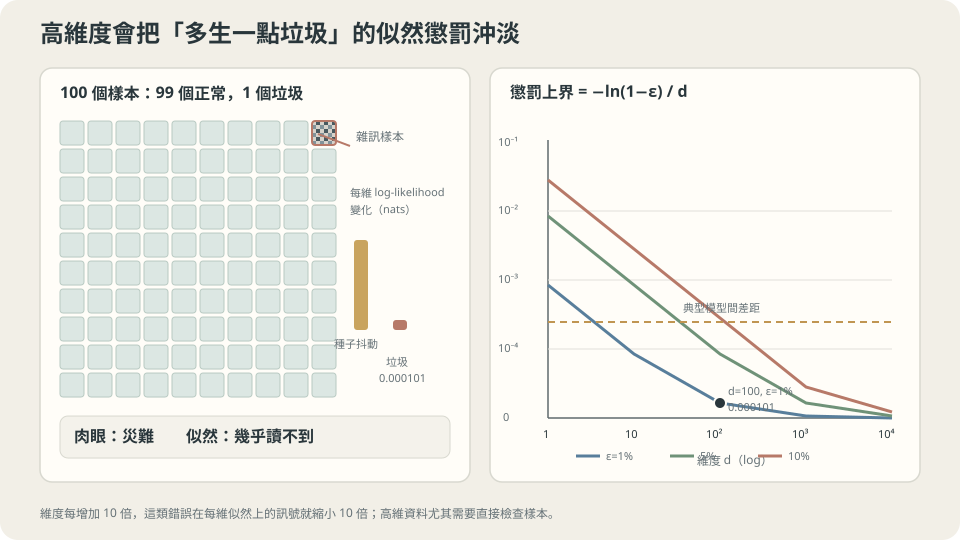

import Objectives from '../../../components/Objectives.astro';
import Ask from '../../../components/Ask.astro';
import Prereq from '../../../components/Prereq.astro';
import Question from '../../../components/Question.astro';
import Answer from '../../../components/Answer.astro';
import QuizBlock from '../../../components/QuizBlock.astro';
import Option from '../../../components/Option.astro';
import Explanation from '../../../components/Explanation.astro';
import VizPlan from '../../../components/VizPlan.astro';
import Remark from '../../../components/Remark.astro';
import Details from '../../../components/Details.astro';
import Bridge from '../../../components/Bridge.astro';
import UsedBy from '../../../components/UsedBy.astro';
import Ref from '../../../components/Ref.astro';

# 一個生成模型好不好，該用哪一個數字回答？

<Objectives>
- **分清 fidelity、coverage 與訓練資料記憶這三個問題。** 用反例說明為什麼一項表現好，不自動保證其他項也好。
- **推導混入 $\varepsilon$ 比例異常樣本的 KL 上界。** 說明每維 NLL 的尺度可能掩蓋什麼，而不是宣稱 likelihood 毫無用途。
- **依用途安排 held-out 評估、生成樣本檢查與最近鄰比較。** 說清楚估計誤差、特徵空間與取樣設定，並避免把診斷線索當成證明。
</Objectives>

<Prereq items={frontmatter.prereqs} />

## 分數比較好，抽出的樣本就比較好嗎？

<Ref to="ml-maximum-likelihood" mode="title"/>、<Ref to="ml-latent-variables-elbo" mode="title"/>、<Ref to="ml-autoregressive" mode="title"/> 三篇做的是同一件事：把「模型好不好」化約成一個數字——似然，或者它的一個下界。

Population cross-entropy 在適當條件下等於真實分布的 entropy 加 $\mathrm{KL}(p\Vert p_\theta)$。所以 likelihood 有明確的統計意義；但我們看到的是有限資料上的估計，想要的也可能不只是這個期望。

想像看一份生成圖片的報告：平均分數很好，但每一百張仍有一張明顯不正常。另一個模型張張好看，卻只會畫同一種東西。**我們到底在乎哪一種「好」？** Theis、van den Oord 與 Bethge [1] 用反例提醒我們，不能直接從一項生成評估推到另一項。

<Ask>
一個模型的每維 log-likelihood 只比另一個低 $0.007\%$，<br />
它抽出來的樣本卻有百分之一是純雜訊——<br />
這兩個觀察，回答的是同一個問題嗎？
</Ask>

<Question id="Q1">
先不要選指標。**我們要求生成模型做到什麼？** 列出幾個不同方向，再想想一個模型是否可能做好其中一項，卻漏掉另一項。

<Answer>
**三件事。**

1. **保真度**（fidelity）：抽出來的東西要**像真的**——落在真實分布有質量的地方。
2. **涵蓋度**（coverage）：真實分布的**每一塊**都要抽得到，不能只會生一種。
3. **訓練資料記憶的檢查**：模型是否主要在重放訓練樣本？連續圖片的新穎性通常值得檢查；但離散資料中，真實新抽樣本來就可能和既有資料相同，不能一律禁止重複。

**三個例子，分別暴露不同問題。**

- **失去保真度**：把一個完美的模型與一點點純雜訊混起來，$p'=(1-\varepsilon)p+\varepsilon\,\text{noise}$。涵蓋度完美（真模型的部分原封不動），新穎性完美（雜訊當然不是訓練資料），但每抽一百次就有一張是垃圾。**第二節量這個。**
- **失去涵蓋度**：只學會真實分布的一個 mode。保真度完美（生出來的每一張都在高密度區），新穎性完美（不是背的），但整個分布錯了。**第三節量這個。**
- **失去新穎性**：把訓練集存起來，抽樣時隨機吐一筆。保真度滿分（生出來的每一筆都是**真的**資料），涵蓋度在訓練集上滿分，但它什麼都沒學到。**第四節量這個。**

這些例子不是「任何 scalar metric 都不可能有用」的證明。它們說的是：常用的分數不一定能分辨失敗的來源，所以還要問每個分數量了什麼、漏了什麼。Sajjadi 等人 [2] 將 precision 與 recall 分開，也是為了區分樣本品質與分布涵蓋。

**先猜一下似然的答案。** 似然算的是「模型在**真實資料點上**給多少密度」。所以：

- 模型漏掉真實分布的一塊 → 那一塊的資料點密度很低 → $-\log p$ 很大 → **抓得到**。
- 模型在真實資料以外的地方亂放密度 → 真實資料點上的密度只被正規化稀釋一點點 → **幾乎抓不到**。

**似然是不對稱的**，而第二、三節就是把這個不對稱量出來。
</Answer>
</Question>

## 似然對「生出垃圾」幾乎是盲的

把第一個反例做成實測。真模型是 $d$ 維的 $\mathcal N(0,I)$，壞模型是

$$
p'=(1-\varepsilon)\,\mathcal N(0,I)+\varepsilon\,\mathcal N(0,100\,I),
$$

取 $\varepsilon=0.01$：$99\%$ 的樣本來自原分布，$1\%$ 來自 covariance 大一百倍、standard deviation 大十倍的分布。$d=100$、兩萬個測試樣本：

```
  真模型    每維 log-likelihood = -1.418756 nats/dim
  混雜訊    每維 log-likelihood = -1.418856 nats/dim
  差距 = 0.000101 nats/dim   （整份 100 維總共 0.0101 nats）
  理論上界 = -ln(0.99)/d = 0.000101 nats/dim
```

差距約 $0.0001$ nats/dim。能否量到它，取決於測試樣本數、paired estimation 與模型波動，不能只由數值小就說一定量不到。重點是：這樣的平均差距，可能不符合我們對異常樣本比例的容忍程度。

而同一個模型抽出來的樣本：

```
  真模型的樣本   範數 ≈ 10   （= √d）
  混雜訊的樣本   99% 的範數 ≈ 10，1% 的範數 ≈ 100
```

**每一百張圖裡有一張是純雜訊，而那件事在似然上值 $0.007\%$。**

這不是巧合，它有一個乾淨的界。因為 $p'\ge(1-\varepsilon)p$ 處處成立，

$$
\log p'(x)\ \ge\ \log p(x)+\log(1-\varepsilon)
\quad\Longrightarrow\quad
\frac{\mathbb E[\log p]-\mathbb E[\log p']}{d}\ \le\ \frac{-\ln(1-\varepsilon)}{d}.
$$

期望對真實分布 p 取，因此左邊是 $\mathrm{KL}(p\Vert p')/d$。實測約等於這個上界；只有異常 component 在真實樣本附近的 density 可忽略時，才會幾乎取到等號。

> **在 $d$ 維裡混進 $\varepsilon$ 比例的垃圾，每維的 log-likelihood 最多只掉 $-\ln(1-\varepsilon)/d$；維度越高，這個代價越接近零。**

維度增加時，**每維平均**把這個固定的 KL 差距攤得更小；完整樣本的上界仍是 $-\log(1-\varepsilon)$。這是此種污染的尺度問題，不是所有 likelihood 差異都會隨維度消失。

<Remark label="注意" summary="反過來的方向會被抓到，而且抓得很兇">
上面的界之所以成立，是因為**加東西**不會讓真實資料點的密度掉太多——最多被正規化稀釋 $(1-\varepsilon)$ 倍。

**拿掉東西就完全不同。** 如果模型在某一塊真實資料存在的地方把密度壓到 $\delta$，那些點的 $-\log p$ 直接變成 $\log(1/\delta)$，沒有上界。$\delta\to0$ 時是 $+\infty$，也就是 <Ref to="ml-maximum-likelihood" mode="title"/> 第一節那個「宣告不可能的事發生了」。

所以似然的不對稱可以一句話講完：**它對「多生了不該生的」幾乎免疫，對「漏掉了該生的」極度敏感。** 而這剛好是很多人直覺的反面——大家看樣本，樣本只會告訴你前者。
</Remark>



**圖說：** 多生垃圾造成的每維似然懲罰上界隨 1/d 衰減；高維下，肉眼明顯的災難可能幾乎量不到。

## 反過來：樣本漂亮，分布全錯

第二個反例。同樣的一維雙峰資料（兩個 mode 在 $\pm1.5$），三個模型：

- **誠實模型**：真的學會了整個分布。
- **只學到一個 mode**：$\mathcal N(1.5,0.2^2)$——每一個樣本都落在真實資料的高密度區，而且比真實資料更集中。
- （第三個模型留到下一節。）

```
                          只學一個 mode    誠實模型
  到最近訓練點的距離          0.0078        0.0157      ← 「看起來更真」
  W1(模型, 測試集)            1.6929        0.0430      ← 分布整個錯
  覆蓋率（測試點 0.3 內有樣本） 0.410        1.000
  測試資料的 log-likelihood   -43.325       -1.700
```

**第一列是陷阱。** 用「樣本離真實資料多近」來評分，這個壞模型**贏了**——它的樣本比誠實模型的樣本更接近訓練資料，因為它把所有質量堆在一個高密度的小區域裡。任何只看「生出來的東西像不像真的」的評估都會給它高分。

**後三列把它抓出來**，而且三個都抓得到。特別是 log-likelihood 從 $-1.700$ 掉到 $-43.325$——**這是第二節那個 Remark 說的「拿掉東西沒有上界」**：另一個 mode 附近的測試資料在這個模型下密度幾乎是零，每一個那樣的點都貢獻一個巨大的 $-\log p$。

**所以似然和樣本品質的關係是這樣的**：

| 失敗模式 | 看樣本 | 看似然 |
| --- | --- | --- |
| 多生了不該生的（$1\%$ 垃圾） | **看得見** | 幾乎看不見（$0.007\%$） |
| 漏掉了該生的（只學一個 mode） | 看不見（樣本更漂亮） | **看得非常清楚**（$-1.7\to-43.3$） |

> **看樣本與看似然不是同一件事的兩種做法，它們各自對另一種失敗瞎掉——所以兩個都要看。**

<Details summary="這也解釋了「調低取樣溫度會讓樣本變好看」">
若正規化常數有限，把取樣分布改成與 $p^{1/T}$ 成正比、$T<1$，會提高高密度區的相對權重。但密度高不等於語意品質好，因此保真度是否改善、覆蓋度如何改變，還要實際評估。

這個例子說明 sampler 也會改變結果：只比較某一項樣本品質，可能忽略另一側的覆蓋損失。因此取樣的溫度、guidance 與 top-$p$ 等設定也要報告，不能把取樣設定不同的結果都當成模型本身的差別。

要同時看到兩面，做法是掃一條曲線而不是報一個點：把溫度從低掃到高，同時記錄保真度與涵蓋度兩個量，得到一條取捨曲線。兩個模型要比較，比的是**整條曲線**——一個模型的曲線如果整條在另一個外側，才是真的比較好；曲線交叉則表示它們各有擅長的操作點。
</Details>

## 第三個失敗：它其實什麼都沒學

前兩節的兩個數字（樣本品質、似然）湊起來，已經擋掉了兩種失敗。但還有一種，而且它兩個都躲得過。

**把訓練集存起來，抽樣時隨機吐一筆。** 保真度滿分——生出來的每一筆都是**真的資料**。似然？如果用一個核密度估計去讀，它在訓練資料附近的密度極高。

實測。$n=200$ 的訓練集，比較三個東西：

```
                          W1(model, train)   W1(model, test)
  背訓練集的模型              0.0172             0.1249
  誠實模型                    0.0918             0.0430
```

這裡的 W1 是從有限生成樣本與資料樣本估出的距離，所以重放模型對 train 的數值仍可能不是零；若直接比較它的 empirical law 與同一份 train empirical law，距離才恰為零。表中的排序提醒我們，要另外使用 held-out data，而不只看模型多貼近訓練集。

對 train 的距離較大本身不是「學對了」的證據。這個已知真實分布的 toy example 才讓我們能確認：train 只是一次抽樣，完全貼住它不等於貼住 population。

**但光換成測試集還不夠。** 一個背了訓練集又加一點點抖動的模型，在測試集上的分布距離可以很不錯，卻仍然是在重放別人的資料。要抓它需要第三個數字：

```
  平均「到最近訓練點的距離」
    背訓練集的模型      0.00000
    誠實模型            0.01568
    真實的測試資料      0.01603   ← 參考點
```

**最後一列是這張表的關鍵。** 「樣本離訓練資料多近」這個量**沒有一個理想值是零**——零表示在背。它的理想值是**真實的新資料離訓練資料多近**，也就是 $0.01603$。誠實模型的 $0.01568$ 幾乎正中那個參考點。

> **最近鄰距離要和 held-out data 的同一個量比較。明顯偏小是檢查記憶或 mode concentration 的線索，不是單獨定罪的證據。**

Carlini 等人 [3] 在 diffusion models 中展示過 training-data extraction，提醒我們除了分布品質，也要依應用檢查訓練資料的記憶與暴露風險。最近鄰只是其中一個工具，不是完整的隱私保證。

## 三種失敗，三組數字

<iframe loading="lazy" src="/personal_website/notes/research_areas/machine-learning-foundations/l5-probabilistic-modeling/l5-3-2.html" class="demo-frame" title="三種失敗，三組數字：互動 demo" style="height: 938px; width: 100%; border: none;"></iframe>

**互動 demo：摻 1% 垃圾只多 0.0066 nat 卻毀掉樣本；塌成單一模式樣本好看卻多出 43.9 nats。**

## 一套可以照做的評估

把三節合成一份清單。

1. **按用途安排互補檢查。** 有 held-out 分布評估、生成樣本的 fidelity／coverage，以及與 train 最近鄰的比較；模型能算 likelihood 時，再報精確 NLL 或明確標示的下界。不是每種模型都能提供同一組數字。
2. **比較 likelihood 要使用相同的觀測空間與慣例。** 精確 likelihood 可以跨模型族比較；ELBO 則有不同的缺口。連續 density 的單位、離散化與 dequantization 也要一致，不能混在一起排名。
3. **報取樣的超參數。** 溫度、guidance 強度、top-$p$ 都會沿著保真度／涵蓋度的取捨曲線移動，所以「哪個模型比較好」在沒有指定操作點的情況下是沒有意義的問題。可以的話報整條曲線。
4. **報種子數與抖動。** <Ref to="ml-seeds-and-reporting" mode="title"/> 的規則在這裡不變，而且更重要——分布距離這類指標的估計本身就有抖動（它們是從有限樣本算出來的）。
5. **隨機看樣本，不只挑展示圖。** 人的檢查也有盲點：若異常比例是 $1\%$，只看二十張完全沒遇到異常的機率仍有 $0.99^{20}\approx82\%$。因此要說明抽樣方式與數量，不能把看過幾張好圖當成保證。

**這一切依賴什麼。**

一，**held-out 資料真的沒被碰過**。生成模型的訓練資料常常來自大規模的爬取，而測試集可能就在裡面——那時候所有的數字都在量記憶力。

二，**特徵空間的選擇**。FID 對 feature distributions 用均值與 covariance 做 Gaussian 近似，再計算相應的平方 W2；它不是原始完整分布的 W2。Feature extractor 沒保留的差異，這個分數也可能看不到。

三，**「好」依賴用途**。資料增強要確認生成資料能改善下游任務；創作工具可能還關心提示符合度與多樣性。哪些缺陷不能接受，應先由任務決定，再安排能偵測它們的評估。

## 檢查理解

<QuizBlock id="ml-l5-3-a">
$d=100$ 的實測裡，混進 $1\%$ 雜訊只讓每維 log-likelihood 掉 $0.000101$ nats。下列哪一句最準確地說明這件事？
<Option>這表示 $1\%$ 的雜訊其實不重要，因為它對分布的影響本來就很小。</Option>
<Option correct>因為 $p'\ge(1-\varepsilon)p$，每維的期望 NLL 增量至多是 $-\log(1-\varepsilon)/d$。這個尺度很小，不代表異常樣本比例符合任務需求；完整樣本的 KL 上界則沒有除以 d。</Option>
<Option>因為 $\mathcal N(0,100I)$ 的樣本仍然在 $\mathcal N(0,I)$ 的支撐集內，所以不算真的垃圾。</Option>
<Explanation>
支撐集相同不保證分布相近；上界來自更強的 pointwise inequality $p'\ge(1-\varepsilon)p$，不是只因兩者共享 support。異常比例是否可接受，也要由應用決定。
</Explanation>
</QuizBlock>

<QuizBlock id="ml-l5-3-b">
「只學到一個 mode」的模型，樣本到最近訓練點的平均距離是 $0.0078$，比誠實模型的 $0.0157$ 還小。這說明：
<Option>這個模型的樣本品質確實比較好，只是多樣性差一點。</Option>
<Option correct>「樣本離真實資料多近」這個量可以靠把質量集中到一小塊高密度區來作弊，所以它單獨使用時不是一個評估。要抓這個模型需要涵蓋度（$0.410$ 對 $1.000$）或似然（$-43.325$ 對 $-1.700$），兩者都把它抓得很清楚。</Option>
<Option>因為 $n=200$ 太小，訓練點之間的間隔還很大。</Option>
<Explanation>
第一個選項的問題在「只是」兩個字：$W_1(\cdot,\text{test})$ 從 $0.0430$ 變成 $1.6929$，那不是「多樣性差一點」，那是分布整個錯了。這題想建立的習慣是：**看到一個指標很好的時候，先問它能不能被便宜地作弊**——如果能，那它必須和一個防守相反方向的指標配對使用。
</Explanation>
</QuizBlock>

<QuizBlock id="ml-l5-3-c">
第四節的表裡，誠實模型的樣本到最近訓練點的距離是 $0.01568$，真實測試資料是 $0.01603$。如果有一個模型這個數字是 $0.004$，最合理的判讀是：
<Option>很好，它的樣本比誠實模型更貼近資料分布。</Option>
<Option correct>可疑。這個量的理想值是真實新資料的那個值（$0.01603$），明顯更小表示樣本系統性地比真實資料更靠近訓練點——可能在背訓練集，也可能是質量過度集中。接下來該做的是檢查最接近的那幾個樣本與訓練點是不是幾乎相同，以及涵蓋度有沒有掉。</Option>
<Option>很好，這表示模型學到的分布比真實分布更精確。</Option>
<Explanation>
這題的重點是「這個量有一個參考點，不是越小越好」。第一與第三個選項犯的是同一個錯：把一個雙向指標當成單向指標讀。順帶一提，$0.004$ 這個值本身不足以判罪——背訓練集與 mode 集中都會產生它，所以正確的下一步是做能區分兩者的檢查（看最近鄰配對 vs 看涵蓋度），而不是直接下結論。
</Explanation>
</QuizBlock>

<QuizBlock id="ml-l5-3-d">
下列哪一句**不對**？
<Option>對特定污染模型 $p'=(1-\varepsilon)p+\varepsilon r$，有 $\mathrm{KL}(p\Vert p')\le-\log(1-\varepsilon)$；但模型若在 p 有正質量的區域給零機率，KL 可為無限大。</Option>
<Option>調低取樣溫度會沿著保真度／涵蓋度的取捨曲線移動，所以只報樣本品質的比較可以靠調溫度贏。</Option>
<Option correct>只要把評估換到 held-out 資料上算，背訓練集的模型就一定會被抓出來。</Option>
<Explanation>
這次 toy 的 held-out 距離能分辨原樣重放與其他樣本，但不是所有資料量與 metric 都有這個保證。若關心記憶或洩漏，要另做訓練資料相似度與 extraction 檢查，並以真實 held-out 樣本作對照；單純的新穎性分數也不是完整證明。
</Explanation>
</QuizBlock>

<UsedBy slug={frontmatter.slug} />

<Bridge>
到這裡，我們不是要找一個永遠最好的分數，而是要學會問：**這個數字正在估哪個量？它是否回答了我們的問題？** 訓練誤差、held-out NLL、ELBO 與分布距離都能提供資訊，但限制不同。

所以這門課留下的不是一個「最佳分數」，而是一個工作方式：先定義問題，再替每個數字補上一個守住盲點的檢查。之後在其他課程裡遇到不熟悉的判斷，就從篇末的 Used By 回到對應工具，再帶著它繼續往下走。
</Bridge>

## 參考文獻

1. Theis, L., van den Oord, A. & Bethge, M. [*A note on the evaluation of generative models.*](https://arxiv.org/abs/1511.01844) ICLR 2016.（本篇第二節那個混雜訊的論證與 $-\log(1-\varepsilon)$ 的界，以及似然與樣本品質可以任意脫鉤的建構。）
2. Sajjadi, M., Bachem, O., Lucic, M., Bousquet, O. & Gelly, S. [*Assessing Generative Models via Precision and Recall.*](https://arxiv.org/abs/1806.00035) NeurIPS 2018.（把「保真度」與「涵蓋度」拆成兩個數字，並說明單一分數為何無法區分兩種失敗。）
3. Carlini, N. et al. [*Extracting Training Data from Diffusion Models.*](https://arxiv.org/abs/2301.13188) USENIX Security 2023.（第四節那個新穎性檢查在真實模型上的後果。）
