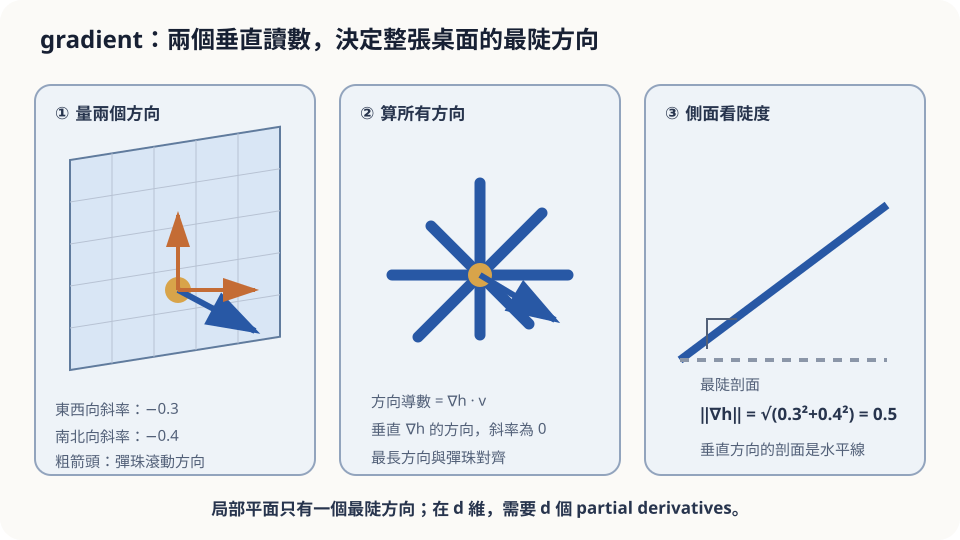

import Objectives from '../../../components/Objectives.astro';
import Prereq from '../../../components/Prereq.astro';
import Question from '../../../components/Question.astro';
import Answer from '../../../components/Answer.astro';
import QuizBlock from '../../../components/QuizBlock.astro';
import Option from '../../../components/Option.astro';
import Explanation from '../../../components/Explanation.astro';
import Details from '../../../components/Details.astro';
import Bridge from '../../../components/Bridge.astro';
import UsedBy from '../../../components/UsedBy.astro';
import Ref from '../../../components/Ref.astro';

# 霧中下山：Gradient 與方向

<Objectives>
- **把「腳下的傾斜」寫成 directional derivative。** 說出為什麼兩個垂直方向的讀數就決定了所有方向的傾斜。
- **寫出 gradient 的定義，證明最陡的方向就是 gradient 的方向。** 說出 $\nabla\log f$ 為什麼是「相對變化率」。
- **對「只憑腳下傾斜往最陡處走」這個下山策略，判斷它在什麼假設下有效、何時失效。** 用一個可以調步長的 demo 驗證。
</Objectives>

<Prereq items={frontmatter.prereqs} />

## 起霧了

你在一座山坡上，霧濃到看不見三步以外。手機沒訊號，地圖沒用，唯一還能用的感官是**腳底**：站著不動，你能感覺到地面往哪邊斜、斜得多陡。

你想盡快下到谷底。直覺的做法很自然：**感覺一下哪邊最陡，就往那邊走一步，再感覺一次。**

先只問三件事：
1. 「腳下最陡的方向」這件事，需要試多少個方向才能確定？要三百六十度轉一圈嗎？
2. 沿最陡方向走，每一步都是「當下最快下降」——這保證你走到的是谷底嗎？
3. 一步該走多大？

多數人對第 1 題會說「轉一圈試試」，對第 2 題會說「應該吧」，對第 3 題會說「越陡走越大步」。這三個答案有的對、有的錯，但重點是：**直覺說不出為什麼，也說不出什麼時候會失效。** 這一篇把它翻成數學，然後回來逐題判斷。

<Question id="Q1">
把這個情境翻成數學問題：這裡的「函數」是什麼？我們手上有什麼資訊？我們想求的量是什麼？

<Answer>
最直覺的說法是「函數是山」，這差一步。山是一個**高度函數** $h(x,y)$：輸入是你在地面上的位置 $(x,y)$（兩個座標），輸出是那裡的海拔。整座山就是 $h$ 的圖形。

我們手上有的資訊**不是** $h$ 本身——霧裡看不到——而只有**當下位置的傾斜**。「往方向 $u$ 走一小段，高度變多少」，這是一個對每個方向 $u$ 都有一個值的量。我們暫時叫它「往 $u$ 方向的斜率」。

我們想求的量是：**在所有方向裡，哪一個方向的斜率最負**（下降最快）。這是一個對方向取最小值的問題。翻譯到這裡，問題已經比原來清楚很多：我們需要一個工具，把「每個方向的斜率」整理成一個好處理的物件，然後在上面做最小化。這個物件就是 gradient。
</Answer>
</Question>

## 一張傾斜的桌子

先不用符號。想像一張桌子，四隻腳不等長，桌面因此往某個方向斜。你把一顆彈珠放在桌上，它會往一個**確定的方向**滾——桌面雖然有無限多個方向，但「傾斜」本身只是一件事：一個方向、一個陡度。

換句話說：在腳下那一小塊地面上（小到可以當成平面），**所有方向的斜率都由同一個「傾斜」決定**。往彈珠滾的方向走，最陡；往垂直的方向走，完全是平的；其他方向介於中間，而且變化的規律是固定的（後面會看到是 cosine）。

這就是為什麼你**不需要轉一圈**。桌面是一個平面，一個平面的傾斜只有兩個自由度——量兩個垂直方向的斜率，整張桌子的傾斜就定了。



*圖：gradient 是局部平面的最陡方向；與它垂直的方向導數為零。*

## 把傾斜寫成數學

**Directional derivative。** 站在位置 $p=(x,y)$，往單位向量 $u$（長度 1，只代表方向）走一小段 $s$，高度變成 $h(p+su)$。「往 $u$ 方向的斜率」就是

$$
D_u h(p)=\lim_{s\to0}\frac{h(p+su)-h(p)}{s}.
$$

它對每個 $u$ 都有一個值。特別地，$u=(1,0)$（東西向）與 $u=(0,1)$（南北向）的兩個值，就是我們熟悉的 partial derivative $\partial h/\partial x$、$\partial h/\partial y$。

**Gradient。** 把這兩個 partial derivative 排成一個向量：

$$
\nabla h(p)=\Big(\frac{\partial h}{\partial x}(p),\ \frac{\partial h}{\partial y}(p)\Big).
$$

桌子那一段說「兩個讀數決定所有方向」，寫成式子就是：只要 $h$ 在 $p$ 附近是 differentiable 的（可以用一個平面貼近），

$$
D_u h(p)=\nabla h(p)\cdot u .
$$

證明只有幾行，放在下面；主線需要的是它的結論。

<Details summary="為什麼 D_u h = ∇h · u（differentiable 的定義就是「局部像平面」）">
$h$ 在 $p$ 是 differentiable，定義上就是存在一個向量 $g$ 使得 $h(p+v)=h(p)+g\cdot v+o(\|v\|)$——小位移 $v$ 造成的高度變化，主要部分是 $v$ 的一個 linear 函數，剩下的比 $\|v\|$ 更小。代 $v=su$：$h(p+su)-h(p)=s\,(g\cdot u)+o(s)$，除以 $s$ 取極限得 $D_u h(p)=g\cdot u$。再代 $u=(1,0)$ 與 $(0,1)$，看出 $g$ 的兩個分量就是兩個 partial derivative，所以 $g=\nabla h(p)$。
</Details>

**最陡方向。** 現在起點問題變成：在 $\|u\|=1$ 的所有 $u$ 裡，讓 $\nabla h\cdot u$ 最小。Cauchy–Schwarz 不等式說 $|\nabla h\cdot u|\le\|\nabla h\|\,\|u\|=\|\nabla h\|$，等號在 $u$ 與 $\nabla h$ 平行時成立。所以

$$
\min_{\|u\|=1}D_u h=-\|\nabla h\|,\qquad\text{在 }u=-\frac{\nabla h}{\|\nabla h\|}\text{ 達到}.
$$

寫成角度：若 $u$ 與 $\nabla h$ 夾角 $\theta$，則 $D_u h=\|\nabla h\|\cos\theta$——這就是桌子那張圖裡「羅盤長條」的規律。**最快下山的方向是 $-\nabla h$，最快上山是 $+\nabla h$，垂直於 $\nabla h$ 走是等高線。**

## 為什麼常常看到的是 $\nabla\log f$？

有一類量天生是**相對**的：手機訊號強度、聲音響度、一個地區的人口密度。對這些量，我們關心的常不是「走一公尺多了多少」，而是「走一公尺多了**幾成**」。

設 $f>0$。Chain rule 給

$$
\nabla\log f=\frac{\nabla f}{f}.
$$

右邊是「絕對變化率除以目前的值」——正是相對變化率。它有一個立刻能用的性質：**把 $f$ 整體乘一個常數 $c$，$\nabla\log(cf)=\nabla\log f$ 不變。** 所以只要你知道 $f$「長什麼形狀」，就算不知道它的整體大小（例如一個還沒 normalize 的密度），$\nabla\log f$ 也算得出來。

直接算一個之後會反覆出現的例子：$f(x)=\exp\!\big(-\|x-\mu\|^2/(2\sigma^2)\big)$（一個鐘形，中心 $\mu$、寬度 $\sigma$）。直接算：

$$
\nabla\log f(x)=-\frac{x-\mu}{\sigma^2}.
$$

它永遠指向中心 $\mu$，長度與「離中心多遠」成正比、與 $\sigma^2$ 成反比。**沿著 $\nabla\log f$ 走，就是往密度高的地方走**，而且鐘形越窄、拉力越強。這個式子之後會反覆出現。

## 三個直覺逐題判斷

**第 1 題（要試幾個方向）——直覺錯了，但錯得有道理。** 只要地面在腳下那一小塊是 differentiable 的（沒有稜線、沒有斷崖），兩個垂直方向的讀數就決定了 $\nabla h$，最陡方向是 $-\nabla h$。「轉一圈」不是錯，是浪費：它隱含假設「每個方向的斜率是獨立的資訊」，而 differentiability 說它們只有兩個自由度。**失效條件**：站在稜線上（像 $h=|x|$ 的尖點），左右兩邊斜率不同、沒有一個平面貼得上，這時 gradient 不存在，兩個讀數也不夠。

**第 2 題（每步最陡就會到谷底嗎）——直覺錯了。** $-\nabla h$ 只保證**這一步**降得最快，是一個**局部**的判斷。走到任何 $\nabla h=0$ 的地方（山坳、小盆地）你就停了，因為腳下感覺是平的——但那可能只是半山腰的一個小窪地，真正的谷底在霧的另一邊。「一路最陡」保證的是**單調下降**，不是「到最低點」。什麼時候直覺是對的？當 $h$ 只有一個低點、而且處處往它斜（convex 的地形），這時 $\nabla h=0$ 的地方就只有谷底一個。

**第 3 題（步長）——直覺對了一半。** $\nabla h$ 是「腳下那一小塊」的傾斜，走出那一小塊之後它就不再準。「越陡走越大步」在平滑的長坡上合理；但坡度變化很快的地方（坡下面就是另一個坡），一大步可能跨過谷底、走到對面山坡上更高的位置。步長的合理範圍由「傾斜變化多快」決定——這件事要到 <Ref to="math-taylor"/> 才有工具量化，這裡先記結論：**gradient 是局部資訊，步長要小到局部近似還成立。**

## 實際走一次

<iframe loading="lazy" src="/personal_website/notes/research_areas/mathematical-foundations/m0-calculus-toolkit/m0-0-2.html" class="demo-frame" title="霧中下山：改步長、換地形，看 gradient descent 何時失效" style="height: 880px; width: 100%; border: none;"></iframe>

如果想用十行程式驗證，下面直接在碗形地形上跑，並刻意把步長調過頭：

```python
import numpy as np
grad = lambda p: np.array([2*p[0], 4*p[1]])        # h = x^2 + 2 y^2 的 gradient
def descend(eta, steps=30, p=np.array([2.0, 1.5])):
    hs = []
    for _ in range(steps):
        p = p - eta * grad(p)                        # 往 -∇h 走一步
        hs.append(p[0]**2 + 2*p[1]**2)
    return np.array(hs)
print(descend(0.1)[-1])    # 收斂：高度趨近 0
print(descend(0.6)[-1])    # y 方向係數 1-4*0.6 = -1.4，每步放大 → 發散
```

## 檢查理解

<QuizBlock id="m0-0-a">
你在一間大廳裡，手上的分貝計顯示目前噪音值，你想走到最安靜的地方。你在原地往東、往北各走一小步並記下讀數變化。接下來該往哪走？
<Option correct>把「往東的變化」「往北的變化」排成一個向量，往它的**反方向**走——那是噪音下降最快的方向。</Option>
<Option>往東與往北兩個方向中變化較大的那一個的反方向走。</Option>
<Option>還要再往西、往南各走一步，資訊才夠。</Option>
<Explanation>
兩個垂直方向的變化率就是 gradient 的兩個分量，$-\nabla$ 是最快下降方向。「挑變化較大的那一軸」只在 gradient 恰好沿座標軸時才正確，一般會偏掉。往西、往南只是往東、往北的反號，沒有新資訊——這正是 differentiability 說的「只有兩個自由度」。
</Explanation>
</QuizBlock>

<QuizBlock id="m0-0-b">
下山策略「每步走 $-\nabla h$」在下面哪個情況**仍然有效**？
<Option>地形上有一道稜線（像 $|x|$ 的折痕），你正好站在稜線上。</Option>
<Option>地形有兩個窪地，你想到達較低的那一個，但不知道自己在哪一側。</Option>
<Option correct>地形只有一個低點、處處往它傾斜，步長小到每一步都在「傾斜還沒明顯改變」的範圍內。</Option>
<Explanation>
稜線上 gradient 不存在，兩個讀數拼不出一個平面。兩個窪地時，gradient 只保證單調下降，停下來的地方由起點決定——你會滑進起點所在的那個盆地，不一定是幾何上最近的窪地，不一定較低。只有單一低點（convex）加上足夠小的步長，「局部最陡」才會帶你到全域最低。
</Explanation>
</QuizBlock>

<QuizBlock id="m0-0-c">
某地區的人口密度是 $f(x)$，但你拿到的地圖把所有數值都乘了一個未知常數 $c$（單位搞錯了）。下列哪個量**不受**這個常數影響？
<Option>$\nabla f$，因為 gradient 只看形狀。</Option>
<Option>$\|\nabla f\|$ 最大的位置。</Option>
<Option correct>$\nabla\log f$，因為 $\nabla\log(cf)=\nabla\log c+\nabla\log f=\nabla\log f$。</Option>
<Explanation>
$\nabla(cf)=c\,\nabla f$，會跟著常數放大；$\|\nabla f\|$ 最大的位置雖然不變，但它的值變了，而且它不是「哪裡人最多」的指標。$\nabla\log f=\nabla f/f$ 是相對變化率，常數在分子分母相消——這就是為什麼「形狀已知、整體大小未知」的函數，仍能算出它的 $\nabla\log$。
</Explanation>
</QuizBlock>

<UsedBy slug={frontmatter.slug} />

<Bridge to="math-divergence">
本篇把「腳下的傾斜」整理成一個向量 $\nabla h$：兩個讀數決定所有方向、最陡方向是 $-\nabla h$、而 $\nabla\log f$ 是不在乎整體倍率的相對變化率。同時看到它是局部資訊——步長與多個低點是它的兩個失效點。接著換一個問題：不是「往哪走」，而是「一個區域裡的東西在變多還是變少」——那需要另一種微分。
</Bridge>

## 參考文獻

1. Strang, G. [*Calculus.*](https://ocw.mit.edu/courses/res-18-001-calculus-online-textbook-spring-2005/) Wellesley-Cambridge Press；MIT OpenCourseWare RES.18-001 免費全文。（partial derivative、gradient 與 directional derivative 的章節。）
2. Marsden, J. E., Tromba, A. J. *Vector Calculus.* W. H. Freeman.（differentiability 的「局部像平面」定義、Cauchy–Schwarz 與最陡方向。）
3. Nocedal, J., Wright, S. J. [*Numerical Optimization*, 2nd ed.](https://doi.org/10.1007/978-0-387-40065-5) Springer 2006.（steepest descent、步長選擇、局部與全域最小的差別。）
