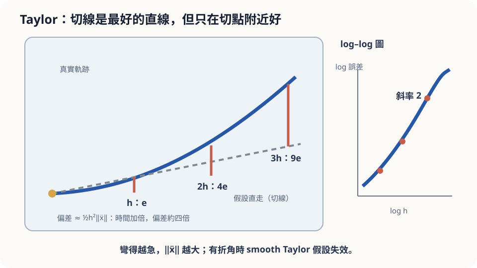

import Objectives from '../../../components/Objectives.astro';
import Prereq from '../../../components/Prereq.astro';
import Question from '../../../components/Question.astro';
import Answer from '../../../components/Answer.astro';
import QuizBlock from '../../../components/QuizBlock.astro';
import Option from '../../../components/Option.astro';
import Explanation from '../../../components/Explanation.astro';
import Details from '../../../components/Details.astro';
import Bridge from '../../../components/Bridge.astro';
import UsedBy from '../../../components/UsedBy.astro';
import Ref from '../../../components/Ref.astro';

# 導航的三十秒：Taylor 展開與「假設直線」

<Objectives>
- **把「兩次定位之間假設車直走」寫成一階 Taylor 近似。** 寫出餘項的量級 $h^2/2$ 乘上加速度。
- **說出二階 Taylor 多補的那一項是什麼、餘項如何變成 $h^3$。** 指出這些量級需要步長小、路徑夠 smooth。
- **對「每 $h$ 秒更新一次、中間直走」這個做法，判斷它在直路與彎路上各差多少、依賴什麼假設。** 用程式在具體數字上驗證誤差隨 $h$ 的縮放。
</Objectives>

<Prereq items={frontmatter.prereqs} />

## 兩次定位之間

手機導航不是每一瞬間都知道你在哪。它每隔一段時間收到一次定位——假設是每 $h$ 秒一次——兩次之間畫面上的小箭頭是**算出來的**：拿上一次的位置與速度，假設你維持同樣的速度、同樣的方向直走。

直路上這沒問題。問題在轉彎：你在市區以 36 km/h（每秒 10 公尺）進入一個半徑 20 公尺的彎，導航在你進彎的瞬間拿到最後一次定位，接下來 $h$ 秒都假設你直走。

我們漏掉的是進彎後速度方向的變化。**能不能用當下的速度、再加上它的變化率，估計這個偏差？** 先看短短的一步，再問這個估計放到很長的時間後還能不能用。

<Question id="Q1">
把情境翻成數學：這裡的函數是什麼？導航「假設直走」在做什麼運算？我們想估的量是什麼？

<Answer>
最直覺的說法是「函數是路線」，可以再精確一點。

函數是**位置隨時間的軌跡** $x(t)$——一個輸入時間、輸出平面座標的函數（兩個分量）。最後一次定位發生在時間 $t$，導航知道的是**當時的位置 $x(t)$ 與速度 $\dot x(t)$**（速度由前幾次定位差出來）。

「假設直走」是一個非常明確的運算：用

$$
\tilde x(t+h)=x(t)+h\,\dot x(t)
$$

當作 $t+h$ 時的位置。也就是說，導航用**經過 $x(t)$、斜率為 $\dot x(t)$ 的直線**取代了真實的曲線。

我們想估的量是這條直線與真實軌跡在 $t+h$ 時的距離 $\|x(t+h)-\tilde x(t+h)\|$。翻譯完會發現，問題其實跟導航無關：**任何時候你用「當下的值加上當下的變化率乘時間」去預測未來，你都在假設直線；問題是這個假設在多長時間內可信、差多少。** 這就是 Taylor 展開要回答的事。
</Answer>
</Question>

## 一把彎的尺

拿一根有點彎的塑膠尺，貼著眼睛看很短的一段——它看起來是直的。看的範圍拉長，彎曲才顯現出來。

把很短的一段用切線取代，誤差來自切線方向之外的變化。對位置隨時間的函數，這個變化用 acceleration 描述。它不只包含轉彎：沿直線加速或減速，同樣會讓「維持當下速度」的預測出錯。若二階項非零且步長夠小，步長加倍，首要誤差會接近四倍，而不是永遠精確四倍。

導航的情形一模一樣：軌跡是那根尺，「兩次定位之間」是你看的那一段，轉彎的急緩是尺的彎曲程度。



*圖：平滑曲線離開切線的首要誤差是二階項，量級為 h²。*

## 把「直線假設的誤差」寫成數學

先看一個分量。設 $f$ 是一個對時間的函數（例如位置的 $x$ 座標），在 $t$ 附近有二階導數。**一階 Taylor 展開**說

$$
f(t+h)=f(t)+h\,f'(t)+R_1(h),\qquad R_1(h)=\frac{h^2}{2}f''(\xi)\ \text{（某個 }\xi\in[t,t+h]\text{）}.
$$

前兩項是維持當下變化率的預測；$R_1$ 是 remainder（餘項）。只要這段時間內 $|f''|\le M$，就有 $|R_1|\le Mh^2/2$。固定同一個 $M$ 比較時，步長加倍，這個上界是四倍；實際誤差是否接近四倍，還要看二階導數在一步內如何變化。

<Details summary="餘項為什麼是 h²/2 乘二階導數（積分形式，六行）">
由微積分基本定理，$f(t+h)-f(t)=\int_t^{t+h}f'(s)\,ds$。再對 $f'$ 用一次：$f'(s)=f'(t)+\int_t^{s}f''(r)\,dr$。代回去並交換積分順序：

$$
f(t+h)-f(t)-h f'(t)=\int_t^{t+h}\!\!\int_t^{s}f''(r)\,dr\,ds=\int_t^{t+h}(t+h-r)\,f''(r)\,dr .
$$

權重 $(t+h-r)$ 在 $[t,t+h]$ 上的積分是 $h^2/2$，所以 $|R_1|\le\frac{h^2}{2}\max|f''|$；若 $f''$ 連續，由中間值定理可以把它寫成 $\frac{h^2}{2}f''(\xi)$。對向量值的 $x(t)$，逐分量套用，或直接用積分形式得到 $\|R_1\|\le\frac{h^2}{2}\max\|\ddot x\|$。
</Details>

**二階 Taylor** 多補一項，把「當下的加速度」也算進去：

$$
f(t+h)=f(t)+h f'(t)+\frac{h^2}{2}f''(t)+R_2(h),\qquad |R_2(h)|\le\frac{h^3}{6}\max|f'''| .
$$

規律是一致的：**多用一階導數的資訊，餘項就多一個 $h$ 的次方。** 但每一階都有同樣的但書——公式裡出現的是那段時間內的最大導數，而「它是一個好用的估計」需要 $h$ 小到 $f''$ 在這段時間裡沒有劇烈變化。

## 三個數字

把轉彎寫成數學：半徑 $R=20$ m 的圓弧、速率 $v=10$ m/s。圓周運動的加速度指向圓心、大小 $\|\ddot x\|=v^2/R=5$ m/s²，而且沿著圓弧**處處相同**，所以餘項的上界可以直接算：

$$
\|x(t+h)-\tilde x(t+h)\|\ \le\ \frac{h^2}{2}\cdot\frac{v^2}{R}=2.5\,h^2\ \text{公尺}.
$$

**$h=1$ 秒**：上界 2.5 m，實際約 2.48 m。**$h=2$ 秒**：上界 10 m，實際約 9.73 m，接近前者四倍。這不是逐秒累積一個固定偏差：我們漏掉的速度變化還會繼續累積成位置誤差，因此短步長時首要項是 $h^2$。

**$h=30$ 秒**：上界 $2.5\times900=2250$ m。這個數字是對的（真實偏差確實不超過它），但**毫無用處**：30 秒內車以 10 m/s 在半徑 20 m 的圓上跑了 300 m，繞了兩圈多，真實位置離出發點不到 40 m，而直線預測跑到 300 m 外——真實偏差約 290 m。上界對、但鬆了將近十倍。原因是 $h^2$ 這個量級描述的是「$h$ 小到軌跡在這段時間內還像一條拋物線」的情形；30 秒早已超出這個範圍，此時偏差其實接近 $v h$（線性），因為真車根本沒走遠。

因此要分清兩件事：加速度在區間內有界時，$Mh^2/2$ 是上界；加速度在短短一步內變化不大時，$h^2\|a_t\|/2$ 才是好用的首要近似。**等速直線**的加速度為零，預測才完全精確；沿直線加減速仍有誤差，不能只看路線彎不彎。

若能估計 acceleration，就可以補上二階項。在這個等速圓周的例子，速率加上轉向率足以算出 acceleration；一般情況還要考慮速率的變化。$h=1$ 秒時，二階 remainder 上界約 0.42 m，比一階近似更小。能不能不直接量 acceleration，而用幾次 velocity 查詢取得類似資訊？這會是 <Ref to="math-higher-order"/> 的問題。

## 實際跑一次，再把彎弄急

```python
import numpy as np
def err(h, v=10.0, R=20.0):
    th = v*h/R                                             # h 秒內轉過的角度
    true = R*np.array([np.sin(th), 1-np.cos(th)])          # 圓弧上的真實位置
    pred = np.array([v*h, 0.0])                            # 假設直走
    return np.linalg.norm(true-pred)
hs = np.array([0.125, 0.25, 0.5, 1, 2, 4])
for R in (20.0, 2.0):                                      # 正常彎 vs 急彎（U-turn）
    e = np.array([err(h, R=R) for h in hs])
    print(f"R={R}: 誤差 {np.round(e, 2)}")
    print(f"       h 加倍後誤差的倍率 {np.round(e[1:]/e[:-1], 2)}   上界 {np.round(50*hs**2/R, 2)}")
```

$R=20$ 時，倍率一路是 $3.9$–$4.0$，直到 $h=4$ 秒才掉到 $3.7$——$h^2$ 規律在 $h$ 小時精確兌現。$R=2$（一個急迫的 U-turn）時，$h=0.125$ 秒的誤差 0.39 m 仍與上界吻合，但倍率一路掉：$0.125\to0.25$ 還有 $3.87$，接著是 $3.50$、$2.29$、$1.78$、$1.78$：加速度大了十倍，「一步之內像拋物線」的範圍縮到零點幾秒，同樣的 $h$ 在這裡已經算「太大」。

另一種違反是**路徑不 smooth**：如果司機在兩次定位之間瞬間變換車道（軌跡有一個折角），那一步的誤差與折角之後經過的時間成正比——是 $h$ 而不是 $h^2$，因為 Taylor 展開需要的二階導數在折角處根本不存在。

<iframe loading="lazy" src="/personal_website/notes/research_areas/mathematical-foundations/m0-calculus-toolkit/m0-2-2.html" class="demo-frame" title="導航的直線假設：步長、彎度、二階修正與折角" style="height: 800px; width: 100%; border: none;"></iframe>

## 檢查理解

<QuizBlock id="m0-2-a">
已知一個平滑函數當下的值與精確變化率，用 $f(t)+hf'(t)$ 預測下一刻。這是幾階近似？
<Option>零階：誤差與時間成正比。</Option>
<Option correct>一階：你用了當下的變化率，漏掉的是變化率本身在改變，誤差是 $\frac{h^2}{2}$ 乘上「變化率的變化率」。</Option>
<Option>二階：因為你用了一週的資料。</Option>
<Explanation>
這是一階 Taylor；二階近似還要補上 $h^2f''(t)/2$。若使用估計的變化率而不是精確的 $f'(t)$，還會多出 $h$ 乘上變化率估計誤差，不能把總誤差都算成 Taylor remainder。
</Explanation>
</QuizBlock>

<QuizBlock id="m0-2-b">
導航的更新間隔從 2 秒改成 1 秒。在一段平順的彎道上，直線假設的最大偏差大約會：
<Option>減半。</Option>
<Option>不變，因為彎道的曲率沒變。</Option>
<Option correct>變成四分之一。</Option>
<Explanation>
餘項是 $\frac{h^2}{2}\|\ddot x\|$，$h$ 減半、$h^2$ 變四分之一。「減半」是把誤差當線性累積的直覺——那是零階近似（完全不更新方向）才有的行為。曲率不變只是說前面的常數 $\|\ddot x\|=v^2/R$ 不變，$h^2$ 那一項還是縮了。
</Explanation>
</QuizBlock>

<QuizBlock id="m0-2-c">
下列哪個情況會讓「誤差 $\approx\frac{h^2}{2}\|\ddot x\|$」這個估計**失準**（而不只是常數變大）？
<Option>彎道半徑從 20 m 變成 40 m，步長不變。</Option>
<Option correct>司機在兩次定位之間瞬間變換車道，軌跡出現一個折角。</Option>
<Option>車速從 10 m/s 變成 15 m/s，步長不變且仍在平順彎道上。</Option>
<Explanation>
半徑變大、車速變快都只改變 $\|\ddot x\|=v^2/R$ 這個常數，$h^2$ 的量級照樣成立（車速變快若讓一步內轉過的角度不再小，才會開始失準）。折角處二階導數不存在，Taylor 展開的前提失效，那一步的誤差變成與 $h$ 成正比——這是「假設被違反」而不是「常數變大」。
</Explanation>
</QuizBlock>

<UsedBy slug={frontmatter.slug} />

<Bridge to="math-total-derivative">
現在我們知道，一階預測漏掉的是變化率本身的變化；在相應平滑條件下，一步 remainder 可由 $h^2$ 乘上二階導數控制。很多步的誤差會怎麼累積，留到 <Ref to="math-euler-error"/>。下一篇先問：當變化率同時受時間與位置影響，要怎麼算沿途真正感受到的變化？
</Bridge>

## 參考文獻

1. Strang, G. [*Calculus.*](https://ocw.mit.edu/courses/res-18-001-calculus-online-textbook-spring-2005/) Wellesley-Cambridge Press；MIT OpenCourseWare RES.18-001 免費全文。（Taylor 展開與餘項的章節。）
2. Hairer, E., Nørsett, S. P., Wanner, G. [*Solving Ordinary Differential Equations I: Nonstiff Problems*, 2nd ed.](https://doi.org/10.1007/978-3-540-78862-1) Springer 1993.（第 II 章：用 Taylor 展開分析一步法的局部誤差。）
