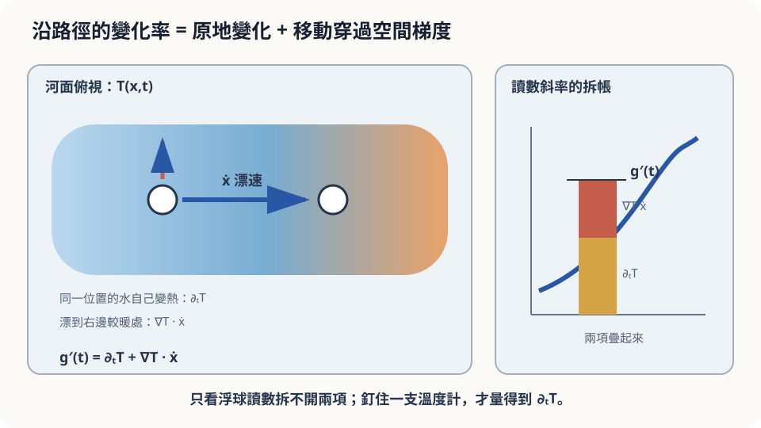

import Objectives from '../../../components/Objectives.astro';
import Prereq from '../../../components/Prereq.astro';
import Question from '../../../components/Question.astro';
import Answer from '../../../components/Answer.astro';
import QuizBlock from '../../../components/QuizBlock.astro';
import Option from '../../../components/Option.astro';
import Explanation from '../../../components/Explanation.astro';
import Details from '../../../components/Details.astro';
import Bridge from '../../../components/Bridge.astro';
import UsedBy from '../../../components/UsedBy.astro';
import Ref from '../../../components/Ref.astro';

# 漂流的溫度計：全導數、微分穿過積分與 JVP

<Objectives>
- **把「一個會動的觀測者讀到的變化」拆成 $\partial_t f+\nabla f\cdot\dot x$ 兩項。** 說出每一項各自是什麼、拆開需要什麼假設。
- **說出 Leibniz 法則（微分穿過積分）在什麼條件下成立。** 解釋它和全導數共用的「微分可以逐項拆開」邏輯。
- **對「讀數上升所以水變熱了」這個判斷，說出它漏了什麼、要補哪個量測才能拆開。** 用 `torch.func.jvp` 三行算出全導數，說出為什麼不需要整個 Jacobian。
</Objectives>

<Prereq items={frontmatter.prereqs} />

## 讀數上升了

你把一支溫度計綁在浮球上放進河裡，它跟著水漂，每分鐘回傳一次讀數。十分鐘後，讀數從 18.0 °C 升到 18.6 °C。

問題：**河水變熱了嗎？**

直覺說「讀數上升了，當然是變熱了」。寫下你有多確定。

再想一下，會冒出第二種可能：溫度計**漂到了比較熱的地方**——例如下游有一段淺灘，水本來就暖。這時候讀數上升，但任何一個固定位置的水溫可能一度都沒變。兩種解釋都說得通。**只有一支會漂的溫度計，你分得出來嗎？** 這一篇要回答的正是這件事：這兩種來源在數學上怎麼拆、拆開需要什麼、程式裡怎麼算。

<Question id="Q1">
把情境翻成數學：這裡有幾個函數？溫度計的讀數是哪些東西的合成？我們想知道的是哪個量、拆成哪幾塊？

<Answer>
最直覺的說法只說「溫度是時間的函數」，這漏掉了最重要的一層。

這裡有**兩個**函數。第一個是**溫度場** $T(x,t)$：在位置 $x$、時間 $t$，那裡的水溫。它是一個定義在「位置 × 時間」上的函數；「水變熱」說的是 $T$ 對 $t$ 的變化，「下游比較暖」說的是 $T$ 對 $x$ 的變化。第二個是**溫度計的路徑** $x(t)$：時間 $t$ 時溫度計在哪裡。

溫度計的讀數是這兩個函數**套在一起**：$g(t)=T\big(x(t),t\big)$。它只是時間的函數——這就是為什麼直覺會把它當成「水溫隨時間的變化」；但它裡面藏著 $x(t)$。

我們想知道的是 $g'(t)$ 拆成兩塊：一塊只跟「同一個位置的水溫在變」有關，另一塊只跟「溫度計移動到了溫度不同的位置」有關。翻譯到這裡，工具已經呼之欲出——這是 chain rule，只是要把它用到「有兩種輸入、其中一種自己也在動」的情形。
</Answer>
</Question>

## 電扶梯上走路

你在往上的電扶梯上往上走。你的高度在上升，原因有兩個：**電扶梯本身在動**（就算你站著不動也會上升），以及**你自己在走**（就算電扶梯停了你也會上升）。兩個效果直接相加。

而且它們可以分開量：站著不動，量到的是電扶梯的速度；等電扶梯停了再走，量到的是你自己的速度。只在動的電扶梯上走，你量到的是總和，**拆不開**——除非你另外知道其中一個。

河的情形一樣。「同一個位置的水溫在變」是電扶梯，「漂到別處」是走路，漂流的溫度計量到的是總和。



*圖：沿路徑的全導數是時間偏導與空間梯度乘速度之和。*

## 把兩個來源寫成數學

**沿路徑的全導數。** 設 $T(x,t)$ 對 $x$、$t$ 都 differentiable，$x(t)$ 是一條 differentiable 的路徑。讀數 $g(t)=T(x(t),t)$ 的變化率是

$$
\frac{d}{dt}T\big(x(t),t\big)=\underbrace{\partial_t T\big(x(t),t\big)}_{\text{位置固定、時間在走}}+\underbrace{\nabla T\big(x(t),t\big)\cdot\dot x(t)}_{\text{時間固定、位置在動}} .
$$

$\partial_t T$ 是把 $x$ 釘住、只讓 $t$ 動的 partial derivative；$\nabla T$ 是 <Ref to="math-gradient"/> 的 gradient（對位置各分量的 partial derivative），$\dot x$ 是漂速。第二項是 $\nabla T$ 與 $\dot x$ 的內積——正是 directional derivative 乘上速率：**往溫度變化最快的方向漂得越快，這一項越大**。左邊叫 $T$ 沿路徑的 **total derivative**（全導數）。

<Details summary="為什麼是相加（一階 Taylor 兩次，五行）">
從 $t$ 到 $t+h$，位置從 $x$ 變成 $x+\Delta x$，$\Delta x\approx h\dot x$。用一階 Taylor（<Ref to="math-taylor"/>）對兩個輸入同時展開：

$$
T(x+\Delta x,\,t+h)-T(x,t)=\partial_t T\cdot h+\nabla T\cdot\Delta x+o(h).
$$

小位移造成的變化是各方向變化的**線性**疊加——這就是 differentiable 的意思（局部像一個平面，只是現在的「平面」多了一個時間軸）。代 $\Delta x\approx h\dot x$、除以 $h$、取極限，就得到上面的式子。如果 $T$ 在某處不 differentiable（例如兩股水溫不同的水流交會、溫度有跳躍），這個線性疊加不成立，式子在那一點失效。
</Details>

**微分穿過積分（Leibniz 法則）。** 同一個「微分可以逐項拆開」的邏輯，再往前推一步。假設你關心的不是一支溫度計，而是**很多支固定位置的溫度計的加權平均**：

$$
m(t)=\int w(x)\,T(x,t)\,dx .
$$

積分是「很多項相加」，微分對相加是線性的，所以自然會猜

$$
\frac{d}{dt}\int w(x)\,T(x,t)\,dx=\int w(x)\,\partial_t T(x,t)\,dx .
$$

這就是 Leibniz 法則：**微分可以穿過積分符號，變成對被積函數的 partial derivative。** 它成立的條件是 $\partial_t T$ 存在，並且 $|w(x)\,\partial_t T(x,t)|$ 能被一個不依賴 $t$、可積的函數壓住（技術名詞是 dominated convergence；直覺是「沒有任何一支溫度計的變化率大到壞掉整個平均」）。一般形式是 $\frac{d}{dy}\int f(x,y)\,dx=\int\partial_y f(x,y)\,dx$——變數叫什麼不重要，重要的是被微分的變數**不是**積分變數，而且積分範圍不隨它改變。這條規則在之後很多推導裡是關鍵的一步，後面會直接用到。

## 一支溫度計拆不開

**結論。** 讀數十分鐘升 0.6 °C，這個數字是 $\int g'(t)\,dt$，是兩項的**總和**。「水變熱了」對應 $\partial_t T>0$，「漂到暖處」對應 $\nabla T\cdot\dot x>0$；單靠 $g(t)$，兩者的任何組合都能給出同樣的 0.6 °C。直覺「當然是變熱了」隱含了一個假設：**$\nabla T=0$，河水處處同溫**——這正是需要被檢查的那個假設。

**要補什麼才能拆開。** 至少再量一個東西。選項一：**在起點釘一支不動的溫度計**，它讀到的就是 $\partial_t T$（電扶梯的速度）；總和減掉它，剩下的就是漂移那一項。選項二：**一張某一時刻的水溫地圖**（$\nabla T$）加上浮球的 GPS（$\dot x$），直接算出第二項。舉個具體的數字：若釘住的溫度計十分鐘升了 0.3 °C，而浮球以 0.5 m/s 漂了 300 m、地圖上下游每公尺暖 0.001 °C，那麼兩項各 0.3 °C——「水變熱」只對了一半。

**假設與失效點。** 式子要求 $T$ 對位置與時間都 differentiable。若浮球漂過一條支流的匯入口——那裡兩股不同溫度的水還沒混合、溫度幾乎是跳躍的——$\nabla T$ 在匯入口沒有定義，讀數會在一分鐘內跳一大格，那一段的變化不能用兩項之和來解釋，也不該把它算進「水變熱」。

## 程式裡怎麼算全導數

當 $T$ 不是手寫的式子，而是一個程式（例如一個神經網路 $f(x,t)$，輸入輸出都是高維向量），全導數 $\partial_t f+(\nabla_x f)\,\dot x$ 有一個計算上的陷阱：$\nabla_x f$ 是一個 $d\times d$ 的 **Jacobian** 矩陣。$d$ 是幾萬時，把它整個算出來要 $d$ 次前向或反向傳播，記憶體 $d^2$，完全不可行。

但我們**不需要**整個 Jacobian，只需要它乘上**一個**向量 $\dot x$ 的結果——這叫 **Jacobian-vector product**（JVP）。Forward-mode 自動微分可以在**一次**前向傳播裡同時帶著「輸入往 $(\dot x,1)$ 方向動一點點，輸出跟著動多少」這個資訊，成本約是普通前向的兩到三倍，與 $d$ 無關。而且把 $t$ 的方向分量設成 1，$\partial_t f$ 那一項會**一起**算出來：

```python
import torch
from torch.func import jvp
def T(x, t):                                   # 溫度場：x=300 附近有一塊暖區，整體每秒升溫 0.0005 °C
    return 20 + 0.3*torch.exp(-((x-300)/100)**2) + 0.0005*t
x0, t0, xdot = torch.tensor(250.), torch.tensor(0.), torch.tensor(0.5)
reading, dg_dt = jvp(T, (x0, t0), (xdot, torch.tensor(1.)))       # 全導數 ∂_t T + ∂_x T · ẋ，一次算完
_, dT_dt_fixed = jvp(T, (x0, t0), (torch.tensor(0.), torch.tensor(1.)))   # 釘住位置：只剩 ∂_t T
print(f"讀數 {reading:.3f}  全導數 {dg_dt:.6f}  釘住 {dT_dt_fixed:.6f}  漂移項 {dg_dt-dT_dt_fixed:.6f}")
```

`jvp(f, primals, tangents)` 回傳 `(f(primals), J·tangents)`：第一個 tangent 是 $\dot x$、第二個是 $dt/dt=1$，回傳的第二項就是全導數。上面這個例子會印出全導數 $0.001668$、釘住 $0.0005$、漂移項 $0.001168$（手算：$\partial_x T(250)=0.3\,e^{-0.25}\times0.01\approx0.00234$ °C/m，乘 $\dot x=0.5$ 得 $0.00117$）。把 `x0` 換成一個幾千維的向量、`T` 換成一個網路，程式一個字都不用改。

<iframe loading="lazy" src="/personal_website/notes/research_areas/mathematical-foundations/m0-calculus-toolkit/m0-3-2.html" class="demo-frame" title="拆開全導數的兩個來源並比較 JVP 與 Jacobian" style="height: 850px; width: 100%; border: none;"></iframe>

## 檢查理解

<QuizBlock id="m0-3-a">
一台空拍機邊飛邊量 PM2.5，讀數在三分鐘內從 20 升到 35。要判斷「這個城市的空氣正在變差」，你需要哪個工具？
<Option>Taylor 展開：用前三分鐘的斜率外推。</Option>
<Option correct>全導數：讀數變化＝$\partial_t(\text{濃度})+\nabla(\text{濃度})\cdot(\text{飛行速度})$，要另外知道飛行速度與濃度的空間分佈（或一個固定測站），才能把「變差」那一項分出來。</Option>
<Option>Gradient：找濃度上升最快的方向。</Option>
<Explanation>
空拍機在動，讀數混合了「同一地點濃度在變」與「飛進了濃度高的區域」。Taylor 外推只是預測讀數的未來值，回答不了來源問題；gradient 只給空間上的方向，沒有時間那一項。要拆開需要全導數的結構，加上至少一個額外的量測。
</Explanation>
</QuizBlock>

<QuizBlock id="m0-3-b">
下面哪一個情況會讓 $\frac{d}{dt}T(x(t),t)=\partial_t T+\nabla T\cdot\dot x$ 在某一刻**不成立**？
<Option>浮球漂得非常快。</Option>
<Option>整條河的水溫同時以相同速率上升。</Option>
<Option correct>浮球漂過兩股不同溫度的水尚未混合的交界，溫度在那裡有跳躍。</Option>
<Explanation>
漂得快只是讓 $\nabla T\cdot\dot x$ 變大，式子仍成立；整條河同速升溫只是 $\nabla T=0$，第二項為零，式子仍成立。溫度跳躍處 $T$ 對位置不 differentiable，「小位移造成的變化是線性疊加」這個前提垮掉，那一刻的讀數變化不能寫成兩項之和。
</Explanation>
</QuizBlock>

<QuizBlock id="m0-3-c">
$m(t)=\int_0^{L}T(x,t)\,dx$ 是一段固定河段的總熱量。$\frac{dm}{dt}=\int_0^L\partial_t T\,dx$ 這一步用到的是：
<Option>全導數，因為河段在動。</Option>
<Option>Gauss 定理。</Option>
<Option correct>Leibniz 法則：積分範圍固定、$\partial_t T$ 存在且被可積函數壓住時，微分可以穿過積分符號。</Option>
<Explanation>
河段 $[0,L]$ 是固定的，不隨時間動，所以沒有「邊界在移動」的項，也用不到全導數；若河段跟著水流移動，才會多出邊界項。Gauss 定理連的是邊界 flux 與內部 divergence，是另一件事。這裡只是「對很多項的和微分＝逐項微分」的連續版，條件是 dominated convergence。
</Explanation>
</QuizBlock>

<UsedBy slug={frontmatter.slug} />

<Bridge to="math-gaussian">
本篇把「會動的觀測者讀到的變化」拆成 $\partial_t f+\nabla f\cdot\dot x$，把「對很多項的和微分」寫成 Leibniz 法則，並用 JVP 在程式裡一次算出全導數而不碰 Jacobian。到這裡，微積分工具箱的四件工具——gradient、divergence、Taylor、全導數——都備齊了。接下來的單元 換一種不確定性：不是「函數在變」，而是「量到的數字本身有雜訊」。第一個問題很日常：兩台體重計讀數不同，該怎麼合併？
</Bridge>

## 參考文獻

1. Strang, G. [*Calculus.*](https://ocw.mit.edu/courses/res-18-001-calculus-online-textbook-spring-2005/) Wellesley-Cambridge Press；MIT OpenCourseWare RES.18-001 免費全文。（多變數 chain rule、微分與積分交換順序的章節。）
2. Baydin, A. G., Pearlmutter, B. A., Radul, A. A., Siskind, J. M. [*Automatic Differentiation in Machine Learning: a Survey.*](https://arxiv.org/abs/1502.05767) JMLR 2018.（forward mode 與 JVP、reverse mode 與 VJP 的成本比較。）
3. PyTorch documentation, [*torch.func.jvp*](https://pytorch.org/docs/stable/generated/torch.func.jvp.html).（本篇程式碼的 API。）
