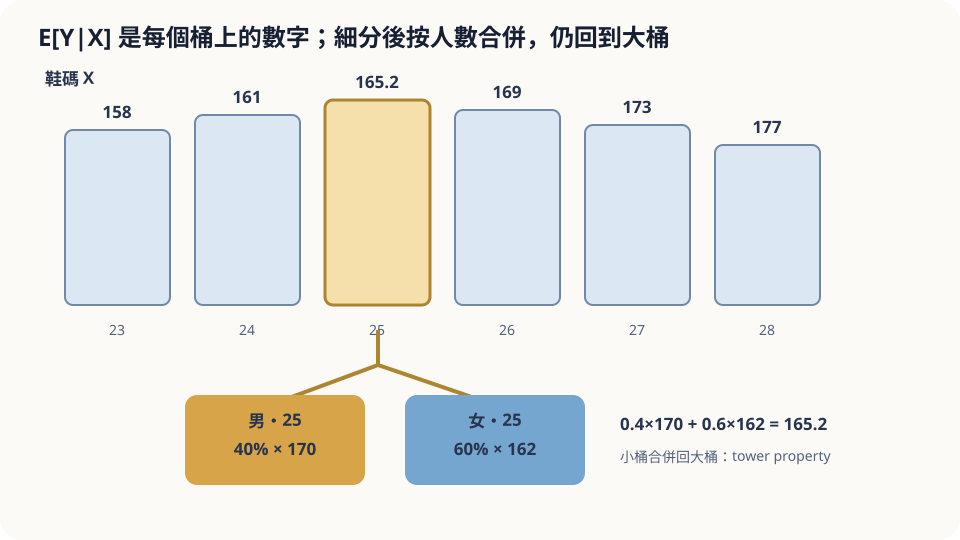

import Objectives from '../../../components/Objectives.astro';
import Prereq from '../../../components/Prereq.astro';
import Question from '../../../components/Question.astro';
import Answer from '../../../components/Answer.astro';
import QuizBlock from '../../../components/QuizBlock.astro';
import Option from '../../../components/Option.astro';
import Explanation from '../../../components/Explanation.astro';
import Details from '../../../components/Details.astro';
import Bridge from '../../../components/Bridge.astro';
import UsedBy from '../../../components/UsedBy.astro';
import Ref from '../../../components/Ref.astro';

# 從鞋子猜身高：Conditional Expectation

<Objectives>
- **說出 $\mathbb E[Y\mid X=x]$ 是「把 $X=x$ 的人分成一桶再取平均」。** 區分 $\mathbb E[Y\mid X=x]$（一個數）與 $\mathbb E[Y\mid X]$（$X$ 的函數、一個隨機變數）。
- **寫出 tower property $\mathbb E\big[\mathbb E[Y\mid X,G]\,\big|\,X\big]=\mathbb E[Y\mid X]$，用「細桶合併回粗桶」解釋它。** 給出四行證明。
- **對「多知道一個條件就會猜得更好」這個說法，判斷它在什麼意義下對、從資料估計時的代價是什麼。** 用模擬驗證桶太細時會發生的事。
</Objectives>

<Prereq items={frontmatter.prereqs} />

## 只看鞋子

朋友傳來一張照片，只拍到一雙鞋。你查到那是 25 公分的尺寸，然後被要求猜鞋主的身高。

問題一：**你會猜幾公分？依據是什麼？**

問題二：朋友補了一句「是男生」。**你的猜測往哪邊動、動多少？** 如果補的是「是女生」呢？

請寫下兩題的答案與確定程度。多數人第一題會說「大概 165」，第二題會說「男生就往上調到 170 左右、女生往下調」。這些直覺大致對。但有一件事直覺通常說不出來：**「男生的猜測」與「女生的猜測」和「不知道性別時的猜測」之間，有一個精確的關係**，而且這個關係決定了「多一個條件」到底是幫了什麼。這一篇把「用已知條件去猜」寫成一個數學物件，然後回來看這個關係。

<Question id="Q1">
把情境翻成數學：這裡的隨機變數有哪些？「猜身高」在數學上是在算什麼？「再知道性別」改變了哪個物件？

<Answer>
最直覺的說法是「身高是隨機變數」，然後就卡住。要多說三件事。

**隨機的來源是「這個人是誰」。** 想像鞋主是從某個母體（例如台灣的成年人）裡隨機抽出來的一個人。抽到誰決定了三個數：身高 $Y$、鞋碼 $X$、性別 $G$。它們是**同一次抽樣**產生的三個隨機變數，彼此有關——鞋子大的人通常比較高。

**「猜」是在算一個平均。** 「知道 $X=25$，猜 $Y$」最自然的做法：把母體裡所有鞋碼 25 的人找出來，算他們的平均身高。這個數記成 $\mathbb E[Y\mid X=25]$。它不是「一定對」的預測（同一個鞋碼的人身高有一整個範圍），而是那一桶人的中心。

**「再知道性別」是換了一個更細的桶。** 「鞋碼 25 且男性」是一桶，「鞋碼 25 且女性」是另一桶，各有自己的平均：$\mathbb E[Y\mid X=25,G=\text{男}]$ 與 $\mathbb E[Y\mid X=25,G=\text{女}]$。原本那一桶，正好是這兩桶倒在一起。翻譯到這裡，問題二就變得精確：**兩個細桶的平均與粗桶的平均是什麼關係？** 這是 conditional expectation 的核心性質。
</Answer>
</Question>

## 分桶、取平均、再合併

把一整個班的人按鞋碼排隊：23 的一桶、24 的一桶、25 的一桶……每桶算一個平均身高，寫在桶上。「知道鞋碼猜身高」就是**看鞋碼、讀桶上的數字**。所以這個猜測不是一個數，是**一張表**：每個鞋碼對應一個數。

現在把每一桶再依性別分成兩小桶，各算平均。三件事會發生：（一）男生小桶的數字通常比原桶高、女生小桶通常比原桶低；（二）把兩個小桶倒回去，總平均**一定**等於原桶的數字——因為那本來就是同一群人；（三）小桶裡的人彼此更像，每桶內的身高散得比較開的程度變小了。

第（二）點是這一篇的主角。它說「多一個條件」不會系統性地把猜測往某邊推——推上去的和推下去的，按人數加權後剛好抵消。



*圖：條件期望是每個桶上的平均；tower property 把細桶合併回粗桶。*

## 把桶寫成數學

**定義。** $X$、$Y$ 是同一次抽樣得到的隨機變數。對 $X$ 的每個可能值 $x$，

$$
m(x)=\mathbb E[Y\mid X=x]=\sum_y y\,P(Y=y\mid X=x)\quad\Big(\text{連續時 }\int y\,p(y\mid x)\,dy\Big)
$$

是「$X=x$ 那一桶的 $Y$ 平均」——一個**數**。把 $x$ 換成隨機變數 $X$ 本身，$\mathbb E[Y\mid X]:=m(X)$ 就是「看到 $X$ 之後讀出來的桶上數字」——它是 $X$ 的**函數**，因此自己也是一個**隨機變數**（抽到誰、鞋碼就不同、讀到的數字就不同）。這是初學最容易混的一點：$\mathbb E[Y\mid X=25]$ 是 165.2 這種數，$\mathbb E[Y\mid X]$ 是整張表。

**四個性質。**
1. **總平均**：$\mathbb E\big[\mathbb E[Y\mid X]\big]=\mathbb E[Y]$——所有桶的數字按人數加權平均，就是全班平均。
2. **Tower property**（迭代條件）：對任何額外的資訊 $G$，
$$
\mathbb E\big[\,\mathbb E[Y\mid X,G]\;\big|\;X\,\big]=\mathbb E[Y\mid X].
$$
細桶（$X,G$ 都知道）的數字，在只知道 $X$ 的情況下取平均，就回到粗桶。性質 1 是它在「$X$ 什麼都不告訴你」時的特例。
3. **提出已知的東西**：$\mathbb E[h(X)\,Y\mid X]=h(X)\,\mathbb E[Y\mid X]$——在桶裡 $X$ 是常數，$h(X)$ 可以直接提出來。
4. **獨立**：若 $X$ 與 $Y$ 獨立，$\mathbb E[Y\mid X]=\mathbb E[Y]$——每桶的數字都一樣，分桶白做。

<Details summary="Tower property 的證明（離散，四行）">
固定 $X=x$。左邊是「先算細桶數字 $\mathbb E[Y\mid X=x,G=g]$，再對 $g$ 按 $P(G=g\mid X=x)$ 加權」：

$$
\sum_g P(g\mid x)\sum_y y\,P(y\mid x,g)=\sum_y y\sum_g P(y,g\mid x)=\sum_y y\,P(y\mid x)=\mathbb E[Y\mid X=x].
$$

中間那一步用了 $P(g\mid x)P(y\mid x,g)=P(y,g\mid x)$（條件機率的乘法），以及「對 $g$ 加總把 $g$ 邊際掉」。連續情形把和換成積分，一字不改。
</Details>

## 兩個直覺，一個關係

**問題一。** 「猜 165」就是讀 $\mathbb E[Y\mid X=25]$。它是對的做法——不過「對」在這裡有一個很具體的意思：它是那一桶的中心，同桶的人身高散在它兩側。為什麼「中心」是好猜測、以及在哪種意義下最好，是 <Ref to="math-mse-conditional-expectation"/> 的事；這裡只確認它是有定義、可以算的量。

**問題二。** 「男生往上調到 170、女生往下調到 162」對應 $\mathbb E[Y\mid X=25,G]$ 的兩個值。tower property 給了直覺說不出的那件事：**$0.4\times170+0.6\times162=165.2$**，兩個細桶按性別比例加權回來，必須等於粗桶。所以「多一個條件」不是「往某邊修正」，而是把一個猜測**拆成**幾個猜測——拆得對不對，可以用加權平均是否回到原值來檢查。也因此，如果有人告訴你「鞋碼 25 的男生平均 170、女生平均 168、整體 165」，你可以立刻判斷這組數字**不可能同時成立**。

**多一個條件到底幫了什麼？** 不是改變平均，而是**縮小每桶內的散佈**：細桶裡的人彼此更像，猜錯的幅度變小。這件事下一篇會寫成一條精確的等式。

**這一切依賴什麼。** 第一，$\mathbb E[Y\mid X]$ 是對**母體的聯合分佈**定義的。鞋主如果不是從你腦中那個母體抽出來的（例如照片來自籃球隊聚會），表就用錯了——不是數學錯，是母體錯。第二，實務上這張表是**從資料估**出來的：每桶的平均由桶內的樣本算。桶分得越細，每桶樣本越少，桶上的數字越不穩。條件多到一定程度，「理論上更準」會被「估計上更抖」吃掉。

## 用一個合成母體跑一次

```python
import numpy as np
rng = np.random.default_rng(1)
def population(n):                                   # 合成母體：性別 → 鞋碼 → 身高
    g = rng.random(n) < 0.5                          # True = 男
    shoe = np.where(g, rng.normal(26.5, 1.0, n), rng.normal(23.5, 1.0, n))
    height = np.where(g, 176 + 4*(shoe-26.5), 158 + 4*(shoe-23.5)) + rng.normal(0, 5, n)
    return g, shoe, height
for n in (200_000, 60):                              # 大母體 vs 只有 60 筆資料
    g, shoe, h = population(n)
    b = np.abs(shoe - 25) < 0.25                     # 鞋碼 25 那一桶
    pm = g[b].mean()                                 # 桶內男生比例
    EY, EYm, EYf = h[b].mean(), h[b & g].mean(), h[b & ~g].mean()
    print(f"n={n:>6}: 桶內 {b.sum()} 人  E[Y|25]={EY:.1f}  男={EYm:.1f} 女={EYf:.1f}  "
          f"加權回來={pm*EYm+(1-pm)*EYf:.1f}  桶內標準差 {h[b].std():.1f} → 男 {h[b&g].std():.1f} 女 {h[b&~g].std():.1f}")
```

大母體那一行：三個平均按比例加權後與 $\mathbb E[Y\mid 25]$ **完全相同**（這是恆等式，不是近似），而桶內標準差從約 5.8 掉到約 5（男生桶平均約 170、女生桶約 164，兩桶各自散佈 5，混在一起多出「桶間差距」那一份）——多知道性別讓散佈變小、平均不變。$n=60$ 那一行：鞋碼 25 的桶裡可能只有幾個人，分性別後有的小桶只剩一兩個、甚至是空的，桶上的數字跳來跳去——這就是「條件太細、樣本太少」。

<iframe loading="lazy" src="/personal_website/notes/research_areas/mathematical-foundations/m1-probability/m1-1-2.html" class="demo-frame" title="條件期望：拖桶寬、細分性別與縮小樣本" style="height: 820px; width: 100%; border: none;"></iframe>

## 檢查理解

<QuizBlock id="m1-1-a">
$\mathbb E[Y\mid X]$ 與 $\mathbb E[Y\mid X=25]$ 的差別是：
<Option>沒有差別，只是寫法不同。</Option>
<Option correct>前者是 $X$ 的函數（一整張表，也是隨機變數），後者是表上 $X=25$ 那一格的數。</Option>
<Option>前者是平均，後者是條件機率。</Option>
<Explanation>
$\mathbb E[Y\mid X=x]=m(x)$ 對每個 $x$ 給一個數；$\mathbb E[Y\mid X]=m(X)$ 把隨機的 $X$ 代進去，所以它跟著抽樣變動、是隨機變數。兩者都是平均（不是機率）——只是一個是固定桶的平均，一個是「看到哪桶就讀哪桶」。
</Explanation>
</QuizBlock>

<QuizBlock id="m1-1-b">
一家外送平台想預測每筆訂單的送達時間。它先按「距離」分桶算平均，再細分成「距離 × 是否下雨」。下列哪個敘述正確？
<Option correct>細分後，「下雨」桶的平均會比原桶高、「沒下雨」桶會比原桶低，兩者按下雨的比例加權回來等於原桶平均。</Option>
<Option>細分後兩個小桶的平均都會比原桶更準確地高。</Option>
<Option>細分後原桶的平均會改變，因為資訊變多了。</Option>
<Explanation>
這是 tower property：$\mathbb E[\mathbb E[T\mid D,R]\mid D]=\mathbb E[T\mid D]$。兩個小桶不可能同時高於原桶（那樣加權平均就超過原桶了）。原桶的平均是同一群訂單的平均，資訊變多是多了「拆法」，不會改動它。改變的是每桶內的散佈——那才是「更準」的意思。
</Explanation>
</QuizBlock>

<QuizBlock id="m1-1-c">
你手上只有 80 筆「鞋碼、身高、性別、年齡、居住縣市」的資料。想用所有五個欄位當條件來猜身高。最可能發生的事是：
<Option>條件越多、理論上的散佈越小，所以猜測一定越準。</Option>
<Option correct>多數條件組合在 80 筆裡只有零或一筆樣本，桶上的平均幾乎就是那一筆的身高，估出來的表極不穩定。</Option>
<Option>tower property 不成立，因為條件太多。</Option>
<Explanation>
tower property 是母體分佈的恆等式，跟樣本數無關、永遠成立。「理論上散佈更小」也對——對母體而言。問題出在**估計**：桶越細、每桶樣本越少，桶上的數字是用一兩個人算出來的，抖動遠大於它理論上省下的散佈。這是條件式猜測在實務上的核心折衷。
</Explanation>
</QuizBlock>

<UsedBy slug={frontmatter.slug} />

<Bridge to="math-mse-conditional-expectation">
本篇把「用已知條件猜」寫成 $\mathbb E[Y\mid X]$——分桶取平均的那張表——並用 tower property 說明多一個條件不會移動平均，只會縮小每桶的散佈；從資料估表時，桶太細是代價。還沒回答的是：為什麼「桶的平均」是好猜測？接著換一個情境問同一件事——天氣預報每天報一個數字，什麼策略讓長期的誤差最小？
</Bridge>

## 參考文獻

1. Grimmett, G., Stirzaker, D. *Probability and Random Processes*, 3rd ed. Oxford University Press 2001.（conditional expectation 的定義與性質。）
2. Williams, D. [*Probability with Martingales.*](https://doi.org/10.1017/CBO9780511813658) Cambridge University Press 1991, Ch. 9.（把 $\mathbb E[Y\mid X]$ 當成隨機變數、tower property 的一般形式。）
3. Blitzstein, J. K., Hwang, J. [*Introduction to Probability*, 2nd ed.](https://probabilitybook.net) CRC Press 2019, Ch. 9.（Adam's law／tower property 與大量生活化例題。）
