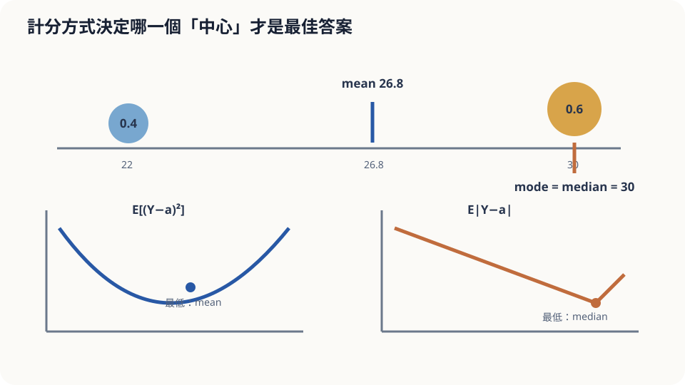

import Objectives from '../../../components/Objectives.astro';
import Prereq from '../../../components/Prereq.astro';
import Question from '../../../components/Question.astro';
import Answer from '../../../components/Answer.astro';
import QuizBlock from '../../../components/QuizBlock.astro';
import Option from '../../../components/Option.astro';
import Explanation from '../../../components/Explanation.astro';
import Details from '../../../components/Details.astro';
import Bridge from '../../../components/Bridge.astro';
import UsedBy from '../../../components/UsedBy.astro';
import Ref from '../../../components/Ref.astro';

# 天氣預報該報幾度：MSE 的最小值是 Conditional Expectation

<Objectives>
- **寫出「用 $X$ 猜 $Y$、以平方誤差計分」的最佳策略是 $\mathbb E[Y\mid X]$。** 給出三行證明；說出剩下的誤差是什麼。
- **說出換一種計分方式，最佳答案就會跟著換。** 解釋絕對誤差為什麼選中位數、不對稱懲罰為什麼選 quantile。
- **對「報最可能發生的溫度」這個直覺策略，判斷它在哪種計分下輸、輸多少、依賴什麼假設。** 用模擬在一個雙峰的例子上驗證。
</Objectives>

<Prereq items={frontmatter.prereqs} />

## 一天只能報一個數字

你是氣象主播。每天早上，根據手上的資料，你必須報**一個**明天的最高溫。年底，電視台把你每天的預報減掉實際溫度、平方、加起來算平均——這個數字越小，年終獎金越高。

今天的資料顯示明天是一個不好報的日子：有 60% 的機率冷鋒不會到，最高溫 30 °C；40% 的機率冷鋒到了，最高溫 22 °C。中間的溫度幾乎不可能發生。

**你報幾度？**

報 30 是選最可能發生的情況；報中間則是在兩種可能之間折衷。但電視台扣分看的是距離平方，不只是有沒有猜中。**要怎麼從這個扣分方式，決定最佳預報？**

上一篇給了條件平均這個物件。現在我們檢查它是否真的讓平方誤差最小，而不是只因為「取平均很自然」就選它。

<Question id="Q1">
把情境翻成數學：隨機變數是什麼？「策略」是什麼樣的數學物件？「長期平均的平方誤差」怎麼寫？我們在對什麼東西求最小？

<Answer>
最直覺的做法是直接寫 $(Y-a)^2$，但這樣就停了，漏掉了「策略」這一層。

**兩個隨機變數**：明天的實際最高溫 $Y$，以及你早上看到的資料 $X$（衛星圖、模式輸出、今天的溫度……全部打包）。它們有關——資料好的時候能把 $Y$ 的範圍縮小。

**策略是一個函數** $g$：看到資料 $x$，報出 $g(x)$。不是一個數，是「每種資料狀況該報什麼」的一整張表——和 <Ref to="math-conditional-expectation"/> 裡「每個鞋碼一格」的表是同一種物件。

**計分**：長期平均的平方誤差是

$$
\mathrm{MSE}(g)=\mathbb E\big[(Y-g(X))^2\big],
$$

期望對「日子」取——每天抽一組 $(X,Y)$。我們在**所有函數 $g$** 裡找讓它最小的那個。這聽起來很大（函數空間），但下一節會看到只要三行就能解掉，答案正好是上一篇的那張表。
</Answer>
</Question>

## 蹺蹺板的支點

在一根木尺上放砝碼：60% 的重量放在 30 的位置、40% 放在 22 的位置。問：支點放哪裡，木尺會平衡？答案是**重心** $0.6\times30+0.4\times22=26.8$——一個沒有砝碼的位置。

平方誤差在做的事和重心一樣：它問「哪一個點到所有砝碼的**距離平方**加權總和最小」，答案就是重心，而重心不需要落在任何砝碼上。「最可能發生的溫度」是**最重的那顆砝碼**，兩者是不同的問題。

如果改問「到所有砝碼的**距離**（不平方）加權總和最小」，答案就變了：那是中位數——把砝碼的重量從兩端往中間數，數到一半的位置。這裡就是 30。



*圖：平方誤差選 mean，絕對誤差選 median，最大機率選 mode。*

## 為什麼最小值一定落在條件期望

假設 $\mathbb E[Y^2]<\infty$，比較平方誤差有限的策略。記 $m(X)=\mathbb E[Y\mid X]$。先加上再減掉 $m(X)$：$Y-g(X)=(Y-m(X))+(m(X)-g(X))$。前者是桶內不可預測的偏差，後者是策略離桶內平均有多遠。展開平方再取期望：

$$
\mathbb E\big[(Y-g(X))^2\big]
=\mathbb E\big[(Y-m(X))^2\big]+\mathbb E\big[(m(X)-g(X))^2\big]+2\,\mathbb E\big[(Y-m(X))(m(X)-g(X))\big].
$$

交叉項是零：先對 $X$ 條件，$m(X)-g(X)$ 在桶內是常數可以提出（<Ref to="math-conditional-expectation"/> 的性質 3），剩下 $\mathbb E[Y-m(X)\mid X]=m(X)-m(X)=0$。於是

$$
\mathrm{MSE}(g)=\underbrace{\mathbb E\big[(Y-m(X))^2\big]}_{\text{與 }g\text{ 無關}}+\underbrace{\mathbb E\big[(m(X)-g(X))^2\big]}_{\ge0,\ g=m\text{ 時為 }0}.
$$

第二項非負，因此 **$g^*(X)=\mathbb E[Y\mid X]$ 讓 MSE 最小**；達到相同最小值的策略，必須幾乎處處等於它。資料根本不會出現的位置上，$g$ 如何取值不影響這個期望。第一項是 $\mathbb E[\mathrm{Var}(Y\mid X)]$，而額外資訊不會增加這個平均的理想誤差。

<Details summary="換成絕對誤差為什麼是中位數；不對稱懲罰為什麼是 quantile">
固定一個桶，考慮 $\mathbb E|Y-a|$。a 向右移時，左邊的距離增加、右邊的減少；若 a 沒有機率質量，導數是 $P(Y<a)-P(Y>a)$。若 a 有 atom，loss 可能不可微，最佳條件改為 $P(Y<a)\le1/2\le P(Y\le a)$，也就是 median。例子中，22 與 30 之間的斜率為 $0.4-0.6<0$，跨過 30 後則為正，所以最佳為 30。

若低估一單位罰 $c_u$、高估一單位罰 $c_o$，loss 是 $c_u(Y-a)_++c_o(a-Y)_+$。沒有 atom 且可以微分時，最佳點滿足 $c_oP(Y<a)=c_uP(Y>a)$，也就是 $\frac{c_u}{c_u+c_o}$ quantile。若在 $a$ 有機率質量，改用 $P(Y<a)\le\tau\le P(Y\le a)$ 判斷，$\tau=c_u/(c_u+c_o)$。對稱的**絕對誤差**選 median；平方誤差是另一種 loss，不是這個分段線性 loss 的特例。
</Details>

## 報 26.8，還是報 30？

**平方誤差計分。** 這一天 $X$ 已知，桶內分佈是「30 佔 60%、22 佔 40%」，$\mathbb E[Y\mid X]=26.8$。三種做法的期望平方誤差：

| 報 | 期望平方誤差 |
|---|---|
| 30（最可能） | $0.4\times8^2=25.6$ |
| 26.8（桶內平均） | $0.6\times3.2^2+0.4\times4.8^2=15.36$ |
| 22 | $0.6\times8^2=38.4$ |

報 26.8 比報 30 少了四成的誤差。它「幾乎不會發生」這件事**與平方誤差無關**——平方誤差只在乎距離，而 26.8 離兩個可能都不遠；報 30 賭對時零誤差，賭錯時 8 度的平方是 64，40% 的機率就夠拖垮它。直覺「報最可能的」錯在一個隱含假設：**它以為計分只看「有沒有猜中」**，那是 0–1 式的計分，不是平方誤差。

**絕對誤差計分。** 同一天，$\mathbb E|Y-a|$：報 30 是 $0.4\times8=3.2$，報 26.8 是 $0.6\times3.2+0.4\times4.8=3.84$。這次 30 贏。所以直覺沒有錯——**它是絕對誤差（或更接近「猜中與否」）下的正確答案。** 兩種計分給不同答案，數學告訴你的是「哪種計分對應哪個中心」，選哪種計分是電視台的事。

**這個結論依賴什麼。** 第一，桶內分佈（60/40、30/22）要對——它來自你的資料與模式，錯了兩個答案都錯。第二，$Y$ 的 variance 要有限；碰到極端厚尾的量（偶爾出現離譜的值），mean 會被那幾天拖著跑，平方誤差的最佳策略本身變得不穩，中位數反而穩。第三，證明用到 $g$ 可以是**任何**函數——實務上你用一個模型逼近 $m$，逼不到的部分就是第二項，不為零。

## 模擬三千天

```python
import numpy as np
rng = np.random.default_rng(2); days = 3000
Y = np.where(rng.random(days) < 0.6, 30.0, 22.0)          # 60% 是 30 度、40% 是 22 度
grid = np.linspace(20, 32, 241)
mse = [((Y - a)**2).mean() for a in grid]; mae = [np.abs(Y - a).mean() for a in grid]
print(f"MSE 最佳預報 {grid[np.argmin(mse)]:.1f}（理論 26.8）  MAE 最佳預報 {grid[np.argmin(mae)]:.1f}（理論 30）")
print(f"報 30 的 MSE {((Y-30)**2).mean():.1f}，報 26.8 的 MSE {((Y-26.8)**2).mean():.1f}")
# 違反假設：把每天的溫度換成極厚尾的分佈（偶爾出現離譜值），看 mean 還穩不穩
Z = 26 + 2*rng.standard_t(df=1, size=days)                 # Cauchy 尾巴：variance 不存在
for k in (100, 1000, 3000):
    print(f"前 {k} 天：mean {Z[:k].mean():8.2f}   median {np.median(Z[:k]):6.2f}")
```

前兩行可和表格比較；有限次模擬的最佳值可能略有偏移。最後使用 Cauchy 分布，刻意違反前提：它的 mean 與 variance 都不存在，所以不能再套用上述有限 MSE 的分解。Sample median 仍可估計分布中心，但不能把這個現象說成「MSE 最佳仍是 mean，只是不好估」。

<iframe loading="lazy" src="/personal_website/notes/research_areas/mathematical-foundations/m1-probability/m1-2-2.html" class="demo-frame" title="拖動預報值：MSE、MAE 與 quantile loss 的最低點" style="height: 800px; width: 100%; border: none;"></iframe>

## 檢查理解

<QuizBlock id="m1-2-a">
一家快遞公司要對每個包裹報一個「預計送達時間」，客戶的不滿意程度與「實際減預計」的**平方**成正比。給定包裹的資訊 $X$，最佳的報法是：
<Option>報送達時間的中位數 $\mathrm{median}(T\mid X)$。</Option>
<Option correct>報條件平均 $\mathbb E[T\mid X]$。</Option>
<Option>報最可能的送達時間 $\arg\max_t p(t\mid X)$。</Option>
<Explanation>
計分是平方誤差，三行證明說最佳是 $\mathbb E[T\mid X]$。中位數是絕對誤差的答案；「最可能」是 0–1 式計分（有沒有猜中）的答案。如果公司真正在意的是「客戶等太久」比「早到」嚴重，那就該換成不對稱懲罰，答案變成一個偏晚的 quantile。
</Explanation>
</QuizBlock>

<QuizBlock id="m1-2-b">
承上例，若改用絕對誤差，且這個條件分布的 median 比 mean 早，最佳報法會怎麼變？
<Option>不變，仍是條件平均。</Option>
<Option>變成報最可能的時間。</Option>
<Option correct>變成條件中位數，它會比條件平均**早**，因為右偏的長尾把平均往後拉、但對中位數影響小。</Option>
<Explanation>
絕對誤差選 conditional median；依照題目給定的 mean、median 關係，最佳預報往前移。常見的右尾延誤模型有這個現象，但「右偏」一個描述本身不足以推出所有分布的 mean、median、mode 排序。
</Explanation>
</QuizBlock>

<QuizBlock id="m1-2-c">
三行證明裡「交叉項為零」這一步用到了什麼？
<Option>$Y$ 是 Gaussian。</Option>
<Option>$g$ 是線性函數。</Option>
<Option correct>對 $X$ 取條件後 $m(X)-g(X)$ 是常數可以提出，而 $\mathbb E[Y-m(X)\mid X]=0$。</Option>
<Explanation>
證明對 $Y$ 的分佈沒有任何要求（只要 variance 有限），也不要求 $g$ 有任何形式——這正是它強的地方：在**所有**函數裡 $\mathbb E[Y\mid X]$ 都是最佳。用到的只是 conditional expectation 的兩個性質：提出已知的東西，以及 $m(X)$ 就是 $Y$ 的條件平均。
</Explanation>
</QuizBlock>

<UsedBy slug={frontmatter.slug} />

<Bridge to="math-bayes-posterior">
現在我們知道平方誤差為什麼選 conditional mean，也知道最佳預測要跟著 loss 改變。接下來還缺的是平均的權重：看到一個觀測結果後，每種可能的真相該占多少比例？下一篇用 Bayes 把這些 posterior weights 算出來。
</Bridge>

## 參考文獻

1. Grimmett, G., Stirzaker, D. *Probability and Random Processes*, 3rd ed. Oxford University Press 2001.（conditional expectation 作為最佳平方誤差預測、法則與例題。）
2. Bishop, C. M. [*Pattern Recognition and Machine Learning.*](https://www.microsoft.com/en-us/research/publication/pattern-recognition-machine-learning/) Springer 2006, Ch. 1.5.5.（平方損失的最小值是 conditional mean；Minkowski loss 一族與中位數。）
3. Gneiting, T. [*Making and Evaluating Point Forecasts.*](https://doi.org/10.1198/jasa.2011.r10138) JASA 2011.（哪種計分函數對應哪個統計量——mean、median、quantile——的系統整理。）
