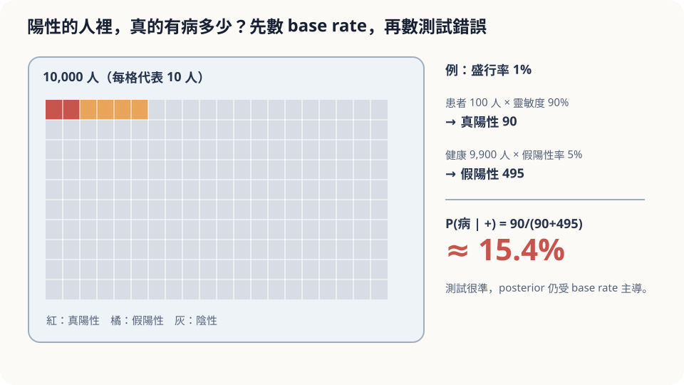

import Objectives from '../../../components/Objectives.astro';
import Prereq from '../../../components/Prereq.astro';
import Question from '../../../components/Question.astro';
import Answer from '../../../components/Answer.astro';
import QuizBlock from '../../../components/QuizBlock.astro';
import Option from '../../../components/Option.astro';
import Explanation from '../../../components/Explanation.astro';
import Details from '../../../components/Details.astro';
import Try from '../../../components/Try.astro';
import Bridge from '../../../components/Bridge.astro';
import UsedBy from '../../../components/UsedBy.astro';
import Ref from '../../../components/Ref.astro';

# 快篩陽性：Bayes 與 Posterior

<Objectives>
- **寫出 Bayes 定理的三個成分——prior、likelihood、posterior。** 用「一萬個人」的數法把快篩陽性後的機率真的算出來。
- **說出 posterior 為什麼是「加權平均的權重」：對所有可能的真相取 conditional expectation 時，用的就是它。** 在 prior 與 likelihood 都是 Gaussian 的情形下配方算出 posterior，看到那組權重就是兩邊的精確度。
- **對「準確率 95% 所以陽性就是 95% 有病」這個直覺，說出它漏掉哪個假設、在什麼情況下反而接近正確。** 用模擬驗證，包括重複檢測的錯誤不獨立時結論如何改變。
</Objectives>

<Prereq items={frontmatter.prereqs} />

## 一條線

某種疾病在一般人口的盛行率是 1%。有一種快篩：有病的人 95% 會驗出陽性（sensitivity），沒病的人 95% 會驗出陰性（specificity）。你在一次全民篩檢裡被抽到，結果：**陽性**。

**你真的有病的機率是多少？**

寫下你的數字與確定程度。在課堂上、甚至在醫學生的調查裡，最常見的答案是「95%」或「差不多九成」。

正確答案大約是 **16%**。不是 95%，也不是 50%——差了一個數量級。這不是腦筋急轉彎，也不是題目有陷阱；它是「有一個數字太小而被忽略」的典型例子。這一篇要把「忽略了什麼」變成一條可以檢查的式子，然後回來看：直覺什麼時候會接近對。

<Question id="Q1">
把情境翻成數學：隨機變數是什麼？「95% 準確」是哪個條件機率？「真的有病的機率」又是哪個？兩者為什麼不一樣？

<Answer>
最直覺的反應會把所有 95% 混在一起。先把物件分開。

**兩個隨機變數**：$D\in\{\text{有病},\text{沒病}\}$ 是你的真實狀態，$T\in\{+,-\}$ 是快篩結果。

**題目給的三個數**都是條件機率或邊際機率：
- 盛行率 $P(D=\text{有病})=0.01$——在看到任何檢測之前，隨機一個人有病的機率。
- Sensitivity $P(T=+\mid D=\text{有病})=0.95$——**已知有病**，驗出陽性的機率。
- Specificity $P(T=-\mid D=\text{沒病})=0.95$，等價地 $P(T=+\mid D=\text{沒病})=0.05$。

**我們想知道的是** $P(D=\text{有病}\mid T=+)$——**已知陽性**，有病的機率。

看清楚就會發現直覺的錯在哪：它把 $P(T=+\mid D)$ 當成了 $P(D\mid T=+)$。這兩個條件機率**方向相反**：一個是「有病的人裡多少陽性」，一個是「陽性的人裡多少有病」。它們的分母不同——前者的分母是有病的人（很少），後者的分母是陽性的人（包含大量沒病卻誤判的人）。把方向反過來需要一個工具，那就是 Bayes 定理；而工具會告訴你，反過來時盛行率這個 1% 會進來，而且是主角。
</Answer>
</Question>

## 一萬個人排成一排

暫時不用式子，直接數人。

一萬個人來篩檢。盛行率 1%：**100 個有病、9,900 個沒病。**

有病的 100 人裡，95% 陽性：**95 個真陽性**。沒病的 9,900 人裡，5% 誤判陽性：**495 個假陽性**。

拿到陽性的一共 $95+495=590$ 人。你是其中一個。其中真的有病的比例是

$$
\frac{95}{590}\approx16\%.
$$

畫面是這樣的：陽性那一排 590 人裡，有病的只佔一小段。原因不是檢測差——5% 的誤判率不高——而是**沒病的人太多**，5% 乘上 9,900 仍然是 495 人，把 95 個真陽性淹掉了。「準確率 95%」這句話讓你盯著檢測，忘了排隊的人裡有病的本來就只有 1%。



*圖：posterior 不能只看測試準確度；低盛行率會產生大量假陽性。*

## 把數人寫成式子

上面那段數人的過程，每一步都是一個機率的乘法或加法。寫成一般形式：

$$
P(D\mid T)=\frac{P(T\mid D)\,P(D)}{P(T)},\qquad P(T)=\sum_{d}P(T\mid D=d)\,P(D=d).
$$

這是 **Bayes 定理**。三個角色各有名字：
- $P(D)$ 是 **prior**——看到檢測之前你對真相的相信程度（盛行率 1%）。
- $P(T\mid D)$ 是 **likelihood**——**假設**某個真相成立，觀測到這個結果有多容易（有病時 0.95、沒病時 0.05）。
- $P(D\mid T)$ 是 **posterior**——看到結果之後，更新過的相信程度。

分母 $P(T)$ 是**邊際**機率：把「每種真相下出現這個結果的機率」按 prior 加權加起來，也就是 590/10,000。它的角色只是把分子正規化成加起來為 1；很多時候寫成「$\text{posterior}\propto\text{likelihood}\times\text{prior}$」就夠了。

代數字：$P(\text{有病}\mid+)=\dfrac{0.95\times0.01}{0.95\times0.01+0.05\times0.99}=\dfrac{0.0095}{0.0590}\approx0.161$。

<Details summary="odds 形式：為什麼「證據」是相乘的">
把 posterior 寫成有病對沒病的**比值**（odds），分母 $P(T)$ 直接消掉：

$$
\frac{P(\text{有病}\mid+)}{P(\text{沒病}\mid+)}=\frac{P(+\mid\text{有病})}{P(+\mid\text{沒病})}\times\frac{P(\text{有病})}{P(\text{沒病})}
=\frac{0.95}{0.05}\times\frac{1}{99}=\frac{19}{99}.
$$

odds $19:99$ 換回機率是 $19/118\approx0.161$。第一個因子 $19$ 叫 **likelihood ratio**：一次陽性把「有病」的 odds 放大 19 倍。prior odds 只有 $1:99$，放大 19 倍後仍不到 $1:5$——這就是「一個數量級」的來源。若再做一次**獨立**的檢測又陽性，再乘 19：odds $361:99$，機率 $\approx0.785$。
</Details>

**Posterior 是權重。** Bayes 給的不只是「有病的機率是 16%」這個數。它給的是**對每一種可能真相的一組權重** $\{P(D=d\mid T=+)\}_d=\{0.161,\,0.839\}$，而任何「在看到結果之後對真相取平均」的動作，都用這組權重。例如「不治療的期望損失」是 $\sum_d(\text{損失}_d)\,P(D=d\mid+)$；<Ref to="math-conditional-expectation"/> 的 $\mathbb E[Y\mid X=x]=\sum_y y\,P(Y=y\mid X=x)$ 裡那個 $P(Y=y\mid X=x)$，當 $Y$ 是「看不見的真相」、$X$ 是「看得見的觀測」時，**就是 posterior**。連續的版本一字不改：$p(x\mid y)=p(y\mid x)p(x)/p(y)$，$p(y)=\int p(y\mid x)p(x)\,dx$，而 $\mathbb E[X\mid Y=y]=\int x\,p(x\mid y)\,dx$ 是用 posterior 當權重的加權平均。這是下一篇的地基。

## 如果真相不是「有病／沒病」，而是一個數？

快篩只有兩種真相，所以 posterior 就是兩個數字。但很多時候真相是一個**連續的量**——今天早上的真實體重、一張還沒被雜訊蓋住的原圖。這時最常用到的一組假設，是 prior 和 likelihood 都取 Gaussian：

$$
p(x)=\mathcal N\big(x;\ \mu_0,\ \sigma_0^2\big),\qquad
p(y\mid x)=\mathcal N\big(y;\ a x,\ \sigma^2\big).
$$

讀法是：「真相 $x$ 大概在 $\mu_0$ 附近，不確定性是 $\sigma_0$」，而「觀測 $y$ 是 $x$ 放大 $a$ 倍再加一點雜訊」。分母 $p(y)$ 不含 $x$，所以配的時候它只是一個正規化常數。

<Try summary="自己配一次方：posterior 的平均與變異數會是什麼？">
把分子的兩項乘起來，只看指數上與 $x$ 有關的部分：

$$
p(x\mid y)\ \propto\ \exp\!\Big[-\frac{(y-ax)^2}{2\sigma^2}-\frac{(x-\mu_0)^2}{2\sigma_0^2}\Big].
$$

方括號裡是 $x$ 的一個二次式。按次數收好：$x^2$ 的係數是 $-\tfrac12\big(\tfrac{a^2}{\sigma^2}+\tfrac{1}{\sigma_0^2}\big)$，$x$ 的係數是 $\tfrac{a y}{\sigma^2}+\tfrac{\mu_0}{\sigma_0^2}$。把它配成完全平方（配方法），剩下的常數項不含 $x$、可再次無視，對照 Gaussian 密度就讀得出平均與變異數。

方法本身可以直接記成：**這裡乘除的是機率密度，不是隨機變數**（兩個 Gaussian 隨機變數相乘不會是 Gaussian）。而 Gaussian 的密度是「$\exp$（一個 $x$ 的二次式）」，相乘相除只是把指數上的二次式加加減減，加減完還是二次式——所以「配出來還是 Gaussian」這件事不必逐次驗算，看指數是不是 $x$ 的二次式就知道。
</Try>

配出來的 posterior 仍然是 Gaussian：

$$
p(x\mid y)=\mathcal N\big(x;\ \mu_{\text{post}},\ \sigma_{\text{post}}^2\big),\qquad
\frac{1}{\sigma_{\text{post}}^2}=\frac{a^2}{\sigma^2}+\frac{1}{\sigma_0^2},\qquad
\mu_{\text{post}}=\sigma_{\text{post}}^2\Big(\frac{a\,y}{\sigma^2}+\frac{\mu_0}{\sigma_0^2}\Big).
$$

**變異數 $\sigma_{\text{post}}^2$ 完全不含 $y$。** 看到的數字是多少，不影響剩下多少不確定性；只有兩邊各自的**精確度**（variance 的倒數 $1/\sigma^2$）決定它，而且兩個精確度是相加的——多一個觀測，不確定性一定變小。

**平均 $\mu_{\text{post}}$ 是「prior 說的」與「觀測說的」的加權平均，權重就是各自的精確度。** 把 $a=1$ 代進去看得最清楚：

$$
\mu_{\text{post}}=\frac{\sigma_0^{-2}}{\sigma^{-2}+\sigma_0^{-2}}\,\mu_0+\frac{\sigma^{-2}}{\sigma^{-2}+\sigma_0^{-2}}\,y .
$$

這正是 <Ref to="math-gaussian"/> 那兩台體重計的 **inverse-variance weighting**，只是其中一台換成了 prior：prior 越尖（$\sigma_0$ 小）就越拉向 $\mu_0$，觀測越乾淨（$\sigma$ 小）就越拉向 $y$。

## 直覺什麼時候會對

**結論。** 全民篩檢中隨機被抽到、快篩陽性，有病的機率約 16%。直覺的 95% 錯在**把 likelihood 當成 posterior**，也就是隱含假設 prior 是 50/50——只有在「一半的人有病」時，$P(D\mid+)$ 才會等於 $P(+\mid D)$ 附近。

**Prior 一變，答案就變。** 同一支快篩，換一個排隊的人群：
- 盛行率 10%（例如疫情高峰的某個社區）：$\dfrac{0.095}{0.095+0.045}\approx68\%$。
- 盛行率 30%（例如**因為有症狀**才來篩的人）：$\dfrac{0.285}{0.285+0.035}\approx89\%$。

所以「陽性就是九成有病」在**門診**裡其實不算離譜——有症狀這件事已經把 prior 推高了。直覺不是無中生有，它是在對另一個 prior 回答；錯的是把門診的經驗搬到全民篩檢上。**這個判斷依賴的假設**：prior 要用「你屬於的那群人」的盛行率；sensitivity／specificity 要適用於這群人與這種檢測方式。

**重複檢測。** odds 形式說第二次陽性再乘 19、機率到 78%——但這**假設兩次檢測的錯誤獨立**。如果第一次假陽性的原因是你體內某個持續存在的干擾物質，第二次也會因為同一個原因陽性，第二次的結果**沒有新資訊**，posterior 停在 16%。這是 Bayes 最常被誤用的地方之一：把相關的證據當成獨立的，一直乘下去。

## 模擬一百萬人

```python
import numpy as np
rng = np.random.default_rng(3); n = 1_000_000
def screen(prev, sens=0.95, spec=0.95, second=None):
    sick = rng.random(n) < prev
    pos1 = np.where(sick, rng.random(n) < sens, rng.random(n) < 1-spec)
    if second is None: return sick[pos1].mean()
    if second == "indep":                                    # 第二次的錯誤與第一次獨立
        pos2 = np.where(sick, rng.random(n) < sens, rng.random(n) < 1-spec)
    else:                                                    # 沒病者的假陽性由同一個干擾物質造成：兩次結果相同
        pos2 = np.where(sick, rng.random(n) < sens, pos1)
    both = pos1 & pos2
    return sick[both].mean()
for prev in (0.01, 0.10, 0.30):
    print(f"盛行率 {prev:.0%}: 一次陽性 → 有病 {screen(prev):.1%}")
print(f"兩次陽性（獨立）  → {screen(0.01, second='indep'):.1%}")
print(f"兩次陽性（相關）  → {screen(0.01, second='corr'):.1%}")
```

前三行印出約 16%、68%、89%，與公式一致。最後兩行是重點：獨立時兩次陽性把機率推到約 78%，相關時留在約 15%（有病的人第二次仍有 5% 機率漏掉，沒病的假陽性卻一個都沒被剔除）——第二次檢測白做。

<iframe loading="lazy" src="/personal_website/notes/research_areas/mathematical-foundations/m1-probability/m1-3-2.html" class="demo-frame" title="Bayes posterior：盛行率、準確率與再次檢測" style="height: 760px; width: 100%; border: none;"></iframe>

## 檢查理解

<QuizBlock id="m1-3-a">
一封信被垃圾郵件過濾器標成「垃圾」。過濾器對垃圾信的偵測率 99%、對正常信的誤判率 1%。你收到的信裡有 20% 是垃圾信。這封信真的是垃圾信的機率約是：
<Option>99%。</Option>
<Option correct>約 96%——$\dfrac{0.99\times0.2}{0.99\times0.2+0.01\times0.8}=\dfrac{0.198}{0.206}$。</Option>
<Option>約 20%。</Option>
<Explanation>
這是同一個結構、不同的 prior。prior 20% 不算低，加上誤判率只有 1%，假陽性 $0.008$ 對真陽性 $0.198$ 影響小，posterior 接近 likelihood。99% 是把 likelihood 當 posterior；20% 是完全沒更新、只看 prior。兩個極端都漏了一半的資訊。
</Explanation>
</QuizBlock>

<QuizBlock id="m1-3-b">
承快篩的例子（盛行率 1%）。你第一次陽性後，同一天用**同一款**快篩再測一次，又陽性。下列哪個敘述最合理？
<Option>兩次陽性，機率一定升到約 78%。</Option>
<Option>第二次陽性沒有任何意義，因為是同一款。</Option>
<Option correct>如果兩次的錯誤獨立，機率升到約 78%；如果假陽性是由持續存在的干擾造成、兩次會一起錯，第二次幾乎沒有新資訊，機率留在 16% 附近。實際介於兩者之間，取決於錯誤的相關程度。</Option>
<Explanation>
odds 相乘的推導假設 $P(T_2\mid T_1,D)=P(T_2\mid D)$——給定真實狀態，兩次結果獨立。同一款試劑、同一天、同一個人，這個假設常常只部分成立。「一定 78%」忽略了相關；「完全沒意義」又把相關當成完全的。正確的態度是：先問錯誤的來源是什麼，再決定能乘多少。
</Explanation>
</QuizBlock>

<QuizBlock id="m1-3-c">
「posterior 是加權平均的權重」這句話在說什麼？
<Option>posterior 的數值一定介於 prior 與 likelihood 之間。</Option>
<Option correct>看到觀測之後，任何對「看不見的真相」取平均的動作——期望損失、conditional expectation——都以 $P(\text{真相}\mid\text{觀測})$ 當權重。</Option>
<Option>posterior 是 prior 與 likelihood 的算術平均。</Option>
<Explanation>
posterior 是 prior 與 likelihood 的**乘積**再正規化，不是算術平均，數值也不必介於兩者之間（例如 prior 0.01、likelihood 0.95、posterior 0.16 剛好介於，但換組數字就不一定）。它真正的用處是作為 $\mathbb E[\cdot\mid\text{觀測}]$ 裡的權重——$\mathbb E[X\mid Y=y]=\int x\,p(x\mid y)\,dx$ 中的 $p(x\mid y)$。
</Explanation>
</QuizBlock>

<UsedBy slug={frontmatter.slug} />

<Bridge to="math-tweedie">
本篇把「陽性後有病的機率」算成 16%，看到直覺的 95% 是忘了 prior，並確認 posterior 是「對看不見的真相取平均」時的權重。現在手上有三件東西：最佳猜測是 conditional expectation、conditional expectation 是用 posterior 加權的平均、而微分可以穿過積分。接著把它們接在一起，處理一個看似平凡的問題——體重計讀 72.3 kg、雜訊 ±1 kg，最佳猜測真的是 72.3 嗎？
</Bridge>

## 參考文獻

1. Grimmett, G., Stirzaker, D. *Probability and Random Processes*, 3rd ed. Oxford University Press 2001.（條件機率、Bayes 定理、全機率公式。）
2. Gigerenzer, G., Hoffrage, U. [*How to Improve Bayesian Reasoning Without Instruction: Frequency Formats.*](https://doi.org/10.1037/0033-295X.102.4.684) Psychological Review 1995.（「一萬個人」的自然頻率表示為什麼比機率表示更不容易算錯；醫療篩檢的實驗。）
3. Blitzstein, J. K., Hwang, J. [*Introduction to Probability*, 2nd ed.](https://probabilitybook.net) CRC Press 2019, Ch. 2.（條件機率、Bayes 定理、odds 形式與檢測例題。）
