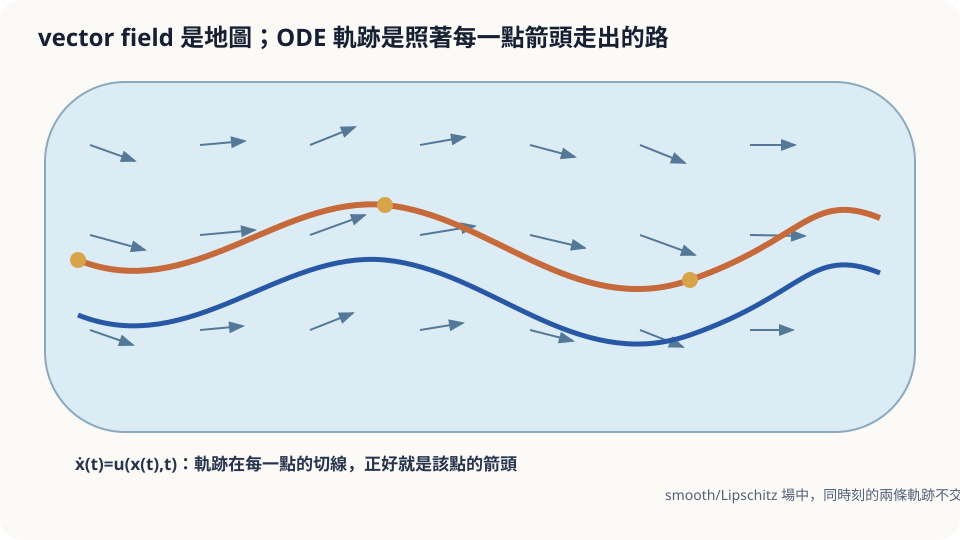

import Objectives from '../../../components/Objectives.astro';
import Prereq from '../../../components/Prereq.astro';
import Question from '../../../components/Question.astro';
import Answer from '../../../components/Answer.astro';
import QuizBlock from '../../../components/QuizBlock.astro';
import Option from '../../../components/Option.astro';
import Explanation from '../../../components/Explanation.astro';
import Details from '../../../components/Details.astro';
import Bridge from '../../../components/Bridge.astro';
import Ref from '../../../components/Ref.astro';
import UsedBy from '../../../components/UsedBy.astro';

# 河面上的箭頭：Vector Field 與 ODE

<Objectives>
- **把「每個位置一支箭頭」寫成 vector field $u(x,t)$，把「順著箭頭走」寫成 ODE $\dot x=u(x,t)$。** 說出解「存在且唯一」依賴的條件。
- **由唯一性推出「兩條軌跡不會在同一時刻交叉」。** 說出這件事在時間會變的 vector field 上要怎麼修正。
- **對「葉子放在河面上會漂到哪」這類情境，判斷「順著箭頭一步步走」這個做法何時可靠、依賴什麼假設。** 用一個小模擬驗證。
</Objectives>

<Prereq items={frontmatter.prereqs} />

## 一條河與一片葉子

你站在橋上往下看。這條河的水面不是均勻往前流的：靠岸的地方慢，中間快；過了橋墩以後水流微微往左彎，再往前又擺回來。假設你有一張完整的「水流地圖」——河面上**每一個位置**都標好了此刻水往哪個方向流、流多快。

現在你把一片葉子輕輕放在腳下的水面上。一分鐘後，它會在哪裡？

先用直覺回答，並且順手寫下兩件事：你有多確定？依據是什麼？大多數人的答案是「它會順著箭頭走，一步一步接下去就知道了」。這個答案是對的。但請再多問自己一句：如果我在**同一個位置**放兩片葉子，它們一定會漂到同一個地方嗎？如果兩片葉子從不同地方出發，有可能在某一刻剛好漂到同一點、之後又分開嗎？直覺這時候開始猶豫——這正是需要數學的地方。

<Question id="Q1">
把這個情境翻成數學問題。「水流地圖」是什麼樣的數學物件？「葉子的位置」是什麼？「順著箭頭走」要怎麼寫成一條式子？

<Answer>
最直覺的說法是「地圖是一堆箭頭」，這已經抓到了一半。往下把它寫精確：

**水流地圖是一個函數。** 河面上每個位置 $x\in\mathbb R^2$，在時刻 $t$，對應一支箭頭 $u(x,t)\in\mathbb R^2$——方向是水流方向，長度是流速。這樣「把位置對到向量」的函數叫做 **vector field**（每點一支箭頭的場）。如果水流不隨時間改變，就寫 $u(x)$，叫 autonomous（不依賴時間）。

**葉子的位置是一條隨時間變化的曲線** $x(t)\in\mathbb R^2$，$x(0)$ 是你放葉子的地方。

**「順著箭頭走」是說：葉子此刻的速度，等於它所在位置的水流。** 速度是位置對時間的導數，所以

$$
\dot x(t)=u\big(x(t),t\big),\qquad x(0)=x_0 .
$$

這就是一條 **ODE**（ordinary differential equation：只對一個變數 $t$ 微分的方程式）加上一個初始條件。我們想知道的量是 $x(60)$——一分鐘後的位置。注意這裡**沒有隨機變數**：水流地圖給定、起點給定，葉子的路徑是被決定的。這是這個 class 叫 deterministic 的原因；有亂流的河留給下一個 class。
</Answer>
</Question>

## 一張地圖，一條路

想像水流地圖是一張畫滿短箭頭的紙，葉子是一支筆尖。筆尖落在某一點，就沿著那點的箭頭滑一小段，到了新位置再看新位置的箭頭，再滑一小段。把「一小段」縮到無限小，筆畫出來的線就是葉子的軌跡。

這個畫面已經暗示了兩件事。第一，軌跡上每一點的切線方向就是那一點的箭頭——軌跡「貼著」場走。第二，只要箭頭的方向從一點到鄰近的點是**連續變化**的，從同一點出發的兩支筆應該畫出同一條線，因為每一刻它們看到的箭頭都一樣。第二件事「應該」成立，但它需要一個條件，下面說。



*圖：軌跡的切線處處等於當地向量；Lipschitz 場中，同一起點只有一條路。*

## 存在、唯一、不交叉

**定義。** 一個 vector field 是函數 $u:\mathbb R^d\times[0,T]\to\mathbb R^d$。給定 $x_0$，ODE 初值問題是找一條可微曲線 $x(t)$ 滿足 $\dot x(t)=u(x(t),t)$ 且 $x(0)=x_0$。這樣的 $x(\cdot)$ 叫這個初值問題的**解**，也叫從 $x_0$ 出發的 **trajectory**（軌跡）。

**定理（Picard–Lindelöf，只講結論）。** 如果 $u$ 對 $t$ 是 continuous 的，並且對 $x$ 是 **Lipschitz** 的——存在常數 $L$ 使得對所有 $x,y,t$ 都有 $\|u(x,t)-u(y,t)\|\le L\|x-y\|$（相鄰兩點的箭頭差，不超過距離的 $L$ 倍）——那麼對每個 $x_0$，解**存在**且**唯一**，至少在一小段時間內；若 $u$ 的成長不超過線性，解可以延伸到整段 $[0,T]$。

Lipschitz 是「箭頭不能變得太突然」的精確版本：任何 $\nabla_x u$ 有界的場都滿足（$L$ 取 Jacobian norm 的上界即可）。證明的想法是把 ODE 改寫成 $x(t)=x_0+\int_0^t u(x(s),s)\,ds$，然後證明右邊那個「把一條猜測曲線送進去、吐出一條新曲線」的操作，在 Lipschitz 條件下每做一次就把兩條猜測之間的差距縮小一個固定比例，反覆做會收斂到唯一的固定點。這門課只用結論，細節見 [1–3]。

**推論（軌跡不交叉）。** 設 $x(\cdot)$、$y(\cdot)$ 都是同一個 ODE 的解。若存在某時刻 $s$ 使 $x(s)=y(s)$，則 $x(t)=y(t)$ 對所有 $t$ 成立。

證明只要三行：把 $s$ 當成新的起始時刻，$x$ 與 $y$ 都是「從 $x(s)$ 出發」這個初值問題的解；唯一性說這樣的解只有一條；所以它們是同一條。(往前與往後都成立，因為把時間反向 $t\mapsto -t$ 之後 $-u$ 仍然 Lipschitz。) $\square$

要小心的是「交叉」的意思。若 $u$ 不隨時間變（autonomous），推論說的是兩條**不同**的軌跡在空間裡永遠不會碰到同一點——葉子畫出的線不會相交。若 $u$ 隨時間變，兩片葉子可以在**不同時刻**經過同一個位置（水流那時已經不同了），推論只保證它們不會在**同一時刻**出現在同一點。畫在 $(x,t)$ 的空間裡，軌跡依然不交叉。

<Details summary="唯一性失效的例子：ẋ = x^(1/3)，x(0) = 0">
這個場在原點不是 Lipschitz 的：x^(1/3) 的斜率在 0 附近趨近無限大。結果從 x(0)=0 出發至少有兩條解：x(t) ≡ 0，以及 x(t) = (2t/3)^(3/2)。直接代入驗證第二條：d/dt (2t/3)^(3/2) = (3/2)(2t/3)^(1/2)·(2/3) = (2t/3)^(1/2) = x^(1/3)。事實上還有無限多條：先在 0 停留任意久、再開始沿第二條走，也都是解。這就是「同一個位置放兩片葉子卻漂去不同地方」的數學版本。

另一個常見的失效是「解在有限時間內跑到無限遠」：ẋ = x²，x(0)=x₀>0 的解是 x(t) = 1/(1/x₀ − t)，在 t = 1/x₀ 時爆掉。這裡 Lipschitz 只在每個有界區域內成立（局部 Lipschitz），所以只保證短時間內的存在唯一。
</Details>

## 直覺對了，但要說出條件

回頭看起點問題。「順著箭頭一步一步走」是對的，而且我們現在能說清楚它**為什麼**對：Lipschitz 條件下軌跡唯一，所以不論你用什麼方法沿著箭頭走，只要走得夠細，都會逼近同一條線；一分鐘後的位置是一個確定的答案 $x(60)$。

同一位置放兩片葉子會漂到同一處——**在 Lipschitz 的河面上**是對的。兩片葉子從不同地方出發會不會在某刻重合又分開——**不會**，這是不交叉推論。直覺在這裡沒有錯，它缺的只是「依賴什麼假設」：真實的河面在礁石邊、漩渦中心，水流方向會在極短距離內劇烈改變，Lipschitz 常數 $L$ 很大甚至不存在，這時「同一點放兩片葉子」的結果就不再由地圖決定，任何微小的擾動都會被放大。理論的價值不在於重申直覺，而在於告訴你**在哪裡**該不相信直覺。

## 動手放葉子

用電腦「順著箭頭走」最簡單的做法，就是把上面「滑一小段」的畫面直接寫成程式：每隔 $h$ 秒看一次箭頭，往那個方向走 $h\cdot u$。

```python
import numpy as np
def u(x, t):                     # 水流地圖：往右流，上下擺動
    return np.array([1.0, 0.5*np.cos(x[0])])
def drift(x0, T=60.0, h=0.1):
    x, t = np.array(x0, float), 0.0
    while t < T - 1e-12:
        x = x + h*u(x, t); t += h
    return x
print(drift([0.0, 0.0]))          # 應接近 (60, 0.5*sin 60)
```

這個場有 closed form 解 $x(t)=t$、$y(t)=0.5\sin t$（自己代入檢查：$\dot y=0.5\cos t=0.5\cos x$），所以可以對答案。$h$ 縮小十倍，數值解與 closed form 解的差距也大約縮小十倍——這個「差距怎麼隨 $h$ 縮小」的規律，本 class 後面兩篇會精確算出來。

<iframe loading="lazy" src="/personal_website/notes/research_areas/mathematical-foundations/m2-deterministic-dynamics/m2-0-1.html" class="demo-frame" title="兩片葉子：Lipschitz 與 non-Lipschitz 的 ODE" style="height: 800px; width: 100%; border: none;"></iframe>

## 檢查理解

<QuizBlock id="m2-0-a">
氣象台給你一張「每個位置此刻的風向風速」地圖，你放出一顆完全隨風飄的氣球。下面哪個描述最貼切？
<Option correct>氣球的位置 $x(t)$ 是 ODE $\dot x=u(x,t)$ 的解，$u$ 是風場；風場會隨時間改變，所以兩顆氣球可以在不同時刻經過同一點，但不會在同一時刻重疊在同一點卻往不同方向走。</Option>
<Option>氣球的位置是隨機的，因為風是隨機的，需要用機率分佈描述。</Option>
<Option>只要知道氣球現在的位置，不必知道風場，也能算出它一分鐘後在哪。</Option>
<Explanation>
「地圖已知」就是 vector field 已知，氣球順著它走是 ODE，沒有隨機成分（真實的風有亂流，那是下一個 class 的事；在「地圖完全已知」的假設下答案是確定的）。不知道風場當然算不出位置——ODE 的右邊就是風場。時間會變的場只保證「同一時刻不交叉」，不保證空間裡的線不相交。
</Explanation>
</QuizBlock>

<QuizBlock id="m2-0-b">
某條河的水流地圖是 $u(x)=(1,\,\mathrm{sign}(y)\sqrt{|y|})$。你在中線 $y=0$ 上放兩片葉子。下面哪個說法對？
<Option>Picard–Lindelöf 保證它們漂到同一個地方。</Option>
<Option>它們一定往相反方向分開。</Option>
<Option correct>這個場在 $y=0$ 附近不是 Lipschitz 的，定理不適用；從 $y=0$ 出發的解不唯一，兩片葉子可能一起留在中線、也可能分別往上下漂走，地圖本身沒有決定答案。</Option>
<Explanation>
$\sqrt{|y|}$ 在 0 附近的斜率無限大，Lipschitz 條件失效，定理的前提不成立——注意定理失效不表示結論一定錯，而是「不保證」；這裡確實有多條解（$y\equiv0$ 與 $y=t^2/4$ 都是），所以第二個說法太強，第一個說法引用了一個不適用的定理。
</Explanation>
</QuizBlock>

<QuizBlock id="m2-0-c">
一個 autonomous 的 Lipschitz vector field，兩條**不同**的軌跡在平面上畫出來的曲線：
<Option>可以相交，只要相交時的時刻不同。</Option>
<Option correct>永遠不會相交——若相交於一點，把那點當起點，唯一性說兩條軌跡整條相同。</Option>
<Option>可以相切但不能穿越。</Option>
<Explanation>
autonomous 的場不看時鐘，「在不同時刻經過同一點」等同於「從同一點出發」，唯一性把兩條線黏成同一條。相切也算碰到同一點，同樣不允許。「時刻不同就可以相交」是 time-dependent 場的情形，不適用於 autonomous 場。
</Explanation>
</QuizBlock>

<UsedBy slug={frontmatter.slug} />

<Bridge to="math-pushforward-flow-map">
本篇把「每點一支箭頭」寫成 vector field、「順著箭頭走」寫成 ODE，並用 Lipschitz 條件換到解的存在唯一與軌跡不交叉。一片葉子的問題解決了；接著同時放下一千片葉子，問的不再是「一片葉子在哪」，而是「這群葉子的分佈變成什麼樣」。
</Bridge>

## 參考文獻

1. Strogatz, S. H. *Nonlinear Dynamics and Chaos: With Applications to Physics, Biology, Chemistry, and Engineering.* Westview Press, 2nd ed., 2015.（第 2、6 章：一維與二維 vector field 的幾何直覺，存在唯一定理的結論式陳述。）
2. Hirsch, M. W., Smale, S., Devaney, R. L. *Differential Equations, Dynamical Systems, and an Introduction to Chaos.* Academic Press, 3rd ed., 2013.（第 7 章：Picard–Lindelöf 的完整證明。）
3. Hairer, E., Nørsett, S. P., Wanner, G. [*Solving Ordinary Differential Equations I: Nonstiff Problems.*](https://doi.org/10.1007/978-3-540-78862-1) Springer, 2nd ed., 1993.（第 I 章：存在唯一定理與數值方法的共同起點。）
