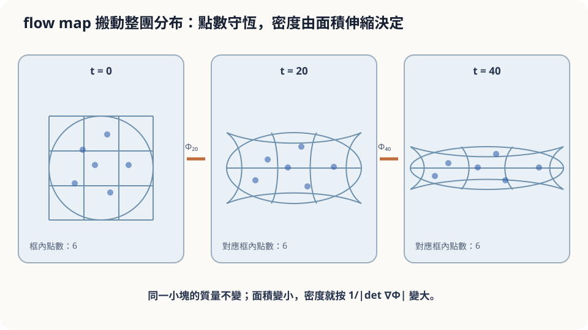

import Objectives from '../../../components/Objectives.astro';
import Prereq from '../../../components/Prereq.astro';
import Question from '../../../components/Question.astro';
import Answer from '../../../components/Answer.astro';
import QuizBlock from '../../../components/QuizBlock.astro';
import Option from '../../../components/Option.astro';
import Explanation from '../../../components/Explanation.astro';
import Details from '../../../components/Details.astro';
import Bridge from '../../../components/Bridge.astro';
import Ref from '../../../components/Ref.astro';
import UsedBy from '../../../components/UsedBy.astro';

# 從一片葉子到一群葉子：Flow Map 與 Pushforward

<Objectives>
- **把「每個起點在時刻 $t$ 被送到哪」打包成 flow map $\Phi_t$。** 說出它為什麼是可逆的。
- **把「一群葉子的分佈被水流搬走」寫成 pushforward $p_t=(\Phi_t)_\#p_0$。** 用 change of variables 寫出密度的公式。
- **對「一群葉子一分鐘後的分佈」這類情境，判斷「數一千片葉子畫直方圖」與「用公式算密度」各自依賴什麼假設、誤差在哪。** 用一個小模擬對照兩者。
</Objectives>

<Prereq items={frontmatter.prereqs} />

## 一千片葉子

上一篇（<Ref to="math-vector-field-ode"/>）解決了一片葉子的問題：水流地圖 $u$ 已知，葉子從 $x_0$ 出發，一分鐘後在一個確定的位置。

現在換個玩法。你抓起一把葉子——一千片——從橋上撒下去。它們不會落在同一點，而是散在橋下一小塊水面上：靠中間多、靠邊少。一分鐘後，這一千片葉子會散成什麼樣子？哪裡密、哪裡稀？

先用直覺回答，並寫下你有多確定。常見的答案是：「每片葉子各自順著箭頭走，所以整群葉子就是原本那團的形狀被水流『搬』到下游」。這個答案抓到了一件對的事——每片葉子的命運彼此無關；但它漏了一件事：水流有地方快、有地方慢，有地方匯合、有地方分開，搬過去的那團**形狀會變**。快的地方葉子被拉開、變稀；匯合的地方葉子被擠在一起、變密。那麼密到多密、稀到多稀？能不能不靠撒一千片葉子去數，直接算出來？

<Question id="Q1">
翻成數學。「一千片葉子的散佈」是什麼物件？「一分鐘後的散佈」又是什麼？我們想求的量，跟上一篇的 $x(60)$ 有什麼關係？

<Answer>
課堂上第一個反應通常是「一千個點的位置」。這沒錯，但它是**樣本**，不是我們想要的東西。一千片葉子是從某個分佈抽出來的：撒葉子的手決定了「落在橋下哪個位置」的機率密度 $p_0(x)$——中間高、邊緣低。所以：

**起點是一個隨機變數** $X_0\sim p_0$，一千片葉子是它的一千個獨立樣本。

**每片葉子接下來的路是確定的。** 上一篇說，從 $x_0$ 出發的葉子在時刻 $t$ 的位置是 ODE 的唯一解。把這個對應寫成一個函數：

$$
\Phi_t(x_0)\;=\;\text{從 }x_0\text{ 出發、順著 }u\text{ 走到時刻 }t\text{ 的位置}.
$$

$\Phi_t:\mathbb R^d\to\mathbb R^d$ 叫 **flow map**：它不是一片葉子的路，而是「**所有**起點同時被送到哪」的一張總表。

**一分鐘後的散佈是隨機變數** $X_t=\Phi_t(X_0)$ **的分佈**，記成 $p_t$。我們想求的就是 $p_t$。它和上一篇的關係是：上一篇算的是一個特定輸入 $x_0$ 的輸出 $\Phi_t(x_0)$；這一篇是把**整個分佈**送進 $\Phi_t$。這個操作有名字，叫 **pushforward**（把分佈往前推），寫成 $p_t=(\Phi_t)_\#\,p_0$。
</Answer>
</Question>

## 一塊會變形的果凍

把橋下那團葉子想成一塊軟果凍，每一小塊果凍就是一小群葉子。水流帶著果凍往下游走，同時把它揉變形：流速在前進方向變快的地方，果凍被**拉長**，同樣多的葉子占了更大的面積，變稀；水流往中央匯合的地方，果凍被**壓扁**，變密。

但有兩件事水流做不到。第一，它不能讓兩塊不同的果凍**融成一塊**——那需要兩片不同的葉子在同一時刻到達同一點，上一篇說這不會發生。第二，它不能把果凍**撕開**——軌跡是連續的。所以一分鐘後的果凍，是原本那塊被連續、不重疊地變形的結果：每一小塊有多少葉子沒變，只是占的面積變了。密度 = 葉子數 ÷ 面積，所以密度的變化**完全由面積的伸縮決定**。



*圖：小塊中的點數不變；面積伸縮透過 Jacobian 改變密度。*

## flow map、pushforward、change of variables

**Flow map 的性質。** 由 <Ref to="math-vector-field-ode"/> 的存在唯一（Lipschitz 條件下）：

1. $\Phi_0=\mathrm{id}$；且 $\Phi_t$ 對 $x_0$ 是 continuous 的（起點差一點、終點差一點，差距至多放大 $e^{Lt}$ 倍——這是 <Ref to="math-euler-error"/> 裡 Grönwall 不等式的內容，先當結論）。
2. **可逆。** $\Phi_t$ 是一對一的：若 $\Phi_t(a)=\Phi_t(b)$，兩條軌跡在時刻 $t$ 相交，唯一性說它們整條相同，故 $a=b$。反函數就是「把時間倒著走」：$\Phi_t^{-1}$ 是 vector field $-u(x,t-s)$ 走 $t$ 秒的 flow map。所以 $\Phi_t$ 是一個 **diffeomorphism**（可微、可逆、反函數也可微的映射），只要 $u$ 夠 smooth。
3. 若 $u$ 不隨時間變，還有 $\Phi_{s+t}=\Phi_s\circ\Phi_t$：先走 $t$ 秒再走 $s$ 秒，等於一次走 $s+t$ 秒。

**Pushforward 的定義。** 給一個可測映射 $\Phi$ 與一個分佈 $p_0$，$\Phi_\#p_0$ 是「先從 $p_0$ 抽 $X_0$、再算 $\Phi(X_0)$」得到的分佈。用集合寫：對任何區域 $A$，

$$
(\Phi_\#p_0)(A)\;=\;p_0\big(\Phi^{-1}(A)\big)
$$

——落在 $A$ 的機率，等於「會被送進 $A$ 的那些起點」在 $p_0$ 下的機率。這個定義對任何映射都成立，不需要可逆。

**密度公式（change of variables）。** 若 $\Phi$ 可逆且可微，pushforward 有密度：

$$
p_t(y)\;=\;p_0\big(\Phi_t^{-1}(y)\big)\;\Big|\det\nabla\Phi_t^{-1}(y)\Big|
\;=\;\frac{p_0(x)}{\big|\det\nabla\Phi_t(x)\big|}\,,\qquad x=\Phi_t^{-1}(y).
$$

三行推導：取 $y$ 附近的小方塊 $A$，它的原像 $\Phi_t^{-1}(A)$ 是 $x$ 附近的一個小平行體，體積是 $|\det\nabla\Phi_t^{-1}(y)|\cdot\mathrm{vol}(A)$（Jacobian 就是「局部把體積放大多少倍」）。兩邊的機率相等：$p_t(y)\,\mathrm{vol}(A)\approx p_0(x)\,|\det\nabla\Phi_t^{-1}(y)|\,\mathrm{vol}(A)$。消掉 $\mathrm{vol}(A)$ 即得。$\square$

這正是上一節「密度變化完全來自面積伸縮」的公式版：$|\det\nabla\Phi_t|$ 就是果凍那一小塊被放大的倍數。

<Details summary="一維的完整例子：ẋ = −x，起點是標準 Gaussian">
flow map 是 Φ_t(x) = e^(−t) x（代入：d/dt e^(−t)x = −e^(−t)x = −Φ_t ✓）。反函數 Φ_t^(−1)(y) = e^t y，導數 e^t。若 p₀ = N(0,1)，則
p_t(y) = p₀(e^t y)·e^t = (2π)^(−1/2) e^t exp(−e^(2t) y²/2)，
也就是 N(0, e^(−2t))：所有葉子往原點收攏，分佈越來越窄，但總質量不變（積分仍是 1，因為多出來的 e^t 正好補償變窄）。這個例子在下一篇會再用一次，用另一條路算出同一個答案。
</Details>

## 直覺的一半對、一半漏

起點問題的直覺答案是「那團葉子的形狀被搬到下游」。對的部分：每片葉子確實各走各的，所以整群的分佈就是 $p_0$ 經 $\Phi_t$ 的 pushforward——不多不少，沒有葉子憑空出現或消失。漏掉的部分：「形狀不變」隱含假設了 $|\det\nabla\Phi_t|\equiv1$，也就是水流處處**保體積**。一般的水流不是這樣；只有 $\nabla\cdot u=0$ 的場（<Ref to="math-divergence"/>）才會保體積。所以正確的說法是：**葉子的數目守恆，密度按 Jacobian 反比縮放。**

這個判斷依賴什麼？依賴 $\Phi_t$ 可逆——也就是上一篇的 Lipschitz 條件。若河面某處水流不是 Lipschitz 的，兩片葉子可能在同一點分道揚鑣，或者反過來說「哪些起點會被送到這裡」不再唯一，pushforward 的集合定義仍然成立（它不需要可逆），但密度公式失效：可能在一個點堆出無限大的密度。

## 數葉子，還是算公式

兩種方法都能得到 $p_t$：**數葉子**是抽 $N$ 個 $X_0$、各自解 ODE、畫直方圖，誤差來自有限樣本，大約隨 $1/\sqrt N$ 縮小（<Ref to="math-gaussian"/> 那類 variance 相加的算法）；**算公式**是對每個 $y$ 反解 $\Phi_t^{-1}(y)$ 並算 Jacobian，沒有取樣誤差，但每個 $y$ 都要解一次反向 ODE。

```python
import numpy as np
t, N = 1.0, 1000
x0 = np.random.randn(N)                 # p0 = N(0,1)
xt = np.exp(-t) * x0                    # Phi_t for xdot = -x（此例有 closed form）
ys = np.linspace(-2, 2, 200)
p_formula = np.exp(t) * np.exp(-(np.exp(t)*ys)**2/2) / np.sqrt(2*np.pi)
hist, edges = np.histogram(xt, bins=40, range=(-2, 2), density=True)
# 直方圖與 p_formula 應重合；N 改成 100 看直方圖變毛
```

<iframe loading="lazy" src="/personal_website/notes/research_areas/mathematical-foundations/m2-deterministic-dynamics/m2-1-1.html" class="demo-frame" title="Pushforward：粒子 histogram 與 change-of-variables 密度" style="height: 850px; width: 100%; border: none;"></iframe>

## 檢查理解

<QuizBlock id="m2-1-a">
你把一張照片的每個像素座標經過同一個可逆的幾何變形（例如魚眼鏡頭效果）。「原圖中某區域的像素密度」與「變形後對應區域的像素密度」之間的關係，該用哪個工具？
<Option>ODE 的存在唯一定理。</Option>
<Option correct>Pushforward 的 change of variables：新密度 = 舊密度 ÷ 該點的 Jacobian 行列式絕對值。</Option>
<Option>Vector field 的 divergence。</Option>
<Explanation>
這裡直接給了映射 $\Phi$，沒有 ODE，也不必問它是不是某個場的 flow map；問的是分佈被映射搬走後密度怎麼變，正是 pushforward 與 change of variables。divergence 描述的是「每秒體積變化率」，是 flow map 隨時間演化時 Jacobian 的變化率，對一個給定的靜態映射不是直接工具。
</Explanation>
</QuizBlock>

<QuizBlock id="m2-1-b">
若水流地圖不是 Lipschitz 的，導致兩片從不同起點出發的葉子在時刻 $t$ 到達同一點。這時：
<Option>pushforward $p_t=(\Phi_t)_\#p_0$ 沒有定義。</Option>
<Option correct>pushforward 仍有定義（集合版的定義不需要可逆），但 $\Phi_t$ 不再一對一，change of variables 的密度公式失效，$p_t$ 可能在該點沒有密度（質量堆成一點）。</Option>
<Option>什麼都不受影響，只是 Jacobian 變大。</Option>
<Explanation>
pushforward 的定義是「落在 $A$ 的機率 = 會被送進 $A$ 的起點的機率」，對任何可測映射都成立。失效的是密度公式，因為它用了 $\Phi_t^{-1}$ 與 Jacobian；兩條軌跡匯合意味著局部體積被壓到零、Jacobian 是 0 不是變大，密度在那裡發散。
</Explanation>
</QuizBlock>

<QuizBlock id="m2-1-c">
場 $u(x,y)=(-y,\,x)$（整條河在原地打轉）把 $p_0=\mathcal N(0,I)$ 推到時刻 $t$ 的 $p_t$ 是：
<Option>一個越來越窄的 Gaussian。</Option>
<Option>一個越來越寬的 Gaussian。</Option>
<Option correct>還是 $\mathcal N(0,I)$：旋轉保體積（Jacobian 行列式為 1），而標準 Gaussian 又是旋轉對稱的，所以每片葉子都在動，分佈卻一動也不動。</Option>
<Explanation>
旋轉的 $\nabla\cdot u=0$，$|\det\nabla\Phi_t|=1$，密度只是被旋轉搬位置；標準 Gaussian 旋轉後與自己重合。這是下一篇「同一條分佈路徑可以有無限多速度場」的第一個例子——葉子的運動與分佈的運動是兩件不同的事。
</Explanation>
</QuizBlock>

<UsedBy slug={frontmatter.slug} />

<Bridge to="math-continuity-equation">
本篇把所有起點的終點打包成 flow map $\Phi_t$，把分佈的搬運寫成 pushforward，並由可逆性得到密度的 change of variables 公式。但這條公式要先算出整個 $\Phi_t$；接著換一條路：不追葉子，直接寫下密度 $p_t$ 自己滿足的方程式。
</Bridge>

## 參考文獻

1. Hirsch, M. W., Smale, S., Devaney, R. L. *Differential Equations, Dynamical Systems, and an Introduction to Chaos.* Academic Press, 3rd ed., 2013.（第 7 章：flow 的定義與性質，$\Phi_{s+t}=\Phi_s\circ\Phi_t$。）
2. Villani, C. *Topics in Optimal Transportation.* AMS Graduate Studies in Mathematics 58, 2003.（第 1 章：pushforward（transport of measure）的定義與 change of variables。）
3. Grimmett, G., Stirzaker, D. *Probability and Random Processes.* Oxford University Press, 3rd ed., 2001.（第 4 章：隨機變數的函數與密度的變數變換公式。）
