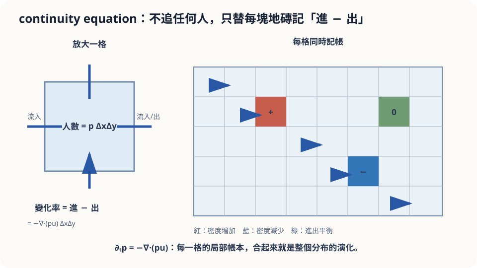

import Objectives from '../../../components/Objectives.astro';
import Prereq from '../../../components/Prereq.astro';
import Question from '../../../components/Question.astro';
import Answer from '../../../components/Answer.astro';
import QuizBlock from '../../../components/QuizBlock.astro';
import Option from '../../../components/Option.astro';
import Explanation from '../../../components/Explanation.astro';
import Details from '../../../components/Details.astro';
import Bridge from '../../../components/Bridge.astro';
import Ref from '../../../components/Ref.astro';
import UsedBy from '../../../components/UsedBy.astro';

# 站內人數變化 = 進 − 出：Continuity Equation

<Objectives>
- **從「一個小方格裡的質量變化 = 流進 − 流出」推出 continuity equation $\partial_t p+\nabla\cdot(pu)=0$。** 說出每一項的意思。
- **說出 continuity equation 與 pushforward 的關係。** 分清「寫出 density 的演化規則」和「已經算出這條 PDE 的解」。
- **對「知道每個閘門的人流，預測站內人數分佈」這類情境，判斷用 continuity equation 是否恰當、說出它會漏掉什麼。** 用一個一維例子代入驗證。
</Objectives>

<Prereq items={frontmatter.prereqs} />

## 捷運站，再看一次

<Ref to="math-divergence"/> 用捷運站問過一個問題：每個閘門的進出人數都知道，站內人數是在增加還是減少？答案是把所有閘門的淨流量加起來，這個總和就是 divergence 的積分。

現在把問題推遠一步。站內不是一個點，是一整片大廳：有人往月台走、有人往出口走、有人在售票機前停下來。假設你有一張「人流地圖」——大廳每個位置、每個時刻，人往哪個方向走、走多快。你也知道此刻大廳裡人群的分佈：哪裡擠、哪裡空。**十分鐘後，人群的分佈會變成什麼樣？**

上一篇（<Ref to="math-pushforward-flow-map"/>）是先算每個人走到哪，再把 distribution 搬過去。但我們也可以守在一小塊地磚旁，看它的人數怎麼變：左邊流進多少，右邊流出多少？**能不能用每塊地磚的進出量，直接描述 density 隨時間的變化？**

<Question id="Q1">
把「站內人數變化 = 進 − 出」這句話，從整個車站縮小到大廳裡一塊 $1\text{ m}\times1\text{ m}$ 的地磚上。這塊地磚上的人數怎麼變？「進」與「出」由哪些量決定？

<Answer>
最直覺的想法是「看有多少人踩進來、多少人踩出去」，接著就能推得很順：

地磚上的人數 $\approx p(x,t)\cdot(1\text{ m}^2)$，$p$ 是人群的密度（每平方公尺幾個人）。人怎麼進出？沿著地磚的四條邊。看左邊那條邊：邊上的人以速度 $v(x,t)$ 走，所以每秒穿過這條邊的人數是「密度 × 速度的垂直分量 × 邊長」——這個量叫 **flux**（單位時間穿過單位邊長的質量），寫成 $p\,v$。

**進 − 出就是四條邊的 flux 的淨和。** 左邊進、右邊出：淨流入是 $(pu_1)|_{\text{左}}-(pu_1)|_{\text{右}}$；上下同理。地磚很小時，「右邊的值減左邊的值」就是 $\partial_x(pu_1)\cdot\Delta x$，所以淨流入 $=-\big[\partial_x(pu_1)+\partial_y(pu_2)\big]\cdot\text{面積}=-\nabla\cdot(pu)\cdot\text{面積}$。

這就把 <Ref to="math-divergence"/> 的結論搬到了每一塊地磚上：**地磚上人數的變化率，等於 flux $pu$ 的 divergence 取負號。** 這裡的隨機變數是「隨機抓一個人，他在哪」，我們想知道的量是它的密度 $p(x,t)$ 隨時間的變化。
</Answer>
</Question>

## 每塊地磚都在記帳

把大廳鋪滿地磚，每塊地磚上站一個記帳員。他不需要知道任何人從哪來、要去哪；他只盯著自己四條邊，數每秒有幾個人跨進來、幾個人跨出去，然後更新自己這塊的人數。

一千個記帳員各自記帳，加起來就是整個分佈的演化。沒有任何一個記帳員追蹤過任何一個人。這就是 continuity equation 的視角：**從「每個人走到哪」（Lagrangian，追粒子）換成「每個位置有多少」（Eulerian，守著格子）**。兩種視角描述的是同一件事——上一篇的 flow map 是追粒子，這一篇是守格子。



*圖：每格密度的變化率是進減出；所有局部帳本合起來就是分布演化。*

## 一個方塊，十行推導

設 $p(x,t)$ 是密度，$v(x,t)$ 是 vector field（<Ref to="math-vector-field-ode"/>），**flux** 是 $J=p\,v$。取一個固定的小區域 $B$（不隨時間動），裡面的質量是 $\int_B p\,dx$。假設質量**守恆**——沒有人憑空出現或消失——那麼質量變化只能來自穿過邊界 $\partial B$ 的 flux：

$$
\frac{d}{dt}\int_B p\,dx\;=\;-\oint_{\partial B} p\,v\cdot n\,dS\;=\;-\int_B \nabla\cdot(pv)\,dx .
$$

第一個等號是守恆（$n$ 是向外的法向量，向外流為正，所以取負號）；第二個等號是 <Ref to="math-divergence"/> 的 Gauss 定理。左邊因為 $B$ 不動，微分可以穿過積分（<Ref to="math-total-derivative"/>），變成 $\int_B\partial_t p\,dx$。於是對**任何**小區域 $B$ 都有

$$
\int_B\Big[\partial_t p+\nabla\cdot(pv)\Big]dx=0 .
$$

一個 continuous 的函數若在每個小區域上積分都是零，它本身必為零。所以

$$
\boxed{\;\partial_t p+\nabla\cdot(p\,v)=0\;}
$$

這就是 **continuity equation**。讀法：密度的變化率 $=-$ flux 的 divergence；flux 往外散的地方密度下降，往內收的地方密度上升。$\square$

它是一條 **PDE**（partial differential equation：同時對 $t$ 與 $x$ 微分）。給定 $p_0$、速度場與適當的邊界條件後，我們可以求解這條方程式；這提供了不逐人追蹤的做法，但 PDE 本身仍可能需要 numerical approximation。

**和 pushforward 的關係。** 若 $v$ 是 Lipschitz 的，這條 PDE 的解**就是** $(\Phi_t)_\#p_0$（[3] 第 8 章）。兩種寫法、同一個 $p_t$。可以在一維例子上直接驗證：<Ref to="math-pushforward-flow-map"/> 算過 $\dot x=-x$、$p_0=\mathcal N(0,1)$ 給出 $p_t=\mathcal N(0,e^{-2t})$，把它代進 $\partial_t p+\partial_x(-x\,p)$，兩項恰好相消（推導放在展開框）。

<Details summary="一維代入驗證：p_t = N(0, σ²)，σ² = e^(−2t)，v = −x">
記 p = (2πσ²)^(−1/2) exp(−x²/(2σ²))。先算對 x 的導數：∂ₓp = −(x/σ²)p，所以
∂ₓ(v p) = ∂ₓ(−x p) = −p − x·∂ₓp = −p + (x²/σ²) p。
再算對 t 的導數。log p = −½ log(2πσ²) − x²/(2σ²)，對 t 微分得
∂ₜ log p = −½·(σ²)′/σ² + (x²/2)·(σ²)′/σ⁴。
代入 (σ²)′ = −2σ²：第一項是 1，第二項是 −x²/σ²，所以 ∂ₜ log p = 1 − x²/σ²，即 ∂ₜp = (1 − x²/σ²) p。
相加：∂ₜp + ∂ₓ(vp) = (1 − x²/σ²)p + (−1 + x²/σ²)p = 0 ✓。

把 continuity equation 沿葉子的軌跡展開：$\frac{d}{dt}p(x_t,t)=\partial_t p+v\cdot\nabla p$，而 $\nabla\cdot(pv)=v\cdot\nabla p+p\nabla\cdot v$。在密度為正且導數存在的地方，兩式合起來得到
$$
\frac{d}{dt}\log p(x_t,t)=-\nabla\cdot v(x_t,t).
$$
跟著葉子走，速度場的局部散開會降低它所在位置的密度；這也是 flow map 的 change of variables 微分版本。
</Details>

## 直覺對了，但它給的比你想的多

這條式子把搬運寫成了每個位置的守恆規則。上面的逐點推導需要足夠的 smoothness，交換微分、積分也要合法；較不 smooth 的情況可以用積分形式或 weak solution 描述，並不表示守恆律失效。若只觀察車站內部，總人數還會受出口的邊界 flux 影響，不一定固定不變。

但這條方程式還說了一件直覺說不出的事。給定一條分佈的路徑 $p_t$，產生它的 $v$ **不唯一**。設 $v$ 滿足方程式，再任取一個 vector field $w$ 使 $\nabla\cdot(p\,w)=0$，那麼 $v+w$ 也滿足：

$$
\partial_t p+\nabla\cdot\big(p(v+w)\big)=\underbrace{\partial_t p+\nabla\cdot(pu)}_{=0}+\underbrace{\nabla\cdot(pw)}_{=0}=0 .
$$

例如對旋轉對稱的 Gaussian，$w(x,y)=(-y,x)$ 同時滿足 $w\cdot\nabla p=0$ 與 $\nabla\cdot w=0$，所以 $\nabla\cdot(pw)=0$。只有「沿等高線走」還不夠，還得檢查這個 flux 條件。這個例子顯示：**每個人的 trajectory 不同，仍可能有相同的 marginal distribution。**

## 算一次，再弄壞一次

一維版本 $\partial_t p+\partial_x(pu)=0$ 可以用幾行程式往前解（有限差分，upwind 格式）。用 $v=-x$、$p_0=\mathcal N(0,1)$ 對答案：

```python
import numpy as np
x = np.linspace(-4, 4, 801); dx = x[1]-x[0]; dt = 0.002
p = np.exp(-x**2/2)/np.sqrt(2*np.pi); u = -x
for _ in range(int(1.0/dt)):            # 解到 t = 1
    J = p*u                              # flux
    dJ = np.where(u > 0, np.diff(J, prepend=J[0]),
                          np.diff(J, append=J[-1])) / dx   # upwind 差分
    p = p - dt*dJ
s2 = np.exp(-2.0)                        # 理論：N(0, e^{-2t})
print(np.abs(p - np.exp(-x**2/(2*s2))/np.sqrt(2*np.pi*s2)).max())
```

這個範例可與 $\mathcal N(0,e^{-2})$ 對照；縮小網格時，時間步長也要滿足數值格式的穩定條件。若把速度換成在原點跳躍的 $\mathrm{sign}(x)$，兩側的人會往外離開，中央出現空缺。此時不能在原點使用上面的普通導數推導，要改用 weak formulation，並另外檢查數值格式是否守恆。

<iframe loading="lazy" src="/personal_website/notes/research_areas/mathematical-foundations/m2-deterministic-dynamics/m2-2-1.html" class="demo-frame" title="Continuity equation：追粒子與守格子" style="height: 800px; width: 100%; border: none;"></iframe>

## 檢查理解

<QuizBlock id="m2-2-a">
一條高速公路上每個位置的車速 $v(x,t)$ 都由感測器測到，且此刻每公里有幾輛車 $p(x,0)$ 也知道。要預測一小時後哪裡塞車，最直接的工具是：
<Option>對每輛車解一條 ODE，再數車。</Option>
<Option>算 $v$ 的 Jacobian 行列式。</Option>
<Option correct>解一維的 continuity equation $\partial_t p+\partial_x(pu)=0$，車流密度就是 $p$、flux $pu$ 就是每小時通過的車輛數。</Option>
<Explanation>
逐車追是 Lagrangian 做法，可行但要知道每輛車的起點、且車數很多時很慢；Jacobian 是 flow map 的性質，還得先算出 flow map。守恆律直接給出密度的演化，而且高速公路上的車流量正是交通工程裡 flux 的原始例子。若車速 $v$ 本身取決於密度（塞車時變慢），方程式就變成 nonlinear，但形式相同。
</Explanation>
</QuizBlock>

<QuizBlock id="m2-2-b">
大廳裡有出口，人可以穿過邊界離開。這時 continuity equation 如何描述站內總人數？
<Option>方程式自動處理，因為 divergence 會在出口變負。</Option>
<Option correct>區域內的總量會按邊界淨 flux 改變；需要指定開放出口的邊界條件，不能默認是封閉車站。</Option>
<Option>方程式會發散，得不到解。</Option>
<Explanation>
對車站區域 $B$ 積分，得到 $\frac{d}{dt}\int_B p=-\int_{\partial B}pu\cdot n\,dS$。開放出口允許正的 outward flux，所以站內總量可以下降，這並不違反局部守恆。只有沒有邊界淨流出的封閉系統，總量才保持不變。
</Explanation>
</QuizBlock>

<QuizBlock id="m2-2-c">
兩位工程師各給出一個人流地圖 $v_1$ 與 $v_2$，兩者的差 $w=v_2-v_1$ 滿足 $\nabla\cdot(p_t w)=0$（對所有 $t$）。從 $p_0$ 出發：
<Option>兩個地圖產生不同的 $p_t$，因為每個人的路徑不同。</Option>
<Option>兩個地圖產生相同的 flow map $\Phi_t$。</Option>
<Option correct>在相應的唯一解條件下，兩者有相同的 $p_t$，但個別 trajectory 不必相同。</Option>
<Explanation>
continuity equation 對 $v$ 是線性的，$\nabla\cdot(pw)=0$ 的 $w$ 加進去不改變方程式，$p_t$ 不變；flow map 卻是逐點順著 $v$ 走出來的，$v$ 變了它就變。「路徑不同所以分佈不同」是這一篇要拆掉的直覺：分佈只看淨流量。
</Explanation>
</QuizBlock>

<UsedBy slug={frontmatter.slug} />

<Bridge to="math-euler-error">
現在可以分清 trajectory 與 distribution 的演化了。但電腦不會真的每一瞬間都看方向；如果每隔一小段才更新一次位置，最後會偏多遠？下一篇回到這個計算上的問題。
</Bridge>

## 參考文獻

1. Evans, L. C. *Partial Differential Equations.* AMS Graduate Studies in Mathematics 19, 2nd ed., 2010.（第 3 章：一階 PDE 與守恆律的基本理論。）
2. Villani, C. *Topics in Optimal Transportation.* AMS Graduate Studies in Mathematics 58, 2003.（第 8 章：continuity equation 與 Benamou–Brenier 公式；pushforward 與 continuity equation 的等價在此脈絡下使用。）
3. Ambrosio, L., Gigli, N., Savaré, G. [*Gradient Flows in Metric Spaces and in the Space of Probability Measures.*](https://doi.org/10.1007/978-3-7643-8722-8) Birkhäuser, 2nd ed., 2008.（第 8 章：continuity equation 的解與 flow map 的 pushforward 相同（superposition principle）。）
