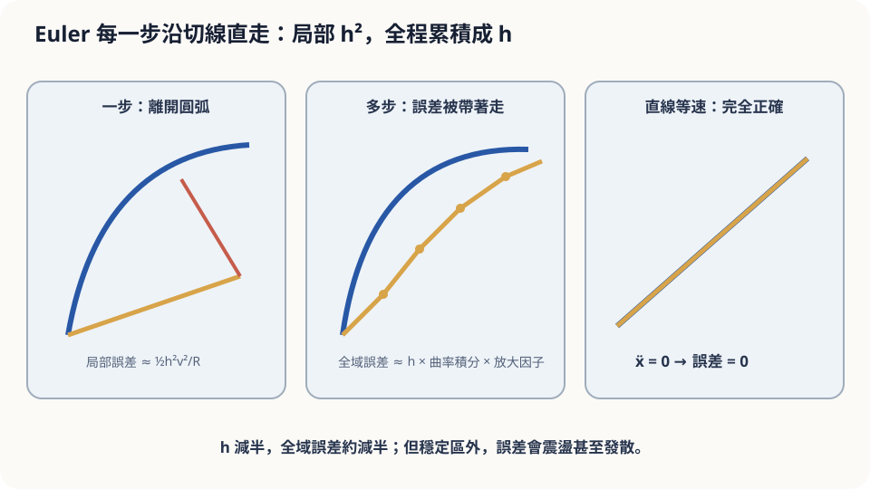

import Objectives from '../../../components/Objectives.astro';
import Prereq from '../../../components/Prereq.astro';
import Question from '../../../components/Question.astro';
import Answer from '../../../components/Answer.astro';
import QuizBlock from '../../../components/QuizBlock.astro';
import Option from '../../../components/Option.astro';
import Explanation from '../../../components/Explanation.astro';
import Details from '../../../components/Details.astro';
import Bridge from '../../../components/Bridge.astro';
import Ref from '../../../components/Ref.astro';
import UsedBy from '../../../components/UsedBy.astro';

# 導航每 30 秒更新一次：Euler 法與它的誤差

<Objectives>
- **把偶爾查看方向寫成 Euler 更新。** 用加速度 $a_t(x_t)$ 描述它漏掉的 velocity 變化，分清直線與等速直線。
- **從誤差的向量等式，推出 $e_{k+1}\le(1+hL)e_k+\|r_k\|$。** 說出三角不等式與 Lipschitz 各控制哪一項。
- **推導 $e_N\le h e^{LT}\int_0^T\|a_t(x_t)\|dt$。** 分清上界、實際誤差與 numerical stability。
</Objectives>

<Prereq items={frontmatter.prereqs} />

## 一條彎路，一台省電的導航

你的車以時速 60 公里在一條大彎道上行駛：彎道是四分之一圓，半徑 2 公里。導航為了省電，**每 30 秒**才讀一次車子的行進方向；在兩次讀取之間，它假設你一直沿著上次讀到的方向**直走**，把位置往前推 30 秒的距離。

走完這個四分之一圓（約 3.1 公里、三分多鐘），導航上的位置和你真正的位置會差多遠？如果換成一條筆直的路呢？

就像走路時只偶爾看導航，直路比較容易走，轉彎時卻容易走過頭。不過，直路上如果一直加速或減速，假設速度固定也會算錯。**更新得更頻繁，誤差究竟會怎麼縮小？** 先分開「這一步漏掉的變化」與「前一步的偏移怎麼繼續傳下去」。

<Question id="Q1">
翻成數學。「真正的位置」是哪個物件？「導航算出的位置」又是哪個？「每 30 秒直走一段」寫成式子是什麼？我們想知道的量是什麼？

<Answer>
真正的位置 $x_t$ 遵守 $\frac{dx_t}{dt}=v_t(x_t)$。導航的近似位置記成 $\hat x_{t_k}$；$t_k=kh$，每次只使用近似位置上的 velocity：

$$
\hat x_{t_{k+1}}=\hat x_{t_k}+h\,v_{t_k}(\hat x_{t_k}).
$$

這就是 **Euler method**。兩者從相同起點出發，要比較的是終點距離 $e_N=\|x_T-\hat x_T\|$。這裡沒有 sampling randomness，只有解 ODE 時的 discretization error。
</Answer>
</Question>

## 切線離開了圓

把彎道畫成一段圓弧，車在圓弧上。Euler 的一步是沿著**切線**往前走 500 公尺（30 秒 × 16.7 m/s）。切線是直的、圓弧是彎的，走完這一步，導航的點落在圓的外側——這是**一步**的誤差，叫**局部誤差**。

下一步從那個已經偏外的點出發。它會犯同樣的錯（又沿切線離開），還會多一件事：它現在站在一個「真車從來沒去過」的位置，讀到的方向也不是真車此刻的方向。前面的錯誤會被帶著走，有時還會被放大。全程的誤差就是這兩件事的疊加：**每步新犯的錯**，加上**舊錯被帶著走的方式**。

等速直線上，整段 velocity 都相同，Euler 才會一步精確。只是方向沒變、速度仍在增加時，一樣會留下沿路的誤差。



*圖：局部誤差為二階，累積後全域誤差為一階；直線等速時誤差為零。*

## 一步的錯、多步的累積

先假設 velocity 夠 smooth，沿精確 trajectory 定義**加速度**

$$
a_t(x_t):=\frac{d}{dt}v_t(x_t)
=\partial_t v_t(x_t)+\nabla_xv_t(x_t)\,v_t(x_t).
$$

這是 <Ref to="math-total-derivative"/> 的 chain rule：場隨時間改變，以及移動後讀到不同位置的速度。它包含轉向、加速與減速，並不是幾何 curvature。

**先看一步。** 精確位移是 velocity 的積分。把 velocity 與起點值的差，再寫成加速度的積分：

$$
\begin{aligned}
x_{t_{k+1}}&=x_{t_k}+h\,v_{t_k}(x_{t_k})+r_k,\\
r_k&=\int_{t_k}^{t_{k+1}}\!\big(v_s(x_s)-v_{t_k}(x_{t_k})\big)\,ds\\
&=\int_{t_k}^{t_{k+1}}(t_{k+1}-r)\,a_r(x_r)\,dr.
\end{aligned}
$$

最後一行交換了兩次積分的順序。所以 $\|r_k\|\le h^2M_k/2$，其中 $M_k=\sup_{[t_k,t_{k+1}]}\|a_t(x_t)\|$。這個積分餘項也適用於向量，不必假設各分量都有同一個 Taylor 中間點。

**再看舊誤差怎麼傳。** 精確更新減掉 Euler 更新，得到

$$
x_{t_{k+1}}-\hat x_{t_{k+1}}
=(x_{t_k}-\hat x_{t_k})
+h\big(v_{t_k}(x_{t_k})-v_{t_k}(\hat x_{t_k})\big)+r_k.
$$

記 $e_k=\|x_{t_k}-\hat x_{t_k}\|$，先取 norm、用三角不等式：

$$
e_{k+1}\le e_k
+h\|v_{t_k}(x_{t_k})-v_{t_k}(\hat x_{t_k})\|+\|r_k\|.
$$

假設 $v_t$ 對位置是 $L$-Lipschitz，中間那項至多是 $hLe_k$，因此

$$
e_{k+1}\le(1+hL)e_k+\|r_k\|.
$$

三項分別是舊的位置偏移、站錯位置後讀到的 velocity 差，以及本步漏掉的變化。由 $e_0=0$ 展開：

$$
e_N\le\sum_{k=0}^{N-1}(1+hL)^{N-1-k}\|r_k\|
\le e^{LT}\sum_{k=0}^{N-1}\|r_k\|.
$$

餘項中的 $t_{k+1}-r\le h$，所以得到真正的上界

$$
\boxed{e_N\le h e^{LT}\int_0^T\|a_t(x_t)\|\,dt.}
$$

若整段加速度還有共同上界 $M$，也可由每步的 $h^2M/2$ 得到 $e_N\le e^{LT}ThM/2$。兩者都顯示 Euler 是一階方法：小步長區域的誤差上界隨 $h$ 縮小。但上界變小不等於實際誤差每次都精確減半，$e^{LT}$ 也只是傳播的最壞情況估計。

<Details summary="連續版 Grönwall 不等式與它的證明（四行）">
連續版：若 φ(t) ≥ 0 滿足 φ(t) ≤ A + L∫₀ᵗ φ(s) ds，則 φ(t) ≤ A·e^(Lt)。
證明：令 Ψ(t) = A + L∫₀ᵗ φ。則 Ψ′ = Lφ ≤ LΨ，所以 d/dt [Ψ e^(−Lt)] = (Ψ′ − LΨ)e^(−Lt) ≤ 0，Ψ(t)e^(−Lt) ≤ Ψ(0) = A，故 φ ≤ Ψ ≤ A e^(Lt)。□
用法：兩條從相距 δ 的起點出發的軌跡，其距離 φ(t) = ‖x(t) − y(t)‖ 滿足 φ(t) ≤ δ + L∫₀ᵗ φ，所以 φ(t) ≤ δ e^(Lt)——起點的差距至多指數放大。Euler 的舊誤差被「帶著走」時放大的就是這個倍數；離散版只是把積分換成和、把 e^(Lh) 換成 (1+hL)。
</Details>

## 直覺對了一半，數字對不上

在圓弧上，速率 $c=16.7$ m/s、半徑 $R=2000$ m，故 $\|a_t\|=c^2/R\approx0.139$ m/s²，全程約 188 秒。代入共同上界 $M$ 的版本，$hTM/2$ 約為 390 m；還要乘上 velocity field 在相關區域的 Lipschitz 傳播因子。這是保守上界，不是終點偏移的預測等式。

下面的程式可以算出實際偏移，並與更新得更頻繁的結果比較。注意程式會將最後一步調整到恰好抵達 $T$，所以顯示的 30 秒是近似的步長。理論說明了哪些量控制誤差，實際數值則要由這個明確的場與 solver 計算。

更新間隔改成 10 秒，在這個平滑範例的小步長區域，誤差大約縮三倍，而不是九倍；這是全域一階與局部二階的差別。

還有一件容易忘的假設：$\ddot x$ 是**加速度**，不只是轉彎。直路上如果你一直在加減速，$\ddot x\ne0$，Euler 也會錯——只是錯在沿路的前後位置，不是偏出路面。

## 跑一次，再把 $h$ 調到壞掉

```python
import numpy as np
R, v = 2000.0, 60/3.6
T = (np.pi/2)*R/v                          # 走完四分之一圓的時間
def u(x): r = np.hypot(*x); return v*np.array([-x[1], x[0]])/r   # 沿圓切線
def euler(h):
    N = int(round(T/h)); x = np.array([R, 0.0])
    for _ in range(N): x = x + (T/N)*u(x)
    return np.linalg.norm(x - np.array([0.0, R]))   # 與真實終點 (0, R) 的距離
for h in [30, 10, 3, 1]: print(h, round(euler(h)))
# 486, 161, 49, 17：h 縮三倍、誤差縮三倍——一階
```

另一個問題是**穩定性**。對 $\frac{dx_t}{dt}=-kx_t$、$k>0$，精確解會衰減，Euler 卻每步乘上 $1-hk$。當 $0<hk<2$ 時其絕對值小於 1；$hk=2$ 不衰減，$hk>2$ 則發散。這要檢查實際的更新因子，不能只由保守的 $(1+hL)$ 上界判定。

<iframe loading="lazy" src="/personal_website/notes/research_areas/mathematical-foundations/m2-deterministic-dynamics/m2-3-1.html" class="demo-frame" title="Euler：步長、曲率、速度與穩定性" style="height: 800px; width: 100%; border: none;"></iframe>

## 檢查理解

<QuizBlock id="m2-3-a">
一台掃地機器人每 0.5 秒讀一次自己的速度、中間假設等速直走，藉此估計自己的位置。哪種情況下它的位置估計會最準？
<Option>沿著一條蛇形路線慢慢走。</Option>
<Option correct>沿著直線等速走，即使走得很快。</Option>
<Option>沿著小圓圈快速轉。</Option>
<Explanation>
誤差界的核心是 $\int\|\ddot x\|dt$：直線等速時 $\ddot x=0$，不論速度多快都精確。蛇形路線 $\ddot x$ 一直不為零；小圓圈快速轉的 $\|\ddot x\|=v^2/R$ 最大。「走得慢比較準」是把速度與加速度混在一起——決定誤差的是加速度。
</Explanation>
</QuizBlock>

<QuizBlock id="m2-3-b">
你把導航的更新間隔從 30 秒改成 10 秒，發現終點誤差從 486 m 降到 161 m。若再改成 1 秒，最合理的預期是：
<Option correct>約 16 m——Euler 是一階方法，誤差大致與 $h$ 成正比。</Option>
<Option>約 1.6 m——誤差與 $h^2$ 成正比。</Option>
<Option>幾乎為零——更新夠頻繁就沒有誤差。</Option>
<Explanation>
局部誤差是 $h^2$ 的量級，但一共要走 $T/h$ 步，乘起來是 $h$ 的一階。30→10 已經驗證了三倍對三倍；10→1 縮十倍，161/10≈16。「$h^2$」是把局部誤差誤當成全域誤差；「幾乎為零」則忘了只要路是彎的，任何有限的 $h$ 都會留下正比於 $h$ 的誤差。
</Explanation>
</QuizBlock>

<QuizBlock id="m2-3-c">
在 $h e^{LT}\int\|a_t(x_t)\|dt$ 這個上界裡，$L$ 控制什麼？
<Option>局部誤差 $\tfrac{h^2}{2}\|\ddot x\|$ 變大。</Option>
<Option>誤差界不受影響，因為 $L$ 只出現在存在唯一定理裡。</Option>
<Option correct>站錯位置後讀到的 velocity 差，以及由此產生的誤差傳播上界；它不單獨決定實際方法是否發散。</Option>
<Explanation>
局部餘項由沿 trajectory 的加速度決定，$L$ 則用來估計兩個位置的 velocity 差。改變整個場時，兩者都可能改變。較大的 $L$ 使傳播上界更保守，但是否真的不穩定，仍要檢查數值更新；例如線性衰減場的因子是 $1-hk$。
</Explanation>
</QuizBlock>

<UsedBy slug={frontmatter.slug} />

<Bridge to="math-higher-order">
Euler 漏掉的是一步裡的 velocity 變化。縮小步長可以改善近似，但也要多讀方向。下一篇換一個想法：在同一步裡多看一次 velocity，能不能捕捉它的變化，用相同的讀取預算得到更小的誤差？
</Bridge>

## 參考文獻

1. Hairer, E., Nørsett, S. P., Wanner, G. [*Solving Ordinary Differential Equations I: Nonstiff Problems.*](https://doi.org/10.1007/978-3-540-78862-1) Springer, 2nd ed., 1993.（第 I.7 節與第 II.3 節：Euler 法的局部與全域誤差、Grönwall 型的累積論證。）
2. Butcher, J. C. [*Numerical Methods for Ordinary Differential Equations.*](https://doi.org/10.1002/9781119121534) Wiley, 3rd ed., 2016.（第 2 章：Euler 法的收斂與穩定性。）
3. Grönwall, T. H. [*Note on the Derivatives with Respect to a Parameter of the Solutions of a System of Differential Equations.*](https://doi.org/10.2307/1967124) Annals of Mathematics 20(4), 1919.（Grönwall 不等式的原始出處。）
