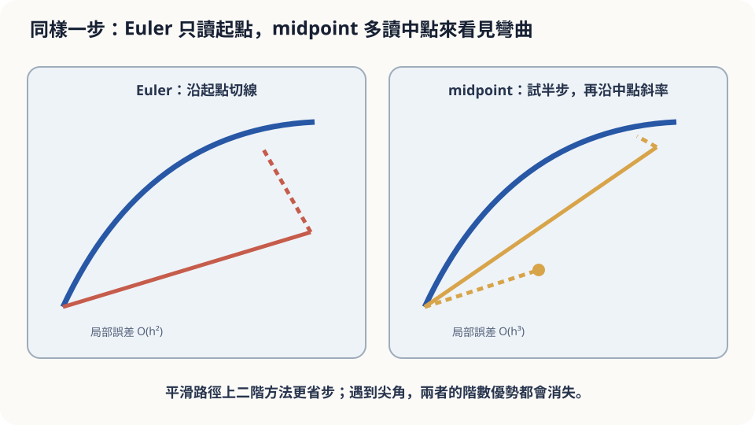

import Objectives from '../../../components/Objectives.astro';
import Prereq from '../../../components/Prereq.astro';
import Question from '../../../components/Question.astro';
import Answer from '../../../components/Answer.astro';
import QuizBlock from '../../../components/QuizBlock.astro';
import Option from '../../../components/Option.astro';
import Explanation from '../../../components/Explanation.astro';
import Details from '../../../components/Details.astro';
import Bridge from '../../../components/Bridge.astro';
import Ref from '../../../components/Ref.astro';
import UsedBy from '../../../components/UsedBy.astro';

# 在 30 秒的中點多看一眼：高階方法

<Objectives>
- **寫出 Heun 法與 midpoint 法的更新式。** 用 Taylor 展開說明它們的局部誤差為什麼是 $h^3$（全域二階）。
- **說出「階數」與「每步成本」的取捨：在相同的方向讀取次數下比較誤差。** 說出高階方法何時贏、何時不贏。
- **對「導航多讀一次方向值不值得」這類情境做判斷、說出它依賴的假設（路夠 smooth、預算夠多）。** 用一個小模擬在相同讀取次數下對照兩種方法。
</Objectives>

<Prereq items={frontmatter.prereqs} />

## 同一條彎道，多一次讀取

上一篇（<Ref to="math-euler-error"/>）的導航每 30 秒讀一次方向、中間直走，追一條半徑 2 公里的四分之一圓，終點偏了 486 公尺。要更準，最直接的辦法是讀得更頻繁：每 10 秒讀一次，誤差降到 161 公尺，但讀取次數變成三倍。

工程師提出另一個想法：**還是每 30 秒走一步，但在每步的中點多讀一次方向**，用「中點的方向」而不是「起點的方向」來直走這 30 秒。讀取次數變成兩倍（不是三倍）。你猜誤差會降到多少？比 161 公尺好還是差？

先寫下你的答案和依據。常見的直覺是「多讀一次，大概好一倍吧，所以 240 公尺左右——比每 10 秒讀一次差」。這個直覺低估得很嚴重。實際跑出來是 **7 公尺**。為什麼差這麼多？以及什麼時候這個好處會消失？

<Question id="Q1">
翻成數學。「在中點多看一眼」寫成更新式是什麼？它和 Euler 的差別在哪一項？我們要比較的量該怎麼定才公平？

<Answer>
課堂上會先寫出「中點的方向」：先用 Euler 走半步找到中點的大概位置，在那裡讀方向，再用那個方向從**起點**走整步：

$$
k_1=u(x_n,t_n),\qquad k_2=u\!\big(x_n+\tfrac{h}{2}k_1,\;t_n+\tfrac h2\big),\qquad x_{n+1}=x_n+h\,k_2 .
$$

這叫 **midpoint 法**。同一個想法的另一個版本是 **Heun 法**：用 Euler 先走到終點的大概位置，在那裡讀方向，然後用起點與終點方向的**平均**走整步：

$$
k_1=u(x_n,t_n),\qquad k_2=u(x_n+h\,k_1,\;t_n+h),\qquad x_{n+1}=x_n+\tfrac h2(k_1+k_2).
$$

兩者與 Euler 的差別都只在「用哪個方向走這一步」：Euler 用起點的方向；midpoint 用中點的；Heun 用兩端的平均。

**公平的比較不是「同樣的 $h$」，而是「同樣的讀取次數」**，因為讀取（評估 $u$）才是成本。這裡的量叫 **number of function evaluations**（NFE）。Euler 一步一次，Heun 與 midpoint 一步兩次。所以要比的是：Euler 用 $h=15$ 秒（12 次讀取）對上 midpoint 用 $h=30$ 秒（同樣 12 次）。
</Answer>
</Question>

## 切線 vs 弦

回到那段圓弧。Euler 沿著起點的**切線**走，一步就離開圓；步長越長、離得越遠，離開的量是 $h^2$ 的量級。

中點的方向是什麼？圓弧上中點的切線，方向剛好與連接起點和終點的**弦**平行。所以「用中點方向走整步」幾乎就是沿著弦走——弦的兩端都在圓上，走完一步幾乎回到圓弧上。剩下的誤差不是「切線離開圓」那種一次項的偏差，而是「弦的長度與弧長不完全相等」這種更高一階的小量。這就是為什麼多讀一次不是「好一倍」，而是**好一個數量級**：它消掉的不是誤差的一半，而是誤差的**最低階項**。



*圖：midpoint 多讀一次向量場，以平滑問題上的二階精度換取較少步數。*

## 把 $h^2$ 那一項配掉

以 autonomous 的 $u(x)$ 為例（有 $t$ 的情形只是多幾項，結論相同）。真實解的 Taylor 展開到二階（<Ref to="math-taylor"/>）：

$$
x(t+h)=x+h\,\dot x+\tfrac{h^2}{2}\ddot x+O(h^3),\qquad \dot x=u(x),\quad \ddot x=\tfrac{d}{dt}u(x(t))=(\nabla u)\,u .
$$

**Midpoint 的局部誤差。** 把 $k_2$ 也展開：$k_2=u\big(x+\tfrac h2u\big)=u+\tfrac h2(\nabla u)\,u+O(h^2)$。於是

$$
x+h\,k_2=x+h\,u+\tfrac{h^2}{2}(\nabla u)\,u+O(h^3),
$$

與真實解**前三項完全一致**，差距是 $O(h^3)$。$\square$

**Heun 同理**：$k_2=u(x+hu)=u+h(\nabla u)u+O(h^2)$，$\tfrac h2(k_1+k_2)=h\,u+\tfrac{h^2}{2}(\nabla u)u+O(h^3)$，同樣配掉二階項。

**全域誤差。** 接著照 <Ref to="math-euler-error"/> 的 Grönwall 論證走一遍，只是局部誤差從 $Ch^2$ 換成 $Ch^3$：$N=T/h$ 步累積後是 $O(h^2)$。所以 Heun 與 midpoint 是**二階方法**：$h$ 縮一半，誤差縮四倍；Euler 是一階，縮一半只縮一半。

一般地，一個方法若局部誤差是 $O(h^{p+1})$、全域誤差就是 $O(h^p)$，叫 **order $p$**。Euler $p=1$，Heun 與 midpoint $p=2$，經典的 Runge–Kutta 四階法 $p=4$（每步四次讀取）。這一族方法的系統設計見 [1, 2]。

<Details summary="從數值積分看同一件事（u 只依賴 t 的情形）">
若 u = u(t) 不依賴 x，ODE 的解就是積分 x(t+h) = x(t) + ∫ₜ^(t+h) u(s) ds，三種方法對應三種數值積分規則：
- Euler：h·u(t)，左端點法則。誤差 (h²/2)u′ + …
- Midpoint：h·u(t+h/2)，中點法則。把 u 在中點 m 展開，奇數次項對稱相消，誤差 = ∫ ½u″(m)(s−m)² ds = (h³/24)u″(m)。
- Heun：(h/2)[u(t)+u(t+h)]，梯形法則。u(t)+u(t+h) = 2u(m) + u″(m)(h/2)² + …，所以誤差 = (h³/8 − h³/24)u″ = (h³/12)u″(m)。
兩者都是 h³，係數分別是 1/24 與 1/12——midpoint 在這個度量下常數小一半，與上面 7 m 對 23 m 的實測一致。有 x 依賴時多出 (∇u)u 的交叉項，但配掉 h² 項的機制不變。
</Details>

## 贏在哪、什麼時候不贏

回答起點問題。中點多讀一次，$h=30$ 秒的 midpoint 誤差是 7 公尺，Heun 是 23 公尺——都遠好於「每 10 秒讀一次」的 Euler（161 公尺，而且那還多用了 50% 的讀取）。直覺的「好一倍」錯在把方法的改進想成**線性**的：多一次讀取不是多修正一半，而是把誤差的主項整個消掉、換成下一階。

但要說清楚這個好處依賴什麼：

- **路要夠 smooth。** 配掉 $h^2$ 項用到 $u$ 的二階 Taylor 展開；若路上有**尖角**（$u$ 在某處不可微），展開在那一步失效，所有方法在那一步都退回一階，高階方法的優勢消失。
- **預算要夠多。** 二階方法的誤差 $\approx C_2(2T/E)^2$、一階的 $\approx C_1(T/E)$（$E$ 是總讀取次數，二階方法每步用兩次所以步長是 $2T/E$）。$E$ 大時 $1/E^2$ 必勝 $1/E$；但 $E$ 很小（例如全程只讀兩三次）時，$C_2\cdot4T^2/E^2$ 未必小於 $C_1T/E$——**高階方法在極粗的步長下不保證比較好**。
- **穩定性不會免費變好。** 步長大到 <Ref to="math-euler-error"/> 那種發散區時，二階方法的穩定區只比 Euler 大一點，不是質的改變。

## 同樣的讀取次數比一次

```python
import numpy as np
R, v = 2000.0, 60/3.6; T = (np.pi/2)*R/v
def u(x): r = np.hypot(*x); return v*np.array([-x[1], x[0]])/r
def run(method, nfe):
    steps = nfe if method == 'euler' else nfe//2
    h = T/steps; x = np.array([R, 0.0])
    for _ in range(steps):
        k1 = u(x)
        if method == 'euler': x = x + h*k1
        else:                 x = x + h*u(x + 0.5*h*k1)      # midpoint
    return np.linalg.norm(x - np.array([0.0, R]))
for nfe in [12, 38, 126]:
    print(nfe, round(run('euler', nfe)), round(run('midpoint', nfe), 1))
# 12 次：Euler 約 252 m、midpoint 7 m；38 次：82 m 對 0.8 m；126 次：25 m 對 0.08 m
```

同樣的讀取次數，二階方法的誤差每次都少一到兩個數量級，而且讀取越多差距越大（一階縮三倍時二階縮九倍）。接著違反假設：把圓弧路換成一條有 90 度**尖角**的折線路（$u$ 在角上不連續）。兩種方法在跨過尖角的那一步都會偏，偏的量都是 $O(h)$；跑一次會看到 midpoint 的優勢從兩個數量級掉到不到一倍。

<iframe loading="lazy" src="/personal_website/notes/research_areas/mathematical-foundations/m2-deterministic-dynamics/m2-4-1.html" class="demo-frame" title="固定 NFE：Euler 與 midpoint，平滑路與尖角路" style="height: 800px; width: 100%; border: none;"></iframe>

## 檢查理解

<QuizBlock id="m2-4-a">
一個天氣模擬每一步都要跑一次極貴的物理計算（一次讀取 $u$ 要一分鐘）。在總計算時間固定為一小時的前提下，下面哪個說法最合理？
<Option>用 Euler 走 60 步，因為步數最多、最細。</Option>
<Option>用四階 Runge–Kutta 走 15 步，因為階數越高一定越準。</Option>
<Option correct>要看場的 smooth 程度與 $60$ 次讀取夠不夠「多」：場 smooth 且預算不算極少時，高階方法在相同讀取次數下通常大勝；但若場有不連續（例如鋒面）或預算極少，優勢不保證。</Option>
<Explanation>
「步數最多所以最準」忽略了每步的誤差階數；「階數越高一定越準」忽略了每步成本與 smooth 假設。公平比較永遠是同樣的讀取次數，而結論取決於 $u$ 是否夠 smooth、以及 $h$ 是否已經小到高階項真正主導。
</Explanation>
</QuizBlock>

<QuizBlock id="m2-4-b">
你把導航從 Euler 換成 midpoint（同樣每 30 秒一步），發現在市區裡效果遠不如在高速公路上。最可能的原因是：
<Option correct>市區路線有很多直角轉彎，$u$ 在轉角處不可微，Taylor 展開在那些步失效，midpoint 退回一階。</Option>
<Option>市區車速慢，$\ddot x$ 太小，midpoint 沒有東西可以修正。</Option>
<Option>midpoint 在 autonomous 的場上才有效，市區的 $u$ 依賴時間。</Option>
<Explanation>
二階的證明用到 $u$ 的二階展開；尖角是最典型的違反。車速慢反而讓 $\|\ddot x\|=v^2/R$ 小、誤差本來就小，不會讓高階方法「變差」。time-dependent 的 $u$ 只是在展開裡多幾項，midpoint 與 Heun 對它一樣是二階。
</Explanation>
</QuizBlock>

<QuizBlock id="m2-4-c">
Heun 法用 $\tfrac h2(k_1+k_2)$，midpoint 用 $h\,k_2$（$k_2$ 在半步處）。兩者都是二階，是因為：
<Option>兩者都用了兩次讀取，讀取次數決定階數。</Option>
<Option correct>兩者的 Taylor 展開都與真實解在 $h$、$h^2$ 兩項上完全一致，只在 $h^3$ 開始不同——「消掉最低階的誤差項」才是階數的來源，讀取次數只是達成它的手段。</Option>
<Option>兩者都在終點讀了一次方向。</Option>
<Explanation>
讀取次數與階數不是一回事：也可以設計每步兩次讀取卻仍是一階的糟糕方法。midpoint 根本沒在終點讀方向。決定階數的是「與真實解的 Taylor 展開對到第幾項」。
</Explanation>
</QuizBlock>

<UsedBy slug={frontmatter.slug} />

<Bridge to="math-random-walk-brownian">
本篇用「在中點多看一眼」把誤差從一階推到二階，並學會用相同的讀取次數做公平比較、以及在路不 smooth 時保持懷疑。到此為止，河面上的水流是確定的、葉子的路是確定的。接下來的單元 把亂流放進河裡：先從最簡單的隨機運動——每秒隨機往左或往右一步——開始，問一小時後離起點多遠。
</Bridge>

## 參考文獻

1. Hairer, E., Nørsett, S. P., Wanner, G. [*Solving Ordinary Differential Equations I: Nonstiff Problems.*](https://doi.org/10.1007/978-3-540-78862-1) Springer, 2nd ed., 1993.（第 II.1 節：Runge–Kutta 方法的起源、Heun 與 midpoint、order 條件。）
2. Butcher, J. C. [*Numerical Methods for Ordinary Differential Equations.*](https://doi.org/10.1002/9781119121534) Wiley, 3rd ed., 2016.（第 3 章：Runge–Kutta 方法的階數理論與成本比較。）
