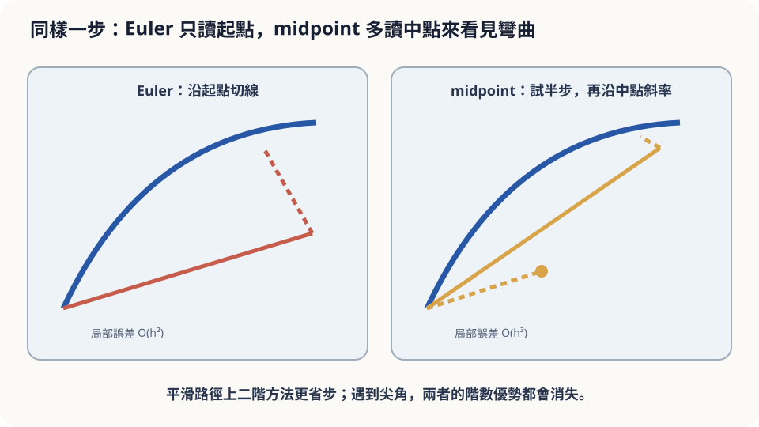

import Objectives from '../../../components/Objectives.astro';
import Prereq from '../../../components/Prereq.astro';
import Question from '../../../components/Question.astro';
import Answer from '../../../components/Answer.astro';
import QuizBlock from '../../../components/QuizBlock.astro';
import Option from '../../../components/Option.astro';
import Explanation from '../../../components/Explanation.astro';
import Details from '../../../components/Details.astro';
import Bridge from '../../../components/Bridge.astro';
import Ref from '../../../components/Ref.astro';
import UsedBy from '../../../components/UsedBy.astro';

# 在 30 秒的中點多看一眼：高階方法

<Objectives>
- **寫出 Heun 法與 midpoint 法的更新式。** 用 Taylor 展開說明它們的局部誤差為什麼是 $h^3$（全域二階）。
- **說出「階數」與「每步成本」的取捨：在相同的方向讀取次數下比較誤差。** 說出高階方法何時贏、何時不贏。
- **對「導航多讀一次方向值不值得」這類情境做判斷、說出它依賴的假設（路夠 smooth、預算夠多）。** 用一個小模擬在相同讀取次數下對照兩種方法。
</Objectives>

<Prereq items={frontmatter.prereqs} />

## 同一條彎道，多一次讀取

上一篇（<Ref to="math-euler-error"/>）的導航每 30 秒讀一次方向、中間直走，追一條半徑 2 公里的四分之一圓，終點偏了 486 公尺。要更準，最直接的辦法是讀得更頻繁：每 10 秒讀一次，誤差降到 161 公尺，但讀取次數變成三倍。

Euler 把整段 velocity 都當成起點值，就像用一個長方形近似曲線下的面積。如果再知道終點附近的 velocity，我們就能改用梯形；或在中點看一次，使用更接近整段平均的速度。**這次讀取能不能補回 Euler 漏掉的加速度項？** 先看多出的資訊怎麼進入更新式，再比較它是否值得。

<Question id="Q1">
翻成數學。「在中點多看一眼」寫成更新式是什麼？它和 Euler 的差別在哪一項？我們要比較的量該怎麼定才公平？

<Answer>
課堂上會先寫出「中點的方向」：先用 Euler 走半步找到中點的大概位置，在那裡讀方向，再用那個方向從**起點**走整步：

$$
k_1=v(x_n,t_n),\qquad k_2=v\!\big(x_n+\tfrac{h}{2}k_1,\;t_n+\tfrac h2\big),\qquad x_{n+1}=x_n+h\,k_2 .
$$

這叫 **midpoint 法**。同一個想法的另一個版本是 **Heun 法**：用 Euler 先走到終點的大概位置，在那裡讀方向，然後用起點與終點方向的**平均**走整步：

$$
k_1=v(x_n,t_n),\qquad k_2=v(x_n+h\,k_1,\;t_n+h),\qquad x_{n+1}=x_n+\tfrac h2(k_1+k_2).
$$

兩者與 Euler 的差別都只在「用哪個方向走這一步」：Euler 用起點的方向；midpoint 用中點的；Heun 用兩端的平均。

**公平的比較不是「同樣的 $h$」，而是「同樣的讀取次數」**，因為讀取（評估 $v$）才是成本。這裡的量叫 **number of function evaluations**（NFE）。Euler 一步一次，Heun 與 midpoint 一步兩次。所以要比的是：Euler 用 $h=15$ 秒（12 次讀取）對上 midpoint 用 $h=30$ 秒（同樣 12 次）。
</Answer>
</Question>

## 切線 vs 弦

回到那段圓弧。Euler 沿著起點的**切線**走，一步就離開圓；步長越長、離得越遠，離開的量是 $h^2$ 的量級。

圓弧中點的切線與兩端的弦平行，比起沿起點切線走，更接近真正的整段位移。不過方法使用的是**預測中點**，並不真的知道圓弧中點；走出的線段也不一定恰好落回圓上。這個圖像提示了為什麼可能更準，是否能補回二階項，仍要由展開確認。



*圖：midpoint 多讀一次向量場，以平滑問題上的二階精度換取較少步數。*

## 把 $h^2$ 那一項配掉

假設場在相關區域夠 smooth，導數也有共同上界。從精確位置 $x_t$ 出發，上一篇定義的加速度給出

$$
x_{t+h}=x_t+h v_t(x_t)+\tfrac{h^2}{2}a_t(x_t)+O(h^3).
$$

**先看 Heun。** 預測終點是 $\tilde x_{t+h}=x_t+h v_t(x_t)$。同時對位置和時間做一階展開：

$$
\begin{aligned}
v_{t+h}(\tilde x_{t+h})
&=v_t(x_t)+h\partial_t v_t(x_t)
+h\nabla_xv_t(x_t)\,v_t(x_t)+O(h^2)\\
&=v_t(x_t)+h a_t(x_t)+O(h^2).
\end{aligned}
$$

兩個 velocity 的平均因此是 $v_t(x_t)+\frac h2a_t(x_t)+O(h^2)$。乘上步長 $h$：

$$
x_t+\tfrac h2\big(v_t(x_t)+v_{t+h}(\tilde x_{t+h})\big)
=x_t+h v_t(x_t)+\tfrac{h^2}{2}a_t(x_t)+O(h^3).
$$

這次與精確解對到了二階。Midpoint 同理：在預測半步上讀到的 velocity 是 $v_t(x_t)+\frac h2a_t(x_t)+O(h^2)$，乘上 $h$ 後也得到相同的二階項。

**全域誤差。** 接著照 <Ref to="math-euler-error"/> 的 Grönwall 論證走一遍，只是局部誤差從 $Ch^2$ 換成 $Ch^3$：$N=T/h$ 步累積後是 $O(h^2)$。所以 Heun 與 midpoint 是**二階方法**：$h$ 縮一半，誤差縮四倍；Euler 是一階，縮一半只縮一半。

一般地，一個方法若局部誤差是 $O(h^{p+1})$、全域誤差就是 $O(h^p)$，叫 **order $p$**。Euler $p=1$，Heun 與 midpoint $p=2$，經典的 Runge–Kutta 四階法 $p=4$（每步四次讀取）。這一族方法的系統設計見 [1, 2]。

<Details summary="從數值積分看同一件事（v 只依賴 t 的情形）">
若 v = v(t) 不依賴 x，ODE 的解就是積分 x(t+h) = x(t) + ∫ₜ^(t+h) v(s) ds，三種方法對應三種數值積分規則：
- Euler：h·v(t)，左端點法則。誤差 (h²/2)v′ + …
- Midpoint：h·v(t+h/2)，中點法則。把 v 在中點 m 展開，奇數次項對稱相消，誤差 = ∫ ½v″(m)(s−m)² ds = (h³/24)v″(m)。
- Heun：(h/2)[v(t)+v(t+h)]，梯形法則。v(t)+v(t+h) = 2v(m) + v″(m)(h/2)² + …，所以誤差 = (h³/8 − h³/24)v″ = (h³/12)v″(m)。
這些是只依賴時間時的領先誤差項，大小還取決於速度的二階導數。當場也依賴位置時，誤差常數會有其他項，不能用 1/24 與 1/12 直接預測兩種 ODE solver 的誤差比例。
</Details>

## 贏在哪、什麼時候不贏

回答起點問題。中點多讀一次，$h=30$ 秒的 midpoint 誤差是 7 公尺，Heun 是 23 公尺——都遠好於「每 10 秒讀一次」的 Euler（161 公尺，而且那還多用了 50% 的讀取）。直覺的「好一倍」錯在把方法的改進想成**線性**的：多一次讀取不是多修正一半，而是把誤差的主項整個消掉、換成下一階。

但要說清楚這個好處依賴什麼：

- **場要夠 smooth。** 上面的餘項估計需要相關導數有界。若 velocity 有跳躍或不可微，不能直接使用二階證明；實際階數還要看不平滑的形式，以及是否另外定位事件。
- **預算要夠多。** 二階方法的誤差 $\approx C_2(2T/E)^2$、一階的 $\approx C_1(T/E)$（$E$ 是總讀取次數，二階方法每步用兩次所以步長是 $2T/E$）。$E$ 大時 $1/E^2$ 必勝 $1/E$；但 $E$ 很小（例如全程只讀兩三次）時，$C_2\cdot4T^2/E^2$ 未必小於 $C_1T/E$——**高階方法在極粗的步長下不保證比較好**。
- **高階不等於任意大步都穩定。** 對 $dx_t/dt=-kx_t$，Heun 與 midpoint 的更新因子都是 $1-hk+(hk)^2/2$；沿負實軸的穩定步長範圍仍是 $0<hk<2$，不能只因階數提高就放大步長。

## 同樣的讀取次數比一次

```python
import numpy as np
R, v = 2000.0, 60/3.6; T = (np.pi/2)*R/v
def u(x): r = np.hypot(*x); return v*np.array([-x[1], x[0]])/r
def run(method, nfe):
    steps = nfe if method == 'euler' else nfe//2
    h = T/steps; x = np.array([R, 0.0])
    for _ in range(steps):
        k1 = u(x)
        if method == 'euler': x = x + h*k1
        else:                 x = x + h*u(x + 0.5*h*k1)      # midpoint
    return np.linalg.norm(x - np.array([0.0, R]))
for nfe in [12, 38, 126]:
    print(nfe, round(run('euler', nfe)), round(run('midpoint', nfe), 1))
# 12 次：Euler 約 252 m、midpoint 7 m；38 次：82 m 對 0.8 m；126 次：25 m 對 0.08 m
```

同樣的讀取次數，二階方法的誤差每次都少一到兩個數量級，而且讀取越多差距越大（一階縮三倍時二階縮九倍）。接著違反假設：把圓弧路換成一條有 90 度**尖角**的折線路（$v$ 在角上不連續）。兩種方法在跨過尖角的那一步都會偏，偏的量都是 $O(h)$；跑一次會看到 midpoint 的優勢從兩個數量級掉到不到一倍。

<iframe loading="lazy" src="/personal_website/notes/research_areas/mathematical-foundations/m2-deterministic-dynamics/m2-4-1.html" class="demo-frame" title="固定 NFE：Euler 與 midpoint，平滑路與尖角路" style="height: 800px; width: 100%; border: none;"></iframe>

## 檢查理解

<QuizBlock id="m2-4-a">
一個天氣模擬每一步都要跑一次極貴的物理計算（一次讀取 $v$ 要一分鐘）。在總計算時間固定為一小時的前提下，下面哪個說法最合理？
<Option>用 Euler 走 60 步，因為步數最多、最細。</Option>
<Option>用四階 Runge–Kutta 走 15 步，因為階數越高一定越準。</Option>
<Option correct>要看場的 smooth 程度與 $60$ 次讀取夠不夠「多」：場 smooth 且預算不算極少時，高階方法在相同讀取次數下通常大勝；但若場有不連續（例如鋒面）或預算極少，優勢不保證。</Option>
<Explanation>
「步數最多所以最準」忽略了每步的誤差階數；「階數越高一定越準」忽略了每步成本與 smooth 假設。公平比較永遠是同樣的讀取次數，而結論取決於 $v$ 是否夠 smooth、以及 $h$ 是否已經小到高階項真正主導。
</Explanation>
</QuizBlock>

<QuizBlock id="m2-4-b">
你把導航從 Euler 換成 midpoint（同樣每 30 秒一步），發現在市區裡效果遠不如在高速公路上。最可能的原因是：
<Option correct>市區路線有很多直角轉彎，$v$ 在轉角處不可微，Taylor 展開在那些步失效，midpoint 退回一階。</Option>
<Option>市區車速慢，$\ddot x$ 太小，midpoint 沒有東西可以修正。</Option>
<Option>midpoint 在 autonomous 的場上才有效，市區的 $v$ 依賴時間。</Option>
<Explanation>
二階的證明用到 $v$ 的二階展開；尖角是最典型的違反。車速慢反而讓 $\|\ddot x\|=v^2/R$ 小、誤差本來就小，不會讓高階方法「變差」。time-dependent 的 $v$ 只是在展開裡多幾項，midpoint 與 Heun 對它一樣是二階。
</Explanation>
</QuizBlock>

<QuizBlock id="m2-4-c">
Heun 法用 $\tfrac h2(k_1+k_2)$，midpoint 用 $h\,k_2$（$k_2$ 在半步處）。兩者都是二階，是因為：
<Option>兩者都用了兩次讀取，讀取次數決定階數。</Option>
<Option correct>兩者的 Taylor 展開都與真實解在 $h$、$h^2$ 兩項上完全一致，只在 $h^3$ 開始不同——「消掉最低階的誤差項」才是階數的來源，讀取次數只是達成它的手段。</Option>
<Option>兩者都在終點讀了一次方向。</Option>
<Explanation>
讀取次數與階數不是一回事：也可以設計每步兩次讀取卻仍是一階的糟糕方法。midpoint 根本沒在終點讀方向。決定階數的是「與真實解的 Taylor 展開對到第幾項」。
</Explanation>
</QuizBlock>

<UsedBy slug={frontmatter.slug} />

<Bridge to="math-random-walk-brownian">
多看一次 velocity，讓我們捕捉了 Euler 漏掉的二階項；但仍是在計算一條確定的 ODE。若每一小段還有無法預測的擾動，兩片同時放下的葉子就可能走出不同的路。下一個單元從左右隨機走一步開始，建立描述這種運動的物件。
</Bridge>

## 參考文獻

1. Hairer, E., Nørsett, S. P., Wanner, G. [*Solving Ordinary Differential Equations I: Nonstiff Problems.*](https://doi.org/10.1007/978-3-540-78862-1) Springer, 2nd ed., 1993.（第 II.1 節：Runge–Kutta 方法的起源、Heun 與 midpoint、order 條件。）
2. Butcher, J. C. [*Numerical Methods for Ordinary Differential Equations.*](https://doi.org/10.1002/9781119121534) Wiley, 3rd ed., 2016.（第 3 章：Runge–Kutta 方法的階數理論與成本比較。）
