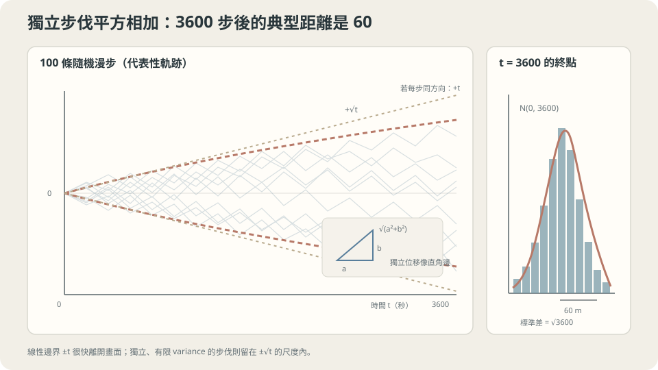

import Objectives from '../../../components/Objectives.astro';
import Prereq from '../../../components/Prereq.astro';
import Question from '../../../components/Question.astro';
import Answer from '../../../components/Answer.astro';
import QuizBlock from '../../../components/QuizBlock.astro';
import Option from '../../../components/Option.astro';
import Explanation from '../../../components/Explanation.astro';
import VizPlan from '../../../components/VizPlan.astro';
import Details from '../../../components/Details.astro';
import Bridge from '../../../components/Bridge.astro';
import Ref from '../../../components/Ref.astro';
import UsedBy from '../../../components/UsedBy.astro';

# 醉漢一小時後在哪：Random Walk 到 Brownian Motion

<Objectives>
- **算出 $n$ 步獨立 random walk 的 expectation 與 variance。** 說出「典型距離是 $\sqrt n$ 而不是 $n$」的原因是獨立步伐的交叉項為零。
- **說出把步長縮成 $\sqrt h$、步頻加快到 $1/h$ 取極限得到的 Brownian motion 有哪三個性質。** 解釋為什麼步長必須是 $\sqrt h$ 而不是 $h$。
- **對「隨機走一段時間後大概離起點多遠」這類情境判斷 $\sqrt t$ 規律是否適用、說出它依賴的假設（獨立、有限 variance）。** 用模擬驗證與破壞它。
</Objectives>

<Prereq items={frontmatter.prereqs} />

## 一條長街，一個喝醉的人

深夜，一條筆直的長街。一個喝醉的人站在路燈下，每一秒鐘隨機往左或往右踏一步，一步一公尺，左右各半、跟上一步完全無關。一小時後，他大概離路燈多遠？

左右有機會抵消，所以不能把 3600 步直接加成 3600 公尺。但也不會每次剛好回到路燈下。**要怎麼描述這種「有時偏左、有時偏右」的距離？** 平均位置可能是零，散開程度卻不是零；先選對要計算的量，才能知道時間增加後會走多遠。

<Question id="Q1">
翻成數學。「每秒隨機一步」是什麼隨機變數？「一小時後的位置」是什麼？「大概離多遠」該用哪個量來衡量——為什麼不能直接算「平均位置」？

<Answer>
課堂上第一個答案通常是「算平均位置」，然後發現平均位置是 0（左右對稱），這顯然不是「大概多遠」的意思——他不會一直站在路燈下。

寫清楚：第 $i$ 秒的那一步是隨機變數 $\xi_i\in\{-1,+1\}$，各半機率，且 $\xi_1,\xi_2,\dots$ 彼此 **independent**（互不影響）。一小時後的位置是

$$
S_n=\xi_1+\xi_2+\cdots+\xi_n,\qquad n=3600 .
$$

$S_n$ 是隨機變數，這個過程叫 **random walk**（隨機漫步）。「大概多遠」問的不是 $\mathbb E[S_n]$（它是 0），而是 $S_n$ 的**散開程度**：最方便的量是 variance $\mathrm{Var}(S_n)=\mathbb E[S_n^2]$，它的平方根 $\sqrt{\mathbb E[S_n^2]}$——均方根距離——才是「典型的離家距離」。

所以問題變成：$\mathrm{Var}(S_n)$ 怎麼隨 $n$ 長？
</Answer>
</Question>

## 抵消的不是距離，是方向

想像把一小時的 3600 步分成兩段，各 1800 步。第一段走完他在某處，第二段從那裡重新開始。第二段有一半機率往回走、一半機率繼續往外——所以第二段**平均而言既不把他帶遠、也不把他帶回**。兩段合起來的距離，不是兩段距離相加（那是「一直往同一邊」才會有的事），也不是互相抵消（那是「第二段剛好反向」才會有的事），而是介於中間：像直角三角形的兩條邊，合起來的長度是**平方和再開根號**。

這不是說一維的腳步真的互相垂直，而是期望中的交叉項會消失，留下平方和。3600 步的**均方根距離**是 60 公尺；它不是每次必走的距離，也不是平均絕對距離，後者在 Gaussian 近似下約為 $60\sqrt{2/\pi}\approx48$ 公尺。



*圖：獨立、有限 variance 的步伐在 √t 尺度內擴散；3600 步的終點標準差是 60，並逐漸接近 Gaussian。*

## variance 相加、極限、$\sqrt h$

**定理。** 若 $\xi_1,\dots,\xi_n$ independent、$\mathbb E[\xi_i]=0$、$\mathrm{Var}(\xi_i)=\sigma^2$，則 $\mathbb E[S_n]=0$、$\mathrm{Var}(S_n)=n\sigma^2$。

證明（五行）。展開平方：

$$
\mathbb E[S_n^2]=\mathbb E\Big[\sum_i\xi_i^2+\sum_{i\ne j}\xi_i\xi_j\Big]=\sum_i\mathbb E[\xi_i^2]+\sum_{i\ne j}\mathbb E[\xi_i]\,\mathbb E[\xi_j]=n\sigma^2+0 .
$$

第二個等號用了 independence：$\mathbb E[\xi_i\xi_j]=\mathbb E[\xi_i]\mathbb E[\xi_j]$；第三個等號用了 $\mathbb E[\xi_i]=0$。**交叉項全部消失**——這就是「垂直的邊」的代數版本。$\square$

所以均方根距離是 $\sigma\sqrt n$。若腳步還是**同分布**的，就可使用 iid 的中央極限定理：$S_n/\sqrt n$ 趨近 $\mathcal N(0,\sigma^2)$。這是非 Gaussian 小步的極限結論，不是 Gaussian 加法封閉性；只有獨立、各自有限 variance，而沒有其他條件，不能直接套用這個版本。

**取極限：Brownian motion。** 現在把時間切細。每 $h$ 秒走一步，走到時刻 $t$ 需要 $t/h$ 步。若步長維持 $\delta$，$\mathrm{Var}=\delta^2 t/h$；要讓 $h\to0$ 時位置不退化（既不停在原地、也不爆到無限遠），必須讓 $\delta^2/h$ 維持常數——**步長必須是 $\sqrt h$ 的尺度**，$\delta=\sqrt h$。這樣極限下的過程 $W_t$ 有三個性質：

1. $W_0=0$，$W_t\sim\mathcal N(0,t)$；
2. **增量獨立且平穩**：對 $s<t$，$W_t-W_s\sim\mathcal N(0,t-s)$，且與 $W_s$ 之前的一切 independent；
3. 軌跡 continuous。

這個極限叫 **Brownian motion**（或 Wiener process）[3]。性質 2 用一句話說就是：**時間 $h$ 內的位移是一個 $\sqrt h\,\varepsilon$，$\varepsilon\sim\mathcal N(0,1)$。** 這句話是下一篇模擬 SDE 的全部依據。

<Details summary="為什麼步長取 h 會讓一切消失、取常數會爆掉">
步長 δ、步頻 1/h，走到時刻 t 的 variance 是 δ²·(t/h)。
- δ = h（步長與時間同尺度，像等速前進）：variance = h·t → 0。極限是靜止不動——「隨機成分」在細分之下蒸發了。這也是為什麼把噪聲寫成「每步加 h·ε」是錯的。
- δ = 常數：variance = δ²t/h → ∞。爆掉。
- δ = √h：variance = t，有限且非零，且不依賴 h。只有這個尺度能活到極限。
√h 尺度提示了為什麼不能把增量除以 h 當成普通速度；但這個尺度觀察本身不是不可微的完整證明。Brownian motion 的軌跡幾乎必然連續且處處不可微，是另外的定理 [3]。因此下一篇會用增量與隨機積分，而不是普通的速度導數。
</Details>

## 平均回到原點，不表示每次都回去

$\mathbb E[S_n]=0$ 與均方根距離 60 可以同時成立：一批人偏左、另一批人偏右，平均位置仍是原點。個別人也可能走到幾百公尺外，只是比較少見；不能由一次偏遠的結果，就推論腳步一定有相關。

若改成傾向沿上一步繼續走，就要重新計算交叉項。下面採用特定模型：初始方向左右各半，每步以 $(1+\rho)/2$ 的機率保持方向，$|\rho|<1$，因此相隔 $k$ 步的 covariance 是 $\sigma^2\rho^k$。此時大 $n$ 下 variance 約為 $n\sigma^2(1+\rho)/(1-\rho)$，仍是平方根尺度但係數改變。**只知道相鄰兩步的相關係數，還不足以推出這個公式。** 若 variance 不存在，則這裡的均方根量與 Gaussian 極限定理都不能直接使用。

<Details summary="相關步伐的 variance（AR(1) 型的 ±1 步）">
令每步以機率 (1+ρ)/2 與上一步同向、否則反向，則 E[ξᵢξᵢ₊ₖ] = ρ^k。
Var(Sₙ) = Σᵢ E[ξᵢ²] + 2Σᵢ\<ⱼ E[ξᵢξⱼ] = n + 2Σₖ₌₁ⁿ⁻¹ (n−k)ρ^k ≈ n[1 + 2ρ/(1−ρ)] = n(1+ρ)/(1−ρ)（大 n 時）。
ρ = 0 回到 n；ρ → 1（永遠同向）時因子發散，對應 Var ~ n² 的「等速前進」；ρ \< 0（傾向折返）因子小於 1，走得比獨立更近。指數仍是 √n，改變的只是常數——除非 ρ 本身隨 n 趨近 1。
</Details>

## 模擬一次，再把假設弄壞

```python
import numpy as np
rng = np.random.default_rng(0)
def walk(n=3600, rho=0.0, trials=5000):
    keep = rng.random((trials, n)) < (1+rho)/2       # 這一步是否沿用上一步的方向
    flips = np.where(keep, 1, -1); flips[:, 0] = 1
    steps = rng.choice([-1, 1], trials)[:, None] * np.cumprod(flips, axis=1)
    return np.sqrt(np.mean(steps.sum(axis=1)**2))       # 均方根距離
for rho in [0.0, 0.5, 0.9]:
    print(rho, round(walk(rho=rho)), round(60*np.sqrt((1+rho)/(1-rho))))
# 0.0: 60 對 60；0.5: 103 對 104；0.9: 257 對 262（模擬值隨種子略有變動）
```

獨立時模擬與 $\sqrt{3600}=60$ 吻合；加入相關，均方根距離按 $\sqrt{(1+\rho)/(1-\rho)}$ 放大，理論預測與模擬一致——而且指數仍是 $\tfrac12$（把 $n$ 改成 14400 再跑，距離變兩倍）。最後把步長換成重尾分佈（例如 Cauchy），均方根距離會隨 trials 增加而不收斂：這時 variance 不存在，$\sqrt n$ 規律與 Gaussian 極限都失效。

<iframe loading="lazy" src="/personal_website/notes/research_areas/mathematical-foundations/m3-stochastic-dynamics/m3-0-1.html" class="demo-frame" title="醉漢的平方根時間：步長、相關與重尾" style="height: 820px; width: 100%; border: none;"></iframe>

## 檢查理解

<QuizBlock id="m3-0-a">
一個感測器每次讀值的誤差獨立、期望為零、標準差 1 個單位。把 250 次誤差加總，均方根大小約為：
<Option>250 個單位。</Option>
<Option correct>約 16 個單位，因為獨立誤差的 variance 相加。</Option>
<Option>約 1 個單位，因為正負會抵消。</Option>
<Explanation>
這是同一個 variance 相加的問題：$n=250$、$\sigma=1$，故均方根為 $\sqrt{250}$。注意這裡算的是**加總**；若計算 250 次讀值的平均，其誤差標準差反而是 $1/\sqrt{250}$。
</Explanation>
</QuizBlock>

<QuizBlock id="m3-0-b">
若醉漢每一步都**強烈傾向**沿著上一步的方向（相鄰步相關 $\rho=0.9$），一小時後的典型距離：
<Option>還是 60 公尺，相關不影響 variance。</Option>
<Option>變成 3600 公尺，因為他幾乎一直往同一邊走。</Option>
<Option correct>約 260 公尺——仍按 $\sqrt n$ 長，但常數被 $\sqrt{(1+\rho)/(1-\rho)}\approx4.4$ 放大；只有 $\rho\to1$ 才會退化成 $n$。</Option>
<Explanation>
相關讓交叉項 $\mathbb E[\xi_i\xi_j]$ 不再為零，variance 多出 $2\sum(n-k)\rho^k$，大 $n$ 時是 $n$ 的常數倍，指數不變。「一直同一邊」對應 $\rho=1$，$0.9$ 離它還很遠——反向的機率是 $(1-\rho)/2=5\%$，所以平均每二十步才換一次方向。
</Explanation>
</QuizBlock>

<QuizBlock id="m3-0-c">
用電腦模擬 Brownian motion，每步時間 $h=0.001$。每步該加的隨機位移是：
<Option>$h\,\varepsilon$，$\varepsilon\sim\mathcal N(0,1)$。</Option>
<Option correct>$\sqrt h\,\varepsilon$，$\varepsilon\sim\mathcal N(0,1)$——這樣 $t/h$ 步的 variance 是 $t$，與 $h$ 無關。</Option>
<Option>$\varepsilon$，不需要縮放。</Option>
<Explanation>
加 $h\varepsilon$ 的 variance 是 $h^2\cdot t/h=ht\to0$，把 $h$ 縮小噪聲就消失，模擬結果會隨 $h$ 改變——這是實作 SDE 最常見的錯誤。不縮放則 variance 是 $t/h\to\infty$。只有 $\sqrt h$ 給出與 $h$ 無關的 $\mathrm{Var}(W_t)=t$。
</Explanation>
</QuizBlock>

<UsedBy slug={frontmatter.slug} />

<Bridge to="math-sde">
本篇用「variance 相加、交叉項為零」解釋了為什麼隨機漫步的距離按 $\sqrt t$ 長，並取極限得到 Brownian motion：時間 $h$ 內的位移是 $\sqrt h\,\varepsilon$。接著把這個隨機成分加回河裡——水流是確定的、亂流是隨機的，葉子怎麼漂、電腦怎麼模擬。
</Bridge>

## 參考文獻

1. Grimmett, G., Stirzaker, D. *Probability and Random Processes.* Oxford University Press, 3rd ed., 2001.（第 3 章 random walk；第 13 章 Brownian motion 的定義與性質。）
2. Feller, W. *An Introduction to Probability Theory and Its Applications, Vol. 1.* Wiley, 3rd ed., 1968.（第 III 章：簡單 random walk 的組合與極限。）
3. Mörters, P., Peres, Y. [*Brownian Motion.*](https://doi.org/10.1017/CBO9780511750489) Cambridge University Press, 2010.（第 1 章：Brownian motion 的存在、增量獨立、軌跡連續但不可微。）
4. Einstein, A. [*Über die von der molekularkinetischen Theorie der Wärme geforderte Bewegung von in ruhenden Flüssigkeiten suspendierten Teilchen.*](https://doi.org/10.1002/andp.19053220806) Annalen der Physik 17, 1905.（歷史出處：懸浮粒子的均方位移與時間成正比。）
