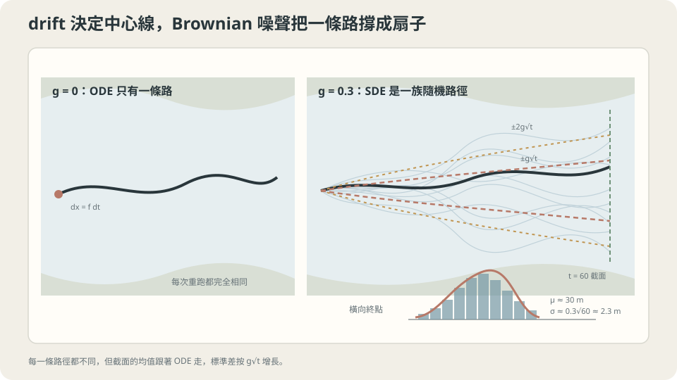

import Objectives from '../../../components/Objectives.astro';
import Prereq from '../../../components/Prereq.astro';
import Question from '../../../components/Question.astro';
import Answer from '../../../components/Answer.astro';
import QuizBlock from '../../../components/QuizBlock.astro';
import Option from '../../../components/Option.astro';
import Explanation from '../../../components/Explanation.astro';
import VizPlan from '../../../components/VizPlan.astro';
import Details from '../../../components/Details.astro';
import Bridge from '../../../components/Bridge.astro';
import Ref from '../../../components/Ref.astro';
import UsedBy from '../../../components/UsedBy.astro';

# 水流加亂流：SDE 是加了噪聲的 ODE

<Objectives>
- **把 $dx=f(x,t)\,dt+g(t)\,dW_t$ 讀成「每一小步 $h$：確定地走 $f h$，再加一個 $g\sqrt h\,\varepsilon$ 的 Gaussian」。** 說出 $f$（drift）與 $g$（diffusion coefficient）各控制什麼。
- **寫出 Euler–Maruyama 法。** 說明為什麼噪聲項是 $\sqrt h$ 而不是 $h$、為什麼 SDE 的「解」是一個分佈而不是一條路。
- **對「有亂流的河裡葉子會漂到哪」這類情境，判斷用 SDE 模擬是否恰當、說出它依賴的假設（噪聲是 Brownian 增量、$g$ 不依賴 $x$）。** 用模擬驗證與破壞它。
</Objectives>

<Prereq items={frontmatter.prereqs} />

## 同一條河，多了亂流

回到 <Ref to="math-vector-field-ode"/> 的那條河，但這次看得更仔細。水面有一個穩定的主流，每秒把東西往下游帶 0.5 公尺；水面也有**亂流**——無數細小的渦旋，每一瞬間隨機地把葉子往左或往右推一點，推的方向與前一瞬間無關。

你在橋下放一片葉子。一分鐘後它在哪？

先用直覺回答，並寫下你有多確定。多數人會說「大概在下游 30 公尺處，左右晃一點」。這個答案的骨架是對的，但兩件事說不清楚：「晃一點」是多少——一公分、一公尺、十公尺？以及如果你想用電腦模擬這片葉子，每一步該加多大的隨機推力？上一篇（<Ref to="math-random-walk-brownian"/>）給了一個提示：亂流的累積效果按 $\sqrt t$ 長。這一篇把水流與亂流放在同一條式子裡。

<Question id="Q1">
翻成數學。「主流」與「亂流」各是什麼物件？「一分鐘後的位置」是什麼——一個數、還是一個分佈？把 ODE $\dot x=f(x,t)$ 改成含亂流的版本，該怎麼寫？

<Answer>
課堂上通常先寫 $\dot x=f(x,t)+\text{噪聲}$，然後卡在「噪聲怎麼寫」。上一篇已經告訴我們答案：Brownian motion 沒有速度（$\sqrt h/h\to\infty$），所以不能寫成 $\dot x$ 的形式，只能寫**增量**。

先把 ODE 改寫成增量：在一小段時間 $h$ 內，$x(t+h)-x(t)\approx f(x,t)\,h$。亂流在這段時間內的推力是 Brownian motion 的增量 $W_{t+h}-W_t\sim\mathcal N(0,h)$，乘上一個強度 $g$。合起來：

$$
x(t+h)-x(t)\;\approx\;f(x,t)\,h\;+\;g(t)\,\big(W_{t+h}-W_t\big).
$$

把 $h\to0$ 的這個關係記成

$$
dx_t=f(x_t,t)\,dt+g(t)\,dW_t .
$$

這叫 **SDE**（stochastic differential equation）。**主流是 $f$**，叫 **drift**（確定的推動）；**亂流的強度是 $g$**，叫 **diffusion coefficient**（隨機的擴散）。「一分鐘後的位置」$x_{60}$ 是一個**隨機變數**——每片葉子走出不同的路；我們能問的是它的**分佈**：均值、標準差、長什麼形狀。這與 ODE 的根本差別：ODE 的解是一條路，SDE 的解是一個分佈隨時間的演化。
</Answer>
</Question>

## 一條路變成一把扇子

ODE 的葉子畫出一條線。SDE 的葉子每一瞬間被隨機推一下，畫出一條抖動的線；放一百片葉子，一百條抖動的線從同一點出發，往下游張開成一把**扇子**——中心線是 drift 帶著走的那條 ODE 軌跡，扇子的寬度按 $g\sqrt t$ 長。

所以 SDE 可以拆成兩個你已經認識的東西疊起來：**一條 ODE 的路**（<Ref to="math-vector-field-ode"/>）加上**一個 random walk 的散開**（<Ref to="math-random-walk-brownian"/>）。drift 決定扇子往哪彎，$g$ 決定扇子多寬。



*圖：SDE 的中心線由 drift 決定，路徑扇面的典型寬度由 g√t 決定。*

## 讀法、模擬、以及為什麼是 $\sqrt h$

**讀法就是定義（本課程採用的層次）。** 給 $f$、$g$，SDE $dx=f\,dt+g\,dW$ 的意思是：對任何很小的 $h$，

$$
x_{t+h}=x_t+f(x_t,t)\,h+g(t)\sqrt h\,\varepsilon_t,\qquad \varepsilon_t\sim\mathcal N(0,I)\ \text{彼此 independent},
$$

且 $h\to0$ 時這串點的分佈收斂。嚴格的定義需要 Itô 積分 [3]，這門課刻意不走那條路：上面這個讀法在 $g$ 不依賴 $x$ 時與嚴格定義一致，而且它**就是**演算法。

**Euler–Maruyama 法。** 把讀法直接寫成迴圈：

$$
x_{n+1}=x_n+h\,f(x_n,t_n)+g(t_n)\sqrt h\,\varepsilon_n .
$$

它是 <Ref to="math-euler-error"/> 的 Euler 法加一項噪聲；$g\equiv0$ 時就退回 Euler。

**為什麼是 $\sqrt h$。** 三行檢查。走到 $T$ 需要 $N=T/h$ 步，噪聲項的總和是 $\sum_n g\sqrt h\,\varepsilon_n$，independent Gaussian 相加、variance 相加（<Ref to="math-gaussian"/>）：

$$
\mathrm{Var}\Big(\sum_{n=0}^{N-1}g\sqrt h\,\varepsilon_n\Big)=N\,g^2h=g^2T .
$$

與 $h$ **無關**——把步長切細，亂流的總效果不變，這是模擬應有的性質。若寫成 $g\,h\,\varepsilon_n$，總 variance 是 $g^2hT\to0$，步長越細亂流越小，模擬結果會隨你選的 $h$ 改變——這不是一個合法的模型。$\square$

**一個能對答案的例子。** $f\equiv c$（等速主流）、$g$ 常數：把讀法從 $0$ 加到 $T$，$x_T=x_0+cT+g\sum\sqrt h\varepsilon_n$，後面那個和是 $\mathcal N(0,g^2T)$，所以

$$
x_T\sim\mathcal N\big(x_0+cT,\;g^2T\big).
$$

$c=0.5$、$g=0.3$、$T=60$：均值 30 公尺、標準差 $0.3\sqrt{60}\approx2.3$ 公尺。這就是「晃一點」的大小。

<Details summary="這門課不用 Itô 積分，代價是什麼">
上面的讀法有一個隱藏的選擇：噪聲強度 g 在每一步用的是步「起點」的值。當 g 只依賴 t，起點、中點或終點的 g 在 h → 0 時沒有差別。當 g 依賴 x（例如亂流在河中央比岸邊強），差別就出現了：用起點的 g(xₙ) 對應 Itô 的定義，用中點對應 Stratonovich 的定義，兩者的極限是不同的過程，差一個 ½ g ∂ₓg 的 drift。這門課只處理 g = g(t) 的情形，所以不需要區分；遇到 g(x) 時要另外學 Itô 引理 [1, 3]。另一個代價是我們沒有證明「h → 0 時分佈收斂」——這是本 class 最後一篇（<Ref to="math-weak-strong-convergence"/>）與 [4] 的內容。
</Details>

## 直覺的骨架對了，數字補上了

起點問題的答案：一分鐘後葉子在下游約 30 公尺處，左右偏差的標準差約 2.3 公尺——95% 的葉子落在 $30\pm4.6$ 公尺內。直覺的「晃一點」沒錯，但它說不出 2.3 這個數字從哪來：來自 $g\sqrt T$，也就是 <Ref to="math-random-walk-brownian"/> 的 $\sqrt t$ 規律。

這個判斷依賴的假設：**亂流的推力是 Brownian 增量**——每一瞬間 independent、Gaussian、variance 與時間成正比。以及 **$g$ 不依賴位置**。真實的河兩者都不完全成立：渦旋有大小，推力在一個渦旋的時間尺度內是**相關**的（那會像上一篇的 $\rho>0$，把有效的 $g$ 放大）；河中央的亂流比岸邊強（$g$ 依賴 $x$，進入展開框裡說的 Itô 領域）。理論告訴你這兩件事會往哪個方向偏；偏多少，要靠實作。

## 模擬一次，再用錯誤的尺度模擬一次

```python
import numpy as np
rng = np.random.default_rng(0)
def em(f, g, x0, T, h, trials=20000, noise_scale='sqrt'):
    x = np.full(trials, x0); N = int(round(T/h))
    for n in range(N):
        eps = rng.standard_normal(trials)
        step = np.sqrt(h) if noise_scale == 'sqrt' else h      # 正確 vs 錯誤的尺度
        x = x + h*f(x) + g*step*eps
    return x
for h in [1.0, 0.1, 0.01]:
    ok  = em(lambda x: 0.5, 0.3, 0.0, 60.0, h)
    bad = em(lambda x: 0.5, 0.3, 0.0, 60.0, h, noise_scale='h')
    print(h, round(ok.mean(),2), round(ok.std(),2), '| h-scaled std:', round(bad.std(),3))
# 均值 30.0、標準差 2.32，與 h 無關；用 h 當尺度時標準差 2.3 → 0.73 → 0.23，隨 h 消失
```

用 $\sqrt h$ 時三種步長給出同樣的均值與標準差，與理論 $\mathcal N(30,2.32^2)$ 一致——這是「模型合法」的實作證據。用 $h$ 時標準差每縮 $h$ 十倍就縮 $\sqrt{10}$ 倍，模擬結果取決於你選的步長，理論預告的失敗兌現了。再進一步違反假設：把 $\varepsilon_n$ 換成前後相關的序列（例如 $\varepsilon_n=\rho\varepsilon_{n-1}+\sqrt{1-\rho^2}\eta_n$），標準差會被放大，且放大的倍數隨 $h$ 改變——噪聲不再是 Brownian 增量，SDE 的讀法不再適用。

<iframe loading="lazy" src="/personal_website/notes/research_areas/mathematical-foundations/m3-stochastic-dynamics/m3-1-1.html" class="demo-frame" title="Euler–Maruyama：噪聲尺度與路徑扇面" style="height: 840px; width: 100%; border: none;"></iframe>

## 檢查理解

<QuizBlock id="m3-1-a">
一個電池的電量每小時穩定下降 2%，同時因為溫度波動每小時隨機上下浮動、浮動彼此獨立。要模擬 24 小時後電量的分佈，該用哪個工具？
<Option>ODE $\dot x=-0.02x$，因為浮動會平均掉。</Option>
<Option correct>SDE $dx=-0.02x\,dt+g\,dW$，用 Euler–Maruyama 模擬多條路徑，看終點的分佈——浮動的累積效果按 $\sqrt t$ 長，不會平均掉。</Option>
<Option>Random walk，因為主要是隨機浮動。</Option>
<Explanation>
「浮動會平均掉」是把期望值當成典型值——獨立浮動累積起來是 $g\sqrt{24}$ 的標準差，不是零；只用 ODE 會給出一個確定的數字、漏掉不確定性。只用 random walk 則漏掉確定的下降趨勢。兩者疊起來就是 SDE。
</Explanation>
</QuizBlock>

<QuizBlock id="m3-1-b">
同事的 Euler–Maruyama 程式把噪聲寫成 `x += h*f(x) + g*h*eps`。他發現把 $h$ 從 0.1 改成 0.01 之後，模擬出的分佈變窄了很多。正確的診斷是：
<Option>步長變小本來就會讓結果更精確、更集中。</Option>
<Option correct>噪聲尺度寫錯了——應該是 $g\sqrt h\,\varepsilon$；用 $h$ 時噪聲的總 variance 是 $g^2hT$，隨 $h$ 消失，所以結果依賴步長，不是變精確。</Option>
<Option>隨機數產生器的問題。</Option>
<Explanation>
一個合法的模型，步長縮小時結果應該**收斂到一個固定的分佈**，而不是持續改變。「更集中」是噪聲被 $h$ 壓掉的假象。檢查方法就是本篇那三行：$N$ 步噪聲的 variance 應該與 $h$ 無關。
</Explanation>
</QuizBlock>

<QuizBlock id="m3-1-c">
SDE $dx=f\,dt+g\,dW$ 裡，若 $g$ 依賴位置 $x$（河中央亂流較強），本篇的讀法「每步用起點的 $g(x_n)$」：
<Option>完全沒有問題，和 $g$ 只依賴 $t$ 時一樣。</Option>
<Option>會讓模擬發散。</Option>
<Option correct>對應到 Itô 意義下的 SDE；若改用中點的 $g$ 會得到另一個不同的極限過程（Stratonovich）。本課程只處理 $g=g(t)$，所以不必區分，但遇到 $g(x)$ 時必須明確選一種。</Option>
<Explanation>
$g$ 依賴 $x$ 時，「在步的哪個位置評估 $g$」在 $h\to0$ 後仍留下 $\tfrac12 g\,\partial_xg$ 量級的差別，這是 Itô 與 Stratonovich 的分歧點。模擬不會發散，只是兩種寫法對應兩個不同的模型；不能說「完全沒問題」。
</Explanation>
</QuizBlock>

<UsedBy slug={frontmatter.slug} />

<Bridge to="math-fokker-planck">
本篇把 SDE 讀成「每一小步走 $fh$、加 $g\sqrt h\,\varepsilon$」，看到它的解是一把扇子而不是一條路，並用 variance 與 $h$ 無關來檢驗 $\sqrt h$。一片葉子的分佈我們用模擬得到；接著像 <Ref to="math-continuity-equation"/> 那樣，不追葉子，直接寫下這個分佈自己滿足的方程式。
</Bridge>

## 參考文獻

1. Särkkä, S., Solin, A. [*Applied Stochastic Differential Equations.*](https://users.aalto.fi/~ssarkka/pub/sde_book.pdf) Cambridge University Press, 2019.（第 2–4 章：SDE 的直覺讀法、Itô 與 Stratonovich 的差別、Euler–Maruyama。）
2. Higham, D. J. [*An Algorithmic Introduction to Numerical Simulation of Stochastic Differential Equations.*](https://doi.org/10.1137/S0036144500378302) SIAM Review 43(3), 2001.（用十幾行 MATLAB 建立 Brownian motion 與 Euler–Maruyama 的教學經典。）
3. Øksendal, B. [*Stochastic Differential Equations: An Introduction with Applications.*](https://doi.org/10.1007/978-3-642-14394-6) Springer, 6th ed., 2003.（第 3–5 章：Itô 積分與 SDE 的嚴格定義——本課程刻意略過的部分。）
4. Kloeden, P. E., Platen, E. [*Numerical Solution of Stochastic Differential Equations.*](https://doi.org/10.1007/978-3-662-12616-5) Springer, 1992.（第 9–10 章：Euler–Maruyama 的收斂性。）
