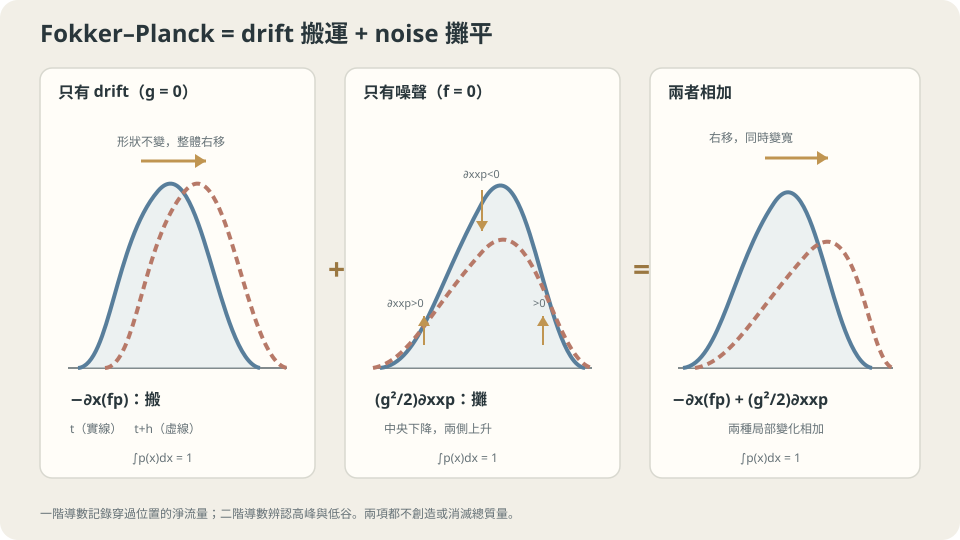

import Objectives from '../../../components/Objectives.astro';
import Prereq from '../../../components/Prereq.astro';
import Question from '../../../components/Question.astro';
import Answer from '../../../components/Answer.astro';
import QuizBlock from '../../../components/QuizBlock.astro';
import Option from '../../../components/Option.astro';
import Explanation from '../../../components/Explanation.astro';
import VizPlan from '../../../components/VizPlan.astro';
import Details from '../../../components/Details.astro';
import Bridge from '../../../components/Bridge.astro';
import Ref from '../../../components/Ref.astro';
import UsedBy from '../../../components/UsedBy.astro';

# 一千片葉子在亂流裡：Fokker–Planck 方程式

<Objectives>
- **寫出 Fokker–Planck 方程式 $\partial_tp=-\nabla\cdot(fp)+\tfrac{g^2}{2}\Delta p$。** 用「drift 搬質量、噪聲攤平質量」說出兩項各從哪來。
- **掌握「代入驗證」的技巧：把一個猜到的 $p_t$ 代進方程式兩邊、確認相等。** 在純 Brownian motion 上做一次，驗證 $p_t=\mathcal N(0,t)$。
- **分清 Brownian SDE、有限步模擬與 diffusion limit。** 說出本篇 $g=g(t)$、各方向相同強度的假設，以及代入驗證還需要檢查的初始條件。
</Objectives>

<Prereq items={frontmatter.prereqs} />

## 一千片葉子，有亂流的河

<Ref to="math-continuity-equation"/> 問過：一群葉子在**沒有亂流**的河裡，分佈怎麼演化？答案是 continuity equation——不追葉子，每個位置記帳「進 − 出」。<Ref to="math-sde"/> 則把亂流加回河裡，但只追了**一片**葉子，看到它的路變成一把扇子。

現在兩件事合起來：一千片葉子，從橋下一小塊水面出發，河裡既有主流也有亂流。一分鐘後，這一千片葉子的分佈是什麼樣子？

主流會搬運葉子，噪聲又讓相同起點的葉子散開。像兩塊相鄰地磚：若左邊的人比較多，即使每個人左右隨機走，從左邊走過來的人也會比較多。**這種隨機移動，會在 density 的記帳式裡多出哪一項？** 我們延續「流進減流出」，但要先算噪聲造成的淨流量。

<Question id="Q1">
翻成數學。「一千片葉子的分佈」是什麼物件？把 continuity equation 的「進 − 出」記帳法套到有亂流的河上，多出了什麼？

<Answer>
這一題可以直接對上前面的語言：一千片葉子是從 $p_0$ 抽出的樣本，每片各自照 SDE $dx=f\,dt+g\,dW$ 走（<Ref to="math-sde"/>），一分鐘後它們是 $p_{60}$ 的樣本。我們要的是密度 $p(x,t)$ 隨時間的方程式。

記帳法還能用，但一塊地磚上的人數變化現在有**兩種**來源。第一種和以前一樣：drift $f$ 讓葉子以確定的速度穿過地磚的邊，淨流入是 $-\nabla\cdot(fp)$。第二種是新的：亂流讓葉子**隨機**跨過邊界——隔壁地磚葉子多，隨機跳過來的就多；這塊葉子多，隨機跳出去的也多。所以亂流造成的淨流入，正比於「隔壁比我多多少」，也就是密度的**二階導數**（<Ref to="math-taylor"/>：一點與它兩側平均值的差，就是二階導數）。密度凹下去的地方（局部低谷）會被填、凸起來的地方（局部高峰）會被削——這就是「攤平」。

所以要找的方程式長得像：$\partial_tp=(\text{drift 搬})+(\text{噪聲攤})$，第一項是 $-\nabla\cdot(fp)$，第二項與 $\Delta p=\nabla\cdot\nabla p$（Laplacian，二階導數的總和）成正比，係數要算。
</Answer>
</Question>

## 一坨顏料在流水裡

把一千片葉子想成一滴顏料滴進河裡。主流把整滴顏料**搬**到下游——形狀跟著水流變形，這是 <Ref to="math-continuity-equation"/> 已經處理過的事。亂流則讓顏料**滲開**：邊緣越來越淡、範圍越來越大，中心的濃度越來越低，但顏料的總量不變。

兩件事同時發生：被搬走的同時也在滲開。關鍵是它們可以**分開算再加起來**——因為在一小步 $h$ 內，drift 的位移是 $fh$、噪聲的位移是 $g\sqrt h\,\varepsilon$，兩者對密度的影響到 $h$ 的一階是各自獨立的。



*圖：drift 以一階導數搬運質量，noise 以二階導數削峰填谷；兩項都守恆總機率。*

## 一步之內，搬與攤各貢獻多少

先算**攤**的係數。一維、$f=0$：在一小步 $h$ 內每片葉子被隨機推 $g\sqrt h\,\varepsilon$，所以新密度是舊密度與 $\mathcal N(0,g^2h)$ 的 convolution：

$$
p(x,t+h)=\mathbb E_\varepsilon\big[p(x-g\sqrt h\,\varepsilon,\,t)\big].
$$

把 $p(x-y)$ 對 $y$ Taylor 展開（<Ref to="math-taylor"/>）到二階、再對 $\varepsilon$ 取期望：$\mathbb E[\varepsilon]=0$ 殺掉一階項，$\mathbb E[\varepsilon^2]=1$ 留下二階項：

$$
p(x,t+h)=p-\,g\sqrt h\,\mathbb E[\varepsilon]\,\partial_xp+\tfrac{g^2h}{2}\,\mathbb E[\varepsilon^2]\,\partial_{xx}p+O(h^{3/2})
=p+\tfrac{g^2h}{2}\,\partial_{xx}p+O(h^{3/2}).
$$

兩邊減 $p$、除以 $h$、令 $h\to0$：$\partial_tp=\tfrac{g^2}{2}\partial_{xx}p$。這就是「攤」的係數：$g^2/2$。$\square$

**搬**的部分就是 continuity equation（<Ref to="math-continuity-equation"/>）：$\partial_tp=-\partial_x(fp)$。一步之內兩者的貢獻都是 $O(h)$，交叉影響是更高階的小量，所以相加：

$$
\boxed{\;\partial_tp=-\partial_x(f\,p)+\tfrac{g^2}{2}\,\partial_{xx}p\;}\qquad
\text{（多維：}\ \partial_tp=-\nabla\cdot(f\,p)+\tfrac{g^2}{2}\,\Delta p\text{）}
$$

這就是 **Fokker–Planck 方程式**（也叫 forward Kolmogorov equation）[1–4]。它是 SDE 的「守格子」版本：<Ref to="math-sde"/> 追一片葉子，這裡直接演化整個分佈——正如 <Ref to="math-continuity-equation"/> 之於 <Ref to="math-vector-field-ode"/>。

**代入驗證的技巧。** 解 PDE 很難，但**驗證一個候選解**很容易：把它代進兩邊，看是否相等。純 Brownian motion（$f=0$、$g=1$）從原點出發，<Ref to="math-random-walk-brownian"/> 說 $p_t=\mathcal N(0,t)$。驗證：

$$
p=\frac{1}{\sqrt{2\pi t}}e^{-x^2/2t},\qquad
\partial_xp=-\frac{x}{t}\,p,\qquad
\partial_{xx}p=\Big(-\frac1t+\frac{x^2}{t^2}\Big)p,\qquad
\partial_tp=\Big(-\frac{1}{2t}+\frac{x^2}{2t^2}\Big)p .
$$

右邊 $\tfrac12\partial_{xx}p=\big(-\tfrac{1}{2t}+\tfrac{x^2}{2t^2}\big)p=\partial_tp$，因此在 $t>0$ 滿足 PDE。還要檢查起點：$t\to0$ 時這個 Gaussian 集中到原點，對應初始 distribution $\delta_0$。只符合 PDE 而沒符合初始、邊界條件，不能說它就是我們要的解。

<Details summary="有 drift 的驗證：f = c 常數、g 常數，p_t = N(ct, g²t)">
記 m = ct、s = g²t，p = (2πs)^(−1/2) exp(−(x−m)²/(2s))。
∂ₓp = −((x−m)/s)·p；∂ₓₓp = (−1/s + (x−m)²/s²)·p。
∂ₜp：對 log p 微分，m′ = c、s′ = g²，得 ∂ₜp = [−g²/(2s) + c(x−m)/s + g²(x−m)²/(2s²)]·p。
右邊：−∂ₓ(cp) = c(x−m)/s·p；(g²/2)∂ₓₓp = [−g²/(2s) + g²(x−m)²/(2s²)]·p。相加恰為 ∂ₜp。✓
這也是 SDE 那一篇「x_T ~ N(x₀+cT, g²T)」的 PDE 版證明。

順帶一提：(g²/2)Δp = ∇·((g²/2)∇p) = ∇·(p·(g²/2)∇log p)，所以 Fokker–Planck 也可以寫成 continuity equation 的形式 ∂ₜp + ∇·(p·u) = 0，u = f − (g²/2)∇log p。同一條 p_t，可以由「SDE 的一群葉子」產生，也可以由「ODE 的一群葉子」產生——這是 continuity equation 那一篇「同一分佈路徑有多個速度場」的又一個例子，只是這次其中一個速度場藏在噪聲裡。
</Details>

## 直覺對了，多了三個數字

固定 drift、固定 $g$ 的特例，中心平移、variance 按 $g^2t$ 增加。一般 drift 也會壓縮或拉開人群，不能照搬這個寬度公式；一維下有 $\frac{d}{dt}\mathrm{Var}(x_t)=2\mathrm{Cov}(x_t,f(x_t,t))+g(t)^2$。Diffusion 項在局部削峰填谷，但和 drift 合起來後，distribution 仍可能維持多個峰。

主流不均勻時兩項會互動：收攏的 drift（$\partial_xf<0$）把分佈壓窄，噪聲把它攤寬，最後可能達到平衡——下一篇（<Ref to="math-langevin"/>）就是這件事。

這裡先處理 Brownian SDE，$g=g(t)$ 是不依賴位置的 scalar，Brownian motion 的各方向獨立且強度相同。若 $g=g(x,t)$，一維的 Itô 版本要改成 $\frac12\partial_{xx}(g^2p)$，不能把 $g^2$ 移出微分。另一方面，iid 的非 Gaussian 小步在適當的 diffusion limit 下也能得到同一條 PDE，但那是極限的結果，不表示有限步增量已經是 Brownian noise。

## 直方圖對上 PDE，再換一種噪聲

```python
import numpy as np
rng = np.random.default_rng(0)
c, g, T, h = 0.5, 0.3, 60.0, 0.1
x = np.zeros(20000)
for _ in range(int(T/h)):                      # 一千片（這裡兩萬片）葉子各走 SDE
    x = x + h*c + g*np.sqrt(h)*rng.standard_normal(x.size)
hist, edges = np.histogram(x, bins=60, density=True)
mid = 0.5*(edges[1:] + edges[:-1])
p_theory = np.exp(-(mid - c*T)**2/(2*g**2*T))/np.sqrt(2*np.pi*g**2*T)   # Fokker–Planck 的解
print(np.abs(hist - p_theory).max())          # 小，且隨葉子數增加而縮小
# 違反假設：把 standard_normal 換成 standard_cauchy，直方圖尾巴變厚、方差不收斂
```

直方圖可以與 $\mathcal N(cT,g^2T)$ 對照。把噪聲換成 Cauchy 後，不能沿用相同的推導；在 $\sqrt h$ 尺度下反覆累加 Cauchy，也不會得到固定尺度的 Brownian 極限。要建立另一種隨機模型，必須重新選擇縮放與對應的演化方程。

<iframe loading="lazy" src="/personal_website/notes/research_areas/mathematical-foundations/m3-stochastic-dynamics/m3-2-1.html" class="demo-frame" title="Fokker–Planck：粒子直方圖與密度方程" style="height: 880px; width: 100%; border: none;"></iframe>

*有限步提醒：同 variance 的 uniform 增量只在 $h\to0$ 的擴散極限與 Gaussian 對應同一條 Fokker–Planck 方程；有限 $h$ 時，直方圖仍保留單步分布的差異。*

## 檢查理解

<QuizBlock id="m3-2-a">
一杯靜水裡滴一滴墨水（沒有攪動）。三十秒後墨水的濃度分佈，該用哪個工具描述？
<Option>Continuity equation，因為墨水在水裡流動。</Option>
<Option correct>Fokker–Planck 方程式在 $f=0$ 的特例 $\partial_tp=\tfrac{g^2}{2}\Delta p$（熱傳導方程式）：沒有主流，只有分子碰撞造成的隨機位移，濃度的 variance 隨時間線性增加。</Option>
<Option>ODE，因為每個墨水分子有確定的路徑。</Option>
<Explanation>
靜水沒有 drift，continuity equation 的 $-\nabla\cdot(fp)$ 是零，什麼都不會發生——但墨水明明會散開，散開來自分子的隨機碰撞，那是二階項。墨水分子的路徑是隨機的（這正是 Einstein 1905 年解釋 Brownian motion 的情境），不是 ODE。
</Explanation>
</QuizBlock>

<QuizBlock id="m3-2-b">
你把 $p_t=\mathcal N(0,t)$ 代進 $\partial_tp=\tfrac12\partial_{xx}p$ 驗證成功。若改用 $p_t=\mathcal N(0,t^2)$（標準差按 $t$ 長）代進去：
<Option>也會成立，因為 Gaussian 永遠是解。</Option>
<Option correct>不成立——$\partial_tp$ 會多出一個因子 $2t$，兩邊對不上；這正是 variance 必須「按 $t$ 線性長」而不是「標準差按 $t$ 長」的 PDE 版證據。</Option>
<Option>成立，只要把 $g$ 改成 $2$。</Option>
<Explanation>
Gaussian 不是「永遠」是解，只有 variance 等於 $g^2t$（加常數）的那一族才是。$\mathcal N(0,t^2)$ 對應的是 <Ref to="math-random-walk-brownian"/> 裡「每步同向」的 $t$ 尺度，不是 Brownian 的 $\sqrt t$ 尺度；改 $g$ 只能改斜率，改不了 $t$ 對 $t^2$ 的差別。代入驗證的價值正在這裡：它能否決錯誤的猜測。
</Explanation>
</QuizBlock>

<QuizBlock id="m3-2-c">
把 SDE 的 Gaussian noise 換成同樣 variance 的均勻分佈噪聲（每步 $g\sqrt h\,\varepsilon$，$\varepsilon$ 均勻於 $[-\sqrt3,\sqrt3]$），Fokker–Planck 方程式：
<Option>失效，因為方程式的推導假設噪聲是 Gaussian。</Option>
<Option>右邊的係數 $g^2/2$ 要改。</Option>
<Option correct>在 $h\to0$ 的極限下仍然成立、係數不變——推導只用了 $\mathbb E[\varepsilon]=0$、$\mathbb E[\varepsilon^2]=1$ 與更高階矩有限，Gaussian 不是必要條件；失效的是重尾（variance 無限）的噪聲。</Option>
<Explanation>
回看 Taylor 展開：一階項靠 $\mathbb E[\varepsilon]=0$ 消掉，二階項的係數只看 $\mathbb E[\varepsilon^2]$，三階以上乘的是 $h^{3/2}$ 以上、只要那些矩有限就會消失。這也是中央極限定理的精神：很多小步加起來，單步的形狀不重要。均勻噪聲的 variance 已經正規化成 1，係數自然不變。
</Explanation>
</QuizBlock>

<UsedBy slug={frontmatter.slug} />

<Bridge to="math-langevin">
現在可以描述搬運與 diffusion 同時發生時的 density 變化。若 drift 持續往低處拉，噪聲又持續讓人散開，能不能找到一個不再改變的 distribution？下一篇把河換成山谷，先找平衡，再分清「平衡存在」和「真的走到平衡」。
</Bridge>

## 參考文獻

1. Särkkä, S., Solin, A. [*Applied Stochastic Differential Equations.*](https://users.aalto.fi/~ssarkka/pub/sde_book.pdf) Cambridge University Press, 2019.（第 5 章：Fokker–Planck 方程式的推導與 Gaussian 情形的 closed form。）
2. Pavliotis, G. A. [*Stochastic Processes and Applications: Diffusion Processes, the Fokker–Planck and Langevin Equations.*](https://doi.org/10.1007/978-1-4939-1323-7) Springer, 2014.（第 4 章：forward Kolmogorov 方程式與其性質。）
3. Risken, H. [*The Fokker–Planck Equation: Methods of Solution and Applications.*](https://doi.org/10.1007/978-3-642-61544-3) Springer, 2nd ed., 1989.（專書；第 4 章推導，第 5 章一維解法。）
4. Gardiner, C. *Stochastic Methods: A Handbook for the Natural and Social Sciences.* Springer, 4th ed., 2009.（第 3、4 章：從 Kramers–Moyal 展開到 Fokker–Planck；本篇 Taylor 展開的來源。）
