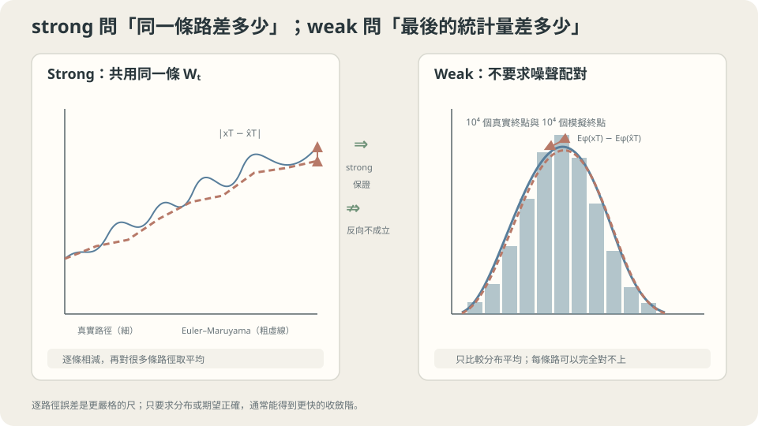

import Objectives from '../../../components/Objectives.astro';
import Prereq from '../../../components/Prereq.astro';
import Question from '../../../components/Question.astro';
import Answer from '../../../components/Answer.astro';
import QuizBlock from '../../../components/QuizBlock.astro';
import Option from '../../../components/Option.astro';
import Explanation from '../../../components/Explanation.astro';
import VizPlan from '../../../components/VizPlan.astro';
import Details from '../../../components/Details.astro';
import Bridge from '../../../components/Bridge.astro';
import Ref from '../../../components/Ref.astro';
import UsedBy from '../../../components/UsedBy.astro';

# 每條路徑對，還是最後的分佈對：Weak 與 Strong Convergence

<Objectives>
- **分清 strong error（逐路徑、同一組噪聲下比終點）與 weak error（只比終點分佈的平均）。** 寫出兩者的定義。
- **說出適當條件下 Euler–Maruyama 的一般 strong order $1/2$、weak order $1$。** 解釋 additive noise 為什麼可能得到更好的 strong order。
- **對一個模擬情境判斷該用哪一種誤差來衡量「模擬夠不夠準」、說出這個判斷依賴的假設（是否共用噪聲、被比較的量是否光滑）。** 用實驗驗證階數。
</Objectives>

<Prereq items={frontmatter.prereqs} />

## 一百條假的股價

你寫了一個程式模擬股價：每天的漲跌有一個平均趨勢，加上隨機波動——就是 <Ref to="math-sde"/> 的 SDE，用 Euler–Maruyama 一天一步跑一年。老闆問：「這個模擬準不準？」

你跑了一百條路徑，畫出來像一百條真的股價圖。但「準」是什麼意思？有兩種可能的回答，它們聽起來差不多、要求卻差很多：

1. **每一條路徑都對。** 如果真實世界擲出了某一串隨機的漲跌（同一組硬幣），我的模擬走出來的那條線，要跟「用同一串硬幣、但以無限小的步長算出來」的真實路徑幾乎重合。
2. **最後的分佈對。** 我不在乎哪一條線對哪一條，只在乎一年後價格的分佈——平均、變異、超過某個門檻的機率——跟真實的一樣。

就像比較兩批人的旅行：可以要求同一個人在兩種導航下走到接近的位置，也可以只比較兩批人最後的分布。**同一個 numerical method，在這兩種比較下會有相同的誤差嗎？** 先定義兩把尺，再決定要花多少計算。

<Question id="Q1">
把兩個要求翻成數學。「同一串硬幣」在 SDE 的語言裡是什麼？兩個要求各在比較哪個量？

<Answer>
最容易卡住的是「同一串硬幣」這個說法。<Ref to="math-random-walk-brownian"/> 說 SDE 裡的隨機性是一條 Brownian motion $W_t$；「同一串硬幣」就是**同一條 $W_t$ 的實現**。真實路徑 $x_T$ 是用這條 $W$ 走出來的極限，模擬路徑 $\hat x_T^{(h)}$ 是用同一條 $W$ 在步長 $h$ 下、每步只看 $\Delta W=W_{t+h}-W_t$ 走出來的。兩者共用噪聲，所以可以逐條相減。

**要求一**（strong）比較的是同一條噪聲下的終點差距，取期望：

$$
e_{\text{strong}}(h)=\mathbb E\big[\,|x_T-\hat x^{(h)}_T|\,\big].
$$

**要求二**（weak）只比較某個統計量，不要求逐條配對；是否在實驗中共用 noise，都不會改變這個定義：

$$
e_{\text{weak}}(h)=\big|\,\mathbb E[\varphi(x_T)]-\mathbb E[\varphi(\hat x^{(h)}_T)]\,\big|,
$$

對一類夠光滑的測試函數 $\varphi$（平均是 $\varphi(x)=x$、二階動差是 $x^2$、超過門檻的機率是一個平滑化的階梯函數）。weak 說的是**分佈**接近，strong 說的是**路徑**接近。

若 $\varphi$ 是 $K$-Lipschitz，則 $e_{\mathrm{weak}}\le K\,e_{\mathrm{strong}}$，因為 $|\mathbb E[\varphi(x_T)-\varphi(\hat x_T)]|\le\mathbb E|\varphi(x_T)-\varphi(\hat x_T)|$。所以這類 test function 的 weak error 可由 strong error 控制；對無界或不連續函數，還要額外的 moment 或 regularity 條件。反過來，相同 marginals 不保證同一條 noise 下的兩條路接近。
</Answer>
</Question>

## 兩把尺

想像兩位評審在看你的模擬。

第一位拿著真實路徑的描圖紙，把你的每一條線疊上去比，量每一對線終點的差距，取平均。這是 **strong** 的尺——它在意「這一條對這一條」。

第二位根本不看哪條對哪條。她把你的一百個終點倒進一個直方圖，把真實的一百個終點倒進另一個直方圖，比兩個直方圖像不像。這是 **weak** 的尺。

這兩種比較會保留不同的誤差：逐條相減時，正負的隨機偏移都算進距離；先取 expectation 時，有些零均值項會抵消。這提示 weak approximation 為什麼可能有較高階數，但不是所有 SDE、所有統計量都必然有不同速率。



*圖：strong error 共用噪聲逐路徑比較；weak error 只比較終點分布的期望。*

## 一個方法，兩個階數

<Ref to="math-euler-error"/> 對 ODE 說 Euler 的全域誤差是 $O(h)$。對 SDE，Euler–Maruyama 的結論是 [1, 2]：

$$
e_{\text{strong}}(h)\le C\,h^{1/2},\qquad e_{\text{weak}}(h)\le C'\,h^{1} .
$$

這是一般的收斂保證，需要 Lipschitz、growth 與 moment 條件；weak order $1$ 還需要係數及 test function 夠 smooth [1, 2]。不是說每個例子的誤差都剛好按這兩個速率下降：additive noise 可以有 strong order $1$，某些統計量甚至完全沒有偏差。下面用 multiplicative noise 看首個漏掉的項。

看最簡單的 SDE $dx=\sigma\,x\,dW_t$（沒有 drift，噪聲乘在 $x$ 上——這正是股價模型的骨架）。Euler–Maruyama 一步是 $\hat x_{t+h}=\hat x_t(1+\sigma\Delta W)$。真實的一步（用 Itô 的結果，這門課只引用）是 $x_{t+h}=x_t\exp(\sigma\Delta W-\tfrac12\sigma^2h)$。把指數展開到二階：

$$
x_{t+h}=x_t\Big(1+\sigma\Delta W+\tfrac12\sigma^2\big[(\Delta W)^2-h\big]+\dots\Big).
$$

Euler 少掉的那一項是 $\tfrac12\sigma^2x_t\big[(\Delta W)^2-h\big]$。現在用兩把尺量它：

- **Strong 的尺**看大小。$(\Delta W)^2-h$ 的標準差是 $\sqrt2\,h$。乘上當下的 $x_t$ 後，各步的項不再是 iid，但對已知的過去仍有 conditional mean 零。在適當 moment bound 下，這類 martingale differences 的二階矩可以累積成 $N\,O(h^2)$，開根號後得到 $O(\sqrt h)$。這是階數的來源，完整證明還要控制誤差傳播。
- **Weak 的尺**看它的**平均**。$\mathbb E[(\Delta W)^2-h]=0$——這一項在平均下**完全消失**。剩下的偏差來自更高階的項，每步 $O(h^2)$，$N$ 步累積成 $O(h)$。這就是 $h^1$。

一句話：**Euler 每步漏掉的主要誤差是一個零均值的隨機量。** 逐路徑比，它累積成 $\sqrt h$；只比分佈，它平均掉了，剩下的是 $h$。

<Details summary="一般 SDE 的版本：為什麼 strong 是 1/2、weak 是 1（Kloeden & Platen 的兩個定理）">
一般 dx = f(x)dt + g(x)dW。Euler–Maruyama 的單步展開比真實解少掉的首項是 ½ g(x)g′(x)[(ΔW)² − h]（Itô–Taylor 展開的下一項；補上它就是 Milstein 方法，strong order 升到 1）。

Strong：這一項的 L² 大小是 $O(h)$。在適當係數與 moment 條件下，martingale differences 的二階矩累積後給出 $O(\sqrt h)$；仍要另外控制傳播誤差。Additive noise 讓這個首項消失，夠平滑的 drift 下可提高到 strong order 1，並不是只看 g 為常數就不需其他條件。

Weak：對 smooth test function $\varphi$，令 $u(t,x)=\mathbb E[\varphi(x_T)\mid x_t=x]$。利用 backward Kolmogorov equation 展開期望，可在相應 smoothness 與 growth 條件下得到單步 $O(h^2)$、全域 $O(h)$。Indicator 不符合這個證明的前提，其 rate 要另外分析；不能直接指定為 $1/2$。完整條件與證明見 [1,4]。
</Details>

## 該拿哪把尺

回答老闆。「準不準」取決於他要拿模擬做什麼：

- 若要比較某個終點統計量，例如 mean 或 second moment，就看對應的 weak error。$O(h)$ 只給速率，還有未知常數，不能單憑一天一步就說已經夠準。
- 若要在同一條 Brownian noise 下比較精確解與 numerical approximation，就看 strong error。這是數學上指定的 coupling，不是要求程式預測真實世界下一次發生的隨機路徑。

抽樣問題通常重視 distribution，但不能只檢查一個 mean 就說整個 distribution 都對。也可以用 Wasserstein 等距離；strong coupling 有時正好提供它的上界。要選哪把尺，取決於用途，不是只要「生成樣本」就永遠不用 strong analysis。

對 indicator function，不能直接套用上面 smooth test function 的證明，但也不能直接宣布一定降成 $1/2$ 階；diffusion 的平滑性與其他條件可能保住更好的速率。共用 noise 則只是 coupling 的選擇，也可以用來降低 weak error 估計的 Monte Carlo variance。

## 把兩條斜率量出來

```python
import numpy as np
rng = np.random.default_rng(1)
sigma, T, M = 1.0, 1.0, 20000                              # M = 路徑數（步數在下面叫 N = T/h）
W_fine = np.cumsum(np.sqrt(1/4096) * rng.standard_normal((M, 4096)), axis=1)   # 一條「真實」Brownian motion
x_true = np.exp(sigma * W_fine[:, -1] - 0.5 * sigma**2 * T)                     # dx = σ x dW 的精確解（Itô）
for h in [1/16, 1/64, 1/256]:
    k = int(4096 * h)
    dW = np.diff(np.concatenate([np.zeros((M, 1)), W_fine[:, k-1::k]], axis=1), axis=1)  # 同一條 W，粗步長
    x_em = np.prod(1 + sigma * dW, axis=1)
    strong = np.abs(x_em - x_true).mean()                       # 共用噪聲，逐路徑比
    weak_exact = abs((1 + sigma**2 * h)**(T/h) - np.exp(sigma**2 * T))   # φ(x)=x²：E[x̂²] 有 closed form，真值是 e
    weak_mc    = abs((x_em**2).mean() - np.exp(sigma**2 * T))   # 同一個量用 20000 條路徑估
    print(f"h={h:.4f}  strong={strong:.3f}  weak(exact)={weak_exact:.4f}  weak(MC)={weak_mc:.3f}")
# 期待：h 縮 4 倍，strong 約減半（order 1/2）、weak(exact) 約減 4 倍（order 1）；weak(MC) 被抽樣誤差蓋住
```

三個步長下，strong error 大約是 $0.145\to0.071\to0.035$——步長每縮 4 倍誤差減半，斜率 $\tfrac12$。weak error 對 $\varphi(x)=x^2$ 可以精確算（$\mathbb E[\hat x_T^2]=(1+\sigma^2h)^{T/h}$，真值是 $e^{\sigma^2T}=e$）：$0.085\to0.021\to0.0053$，每次減 4 倍，斜率 $1$。把兩條線畫在 log–log 圖上，一條 $\tfrac12$、一條 $1$。

順帶看 `weak(MC)` 那一欄：用兩萬條路徑估同一個量，數字大約在 $0.03$–$0.08$ 之間跳、幾乎不隨 $h$ 下降——因為 $x_T^2$ 的抽樣誤差（$\approx20/\sqrt{20000}\approx0.14$）早就大過離散化偏差。這正是後面 quiz 要問的事：瓶頸已經不在步長。

（為什麼不用 $\varphi(x)=x$？因為 $\mathbb E[\hat x_T]=1$ 對任何 $h$ 都**精確**成立——Euler–Maruyama 保住了這個 SDE 的平均，weak error 恰為零。挑一個會出錯的 $\varphi$ 才量得到斜率。）

可以再比較 $\varphi(x)=\mathbf 1[x>1]$。它不符合這裡的 smoothness 前提，所以要另做分析，不能預先指定實測斜率。若把兩條解的 noise 改成獨立抽取，逐條終點距離也不再是剛才定義的 strong approximation error；兩個精確樣本本來就可能離得很遠。

<iframe loading="lazy" src="/personal_website/notes/research_areas/mathematical-foundations/m3-stochastic-dynamics/m3-4-1.html" class="demo-frame" title="Weak 與 strong convergence 的收斂階" style="height: 820px; width: 100%; border: none;"></iframe>

## 檢查理解

<QuizBlock id="m3-4-a">
氣象局用 SDE 模擬明天氣溫，跑一萬次，只發布「明天氣溫超過 30 度的機率」。衡量這個模擬準不準，該看：
<Option>strong error，因為每一次模擬都要跟真實的明天一樣。</Option>
<Option correct>weak error（對 $\varphi=\mathbf 1[x>30]$ 或它的平滑版本）——發布的是一個分佈的統計量，沒有任何一條模擬路徑需要對上真實的那一條。</Option>
<Option>兩者都要，缺一不可。</Option>
<Explanation>
發布的是 distribution 的統計量，因此直接相關的是 weak error。Strong error 仍可以在數學上的共用-noise coupling 下定義，只是不要求某一條模擬對上明天的實際路徑。Indicator 不 smooth，所以它的收斂階數需要另外檢查；平滑門檻則會增加另一種 approximation bias。
</Explanation>
</QuizBlock>

<QuizBlock id="m3-4-b">
你把 $dx=\sigma x\,dW$ 換成 additive noise 的 $dx=-x\,dt+dW$，再量 Euler–Maruyama 的 strong error。斜率會：
<Option>仍是 $\tfrac12$，因為 Euler 的 strong order 永遠是 $\tfrac12$。</Option>
<Option correct>變成 $1$——每步漏掉的首項 $\tfrac12 g g'[(\Delta W)^2-h]$ 在 $g$ 是常數時恆為零，Euler 與 Milstein 在這裡是同一個方法。</Option>
<Option>變成 $0$，因為 additive noise 沒有誤差。</Option>
<Explanation>
strong order $\tfrac12$ 來自噪聲係數 $g(x)$ 隨 $x$ 變化那一項；$g$ 是常數時它消失，剩下的誤差來自 drift 的離散化，是 $O(h)$。但誤差不會是零——drift $-x$ 仍然被 Euler 近似。
</Explanation>
</QuizBlock>

<QuizBlock id="m3-4-c">
「weak error 已經小於 Monte Carlo 的抽樣誤差」這句話的正確解讀是：
<Option>模擬已經完全正確，不必再改進。</Option>
<Option>應該繼續縮小步長，直到 weak error 為零。</Option>
<Option correct>繼續縮小步長對最後的估計幾乎沒有幫助——瓶頸已經不在離散化，而在樣本數；要更準，該增加路徑數而不是步數。</Option>
<Explanation>
最後的估計有兩個誤差來源：離散化偏差（隨 $h$ 下降）與抽樣誤差（隨 $1/\sqrt M$ 下降，$M$ 是路徑數——別和步數 $N=T/h$ 混在一起）。當前者已遠小於後者，計算預算該花在 $M$ 上。這是理論（階數）與實作（實際數字）合起來才能做的判斷。
</Explanation>
</QuizBlock>

<UsedBy slug={frontmatter.slug} />

<Bridge to="math-markov-chain">
現在可以分開 trajectory error、distribution 的統計量偏差，以及有限樣本的 Monte Carlo error。接下來把連續位置換成有限個狀態：如果明天的天氣只依賴今天，能不能用一張轉移機率表，算出很多天後的 distribution？
</Bridge>

## 參考文獻

1. Kloeden, P. E., Platen, E. [*Numerical Solution of Stochastic Differential Equations.*](https://doi.org/10.1007/978-3-662-12616-5) Springer, 1992.（第 9.6 節 strong convergence 定義、第 9.7 節 weak convergence 定義；第 10.2 節 Euler 的 strong order 1/2；第 14.1 節 weak order 1。）
2. Higham, D. J. [*An Algorithmic Introduction to Numerical Simulation of Stochastic Differential Equations.*](https://doi.org/10.1137/S0036144500378302) SIAM Review 43(3), 2001.（用 $dx=\lambda x\,dt+\mu x\,dW$ 逐段實作並量出兩個階數的教學文章；本篇程式的原型。）
3. Särkkä, S., Solin, A. [*Applied Stochastic Differential Equations.*](https://users.aalto.fi/~ssarkka/pub/sde_book.pdf) Cambridge University Press, 2019.（第 8 章：Euler–Maruyama、Milstein、strong 與 weak order。）
4. Milstein, G. N., Tretyakov, M. V. [*Stochastic Numerics for Mathematical Physics.*](https://doi.org/10.1007/978-3-662-10063-9) Springer, 2004.（weak approximation 的一般理論與對 $\varphi$ 光滑性的要求。）
