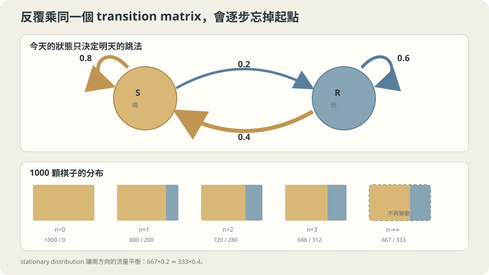

import Objectives from '../../../components/Objectives.astro';
import Prereq from '../../../components/Prereq.astro';
import Question from '../../../components/Question.astro';
import Answer from '../../../components/Answer.astro';
import QuizBlock from '../../../components/QuizBlock.astro';
import Option from '../../../components/Option.astro';
import Explanation from '../../../components/Explanation.astro';
import VizPlan from '../../../components/VizPlan.astro';
import Details from '../../../components/Details.astro';
import Bridge from '../../../components/Bridge.astro';
import Ref from '../../../components/Ref.astro';
import UsedBy from '../../../components/UsedBy.astro';

# 明天的天氣只看今天：Markov Chain 與 Transition Matrix

<Objectives>
- **把「下一步只依賴現在」這句話寫成 transition matrix $P$。** 用矩陣乘法算出「走 $n$ 步後在哪裡」的分佈 $p_n=p_0P^n$。
- **定義 stationary distribution $\pi$、手算一個 2 狀態的例子。** 說出「一百天後的分佈跟今天無關」是在什麼條件下成立、多快成立。
- **對一個生活情境（天氣、排隊、網頁點擊）判斷「用 Markov chain 建模」是否合理、說出它依賴的假設（只看現在、規則不隨時間變）。** 用模擬驗證理論給的數字。
</Objectives>

<Prereq items={frontmatter.prereqs} />

## 從一份氣象紀錄開始

你手上有一個城市過去幾年的天氣紀錄，每天只記「晴」或「雨」。翻過幾頁之後你發現一個規律：**晴天的隔天有八成還是晴天；雨天的隔天有四成會放晴。** 沒有別的訊息——前天、上週、季節都先不看。

今天是晴天。請先用直覺回答兩個問題，並且寫下你有多確定、依據是什麼：

1. 接下來三天**都是**晴天的機率大概多少？
2. 一百天之後那一天是晴天的機率大概多少？——它還跟「今天是晴天」有關嗎？

第一題多數人會算 $0.8\times0.8\times0.8\approx0.51$，而且很有信心。第二題的答案就分歧了：有人說「一百天太遠了，跟今天無關，晴雨各半」；有人說「晴天比較黏，應該晴天多一點，大概六成？」；也有人說「八成」，因為「天氣傾向不變」。這三個答案裡只有一個對，而且對的那個人通常也說不出**為什麼是那個數字**、以及**什麼時候這個數字會失效**。這一篇就是要把這件事說清楚。

<Question id="Q1">
先不急著算。把「晴天的隔天八成晴、雨天的隔天四成晴」翻成數學：這裡的隨機變數是什麼？我們要算的量又是什麼？「只看今天」這個假設在數學上要怎麼寫？

<Answer>
最直覺的說法是「隨機變數是天氣」，這是對的但不夠精確——每一天各有一個。令 $X_n\in\{\text{S},\text{R}\}$ 是第 $n$ 天的天氣（S 晴、R 雨），$n=0$ 是今天。一整串 $X_0,X_1,X_2,\dots$ 是一個 **stochastic process**（隨時間演進的一串隨機變數）。

「只看今天」寫成一條關於 conditional probability 的等式：

$$
\Pr(X_{n+1}=y\mid X_n=x,\ X_{n-1},\dots,X_0)=\Pr(X_{n+1}=y\mid X_n=x).
$$

給了今天，再多給過去任何資訊都**不改變**明天的分佈。這叫 **Markov property**。紀錄裡那兩個數字則是另一個假設：$\Pr(X_{n+1}=y\mid X_n=x)$ **不隨 $n$ 變**（time-homogeneous，規則每天一樣）。

我們要算的量有兩個：第一題是一個聯合事件的機率 $\Pr(X_1=X_2=X_3=\text{S}\mid X_0=\text{S})$；第二題是一個邊際分佈 $\Pr(X_{100}=\text{S}\mid X_0=\text{S})$。兩個都只由那兩個數字決定——這正是 Markov property 的威力：整個過程的所有機率，都由「一步的規則」生出來。
</Answer>
</Question>

## 先抓住這個畫面

想像一顆棋子在兩個格子之間跳。每一天它擲一次骰子決定要不要換格子：站在「晴」格時，八成留下、兩成跳到「雨」格；站在「雨」格時，六成留下、四成跳回「晴」格。棋子沒有記憶——它不知道自己在這一格已經待了幾天，每天擲的骰子都一樣。

現在不放一顆棋子，放**一千顆**，全部從「晴」格出發。第一天結束後約八百顆留在「晴」、兩百顆到了「雨」。第二天，「晴」格裡的八百顆有八成留下（640），「雨」格裡的兩百顆有四成回來（80），所以「晴」格有 720 顆。第三天再算一次……你會看到「晴」格的數量往某個值靠過去，然後不再動。**那個不再動的分配，就是這一篇要找的東西。** 而「往它靠過去」的速度，決定了「一百天後跟今天有沒有關係」。



*圖：反覆套用同一個 transition matrix 會忘掉起點，並靠向流量平衡的 stationary distribution。*

## 把畫面寫成矩陣

把「一步的規則」排成一張表，列是今天、欄是明天：

$$
P=\begin{pmatrix} P(\text{S},\text{S}) & P(\text{S},\text{R})\\ P(\text{R},\text{S}) & P(\text{R},\text{R})\end{pmatrix}
=\begin{pmatrix}0.8&0.2\\0.4&0.6\end{pmatrix},\qquad P(x,y)=\Pr(X_{n+1}=y\mid X_n=x).
$$

這叫 **transition matrix**。它每一列的和都是 1（今天是 $x$，明天總得在某一格），元素都非負；符合這兩個條件的矩陣叫 stochastic matrix。

把「今天的分佈」寫成**列向量** $p_0=(\Pr(X_0=\text{S}),\Pr(X_0=\text{R}))$。明天的分佈是

$$
p_1(y)=\sum_x p_0(x)\,P(x,y)\quad\Longleftrightarrow\quad p_1=p_0P .
$$

這一行是 law of total probability：明天在 $y$，要嘛今天在 S 然後跳到 $y$，要嘛今天在 R 然後跳到 $y$。再走一天就是再乘一次，所以

$$
p_n=p_0P^n .
$$

**矩陣乘法就是「把一步的規則連續套 $n$ 次」。** 兩步的轉移 $P^2(x,y)=\sum_z P(x,z)P(z,y)$ 是「先到某個中繼 $z$、再到 $y$」對所有 $z$ 加總，這叫 Chapman–Kolmogorov 等式，它只是矩陣乘法的定義。

第一題現在是三個條件機率相乘（Markov property 讓每一步只看前一步）：

$$
\Pr(X_1=X_2=X_3=\text{S}\mid X_0=\text{S})=P(\text{S},\text{S})^3=0.8^3=0.512 .
$$

直覺答案對了，而且現在知道它為什麼對：三個 $0.8$ 能直接相乘，靠的正是 Markov property；如果「連晴兩天後第三天更容易下雨」，這條就不成立。

### 不再動的分配

一個分佈 $\pi$ 如果滿足

$$
\pi P=\pi,\qquad \sum_x\pi(x)=1,
$$

就叫 **stationary distribution**：今天的分配是 $\pi$，明天還是 $\pi$。用 2 狀態手算，$\pi P=\pi$ 的第一個分量是 $0.8\pi_\text{S}+0.4\pi_\text{R}=\pi_\text{S}$，整理成 $0.2\,\pi_\text{S}=0.4\,\pi_\text{R}$。讀法：**每天從 S 流出的量等於從 R 流回的量**（流量平衡）。加上 $\pi_\text{S}+\pi_\text{R}=1$ 得

$$
\pi=\Big(\tfrac23,\tfrac13\Big).
$$

一般地，$\pi$ 是 $P$ 對應 eigenvalue $1$ 的左 eigenvector。任何 stochastic matrix 都有 eigenvalue $1$（因為 $P\mathbb 1=\mathbb 1$，右 eigenvector 是全 1 向量），所以 $\pi$ 一定存在；有限狀態、且任兩格互相到得了（irreducible）時它唯一。

### 多快忘掉今天

第二題問的是 $p_{100}$。用 $\pi$ 把 $p_n(\text{S})$ 分解成「極限」加「離極限的差」。令 $d_n=p_n(\text{S})-\tfrac23$。從 $p_{n+1}(\text{S})=0.8\,p_n(\text{S})+0.4\,(1-p_n(\text{S}))=0.4\,p_n(\text{S})+0.4$ 可得

$$
d_{n+1}=0.4\,d_n\quad\Longrightarrow\quad p_n(\text{S})=\tfrac23+\Big(p_0(\text{S})-\tfrac23\Big)\,0.4^{\,n}.
$$

（驗算：$p_0(\text{S})=1$ 時 $p_1(\text{S})=\tfrac23+\tfrac13\cdot0.4=0.8$，正確。）那個 $0.4=0.8+0.6-1$ 是 $P$ 的第二個 eigenvalue $\lambda_2$。今天的影響每天縮成 $0.4$ 倍：五天後剩 $0.4^5\approx1\%$，一百天後是 $0.4^{100}\approx10^{-40}$，什麼都不剩。

所以第二題的答案是 $\tfrac23\approx0.667$，**跟今天是晴是雨無關**。「各半」錯在忽略了規則不對稱（晴天比雨天黏）；「八成」錯在把「一天的規則」當成「長期的比例」——晴天雖然八成留下，但一旦掉進雨天要花幾天才回來，長期比例是兩種黏性**相對強弱**的結果，$\pi_\text{S}/\pi_\text{R}=P(\text{R},\text{S})/P(\text{S},\text{R})=0.4/0.2=2$。

<Details summary="一般的收斂敘述：Perron–Frobenius 給的三件事">
有限狀態、irreducible（任兩格互相到得了）且 aperiodic（不會被鎖在固定的節拍裡，例如「每天一定換格」那種）的 chain，滿足：(i) stationary distribution $\pi$ 唯一；(ii) 對任何 $p_0$，$p_0P^n\to\pi$；(iii) 收斂速度是幾何的，$\|p_0P^n-\pi\|\le C\,|\lambda_2|^n$，其中 $\lambda_2$ 是 $P$ 絕對值第二大的 eigenvalue。上面 2 狀態的計算就是這個定理的手算版本：$\lambda_2=0.4$，$C=|p_0(\text{S})-\tfrac23|$。標準證明見 Norris [1] 第 1 章或 Levin–Peres [3] 第 4 章。

另外，$\pi$ 還有一個「時間平均」的意義：一條**單一**軌跡裡，晴天所佔的天數比例以機率 1 收斂到 $\pi_\text{S}$（ergodic theorem）。這是為什麼「一千顆棋子的分配」與「看一條紀錄很多年」會給同一個 $\tfrac23$。
</Details>

## 回頭看那兩個直覺

**理論的判斷。** 在「只看今天、規則不隨時間變」這兩個假設下：連續三天晴的機率是 $0.512$；一百天後晴的機率是 $\tfrac23$，與今天無關，而且大約五到十天後就已經看不出差別。這兩個結論的**全部依據**就是 $P$ 的四個數字。直覺答對第一題，是因為「相乘」剛好就是 Markov property；直覺在第二題分歧，是因為「長期比例」不是任何單一數字能讀出來的——它是流量平衡 $\pi_\text{S}P(\text{S},\text{R})=\pi_\text{R}P(\text{R},\text{S})$ 的解。

**哪裡可能失準。** 兩個假設都可能不成立。真實天氣有季節（$P$ 隨 $n$ 變，就沒有單一的 $\pi$），也可能有超過一天的記憶（連晴幾天後轉雨的機率變高，Markov property 失效——但注意，把「昨天＋今天」合起來當一個狀態，它又變回 Markov chain，只是狀態變成四個）。另外 aperiodic 也是必要的：如果 $P=\begin{pmatrix}0&1\\1&0\end{pmatrix}$（每天一定變天），$\pi=(\tfrac12,\tfrac12)$ 仍然存在，但 $p_n$ 永遠在 $(1,0)$ 與 $(0,1)$ 之間跳，永遠不會「忘掉今天」。

## 動手跑一次

理論預測有三個數字可以對：$0.512$、$\tfrac23$、以及「$d_n$ 每天縮 $0.4$ 倍」。用十行程式驗證，然後刻意違反一個假設。

```python
import numpy as np
rng = np.random.default_rng(0)
P = np.array([[0.8, 0.2], [0.4, 0.6]])          # 0 = S, 1 = R
N, x = 200_000, 0                                # 今天晴
path = np.empty(N, dtype=int)
for n in range(N):
    x = rng.choice(2, p=P[x]); path[n] = x
print("長期晴天比例", (path == 0).mean())         # ≈ 0.667
p = np.array([1.0, 0.0])
for n in range(1, 6):
    p = p @ P; print(n, p[0], p[0] - 2/3)          # 差每天 ×0.4
# 違反 Markov：連晴兩天後轉雨機率升到 0.5（二階規則）
```

<iframe loading="lazy" src="/personal_website/notes/research_areas/mathematical-foundations/m4-markov-chains/m4-0-1.html" class="demo-frame" title="Markov chain：stationary distribution 與 mixing" style="height: 820px; width: 100%; border: none;"></iframe>

## 檢查理解

<QuizBlock id="m4-0-a">
一個網站有三個頁面，紀錄顯示使用者「下一個點哪一頁」只跟「現在在哪一頁」有關。你想知道使用者長期停留在各頁的時間比例。該用什麼工具？
<Option>算 $P^3$ 的對角線。</Option>
<Option>對每一頁算「留在本頁的機率」，比例就照這些機率分配。</Option>
<Option correct>解 $\pi P=\pi$，$\pi$ 就是長期比例。</Option>
<Explanation>
「只跟現在在哪一頁有關」就是 Markov property，長期比例是 stationary distribution，也就是 $\pi P=\pi$ 的解。$P^3$ 的對角線是「三步後回到原頁」的機率，不是長期比例。只看「留在本頁的機率」是這一篇裡「八成」那個直覺的翻版：長期比例由所有進出流量的平衡決定，不是單一數字讀得出來的。
</Explanation>
</QuizBlock>

<QuizBlock id="m4-0-b">
把天氣的 transition matrix 換成 $P=\begin{pmatrix}0&1\\1&0\end{pmatrix}$（晴雨每天必換）。下列哪個敘述正確？
<Option correct>$\pi=(\tfrac12,\tfrac12)$ 仍是 stationary distribution，但 $p_n$ 不收斂到它。</Option>
<Option>沒有 stationary distribution。</Option>
<Option>$p_n$ 收斂到 $(\tfrac12,\tfrac12)$，只是比較慢。</Option>
<Explanation>
驗算 $(\tfrac12,\tfrac12)P=(\tfrac12,\tfrac12)$，所以 $\pi$ 存在；任何 stochastic matrix 都有 eigenvalue 1，「沒有 $\pi$」不會發生在有限狀態。但 $\lambda_2=-1$，$|\lambda_2|^n$ 不衰減，從 $(1,0)$ 出發 $p_n$ 永遠在 $(1,0)$ 與 $(0,1)$ 間交替——這不是「慢」，是根本不收斂。「$p_n\to\pi$」需要 aperiodic，這個例子正是被違反的那條假設。
</Explanation>
</QuizBlock>

<QuizBlock id="m4-0-c">
紀錄顯示這個城市「連晴三天後，第四天下雨的機率會從 0.2 升到 0.5」。對「連續三天晴的機率」與「長期晴天比例」兩個結論，各有什麼影響？
<Option>兩者都不受影響，因為長期來看記憶會被平均掉。</Option>
<Option correct>$0.8^3$ 這個算法本身沒有錯（它只用到前三步），但長期比例會改變，且 2 狀態的 $\pi$ 不再是正確答案；要把「連晴幾天」納入狀態才能重算。</Option>
<Option>$0.8^3$ 變錯，但長期比例不變。</Option>
<Explanation>
前三步的規則沒被改動，所以 $\Pr(X_1=X_2=X_3=\text{S}\mid X_0=\text{S})=0.8^3$ 仍然成立；被改動的是第四步以後。長期比例卻會變：連晴串更容易被打斷，$\pi_\text{S}$ 會低於 $\tfrac23$。「記憶會被平均掉」是錯的——記憶改變的是每一步的流量，流量平衡的解就跟著變。正確做法是把狀態擴成「今天天氣＋已連晴幾天」，它又是一條 Markov chain。
</Explanation>
</QuizBlock>

<UsedBy slug={frontmatter.slug} />

<Bridge to="math-absorbing-state">
這一篇把「只看今天」寫成 transition matrix $P$，用 $p_n=p_0P^n$ 算任何時刻的分佈，並找出不再變動的 $\pi$ 與忘掉出發點的速度 $|\lambda_2|$。接著看一種特別的格子：跳進去就出不來。那時「長期比例」變得無趣（全部被吸進去），有趣的問題換成「平均多久被吸進去」。
</Bridge>

## 參考文獻

1. Norris, J. R. [*Markov Chains.*](https://www.statslab.cam.ac.uk/~james/Markov/) Cambridge University Press, 1997.（第 1 章：離散時間 chain、transition matrix、stationary distribution 與收斂定理。）
2. Grimmett, G., Stirzaker, D. *Probability and Random Processes*, 3rd ed. Oxford University Press, 2001.（第 6 章 Markov chains。）
3. Levin, D. A., Peres, Y. [*Markov Chains and Mixing Times*](https://pages.uoregon.edu/dlevin/MARKOV/), 2nd ed. AMS, 2017.（第 4 章：收斂速度與 $\lambda_2$。）
