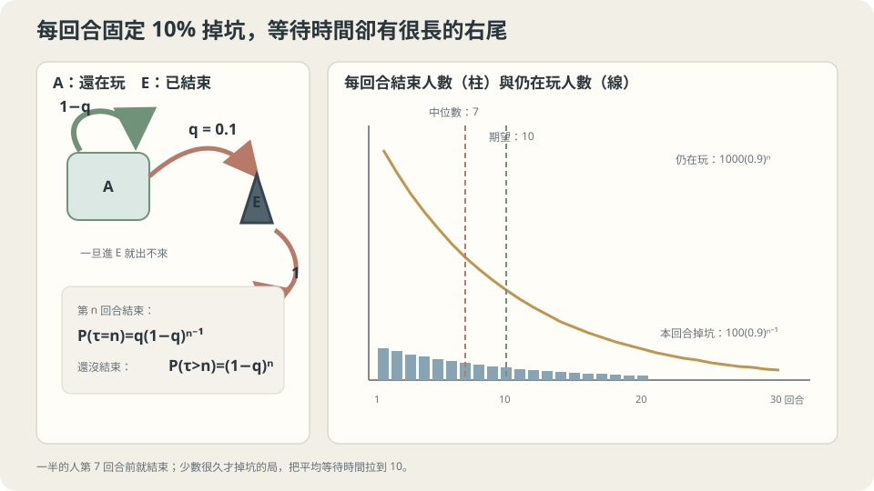

import Objectives from '../../../components/Objectives.astro';
import Prereq from '../../../components/Prereq.astro';
import Question from '../../../components/Question.astro';
import Answer from '../../../components/Answer.astro';
import QuizBlock from '../../../components/QuizBlock.astro';
import Option from '../../../components/Option.astro';
import Explanation from '../../../components/Explanation.astro';
import VizPlan from '../../../components/VizPlan.astro';
import Details from '../../../components/Details.astro';
import Bridge from '../../../components/Bridge.astro';
import Ref from '../../../components/Ref.astro';
import UsedBy from '../../../components/UsedBy.astro';

# 進去就出不來：Absorbing State 與吸收時間

<Objectives>
- **認出 absorbing state：$P(x,x)=1$。** 分清「有一個不能離開的狀態」與「從所有起點最後都會到達它」。
- **用 first-step analysis 寫出期望吸收時間的方程式，手算「每回合結束機率 $q$」的例子得到 $1/q$。** 說出它的分佈是 geometric、中位數與期望為何不同。
- **對一個生活情境（遊戲回合、顧客流失、零件故障）判斷「平均還要多久」這類問題的答案是否可信、說出它依賴的假設（每回合機率不變、結束後不復活）。** 用模擬驗證。
</Objectives>

<Prereq items={frontmatter.prereqs} />

## 一個會自己結束的遊戲

一款單人手機遊戲，每一回合結束時系統擲一顆十面骰：擲到 0 遊戲結束，否則進入下一回合。結束了就是結束了——沒有復活、沒有續命，要玩得重開一局。

這次只知道「最後會結束」還不夠。我們想知道：

1. 一局遊戲**平均**玩幾回合？
2. 你已經玩了二十回合還沒結束。接下來平均還能再玩幾回合？
3. 「一半的玩家在第幾回合之前就結束了」——這個數字跟第一題一樣嗎？

如果每回合都重新擲相同的骰子，已經玩多久，應該不會改變下一回合的機率。但**平均玩幾回合，要怎麼由這個一步的規則算出來？** 而「一半的人已經結束」又不是同一個問題。先把結束時間當成隨機變數，才看得出這幾種摘要的差別。

<Question id="Q1">
用上一篇的語言，這個遊戲是一條什麼樣的 Markov chain？狀態是什麼？我們要算的量「平均玩幾回合」在數學上是哪一個隨機變數的什麼？

<Answer>
課堂上第一個反應通常是「狀態是第幾回合」——這樣狀態會無限多，而且回合數本身不是隨機的，是我們在數的東西。更好的選擇是只用**兩個**狀態：「還在玩」（記作 $\mathrm{A}$，alive）與「已結束」（記作 $\mathrm{E}$，ended）。每回合的規則是：

$$
P=\begin{pmatrix}P(\mathrm A,\mathrm A)&P(\mathrm A,\mathrm E)\\P(\mathrm E,\mathrm A)&P(\mathrm E,\mathrm E)\end{pmatrix}
=\begin{pmatrix}1-q&q\\0&1\end{pmatrix},\qquad q=0.1 .
$$

第二列 $(0,1)$ 表示「結束了就出不來」，這種 $P(x,x)=1$ 的狀態叫 **absorbing state**（吸收態）。在本例 $0<q\le1$ 下，$\mathrm A$ 最後幾乎必然離開，所以是 transient；一般 chain 的其他狀態則不一定都是 transient。

我們要算的量是一個隨機變數：**首次到達 $\mathrm E$ 的時刻** $\tau=\min\{n\ge1:X_n=\mathrm E\}$，也就是玩到第幾回合結束。「平均玩幾回合」是 $\mathbb E[\tau\mid X_0=\mathrm A]$；第三題問的是 $\tau$ 的中位數；第二題問的是 conditional expectation $\mathbb E[\tau-20\mid \tau>20]$。三個問題問的是**同一個隨機變數的三個不同摘要**——這是它們答案可以不同的原因。
</Answer>
</Question>

## 先抓住這個畫面

回到上一篇的棋子。兩個格子，但這次「已結束」那格是個坑：棋子掉進去就留在裡面，每天擲的骰子都寫「留下」。放一千顆棋子在「還在玩」格。第一回合約一百顆掉坑，剩九百；第二回合九百顆的一成、九十顆掉坑，剩八百一十；每回合掉進去的**數量**越來越少，但**比例**永遠是一成。

這個畫面立刻回答了第二題：站在「還在玩」格的棋子，不管已經站了多久，下一回合掉坑的機率都是一成——它沒有記憶。所以「玩了二十回合的人」跟「剛開始的人」面對的未來一模一樣，還能再玩的期望**還是十**。「應該快結束了」是把「平均十回合」誤讀成「配額」，好像每局有十回合的額度會用完；實際上額度不存在，只有每回合一成的骰子。



*圖：固定 hazard 產生 geometric 長尾；中位數約 7 回合，少數長局把平均拉到 10。*

## 把畫面寫成方程式

### 分佈：幾何遞減

第 $n$ 回合還在玩，需要前 $n$ 次骰子都不是 0：

$$
\Pr(\tau>n)=(1-q)^n,\qquad \Pr(\tau=n)=(1-q)^{n-1}q .
$$

這是 **geometric distribution**：每回合以固定機率 $q$ 成功（這裡的「成功」是結束），數到第一次成功為止。用上一篇的矩陣語言，$\Pr(X_n=\mathrm A\mid X_0=\mathrm A)=P^n(\mathrm A,\mathrm A)=(1-q)^n$——$P$ 是上三角的，$P^n$ 的左上角就是 $(1-q)^n$。

### 期望：一行 first-step analysis

要算 $m=\mathbb E[\tau\mid X_0=\mathrm A]$，可以老實對 geometric 求和，但有一個更好的辦法，它適用於任何 absorbing chain。**看第一步**：走一回合（花掉 1），然後以機率 $q$ 結束（之後花 0），以機率 $1-q$ 回到同一個狀態、面對同樣的未來（再花 $m$）：

$$
m=1+q\cdot0+(1-q)\,m\quad\Longrightarrow\quad m=\frac1q=10 .
$$

這叫 **first-step analysis**：對每個 transient 狀態 $x$，令 $m(x)$ 是從 $x$ 出發的期望吸收時間，則

$$
m(x)=1+\sum_{y\ \text{transient}}P(x,y)\,m(y),
$$

一個線性方程組，未知數的個數等於 transient 狀態數。「回到同一個狀態就面對同樣的未來」用掉的正是 Markov property；上一篇的 $p_n=p_0P^n$ 是把規則往前推，這裡是把「未來的期望」往回推，兩者是同一條性質的兩個方向。

### 中位數與變異數

先找滿足 $\Pr(\tau\le n)\ge1/2$ 的最小整數。由 $(1-q)^n\le1/2$ 得 $n\ge\ln(1/2)/\ln0.9\approx6.6$，故中位數是 7：至少一半的人在**第 7 回合結束以前或當回合**結束。Variance 是 90，標準差約 9.5；少數很長的局把 mean 拉到 10，所以 mean 不等於 median，也不是每一局的回合配額。

<Details summary="多個 transient 狀態：fundamental matrix 與兩關遊戲的手算">
把 $P$ 依「transient / absorbing」分塊寫成 $P=\begin{pmatrix}Q&R\\0&I\end{pmatrix}$。$Q^n(x,y)$ 是「第 $n$ 步還在 transient 狀態 $y$」的機率，所以從 $x$ 出發在 $y$ 停留的期望總步數是 $\sum_{n\ge0}Q^n(x,y)=(I-Q)^{-1}(x,y)$。矩陣 $N=(I-Q)^{-1}$ 叫 fundamental matrix，期望吸收時間是 $m=N\mathbb 1$——這就是把 first-step analysis 的方程組 $m=\mathbb 1+Qm$ 解出來。$I-Q$ 可逆的條件是每個 transient 狀態都到得了某個 absorbing state。

例：遊戲分兩關。第 1 關每回合以 0.5 升到第 2 關、0.4 留在第 1 關、0.1 結束；第 2 關每回合 0.8 留下、0.2 結束。方程組 $m_2=1+0.8\,m_2$ 給 $m_2=5$；$m_1=1+0.4\,m_1+0.5\,m_2=1+0.4\,m_1+2.5$ 給 $m_1=3.5/0.6\approx5.83$。從第 1 關開始平均玩約 5.8 回合。細節見 Kemeny–Snell [3] 第 3 章。
</Details>

### 跟上一篇的 chain 差在哪

上一篇的 chain 有一個有意義的 stationary distribution $\pi=(\tfrac23,\tfrac13)$，長期會在兩格之間來回。這裡 $\pi P=\pi$ 的解是 $\pi=(0,1)$：**所有質量最後都在坑裡**，這個答案正確但無趣。有 absorbing state 的 chain 不是 irreducible（從 $\mathrm E$ 到不了 $\mathrm A$），上一篇的收斂定理不適用於「回到 $\mathrm A$」這件事。問題於是換了：不問「長期在哪」，問「**多久**到那裡」與「**從哪條路**到那裡」。

## 回頭看那三個直覺

**理論的判斷。** 在「每回合結束機率固定為 $q$、結束後不再回來」的假設下：期望 $1/q=10$（直覺對，原因是 first-step analysis）；已玩二十回合後剩餘期望仍是 10（「快結束了」錯在假想了一個不存在的配額——geometric 的 memoryless 性質 $\Pr(\tau>20+k\mid\tau>20)=(1-q)^k$ 與從頭開始一樣）；中位數約 7，不等於期望（直覺錯在忽略分佈的右偏）。

**哪裡可能失準。** 兩個假設都可能不成立。若結束機率隨回合增加（難度爬升、玩家疲勞），$q_n$ 遞增，期望會低於 $1/q_1$，而且 memoryless 失效——這時「玩了很久應該快結束了」反而是**對的**。若結束後可以復活（$P(\mathrm E,\mathrm A)=r>0$），$\mathrm E$ 就不是 absorbing state，chain 變回 irreducible，「平均玩幾回合」要改問成「每一段連續遊玩的平均長度」，而長期在 $\mathrm E$ 的比例 $\pi_\mathrm E=q/(q+r)$ 又變得有意義。

## 動手跑一次

```python
import numpy as np
rng = np.random.default_rng(0)
q, T = 0.1, 100_000
tau = rng.geometric(q, size=T)                    # 每局的結束回合
print("平均", tau.mean(), " 中位數", np.median(tau), " 標準差", tau.std())
alive20 = tau[tau > 20]
print("已玩 20 回合者，剩餘平均", (alive20 - 20).mean())   # ≈ 10
# 違反假設：結束機率隨回合遞增 q_n = 0.1 + 0.02 (n-1)
def play():
    n = 1
    while rng.random() >= min(1, 0.1 + 0.02 * (n - 1)): n += 1
    return n
tau2 = np.array([play() for _ in range(T)])
print("遞增 q：平均", tau2.mean(), " 已玩 5 回合者剩餘", (tau2[tau2 > 5] - 5).mean())
```

<iframe loading="lazy" src="/personal_website/notes/research_areas/mathematical-foundations/m4-markov-chains/m4-1-1.html" class="demo-frame" title="吸收時間：geometric 分布與 memoryless" style="height: 820px; width: 100%; border: none;"></iframe>

## 檢查理解

<QuizBlock id="m4-1-a">
一家訂閱服務的資料顯示，每個月有 5% 的用戶取消訂閱，且取消後不再回來。行銷部門問「一個新用戶平均會訂閱幾個月」。該用什麼工具？
<Option>算 stationary distribution，讀出「訂閱中」的比例。</Option>
<Option correct>把「已取消」當 absorbing state，用 first-step analysis 算期望吸收時間 $1/0.05=20$ 個月。</Option>
<Option>算 $P^{12}$，看一年後還在訂閱的比例。</Option>
<Explanation>
「取消後不再回來」就是 absorbing state，「平均訂閱幾個月」是期望吸收時間，first-step analysis 一行給 $1/q=20$。Stationary distribution 在這裡是 $(0,1)$——所有人最終都取消——正確但答不了問題。$P^{12}$ 給的是 $\Pr(\tau>12)=0.95^{12}\approx0.54$，是另一個有用的數字，但不是平均月數。
</Explanation>
</QuizBlock>

<QuizBlock id="m4-1-b">
同一款遊戲，你的朋友說：「我剛玩了 30 回合還沒結束，運氣快用完了，下一回合結束的機率一定比 10% 高。」在「每回合結束機率固定為 0.1」的模型下，這句話：
<Option>對，因為連續 30 次不擲到 0 的機率只有 $0.9^{30}\approx4\%$。</Option>
<Option>對，因為期望是 10 回合，超過期望之後結束的機率會補償回來。</Option>
<Option correct>錯，下一回合結束的機率仍是 0.1；$0.9^{30}$ 很小是事前的機率，事後已經發生就不再相關。</Option>
<Explanation>
Geometric 分佈是 memoryless：$\Pr(\tau=31\mid\tau>30)=q$，跟第一回合一樣。「$0.9^{30}$ 很小」說的是**開局前**「能撐過 30 回合」的機率，撐過之後這個數字就沒有用了。「超過期望會補償」是把期望當成配額——分佈裡沒有這種機制。當然，如果真實遊戲的 $q$ 隨回合上升，朋友就對了；但那是另一個模型。
</Explanation>
</QuizBlock>

<QuizBlock id="m4-1-c">
把規則改成「結束後有 30% 機率獲得復活、回到遊戲」。下列哪個敘述正確？
<Option>期望吸收時間變成 $1/(0.1\times0.7)$。</Option>
<Option>「已結束」仍是 absorbing state，只是吸收得比較慢。</Option>
<Option correct>「已結束」不再是 absorbing state；chain 變成 irreducible，長期在「已結束」的比例是 $0.1/(0.1+0.3)=0.25$，而「平均玩幾回合」要改問成「每段連續遊玩的平均長度」。</Option>
<Explanation>
有 30% 機率離開的「已結束」不是 absorbing state，因此不能再用永久吸收的模型。不過第一次到達「已結束」的 hitting time 仍有定義，期望仍是 10 回合。長期比例則用流量平衡算出 $\pi_\mathrm E=0.25$；hitting 與 absorbing 要分清楚。
</Explanation>
</QuizBlock>

<UsedBy slug={frontmatter.slug} />

<Bridge to="math-ctmc">
First-step analysis 把等待時間拆成「先花一回合，再面對剩下的問題」。但電話不等下一回合才響；若狀態隨時都可能改變，我們要怎麼寫一步的規則？下一篇把每回合的機率換成每單位時間的 rate。
</Bridge>

## 參考文獻

1. Norris, J. R. [*Markov Chains.*](https://www.statslab.cam.ac.uk/~james/Markov/) Cambridge University Press, 1997.（1.3 節 hitting times 與 first-step analysis。）
2. Grimmett, G., Stirzaker, D. *Probability and Random Processes*, 3rd ed. Oxford University Press, 2001.（第 6 章。）
3. Kemeny, J. G., Snell, J. L. *Finite Markov Chains.* Springer, 1976.（absorbing chain 與 fundamental matrix 的經典處理。）
