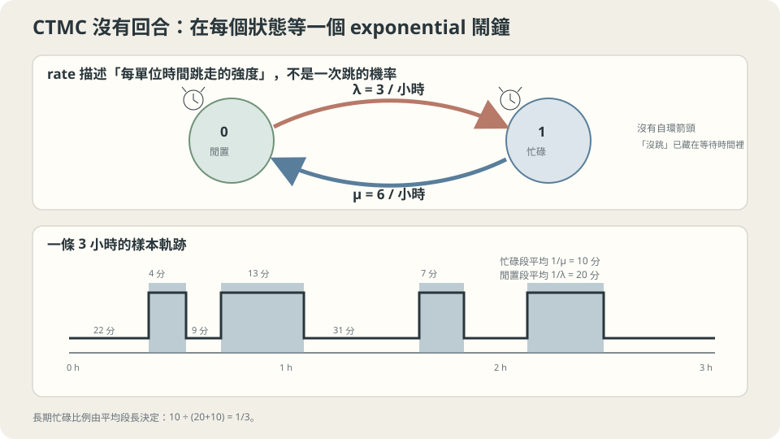

import Objectives from '../../../components/Objectives.astro';
import Prereq from '../../../components/Prereq.astro';
import Question from '../../../components/Question.astro';
import Answer from '../../../components/Answer.astro';
import QuizBlock from '../../../components/QuizBlock.astro';
import Option from '../../../components/Option.astro';
import Explanation from '../../../components/Explanation.astro';
import VizPlan from '../../../components/VizPlan.astro';
import Details from '../../../components/Details.astro';
import Bridge from '../../../components/Bridge.astro';
import Ref from '../../../components/Ref.astro';
import UsedBy from '../../../components/UsedBy.astro';

# 電話隨時會響：Continuous-Time Markov Chain 與 Rate Matrix

<Objectives>
- **說出「每小時平均 3 通」這種 rate 和「每回合機率 0.1」的差別。** 把一個連續時間的狀態切換寫成 rate matrix $R$：非對角線是 rate、每列和為 0。
- **從 $P(\Delta t)\approx I+R\Delta t$ 推出 $P(t)=e^{tR}$ 與 forward equation $\dot p_t=p_tR$，手算 2 狀態的解。** 指出它與 <Ref to="math-fokker-planck"/> 是同一件事的兩個版本。
- **對一個生活情境（客服專線、機器故障與維修、燈號切換）判斷「長期忙碌比例」的直覺算法是否正確、說出它依賴的假設（rate 不隨時間變、事件之間無記憶）。** 用模擬驗證。
</Objectives>

<Prereq items={frontmatter.prereqs} />

## 一條只有一個人的客服專線

一家小公司的客服專線只有一位話務員、一條線。電話平均**每小時進來 3 通**，每通平均講 **10 分鐘**。線路忙碌時打進來的電話會聽到忙線音、直接掛掉，不排隊。

請先用直覺回答，並寫下你有多確定：這位話務員**長期來看有多少比例的時間在講電話**？

課堂上最常見的答案是「3 通 × 10 分鐘 = 30 分鐘，所以一半」，而且很篤定。第二常見的是「比一半少一點，因為有些電話會撞在一起」，但說不出少多少。這一篇的目標不只是算出正確數字，而是先解決一個更基本的問題：**「隨時可能發生」要怎麼寫成數學？** 前兩篇的 chain 都是一回合一回合走的，電話沒有回合。

<Question id="Q1">
這裡的狀態是什麼？「每小時 3 通」不是機率（它可以大於 1），那它是什麼？如果硬要用前兩篇「每一步一個 transition matrix」的語言，這一步該多長？

<Answer>
狀態很清楚：線路「閒」（記 0）或「忙」（記 1），$X_t\in\{0,1\}$，但現在 $t$ 是**連續的實數**（單位：小時），不是回合數。

「每小時 3 通」是一個 **rate**（速率）：單位時間內事件發生的平均次數。它跟機率的關係是：在一段**很短**的時間 $\Delta t$ 裡，恰好來一通電話的機率約是 $3\Delta t$（$\Delta t=1$ 分鐘 $=\tfrac1{60}$ 小時時約 5%），來兩通以上的機率是 $\Delta t^2$ 量級、可以忽略。rate 不是機率，「rate × 短時間」才是機率。

所以「硬要用 transition matrix」的答案是：**任何一個很短的 $\Delta t$ 都可以**，得到的矩陣是 $P(\Delta t)\approx\begin{pmatrix}1-\lambda\Delta t&\lambda\Delta t\\ \mu\Delta t&1-\mu\Delta t\end{pmatrix}$，$\lambda=3$ 是來電 rate、$\mu$ 是結束 rate（一通平均 10 分鐘，每小時「結束」6 次，$\mu=6$）。但 $\Delta t$ 選多短是任意的，而且 $\Delta t$ 太大這個式子就錯了（$\lambda\Delta t$ 會超過 1）。真正不依賴 $\Delta t$ 的物件，是把 $\Delta t$ 除掉之後剩下的東西——這是下一節要引入的 rate matrix。
</Answer>
</Question>

## 先抓住這個畫面

想像一顆棋子在「閒」「忙」兩格之間，但這次沒有人喊「下一回合」。棋子站在「閒」格時，頭上有一個以每小時 3 次的頻率隨機響的鬧鐘；響了就跳到「忙」格。站在「忙」格時換另一個鬧鐘，每小時 6 次；響了就跳回「閒」。兩個鬧鐘都**沒有記憶**：不管已經等了多久，接下來一分鐘響的機率都一樣。

「隨時」的意思就是：時間不再是一格一格的，但在每個瞬間，「跳走」這件事有一個固定的**傾向**。把這個傾向叫做 rate，整個描述就完整了。



*圖：CTMC 用 rate 決定 exponential 停留時間；長期占比由兩種平均停留時間的比例決定。*

## 把畫面寫成矩陣

### 從短時段的 transition matrix 到 rate matrix

上一節的 $P(\Delta t)$ 可以寫成

$$
P(\Delta t)\approx I+R\,\Delta t,\qquad
R=\begin{pmatrix}-\lambda&\lambda\\ \mu&-\mu\end{pmatrix}=\begin{pmatrix}-3&3\\6&-6\end{pmatrix}.
$$

$R$ 叫 **rate matrix**（也叫 generator）。讀法：非對角線 $R(x,y)\ge0$ 是「從 $x$ 跳到 $y$ 的 rate」；對角線 $R(x,x)=-\sum_{y\ne x}R(x,y)$ 是負的「離開 $x$ 的總 rate」，讓每列的和是 0——這是 $P(\Delta t)$ 每列和為 1 在 $\Delta t\to0$ 後留下的痕跡。$R$ 不依賴 $\Delta t$：它是把所有短時段的 transition matrix 共同的「斜率」抽出來的結果，$R=\lim_{\Delta t\to0}\frac{P(\Delta t)-I}{\Delta t}$。

### 走一段時間：矩陣指數

走 $t$ 小時等於走 $n=t/\Delta t$ 個短步。用前面 chain 的乘法規則 $P(t)=P(\Delta t)^n$（Markov property 在連續時間的版本：$P(t+s)=P(t)P(s)$），

$$
P(t)=\lim_{n\to\infty}\Big(I+\frac{tR}{n}\Big)^{n}=e^{tR}\equiv\sum_{k\ge0}\frac{(tR)^k}{k!}.
$$

這跟 $e^{x}=\lim(1+x/n)^n$ 是同一條極限，只是把數字換成矩陣。另一個得到它的方法是微分：

$$
\frac{d}{dt}P(t)=\lim_{\Delta t\to0}\frac{P(t)P(\Delta t)-P(t)}{\Delta t}=P(t)\,R,\qquad P(0)=I,
$$

一個矩陣版的線性 ODE，解正是 $e^{tR}$。

### 分佈怎麼變：forward equation

把上式左乘初始分佈的列向量 $p_0$，$p_t=p_0P(t)$ 滿足

$$
\dot p_t=p_tR\quad\Longleftrightarrow\quad
\dot p_t(y)=\sum_{x\ne y}\Big[p_t(x)R(x,y)-p_t(y)R(y,x)\Big].
$$

右邊的寫法是把 $R$ 的對角線攤開後得到的：$y$ 的機率增加率＝**流進來**（各 $x$ 的機率乘上 $x\to y$ 的 rate）減**流出去**（$y$ 的機率乘上離開的總 rate）。這叫 forward equation（或 master equation）。

它就是 <Ref to="math-fokker-planck"/> 的離散狀態版：那裡質量在連續的位置之間流動，drift 與 diffusion 決定「流到鄰近位置」的速率，方程式是 $\partial_t p=\mathcal L^{*}p$；這裡位置是有限個格子，「流到哪裡、多快」全由 $R$ 決定，$\mathcal L^{*}$ 換成了「右乘 $R$」。兩者都是**守恆律**：總機率 $\sum_y p_t(y)$ 的導數是 $\sum_y(p_tR)(y)=p_t(R\mathbb 1)=0$，因為 $R$ 每列和為 0。

### 2 狀態手算

對我們的專線，$p_t(1)$（忙的機率）滿足 $\dot p_t(1)=\lambda\,p_t(0)-\mu\,p_t(1)=\lambda-(\lambda+\mu)\,p_t(1)$。這是一條一階線性 ODE，解是

$$
p_t(1)=\frac{\lambda}{\lambda+\mu}+\Big(p_0(1)-\frac{\lambda}{\lambda+\mu}\Big)e^{-(\lambda+\mu)t}.
$$

Stationary distribution 是 $\pi R=0$ 的解——流進等於流出，$\pi(0)\lambda=\pi(1)\mu$——

$$
\pi(1)=\frac{\lambda}{\lambda+\mu}=\frac{3}{3+6}=\frac13 .
$$

而不是 $\tfrac12$。今天早上的狀態被忘掉的時間尺度是 $1/(\lambda+\mu)=1/9$ 小時，約 7 分鐘：這是上一篇 $|\lambda_2|^n$ 的連續時間版本，$e^{-(\lambda+\mu)t}$ 裡的 $-(\lambda+\mu)$ 正是 $R$ 的非零 eigenvalue。

<Details summary="完整的 e^{tR}、停留時間為什麼是 exponential、以及 Δt 太大會怎樣">
**$e^{tR}$ 的 closed form。** $R$ 的 eigenvalue 是 $0$（左 eigenvector $\pi$）與 $-(\lambda+\mu)$。令 $\Pi$ 是每一列都等於 $\pi$ 的矩陣（$\Pi=\mathbb 1\pi$），則 $R\Pi=\Pi R=0$、$R^2=-(\lambda+\mu)R$，代入級數得 $e^{tR}=\Pi+e^{-(\lambda+\mu)t}(I-\Pi)$。驗算：$t=0$ 得 $I$；$t\to\infty$ 每列都變成 $\pi$；對 $t$ 微分在 $0$ 得 $-(\lambda+\mu)(I-\Pi)=R$。

**停留時間。** 在狀態 $x$ 待超過 $t$ 的機率是 $\lim(1-|R(x,x)|\Delta t)^{t/\Delta t}=e^{-|R(x,x)|t}$：停留時間是 rate $|R(x,x)|$ 的 exponential distribution，平均 $1/|R(x,x)|$。它是 geometric distribution 的連續極限，同樣 memoryless——這就是「鬧鐘沒有記憶」。一通電話平均 10 分鐘對應 $\mu=6$，就是這樣來的。

**$\Delta t$ 太大。** $I+R\Delta t$ 要是合法的 transition matrix，需要對角線 $1-|R(x,x)|\Delta t\ge0$，即 $\Delta t\le1/\max_x|R(x,x)|=1/6$ 小時。取 $\Delta t=0.5$ 小時，$\lambda\Delta t=1.5$，「機率」超過 1。$e^{tR}$ 沒有這個問題——它對任何 $t$ 都是合法的 transition matrix，這正是要引入它的原因。
</Details>

## 回頭看「一半」

**理論的判斷。** 在「來電是 rate $\lambda$ 的無記憶鬧鐘、通話長度是 rate $\mu$ 的無記憶鬧鐘、忙線時的來電被丟掉」這三個假設下，長期忙碌比例是 $\lambda/(\lambda+\mu)=\tfrac13$，不是 $\tfrac12$。「3 通 × 10 分鐘」的直覺錯在一個隱含假設：**它把每小時進來的 3 通都算成有講到**。但其中一部分打進來時線路是忙的、直接被掛掉；真正接到的電話每小時只有 $\lambda\,\pi(0)=3\times\tfrac23=2$ 通，$2\times10$ 分鐘 $=20$ 分鐘，正好是 $\tfrac13$。流量平衡 $\pi(0)\lambda=\pi(1)\mu$ 自動把這件事算進去了。（若電話可以排隊而不是掛掉，$\tfrac12$ 才是負載——但那是另一條 chain，狀態要包含隊伍長度。）

**哪裡可能失準。** 三個假設裡最脆弱的是「通話長度無記憶」：真實通話不太可能「已經講了 20 分鐘，剩餘時間的分佈跟剛接起來時一樣」。有趣的是，長期忙碌比例**不受這條影響**：把一次「閒→忙→閒」看成一個循環，閒置段平均 $1/\lambda$、忙碌段平均 $\mathbb E[S]$，忙碌比例是 $\mathbb E[S]/(1/\lambda+\mathbb E[S])=\lambda\mathbb E[S]/(1+\lambda\mathbb E[S])$，只用到平均通話長度。會失準的是**中途的預測**：例如 $p_t(1)$ 的曲線形狀、以及「現在在忙，還要等多久」——那些依賴 exponential 的無記憶性。「來電無記憶」則在真實世界常被違反（廣告後湧入、午休空檔），這時 $\lambda$ 隨時間變，$\pi$ 也就不存在。

## 動手跑一次

```python
import numpy as np
rng = np.random.default_rng(0)
lam, mu, T = 3.0, 6.0, 20_000.0                # 每小時；模擬 20000 小時
t, x, busy = 0.0, 0, 0.0
while t < T:                                     # 用 exponential 停留時間直接模擬
    stay = rng.exponential(1/lam) if x == 0 else rng.exponential(1/mu)
    busy += stay * x; t += stay; x = 1 - x
print("忙碌比例", busy / T)                       # ≈ 1/3
# 違反「通話無記憶」：通話固定 10 分鐘 → 比例仍 ≈ 1/3
# 違反 Δt 小：用 P ≈ I + R·0.5 走離散步 → 出現負機率，模擬直接壞掉
```

<iframe loading="lazy" src="/personal_website/notes/research_areas/mathematical-foundations/m4-markov-chains/m4-2-1.html" class="demo-frame" title="CTMC：rate、時間離散化與停留時間" style="height: 820px; width: 100%; border: none;"></iframe>

## 檢查理解

<QuizBlock id="m4-2-a">
一台機器在正常運轉時平均每 10 小時故障一次，每次維修平均 2 小時，維修期間不會再故障。工廠問「長期可用率」。該用什麼工具？
<Option>離散時間 chain，一小時一步，$P(\text{好}\to\text{壞})=0.1$、$P(\text{壞}\to\text{好})=0.5$，解 $\pi P=\pi$，並用它預測「現在剛修好，3 小時後還正常的機率」。</Option>
<Option correct>2 狀態 CTMC，$\lambda=1/10$、$\mu=1/2$，可用率 $\pi(\text{好})=\mu/(\lambda+\mu)=5/6\approx0.83$。</Option>
<Option>可用率就是 $1-2/10=0.8$，不需要任何 chain。</Option>
<Explanation>
故障與修好都是「隨時可能發生」，是 rate 而不是每步的機率，rate matrix 是自然的語言；流量平衡 $\pi(\text{好})\lambda=\pi(\text{壞})\mu$ 給 $5/6$。一小時一步的離散 chain 是 $I+R\Delta t$ 的近似，$\Delta t=1$ 小時對 $\mu=1/2$ 來說並不小（$\mu\Delta t=0.5$）；它的 $\pi$ 恰好也是 $5/6$（2 狀態的巧合：流量平衡式兩邊同乘 $\Delta t$），但用它預測「3 小時後還正常」會與 $e^{tR}$ 的答案有明顯偏差。$1-2/10$ 算的是「每 10 小時裡壞 2 小時」，忽略了 10 小時是**好的時候**的平均間隔，正確的循環是「好 10 小時、壞 2 小時」，可用率 $10/12$。
</Explanation>
</QuizBlock>

<QuizBlock id="m4-2-b">
Rate matrix $R$ 每列的和為 0。這條性質對應 forward equation 的哪個事實？
<Option>$p_t$ 會收斂到 stationary distribution。</Option>
<Option>每個狀態的停留時間是 exponential。</Option>
<Option correct>總機率守恆：$\frac{d}{dt}\sum_yp_t(y)=0$。</Option>
<Explanation>
$\frac{d}{dt}\sum_yp_t(y)=p_tR\mathbb 1$，而 $R\mathbb 1=0$ 就是「每列和為 0」，所以總機率不變——這是 <Ref to="math-fokker-planck"/> 那個守恆律的離散版。收斂到 $\pi$ 需要額外條件（狀態互通），跟列和無關；停留時間是 exponential 來自對角線 $R(x,x)$ 的意義，也不是列和給的。
</Explanation>
</QuizBlock>

<QuizBlock id="m4-2-c">
把專線的通話長度從「平均 10 分鐘的 exponential」改成「每通固定 10 分鐘」。哪個結論會改變？
<Option>長期忙碌比例會偏離 $\tfrac13$。</Option>
<Option correct>長期忙碌比例仍是 $\tfrac13$，但「現在在忙，還要等多久才閒」的答案改變：不再是「平均 10 分鐘、與已講多久無關」。</Option>
<Option>兩者都不變，因為平均通話長度沒變。</Option>
<Explanation>
長期比例只用到「閒置段平均 $1/\lambda$、忙碌段平均 $\mathbb E[S]$」這兩個平均，換分佈不改變它。但「還要等多久」依賴 exponential 的無記憶性：固定 10 分鐘的通話，講了 8 分鐘就只剩 2 分鐘。所以「兩者都不變」錯在忽略了 memoryless 是 exponential 專有的性質，「比例會變」則錯在以為長期比例需要整個分佈的形狀。
</Explanation>
</QuizBlock>

<UsedBy slug={frontmatter.slug} />

<Bridge to="math-time-reversal">
這一篇把「隨時」寫成 rate matrix $R$，得到 $P(t)=e^{tR}$ 與 forward equation $\dot p_t=p_tR$，並看到它是 Fokker–Planck 的離散狀態版本。接著把影片倒著播：一條 chain 反過來走，rate 會變成什麼？為什麼會冒出一個比值 $p_t(y)/p_t(x)$？
</Bridge>

## 參考文獻

1. Norris, J. R. [*Markov Chains.*](https://www.statslab.cam.ac.uk/~james/Markov/) Cambridge University Press, 1997.（第 2–3 章：連續時間 chain、generator、forward / backward equations。）
2. Grimmett, G., Stirzaker, D. *Probability and Random Processes*, 3rd ed. Oxford University Press, 2001.（6.9 節。）
3. Anderson, W. J. *Continuous-Time Markov Chains: An Applications-Oriented Approach.* Springer, 1991.
