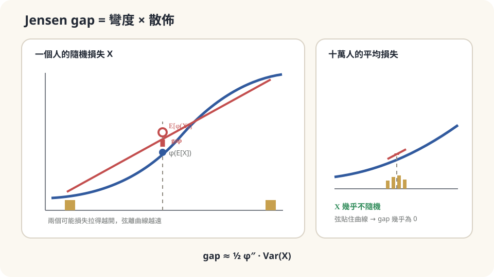

import Objectives from '../../../components/Objectives.astro';
import Prereq from '../../../components/Prereq.astro';
import Question from '../../../components/Question.astro';
import Answer from '../../../components/Answer.astro';
import QuizBlock from '../../../components/QuizBlock.astro';
import Option from '../../../components/Option.astro';
import Explanation from '../../../components/Explanation.astro';
import VizPlan from '../../../components/VizPlan.astro';
import Details from '../../../components/Details.astro';
import Bridge from '../../../components/Bridge.astro';
import Ref from '../../../components/Ref.astro';
import UsedBy from '../../../components/UsedBy.astro';

# 保險為什麼存在：Convex Function 與 Jensen 不等式

<Objectives>
- **說出 convex function 的定義（弦在曲線上方）。** 用它寫出 Jensen 不等式 $\varphi(\mathbb E[X])\le\mathbb E[\varphi(X)]$ 與等號成立的條件。
- **分清「損失的平均」與「平均的損失」。** 解釋兩者的差距如何由 $\varphi$ 的彎度與 $X$ 的散佈共同決定。
- **對一個生活情境（保險、分散投資、排隊）判斷該把 Jensen 用在哪個方向、說出它依賴的假設（$\varphi$ 真的 convex、期望存在）。** 用模擬驗證與破壞它。
</Objectives>

<Prereq items={frontmatter.prereqs} />

## 一筆穩賠的交易

你一年付 6,000 元的機車險。保險公司的資料說：像你這樣的騎士，一年裡有 2% 的機率出一次事故、平均賠 20 萬，其他 98% 什麼事也沒有。算一下期望損失：$0.02\times200{,}000=4{,}000$ 元。你付 6,000，拿回的期望值是 4,000——**平均而言你每年虧 2,000**，保險公司每年賺 2,000。

這筆交易對雙方都是自願的，而且幾百年來一直存在。請先用直覺回答：一筆平均讓你虧錢的交易，你為什麼還是買？寫下你有多確定、依據是什麼。

課堂上的回答大致是「因為我怕」「因為 20 萬我付不出來」「因為安心」。這些都對，但它們說不出**為什麼「怕」可以值 2,000 元、而不是 200 元或 20,000 元**——也說不出保險公司為什麼不怕。這一篇要把「怕」寫成一條曲線的形狀，然後那個 2,000 元就會有一個數學位置。

<Question id="Q1">
翻成數學。這裡的隨機變數是什麼？「你在意的東西」是它的哪個函數？「平均虧 2,000」比較的是哪兩個量——而它漏掉了哪個量？

<Answer>
隨機變數是你的**年度損失** $X$：以 0.98 的機率是 0，以 0.02 的機率是 200,000。$\mathbb E[X]=4{,}000$。

「平均虧 2,000」比較的是保費 6,000 與 $\mathbb E[X]$。這個比較假設你在意的是**金額本身**。但你在意的其實是金額對你生活的影響——損失 20 萬對一個存款 30 萬的人，不是損失 2 萬的十倍那麼糟，而是糟得不成比例：要借錢、要賣東西、可能失去工作。把「有多糟」寫成一個函數 $\varphi(x)$：損失 $x$ 元帶來的**痛苦**。這個函數的特徵是**越虧越痛、而且痛得越來越快**——每多虧一萬元，增加的痛苦比前一萬元更多。

所以你真正比較的不是 $6{,}000$ 與 $\mathbb E[X]$，而是兩種痛苦：確定付 6,000 的痛苦 $\varphi(6{,}000)$，對上不買保險時的**期望痛苦** $\mathbb E[\varphi(X)]=0.98\,\varphi(0)+0.02\,\varphi(200{,}000)$。

漏掉的量就是 $\mathbb E[\varphi(X)]$ 與 $\varphi(\mathbb E[X])$ 的差。「平均虧 2,000」只算了 $\varphi(\mathbb E[X])$ 附近的事——它把痛苦當成線性的。
</Answer>
</Question>

## 弦在曲線上方

畫 $\varphi$ 的圖：橫軸是損失，縱軸是痛苦。「越虧越痛、痛得越來越快」讓這條曲線**往上彎**，像一個碗。

在曲線上取兩個點：$(0,\varphi(0))$ 與 $(200{,}000,\varphi(200{,}000))$，用一條直線（弦）連起來。弦上橫座標 $4{,}000$ 的那個點——也就是從左端點往右走 2% 的位置——高度正是 $0.98\,\varphi(0)+0.02\,\varphi(200{,}000)=\mathbb E[\varphi(X)]$。而曲線上橫座標 $4{,}000$ 的點是 $\varphi(4{,}000)=\varphi(\mathbb E[X])$。

碗往上彎，所以**弦在曲線上方**：$\mathbb E[\varphi(X)]\ge\varphi(\mathbb E[X])$。「不買保險的期望痛苦」比「確定損失 4,000 的痛苦」高。高出多少，就是弦與曲線在 $x=4{,}000$ 處的垂直距離——曲線彎得越厲害、兩個端點拉得越開，這段距離越長。

你願意多付的那 2,000 元，就是把這段垂直距離換成錢：只要 $\varphi(6{,}000)\le\mathbb E[\varphi(X)]$，買保險就是理性的。保險公司呢？它同時承保十萬個人，它的 $X$ 是十萬個獨立損失的平均，散佈小到幾乎是一個定點——弦與曲線的距離趨近零，它的曲線在這個尺度上幾乎是直的。**它不怕，因為它的 $X$ 幾乎不隨機。**



*圖：凸曲線的弦在曲線上方；Jensen gap 同時由曲線彎度與隨機量散佈決定。*

## Convex 與 Jensen

**定義。** 函數 $\varphi$ 是 **convex**（往上彎）的，若對任意兩點 $a,b$ 與任意 $\lambda\in[0,1]$，

$$
\varphi\big(\lambda a+(1-\lambda)b\big)\;\le\;\lambda\,\varphi(a)+(1-\lambda)\,\varphi(b).
$$

左邊是曲線在 $a,b$ 之間某點的高度，右邊是弦在同一點的高度——「弦在曲線上方」的逐字翻譯。若 $\varphi$ 二次可微，等價的判準是 $\varphi''\ge0$（<Ref to="math-taylor"/> 的二階項永遠往上）。$x^2$、$e^x$、$-\log x$（$x>0$）都是 convex；$\log x$、$\sqrt x$ 是 **concave**（往下彎，$-\varphi$ 是 convex）。

**Jensen 不等式。** 若 $\varphi$ convex 且 $\mathbb E[X]$、$\mathbb E[\varphi(X)]$ 存在，則

$$
\boxed{\;\varphi\big(\mathbb E[X]\big)\;\le\;\mathbb E\big[\varphi(X)\big].\;}
$$

**證明（五行）。** 在 $m=\mathbb E[X]$ 處畫一條**支撐線**：convex 函數在任何一點都有一條直線 $\ell(x)=\varphi(m)+c\,(x-m)$，整條曲線都在它上方，$\varphi(x)\ge\ell(x)$ 對所有 $x$ 成立（可微時 $c=\varphi'(m)$，就是切線）。對這個不等式兩邊取期望：

$$
\mathbb E[\varphi(X)]\;\ge\;\mathbb E[\ell(X)]=\varphi(m)+c\,\big(\mathbb E[X]-m\big)=\varphi(m).\qquad\square
$$

整個證明只用了兩件事：曲線在切線上方，以及期望是線性的（<Ref to="math-conditional-expectation"/>）。兩點的 convex 定義是 Jensen 的特例（$X$ 只取兩個值），Jensen 是它對任意分佈的推廣。

**等號何時成立。** $\mathbb E[\varphi(X)]-\mathbb E[\ell(X)]=\mathbb E[\varphi(X)-\ell(X)]$，被積函數 $\ge0$，期望為零只能是它幾乎處處為零：$X$ 落在的每一個點上曲線都貼著切線。若 $\varphi$ **strictly** convex（弦嚴格在上方、沒有平的段），這只在 $X$ 是常數時發生。**Jensen 的等號成立 ⟺ $X$ 不隨機**（strictly convex 時）。這就是保險公司不怕的數學版本。

**差距有多大。** 把 $\varphi$ 在 $m$ 附近二階展開（<Ref to="math-taylor"/>）：$\varphi(X)\approx\varphi(m)+\varphi'(m)(X-m)+\tfrac12\varphi''(m)(X-m)^2$，取期望，一階項消失：

$$
\mathbb E[\varphi(X)]-\varphi(\mathbb E[X])\;\approx\;\tfrac12\,\varphi''(m)\,\mathrm{Var}(X).
$$

**Jensen gap ≈ 彎度 × 散佈。** 彎度是你「怕」的程度，散佈是風險的大小；兩者相乘就是保費裡合理的那部分溢價。

<Details summary="把 Jensen 用在 concave 函數與 conditional expectation 上">
concave 的 φ（例如 log、√）把不等式反過來：φ(E[X]) ≥ E[φ(X)]。最常見的例子是 E[log X] ≤ log E[X]——「先取 log 再平均」小於「先平均再取 log」；一筆投資如果每年 +50% 或 −50% 各半，算術平均報酬是 0，但 E[log(1+r)] = ½(log 1.5 + log 0.5) ≈ −0.144 \< 0，長期複利下財富會趨近零。這是「分散投資降低波動本身就有價值」的來源，也是 Jensen gap 的另一個生活版本。

條件版本：對任何 σ-代數（任何「已知資訊」）Y，φ(E[X|Y]) ≤ E[φ(X)|Y] 逐點成立——證明一字不改，只要把期望換成 conditional expectation，支撐線的斜率 c 可以依 Y 而變。對兩邊再取期望就回到原式。這個版本在後面比較「先平均再算」與「先算再平均」的各種情境時都會用到。
</Details>

## 直覺對了，數字現在有了

回答起點問題。你買保險不是因為算錯，而是因為你比較的是 $\varphi(6{,}000)$ 與 $\mathbb E[\varphi(X)]$，不是 6,000 與 4,000。只要你的痛苦函數夠彎——$\tfrac12\varphi''(4{,}000)\cdot\mathrm{Var}(X)$ 大於 $\varphi(6{,}000)-\varphi(4{,}000)$——多付 2,000 就是理性的。$\mathrm{Var}(X)=0.02\times0.98\times200{,}000^2\approx7.8\times10^8$，很大；一個存款 30 萬的人在 20 萬那一端的 $\varphi''$ 也很大。

保險公司站在同一條不等式的另一邊：它的 $X$ 是十萬個獨立損失的平均，$\mathrm{Var}$ 被除以十萬，gap 趨近零，它可以幾乎照 $\mathbb E[X]$ 定價、再加一點利潤。**同一個 Jensen，兩邊的 $\mathrm{Var}(X)$ 不同，就是保險存在的理由。**

這個判斷依賴的假設：

- **$\varphi$ 真的 convex。** 如果一個人的痛苦函數在某段是 concave 的——例如「反正欠債超過 50 萬就宣告破產，再多欠也一樣」——那在那一段 Jensen 反向，這個人對大額損失反而**不在意**，保險對他沒有吸引力。這不是理論錯，是假設不成立。
- **期望存在。** 若損失分佈的尾巴太厚（例如 $\mathbb E[X]=\infty$ 的分佈），兩邊都沒有定義，「平均」這個詞本身失去意義。

## 跑一次，再把 φ 翻成 concave

```python
import numpy as np
rng = np.random.default_rng(0)
loss = np.where(rng.random(200_000) < 0.02, 200_000.0, 0.0)      # 你的年度損失 X
phi  = lambda x: -np.log1p(-x / 250_000)                           # 一條 convex 的「痛苦」：損失越接近 25 萬的上限越痛
print(loss.mean())                                                 # ≈ 4000：E[X]
print(phi(np.array([6000.])).item(), phi(loss).mean())             # φ(6000) vs E[φ(X)]：後者更大 → 買保險划算
# 保險公司：十萬人的平均損失
pool = loss.reshape(2, 100_000).mean(1)                            # 兩個「公司年度」的平均損失，幾乎都 ≈ 4000
print(pool, phi(pool).mean() - phi(np.array([pool.mean()])).item())  # Jensen gap ≈ 0
# 破壞假設：把 φ 換成 concave（破產後不在意）
phi_c = lambda x: np.sqrt(x)
print(phi_c(np.array([4000.])).item(), phi_c(loss).mean())         # φ(E[X]) > E[φ(X)]：不等式反向，保險不吸引人
```

前三行：$\mathbb E[X]\approx4{,}000$；$\varphi(6{,}000)$ 小於 $\mathbb E[\varphi(X)]$，確定付 6,000 比冒險舒服。保險公司那兩個「年度」的平均損失都在 4,000 附近，Jensen gap 幾乎是零。最後把 $\varphi$ 換成 concave 的 $\sqrt x$：$\varphi(\mathbb E[X])=63.2$，$\mathbb E[\varphi(X)]=0.02\times447=8.9$——不等式整個反過來，這樣的人寧願賭。理論預告了方向，數字確認了大小。

<iframe loading="lazy" src="/personal_website/notes/research_areas/mathematical-foundations/m5-optimization/m5-0-1.html" class="demo-frame" title="Jensen gap：彎度與散佈互動示範" style="height: 900px; width: 100%; border: none;"></iframe>

**互動 demo：拖動彎度、散佈與保單池大小，直接比較 E[φ(X)] 與 φ(E[X])。**

## 檢查理解

<QuizBlock id="m5-0-a">
你有 100 萬要投資，兩個選擇：全部押一支股票（一年後翻倍或歸零各半），或分散到 100 支互相獨立、每支同樣「翻倍或歸零各半」的股票。兩者的期望財富都是 100 萬。若你的滿足感是財富的 $\log$，哪個選擇的期望滿足感高？
<Option>一樣高，因為期望財富相同。</Option>
<Option correct>分散的那個——$\log$ 是 concave，$\mathbb E[\log W]\le\log\mathbb E[W]$，而分散讓 $W$ 的散佈變小、gap 變小，期望滿足感更接近上界 $\log(100\text{ 萬})$。</Option>
<Option>全押的那個，因為有機會翻倍。</Option>
<Explanation>
「期望財富相同」只看了 $\mathbb E[W]$，漏掉了 Jensen gap。$\log$ 往下彎，散佈越大 $\mathbb E[\log W]$ 掉得越多——全押時它是 $\tfrac12\log(200\text{ 萬})+\tfrac12\log 0=-\infty$。分散把 $W$ 收攏到 100 萬附近，gap 趨近零。「有機會翻倍」是只看上端點的直覺，忽略了下端點被 $\log$ 放大的懲罰。
</Explanation>
</QuizBlock>

<QuizBlock id="m5-0-b">
Jensen 的等號 $\varphi(\mathbb E[X])=\mathbb E[\varphi(X)]$，在 $\varphi$ strictly convex 時成立的條件是：
<Option>$X$ 是對稱分佈。</Option>
<Option>$\mathbb E[X]=0$。</Option>
<Option correct>$X$ 幾乎必然是一個常數——沒有散佈就沒有 gap。</Option>
<Explanation>
證明裡的差 $\mathbb E[\varphi(X)-\ell(X)]$ 是非負函數的期望，為零只能是被積函數幾乎處處為零；strictly convex 的曲線只在切點碰到切線，所以 $X$ 只能落在那一點。對稱或均值為零都不能讓一條彎曲的曲線變直。
</Explanation>
</QuizBlock>

<QuizBlock id="m5-0-c">
一家餐廳每天的客人數 $N$ 隨機，廚房的等待時間是客人數的函數 $T(N)$，而且客人越多、每多一人增加的等待時間越長（$T$ convex）。老闆用「平均客人數」算出的等待時間 $T(\mathbb E[N])$，和顧客實際體驗的平均等待 $\mathbb E[T(N)]$ 比：
<Option correct>低估了——$T$ convex 時 $\mathbb E[T(N)]\ge T(\mathbb E[N])$，尖峰日的等待被凸性放大，平均客人數算出來的數字永遠偏樂觀。</Option>
<Option>剛好相等，因為長期來看會平均掉。</Option>
<Option>高估了，因為離峰日很快。</Option>
<Explanation>
這是同一個 Jensen：用「平均輸入」算「輸出」，等於取曲線上的點；顧客體驗的是弦上的點。凸性把尖峰的懲罰放得比離峰的獎勵大。「長期平均掉」是把 $T$ 當成線性——只有 $T$ 是直線時才成立。若 $T$ 是 concave（人多反而更有效率），結論才會反過來。
</Explanation>
</QuizBlock>

<UsedBy slug={frontmatter.slug} />

<Bridge to="math-kl">
本篇把「怕」寫成一條往上彎的曲線，「弦在曲線上方」就是 Jensen 不等式：$\varphi(\mathbb E[X])\le\mathbb E[\varphi(X)]$，gap 由彎度乘散佈決定，$X$ 不隨機時等號成立。接著把 Jensen 用在 $\varphi=-\log$ 上：用一張錯的機率表下注一年，平均會多輸多少——那個「多輸的量」有一個名字，而它永遠非負的證明只有兩行。
</Bridge>

## 參考文獻

1. Boyd, S., Vandenberghe, L. [*Convex Optimization.*](https://web.stanford.edu/~boyd/cvxbook/) Cambridge University Press, 2004.（第 3.1 節 convex function 的定義與二階判準；第 3.1.8 節 Jensen 不等式與其推廣。）
2. Jensen, J. L. W. V. [*Sur les fonctions convexes et les inégalités entre les valeurs moyennes.*](https://doi.org/10.1007/BF02418571) Acta Mathematica 30, 1906.（不等式的原始出處。）
3. Cover, T. M., Thomas, J. A. [*Elements of Information Theory.*](https://doi.org/10.1002/047174882X) Wiley, 2nd ed., 2006.（第 2.6 節：Jensen 不等式與等號條件，作為資訊量非負性的工具。）
4. Grimmett, G., Stirzaker, D. *Probability and Random Processes.* Oxford University Press, 3rd ed., 2001.（第 3.6 與 7.9 節：期望的不等式、conditional Jensen。）
