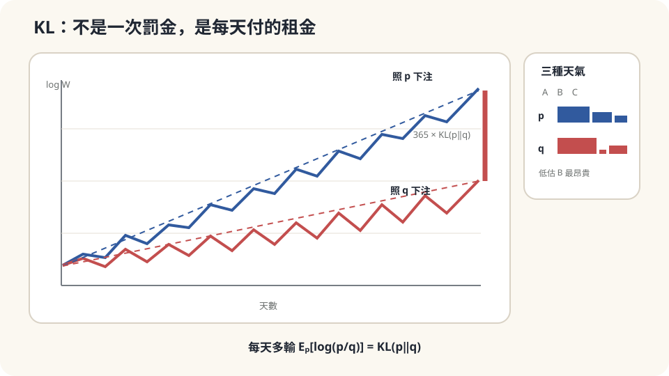

import Objectives from '../../../components/Objectives.astro';
import Prereq from '../../../components/Prereq.astro';
import Question from '../../../components/Question.astro';
import Answer from '../../../components/Answer.astro';
import QuizBlock from '../../../components/QuizBlock.astro';
import Option from '../../../components/Option.astro';
import Explanation from '../../../components/Explanation.astro';
import VizPlan from '../../../components/VizPlan.astro';
import Details from '../../../components/Details.astro';
import Bridge from '../../../components/Bridge.astro';
import Ref from '../../../components/Ref.astro';
import UsedBy from '../../../components/UsedBy.astro';

# 用錯的機率表下注一年會多輸多少：KL Divergence 與 Cross-Entropy

<Objectives>
- **寫出 $\mathrm{KL}(p\,\|\,q)=\sum_x p(x)\log\frac{p(x)}{q(x)}$。** 用「照 $q$ 下注、天氣照 $p$ 出現、每天平均多輸的量」讀懂它。
- **用 Jensen 兩行證明 $\mathrm{KL}\ge0$、等號只在 $p=q$。** 說出 cross-entropy $=$ entropy $+$ KL 這條分解。
- **對一個「用錯的模型做決策」的情境判斷該用 $\mathrm{KL}(p\|q)$ 還是 $\mathrm{KL}(q\|p)$、說出兩者各在哪種錯上罰得重（$q$ 給真實事件太低機率 vs $q$ 把機率浪費在不會發生的事上）。** 用模擬驗證。
</Objectives>

<Prereq items={frontmatter.prereqs} />

## 一張錯的天氣表

一家賭場每天對明天的天氣開盤：晴、雨、陰三種結果，你可以把手上的錢按任意比例押在三個結果上，押中的部分按賠率放大。假設賠率是公平的：押中「晴」的錢乘上 $1/q_{\text{莊}}(\text{晴})$，$q_{\text{莊}}$ 是賭場公告的機率表。

你手上有一張自己的機率表 $q$，你照它的比例下注——這是長期複利下最合理的策略（Kelly [3]）。問題是**真實的天氣照另一張表 $p$ 出現**，而你不知道。

一年後，你的財富會比一個**知道真實 $p$ 並照 $p$ 下注的人**差多少？請先用直覺回答：這個差距會是零、是一個常數、還是每天累積？它會不會因為你錯的方向不同而差很多——比方說「把 30% 的雨天當成 10%」和「把 10% 的雨天當成 30%」，哪個更傷？寫下你有多確定。

<Question id="Q1">
翻成數學。每天的隨機變數是什麼？「財富」怎麼隨天數變化？「比知道 $p$ 的人差多少」要比的是哪個量？

<Answer>
課堂上會先把每天的天氣寫成隨機變數 $X_t\in\{\text{晴},\text{雨},\text{陰}\}$，獨立、分佈 $p$。照 $q$ 下注，若第 $t$ 天出現 $x$，你押在 $x$ 上的比例是 $q(x)$，賠率是 $1/q_{\text{莊}}(x)$，所以財富乘上 $q(x)/q_{\text{莊}}(x)$。一年後：

$$
W_{365}=W_0\prod_{t=1}^{365}\frac{q(X_t)}{q_{\text{莊}}(X_t)}
\quad\Longrightarrow\quad
\frac1{365}\log\frac{W_{365}}{W_0}=\frac1{365}\sum_t\log\frac{q(X_t)}{q_{\text{莊}}(X_t)}
\;\xrightarrow{\ \text{大數法則}\ }\;
\mathbb E_{X\sim p}\Big[\log\frac{q(X)}{q_{\text{莊}}(X)}\Big].
$$

複利讓「相乘」變成 $\log$ 的「相加」，長期平均後每天的成長率是一個期望值——對**真實分佈 $p$** 取期望，因為天氣照 $p$ 出現。

知道 $p$ 的人用同一個式子，把 $q$ 換成 $p$。兩人每天成長率的差：

$$
\mathbb E_p\Big[\log\frac{p(X)}{q_{\text{莊}}(X)}\Big]-\mathbb E_p\Big[\log\frac{q(X)}{q_{\text{莊}}(X)}\Big]
=\mathbb E_p\Big[\log\frac{p(X)}{q(X)}\Big].
$$

賭場的 $q_{\text{莊}}$ 消掉了——差距只跟你的表 $q$ 與真實的 $p$ 有關。這個量就是這一篇的物件。它**每天累積**：一年後兩人財富的 $\log$ 差是它的 365 倍。
</Answer>
</Question>

## 每天多輸一點點

想像兩個人並排坐在賭場，一年裡看到**同一串**天氣。知道 $p$ 的人每天的財富曲線（$\log$ 座標）是一條有斜率的直線加上抖動；你的曲線也是一條直線加抖動，但斜率**低了一個固定的量**。兩條線之間的縫隙以固定速度張開。

那個固定的量，就是你「用錯表」的代價：每一天、平均而言，你比他少賺 $\mathbb E_p[\log(p/q)]$ 單位的 $\log$ 財富。它不是一次性的罰金，是**每天都要付的租金**——租的是「你不知道的那部分真相」。



*圖：同一串結果下，用錯機率表的人每天多付 KL(p‖q)，差距會線性累積。*

## KL、非負、與 cross-entropy

**定義。** 兩個分佈 $p,q$（同一個樣本空間）之間的 **Kullback–Leibler divergence**：

$$
\mathrm{KL}(p\,\|\,q)=\sum_x p(x)\log\frac{p(x)}{q(x)}=\mathbb E_{X\sim p}\Big[\log\frac{p(X)}{q(X)}\Big].
$$

連續分佈把和換成積分。讀法：**真相是 $p$，你以為是 $q$，每次觀測平均多付的 $\log$ 代價**。

**非負性（兩行）。** 把 $\mathrm{KL}$ 寫成 $-\mathbb E_p[\log(q/p)]$，$-\log$ 是 convex（<Ref to="math-jensen"/>），Jensen 說

$$
-\mathbb E_p\Big[\log\frac{q(X)}{p(X)}\Big]\;\ge\;-\log\mathbb E_p\Big[\frac{q(X)}{p(X)}\Big]=-\log\sum_x p(x)\frac{q(x)}{p(x)}=-\log\sum_xq(x)=-\log1=0.\qquad\square
$$

等號成立 ⟺ Jensen 的等號 ⟺ $q(X)/p(X)$ 是常數（$-\log$ strictly convex）⟺ $q=p$。**用錯表永遠有代價，只有表完全對才不用付。** 這就是為什麼 KL 可以當「距離」用——雖然它不是真正的距離（下面會看到）。

**Cross-entropy 與 entropy。** 把 $\log(p/q)$ 拆開：

$$
\mathrm{KL}(p\,\|\,q)=\underbrace{\mathbb E_p[-\log q(X)]}_{H(p,q)\ \text{cross-entropy}}-\underbrace{\mathbb E_p[-\log p(X)]}_{H(p)\ \text{entropy}}.
$$

$H(p)$ 只跟真相有關，是「就算知道 $p$ 也逃不掉的不確定性」（賭場那條線的斜率上限）；$H(p,q)$ 是你實際付的。所以 **cross-entropy $=$ 逃不掉的部分 $+$ 用錯表多付的部分**。當我們只能動 $q$ 時，最小化 $H(p,q)$ 與最小化 $\mathrm{KL}(p\|q)$ 是同一件事——這就是為什麼「cross-entropy loss」和「讓模型分佈接近資料分佈」是一體的兩面。

**不對稱。** $\mathrm{KL}(p\|q)\ne\mathrm{KL}(q\|p)$，而且差別不是技術性的。看兩種錯：

- $q(x)$ **太小**而 $p(x)$ 不小——你以為某件事幾乎不會發生，它卻常發生。$\log(p/q)$ 很大，乘上不小的 $p(x)$，$\mathrm{KL}(p\|q)$ **爆炸**（$q(x)\to0$ 時趨近 $\infty$）。這是「押太少在會發生的事上」——賭場裡這叫破產。
- $q(x)$ **太大**而 $p(x)$ 很小——你把機率浪費在不會發生的事上。$\log(p/q)$ 是負的，但乘上很小的 $p(x)$，貢獻有限。$\mathrm{KL}(p\|q)$ 對這種錯**很寬容**。

把 $p,q$ 對調，罰的方向就對調：$\mathrm{KL}(q\|p)$ 對「$q$ 在 $p$ 為零的地方放了質量」爆炸，對「$q$ 漏掉 $p$ 的某一塊」寬容。**選哪個方向，就是選要對哪種錯嚴格。**

<Details summary="KL 不是距離：不對稱、不滿足三角不等式，但有一個更好的性質">
距離（metric）要對稱、要滿足三角不等式；KL 兩者都不滿足。它也不是「差多少」的唯一選擇——total variation、Hellinger、Wasserstein 都是。KL 的特別之處有兩個。第一，它有上面那個「每次觀測的 log 代價」的操作意義（Kelly 賭注、編碼長度：用 q 設計的碼去編 p 產生的訊息，平均多用 KL 個 nat）。第二，它對獨立乘積可加：KL(p₁p₂ ‖ q₁q₂) = KL(p₁‖q₁) + KL(p₂‖q₂)——這正是「365 天的代價是一天的 365 倍」。可加性是 log 帶來的，任何不用 log 的距離都沒有。

另一個常用的事實：KL(p‖q) ≥ ½‖p − q‖₁²（Pinsker 不等式）。所以 KL 小 ⟹ 兩個分佈在任何事件上的機率差都小；但反過來不成立——total variation 很小時 KL 仍可能是無限大（只要 q 在某個 p 不為零的點上是零）。
</Details>

## 直覺對了一半

回答起點問題。差距不是零、不是常數，是**每天累積**：一年後 $\log$ 財富差 $365\,\mathrm{KL}(p\|q)$。用 $p=(0.5,0.3,0.2)$、$q=(0.6,0.1,0.3)$ 算：

$$
\mathrm{KL}(p\|q)=0.5\log\tfrac{0.5}{0.6}+0.3\log\tfrac{0.3}{0.1}+0.2\log\tfrac{0.2}{0.3}\approx-0.091+0.330-0.081=0.158\ \text{nat/天},
$$

一年 $57.4$ nat——你的財富是他的 $e^{-57.4}\approx10^{-25}$ 倍。三項裡**第二項**（把 30% 的雨天當成 10%）貢獻了全部；把 20% 的陰天高估成 30% 那一項甚至是負的。直覺說「兩種錯都傷」——對，但傷的程度差了一個數量級，而且方向是明確的：**低估會發生的事，比高估不會發生的事貴得多**。

反過來的錯——真相 $p'=(0.6,0.1,0.3)$、你的表 $q'=(0.5,0.3,0.2)$，也就是把 10% 的雨天當成 30%：$\mathrm{KL}(p'\|q')=0.6\log1.2+0.1\log\tfrac13+0.3\log1.5\approx0.109-0.110+0.122=0.121$。比 $0.158$ 小——同樣是「雨天差 20 個百分點」，方向不同代價不同，這就是不對稱。

判斷依賴的假設：**天氣真的照一個固定的 $p$ 獨立出現**（大數法則才成立），以及**你照 $q$ 的比例全額下注**（Kelly 策略；若你只押一部分，代價按比例縮小，但排序不變）。

## 跑一年，然後把某個 $q(x)$ 壓到零

```python
import numpy as np
rng = np.random.default_rng(0)
p = np.array([0.5, 0.3, 0.2]); q = np.array([0.6, 0.1, 0.3])
kl = lambda a, b: np.sum(a * np.log(a / b))
print(kl(p, q), kl(q, p))                                   # 0.157 vs 0.121：不對稱
x = rng.choice(3, size=(2000, 365), p=p)                    # 2000 個「一年」，每年 365 天真實天氣
gap = np.log(p[x]).sum(1) - np.log(q[x]).sum(1)             # 知道 p 的人 − 照 q 下注的人（log 財富差）
print(gap.mean() / 365, gap.std() / 365)                    # ≈ 0.158，抖動 ≈ 0.03：每天多輸 KL
# 破壞：把雨天的機率壓到幾乎零
q_bad = np.array([0.7, 1e-6, 0.3 - 1e-6])
print(kl(p, q_bad))                                         # ≈ 3.5 nat/天：每個雨天輸掉 3×10⁵ 倍
```

模擬 2000 個「一年」，每天平均多輸 $0.158$ nat、與公式一致，抖動是 $0.03$（一年 365 天的隨機性）。把雨天的機率壓到 $10^{-6}$：KL 跳到 $3.5$ nat/天——每個雨天你的財富乘上 $10^{-6}/0.3$，一年約 110 個雨天，破產。理論不只說「用錯表會輸」，還說出**哪一格錯最貴、貴多少**。

<iframe loading="lazy" src="/personal_website/notes/research_areas/mathematical-foundations/m5-optimization/m5-1-1.html" class="demo-frame" title="KL divergence 逐項代價互動示範" style="height: 900px; width: 100%; border: none;"></iframe>

**互動 demo：拖動 q 的三格並交換方向，觀察哪一種錯誤被 KL 重罰。**

## 檢查理解

<QuizBlock id="m5-1-a">
一個氣象站用模型 $q$ 預報，事後拿真實頻率 $p$ 來評分。它在「颱風」這一格給了 $q=0.001$，而颱風實際上一年來了 3 次（$p\approx0.008$）；在「冰雹」這一格給了 $q=0.05$，實際上一年沒發生（$p\approx0$）。哪一格對 $\mathrm{KL}(p\|q)$ 的貢獻大？
<Option>冰雹，因為高估了 50 倍。</Option>
<Option correct>颱風——$p$ 不小而 $q$ 太小，$p\log(p/q)\approx0.008\times\log8\approx0.017$；冰雹那格 $p\approx0$，乘上去幾乎沒有貢獻，不管 $q$ 多大。</Option>
<Option>兩格差不多。</Option>
<Explanation>
KL 的每一項都乘上真實機率 $p(x)$。不會發生的事（$p\approx0$）無論你怎麼高估，權重都是零；會發生的事被低估，$\log(p/q)$ 大又有權重。「高估 50 倍」聽起來嚴重，但在 $\mathrm{KL}(p\|q)$ 下幾乎免費——換成 $\mathrm{KL}(q\|p)$ 才會罰它。
</Explanation>
</QuizBlock>

<QuizBlock id="m5-1-b">
把天氣改成**不獨立**——今天雨明天很可能也雨（Markov chain），但你仍假設每天獨立、照邊際 $q$ 下注。「一年多輸 $365\,\mathrm{KL}(p\|q)$」這個結論會：
<Option>完全不變，KL 跟獨立不獨立無關。</Option>
<Option correct>不再精確——推導用了「每天的代價可以相加、大數法則平均」；相依時真正的代價是整條序列聯合分佈之間的 KL，它可以比 $365\,\mathrm{KL}(p\|q)$ 大（知道 $p$ 的人還能利用昨天的資訊，你不能）。</Option>
<Option>變成零，因為相依讓天氣可預測。</Option>
<Explanation>
可加性 $\mathrm{KL}(p^{\otimes n}\|q^{\otimes n})=n\,\mathrm{KL}(p\|q)$ 只對獨立乘積成立。相依時，「知道真相」的人知道的是整個 Markov chain，他每天用條件分佈下注，比只用邊際的你多贏一段；那一段是 $H(\text{邊際})-H(\text{條件})$，不在單日 KL 裡。「變成零」錯在方向：可預測性是對知道 $p$ 的人有利，不是對你。
</Explanation>
</QuizBlock>

<QuizBlock id="m5-1-c">
訓練一個分類器時，我們最小化 cross-entropy $H(p_{\text{data}},q_\theta)$ 而不是 $\mathrm{KL}(p_{\text{data}}\|q_\theta)$。這是因為：
<Option>cross-entropy 對稱，KL 不對稱。</Option>
<Option>兩者是不同的目標，cross-entropy 比較好。</Option>
<Option correct>兩者只差一個與 $\theta$ 無關的常數 $H(p_{\text{data}})$，對 $\theta$ 而言是同一個目標；cross-entropy 只需要 $p_{\text{data}}$ 的樣本（算 $-\log q_\theta$ 的平均），不需要知道 $p_{\text{data}}$ 的密度本身。</Option>
<Explanation>
$H(p,q)=H(p)+\mathrm{KL}(p\|q)$，$H(p)$ 不含 $\theta$。KL 裡的 $\log p(x)$ 我們算不出來（只有樣本），但它在對 $\theta$ 微分時本來就消失；cross-entropy 是可以從樣本直接估的那個版本。cross-entropy 同樣不對稱。
</Explanation>
</QuizBlock>

<UsedBy slug={frontmatter.slug} />

<Bridge to="math-ema">
本篇把「用錯表的代價」寫成 $\mathrm{KL}(p\|q)=\mathbb E_p[\log(p/q)]$：每天付的租金、Jensen 兩行證明非負、cross-entropy 減 entropy、對「低估會發生的事」罰到無限而對「高估不會發生的事」寬容。接下來換一個場景：目標不是固定的表，而是一個會動的東西——追一隻自己也在跑的狗，你該怎麼估它的位置，才不會一直追過頭？
</Bridge>

## 參考文獻

1. Cover, T. M., Thomas, J. A. [*Elements of Information Theory.*](https://doi.org/10.1002/047174882X) Wiley, 2nd ed., 2006.（第 2.3 節 relative entropy 的定義、第 2.6 節非負性（information inequality）、第 6 章 gambling and data compression：Kelly 賭注與「多輸 KL」的推導、第 11.6 節 Pinsker 不等式。）
2. Kullback, S., Leibler, R. A. [*On Information and Sufficiency.*](https://doi.org/10.1214/aoms/1177729694) Annals of Mathematical Statistics 22(1), 1951.（原始出處。）
3. Kelly, J. L. [*A New Interpretation of Information Rate.*](https://doi.org/10.1002/j.1538-7305.1956.tb03809.x) Bell System Technical Journal 35(4), 1956.（照機率比例下注使長期成長率最大；用錯表的損失。）
4. MacKay, D. J. C. [*Information Theory, Inference, and Learning Algorithms.*](https://www.inference.org.uk/itprnn/book.html) Cambridge University Press, 2003.（第 2 章：entropy、cross-entropy 與 KL 的直覺解釋與練習。）
