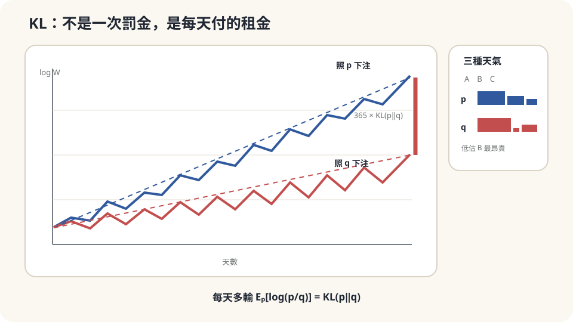

import Objectives from '../../../components/Objectives.astro';
import Prereq from '../../../components/Prereq.astro';
import Question from '../../../components/Question.astro';
import Answer from '../../../components/Answer.astro';
import QuizBlock from '../../../components/QuizBlock.astro';
import Option from '../../../components/Option.astro';
import Explanation from '../../../components/Explanation.astro';
import VizPlan from '../../../components/VizPlan.astro';
import Details from '../../../components/Details.astro';
import Bridge from '../../../components/Bridge.astro';
import Ref from '../../../components/Ref.astro';
import UsedBy from '../../../components/UsedBy.astro';

# 用錯的機率表下注一年會多輸多少：KL Divergence 與 Cross-Entropy

<Objectives>
- **寫出 $\mathrm{KL}(p\,\|\,q)=\sum_x p(x)\log\frac{p(x)}{q(x)}$。** 用「照 $q$ 下注、天氣照 $p$ 出現、每天平均多輸的量」讀懂它。
- **用 Jensen 兩行證明 $\mathrm{KL}\ge0$、等號只在 $p=q$。** 說出 cross-entropy $=$ entropy $+$ KL 這條分解。
- **對一個「用錯的模型做決策」的情境判斷該用 $\mathrm{KL}(p\|q)$ 還是 $\mathrm{KL}(q\|p)$、說出兩者各在哪種錯上罰得重（$q$ 給真實事件太低機率 vs $q$ 把機率浪費在不會發生的事上）。** 用模擬驗證。
</Objectives>

<Prereq items={frontmatter.prereqs} />

## 一張錯的天氣表

一家賭場每天對明天的天氣開盤：晴、雨、陰三種結果，你可以把手上的錢按任意比例押在三個結果上，押中的部分按賠率放大。假設賠率是公平的：押中「晴」的錢乘上 $1/q_{\text{莊}}(\text{晴})$，$q_{\text{莊}}$ 是賭場公告的機率表。

這是簡化的數學模型，不是下注建議。若你相信自己的機率表 $q$，在這個全額分配模型中，照 $q$ 的比例下注會最大化你所相信的期望 log 財富（Kelly [3]）。但**真實的天氣照另一張表 $p$ 出現**，用錯表的影響會如何累積？

兩個人看到同一串天氣，一個用 $p$、另一個用 $q$。每次結果出現後，兩人財富都乘上一個數；所以要比較長期累積的影響，最自然的做法就是先取 log，把相乘換成相加。

<Question id="Q1">
翻成數學。每天的隨機變數是什麼？「財富」怎麼隨天數變化？「比知道 $p$ 的人差多少」要比的是哪個量？

<Answer>
課堂上會先把每天的天氣寫成隨機變數 $X_t\in\{\text{晴},\text{雨},\text{陰}\}$，獨立、分佈 $p$。照 $q$ 下注，若第 $t$ 天出現 $x$，你押在 $x$ 上的比例是 $q(x)$，賠率是 $1/q_{\text{莊}}(x)$，所以財富乘上 $q(x)/q_{\text{莊}}(x)$。一年後：

$$
W_n=W_0\prod_{t=1}^{n}\frac{q(X_t)}{q_{\text{莊}}(X_t)}
\quad\Longrightarrow\quad
\frac1n\log\frac{W_n}{W_0}=\frac1n\sum_{t=1}^n\log\frac{q(X_t)}{q_{\text{莊}}(X_t)}
\;\xrightarrow{\ n\to\infty\ }\;
\mathbb E_{X\sim p}\Big[\log\frac{q(X)}{q_{\text{莊}}(X)}\Big].
$$

複利讓「相乘」變成 $\log$ 的「相加」，長期平均後每天的成長率是一個期望值——對**真實分佈 $p$** 取期望，因為天氣照 $p$ 出現。

知道 $p$ 的人用同一個式子，把 $q$ 換成 $p$。兩人每天成長率的差：

$$
\mathbb E_p\Big[\log\frac{p(X)}{q_{\text{莊}}(X)}\Big]-\mathbb E_p\Big[\log\frac{q(X)}{q_{\text{莊}}(X)}\Big]
=\mathbb E_p\Big[\log\frac{p(X)}{q(X)}\Big].
$$

賭場的 $q_{\text{莊}}$ 消掉了，差距只跟 $p,q$ 有關。一年後的**期望** log 財富差是它的 365 倍；某一個實際年份仍會在這個期望附近波動。
</Answer>
</Question>

## 每天多輸一點點

想像兩個人並排坐在賭場，一年裡看到**同一串**天氣。知道 $p$ 的人每天的財富曲線（$\log$ 座標）是一條有斜率的直線加上抖動；你的曲線也是一條直線加抖動，但斜率**低了一個固定的量**。兩條線之間的縫隙以固定速度張開。

這個量就是每次事件發生時，平均多付的 log 代價。畫出來的實際曲線會抖動，線性張開的是期望差距，不是每一天都損失完全相同的數。



*圖：同一串結果下，log 財富差會波動；它的期望以 KL(p‖q) 的速率累積。*

## KL、非負、與 cross-entropy

**定義。** 兩個分佈 $p,q$（同一個樣本空間）之間的 **Kullback–Leibler divergence**：

$$
\mathrm{KL}(p\,\|\,q)=\sum_x p(x)\log\frac{p(x)}{q(x)}=\mathbb E_{X\sim p}\Big[\log\frac{p(X)}{q(X)}\Big].
$$

連續分佈把和換成積分。約定 $p(x)=0$ 的項為零；若 $p(x)>0$ 但 $q(x)=0$，KL 是無限大。讀法是：**真相是 $p$，你以為是 $q$，每次觀測平均多付的 log 代價。** Kullback 與 Leibler [2] 將這個量用來描述分布之間的資訊差異。

**非負性（兩行）。** 把 $\mathrm{KL}$ 寫成 $-\mathbb E_p[\log(q/p)]$，$-\log$ 是 convex（<Ref to="math-jensen"/>），Jensen 說

$$
-\mathbb E_p\Big[\log\frac{q(X)}{p(X)}\Big]\ge-\log\sum_{x:p(x)>0}q(x)\ge-\log1=0.\qquad\square
$$

第一個等號要求 $q(X)/p(X)$ 在 $p$ 下是常數；第二個等號要求 $q$ 沒有在 $p=0$ 的地方放質量。再用兩者總和都是 1，就得到 $p=q$。所以 KL 為零當且僅當兩個分布相同，但它並不是 metric 意義下的距離。

**Cross-entropy 與 entropy。** 把 $\log(p/q)$ 拆開：

$$
\mathrm{KL}(p\,\|\,q)=\underbrace{\mathbb E_p[-\log q(X)]}_{H(p,q)\ \text{cross-entropy}}-\underbrace{\mathbb E_p[-\log p(X)]}_{H(p)\ \text{entropy}}.
$$

$H(p)$ 是用正確機率表計算的平均 negative log probability；$H(p,q)$ 則使用模型的表。在這些量有限時，**cross-entropy＝正確表的代價＋用錯表的額外代價**。固定 $p$ 後，最小化 cross-entropy 與 KL 是同一個目標。連續情況的 differential entropy 可以是負的，不能直接解讀成離散事件的不確定性。

**不對稱。** $\mathrm{KL}(p\|q)\ne\mathrm{KL}(q\|p)$，而且差別不是技術性的。看兩種錯：

- $q(x)$ **太小**而 $p(x)$ 不小——你以為某件事幾乎不會發生，它卻常發生。$\log(p/q)$ 很大，乘上不小的 $p(x)$，$\mathrm{KL}(p\|q)$ **爆炸**（$q(x)\to0$ 時趨近 $\infty$）。這是「押太少在會發生的事上」——賭場裡這叫破產。
- $q(x)$ **太大**而 $p(x)$ 很小，該項的權重也小；若 $p(x)=0$，該項本身為零。但 $q$ 的總質量只能是 1，多放在這裡就會少放在別處，整個 KL 仍會受影響。

把 $p,q$ 對調，取平均的權重也換了。$\mathrm{KL}(q\|p)$ 對「$q$ 在 $p=0$ 的地方放質量」是無限大；漏掉某塊的直接權重則可能是零。這說明方向會影響對錯誤的處理，不代表任意例子中某一方向都比較大。

<Details summary="KL 不是距離：不對稱、不滿足三角不等式，但有一個更好的性質">
距離（metric）要對稱、滿足三角不等式；KL 兩者都不滿足。它也不是唯一的比較方式。KL 的一個重要性質是對獨立乘積可加：$\mathrm{KL}(p_1p_2\|q_1q_2)=\mathrm{KL}(p_1\|q_1)+\mathrm{KL}(p_2\|q_2)$。證明只要把 log 乘積拆成和，再分別取期望即可。

另一個常用的事實：KL(p‖q) ≥ ½‖p − q‖₁²（Pinsker 不等式）。所以 KL 小 ⟹ 兩個分佈在任何事件上的機率差都小；但反過來不成立——total variation 很小時 KL 仍可能是無限大（只要 q 在某個 p 不為零的點上是零）。
</Details>

## 直覺對了一半

一年後的期望 log 財富差是 $365\,\mathrm{KL}(p\|q)$。用 $p=(0.5,0.3,0.2)$、$q=(0.6,0.1,0.3)$ 算：

$$
\mathrm{KL}(p\|q)=0.5\log\tfrac{0.5}{0.6}+0.3\log\tfrac{0.3}{0.1}+0.2\log\tfrac{0.2}{0.3}\approx-0.091+0.330-0.081=0.158\ \text{nat/天},
$$

約一年 $57.4$ nat，這是期望 log 差，不是實際財富比例的確定值，也不是平均財富比例的 log。各項可以為負，只有總和保證非負；這個例子中，低估雨天造成了最大的正貢獻。

反過來的錯——真相 $p'=(0.6,0.1,0.3)$、你的表 $q'=(0.5,0.3,0.2)$，也就是把 10% 的雨天當成 30%：$\mathrm{KL}(p'\|q')=0.6\log1.2+0.1\log\tfrac13+0.3\log1.5\approx0.109-0.110+0.122=0.121$。比 $0.158$ 小——同樣是「雨天差 20 個百分點」，方向不同代價不同，這就是不對稱。

上面的長期極限用了固定 $p$ 的獨立樣本與可積分的 log 比值。若只拿部分資金下注，財富乘數會改變，不能直接把 KL 按下注比例縮小。

## 跑一年，然後把某個 $q(x)$ 壓到零

```python
import numpy as np
rng = np.random.default_rng(0)
p = np.array([0.5, 0.3, 0.2]); q = np.array([0.6, 0.1, 0.3])
kl = lambda a, b: np.sum(a * np.log(a / b))
print(kl(p, q), kl(q, p))                                   # 0.157 vs 0.121：不對稱
x = rng.choice(3, size=(2000, 365), p=p)                    # 2000 個「一年」，每年 365 天真實天氣
gap = np.log(p[x]).sum(1) - np.log(q[x]).sum(1)             # 知道 p 的人 − 照 q 下注的人（log 財富差）
print(gap.mean() / 365, gap.std() / 365)                    # ≈ 0.158，抖動 ≈ 0.03：每天多輸 KL
# 破壞：把雨天的機率壓到幾乎零
q_bad = np.array([0.7, 1e-6, 0.3 - 1e-6])
print(kl(p, q_bad))                                         # ≈ 3.5 nat/天：每個雨天輸掉 3×10⁵ 倍
```

模擬 2000 個「一年」，每天平均多輸 $0.158$ nat、與公式一致，抖動是 $0.03$（一年 365 天的隨機性）。把雨天的機率壓到 $10^{-6}$：KL 跳到 $3.5$ nat/天——每個雨天你的財富乘上 $10^{-6}/0.3$，一年約 110 個雨天，破產。理論不只說「用錯表會輸」，還說出**哪一格錯最貴、貴多少**。

<iframe loading="lazy" src="/personal_website/notes/research_areas/mathematical-foundations/m5-optimization/m5-1-1.html" class="demo-frame" title="KL divergence 逐項代價互動示範" style="height: 900px; width: 100%; border: none;"></iframe>

**互動 demo：拖動 q 的三格並交換方向，觀察哪一種錯誤被 KL 重罰。**

## 檢查理解

<QuizBlock id="m5-1-a">
以某一年的 empirical frequency $p$ 評分，模型給颱風 $q=0.001$，該年頻率約 $0.008$；給冰雹 $q=0.05$，該年頻率為零。哪一格對這份 empirical KL 的貢獻大？
<Option>冰雹，因為高估了 50 倍。</Option>
<Option correct>颱風——$p$ 不小而 $q$ 太小，$p\log(p/q)\approx0.008\times\log8\approx0.017$；冰雹那格 $p\approx0$，乘上去幾乎沒有貢獻，不管 $q$ 多大。</Option>
<Option>兩格差不多。</Option>
<Explanation>
這份表裡冰雹那一項為零，但不是高估它完全免費：分配給冰雹的質量會壓縮其他格的機率。也不能因為一年沒有觀測到冰雹，就認定真實機率為零。
</Explanation>
</QuizBlock>

<QuizBlock id="m5-1-b">
假設天氣是 stationary Markov chain，每天的 marginal 都是 $p$。兩個人都不使用歷史，一個固定照 $p$、另一個固定照 $q$ 下注。$n$ 天的期望 log 財富差是：
<Option correct>$n\,\mathrm{KL}(p\|q)$；期望的線性不需要每天獨立。</Option>
<Option>只要相依，期望差就一定更大。</Option>
<Option>零，因為相依讓天氣可預測。</Option>
<Explanation>
$\mathbb E[\sum_t\log(p(X_t)/q(X_t))]=\sum_t\mathbb E[\log(p(X_t)/q(X_t))]=n\,\mathrm{KL}(p\|q)$。若改成跟一個會使用完整歷史的人比較，基準才變成真實的 conditional probabilities，不能再只看單日 marginal KL。長期 sample average 的收斂則另外需要 ergodicity 等條件。
</Explanation>
</QuizBlock>

<QuizBlock id="m5-1-c">
訓練一個分類器時，我們最小化 cross-entropy $H(p_{\text{data}},q_\theta)$ 而不是 $\mathrm{KL}(p_{\text{data}}\|q_\theta)$。這是因為：
<Option>cross-entropy 對稱，KL 不對稱。</Option>
<Option>兩者是不同的目標，cross-entropy 比較好。</Option>
<Option correct>兩者只差一個與 $\theta$ 無關的常數 $H(p_{\text{data}})$，對 $\theta$ 而言是同一個目標；cross-entropy 只需要 $p_{\text{data}}$ 的樣本（算 $-\log q_\theta$ 的平均），不需要知道 $p_{\text{data}}$ 的密度本身。</Option>
<Explanation>
$H(p,q)=H(p)+\mathrm{KL}(p\|q)$，$H(p)$ 不含 $\theta$。KL 裡的 $\log p(x)$ 我們算不出來（只有樣本），但它在對 $\theta$ 微分時本來就消失；cross-entropy 是可以從樣本直接估的那個版本。cross-entropy 同樣不對稱。
</Explanation>
</QuizBlock>

<UsedBy slug={frontmatter.slug} />

<Bridge to="math-ema">
現在能用 KL 衡量固定機率表的平均 log 代價，也知道 cross-entropy 為什麼能用樣本訓練。若我們要估計的目標本身一直在動，直接相信最新一次觀測會不會太不穩？下一篇從追蹤位置出發，看看 EMA 如何在平滑與延遲之間取捨。
</Bridge>

## 參考文獻

1. Cover, T. M., Thomas, J. A. [*Elements of Information Theory.*](https://doi.org/10.1002/047174882X) Wiley, 2nd ed., 2006.（第 2.3 節 relative entropy 的定義、第 2.6 節非負性（information inequality）、第 6 章 gambling and data compression：Kelly 賭注與「多輸 KL」的推導、第 11.6 節 Pinsker 不等式。）
2. Kullback, S., Leibler, R. A. [*On Information and Sufficiency.*](https://doi.org/10.1214/aoms/1177729694) Annals of Mathematical Statistics 22(1), 1951.（原始出處。）
3. Kelly, J. L. [*A New Interpretation of Information Rate.*](https://doi.org/10.1002/j.1538-7305.1956.tb03809.x) Bell System Technical Journal 35(4), 1956.（照機率比例下注使長期成長率最大；用錯表的損失。）
4. MacKay, D. J. C. [*Information Theory, Inference, and Learning Algorithms.*](https://www.inference.org.uk/itprnn/book.html) Cambridge University Press, 2003.（第 2 章：entropy、cross-entropy 與 KL 的直覺解釋與練習。）
