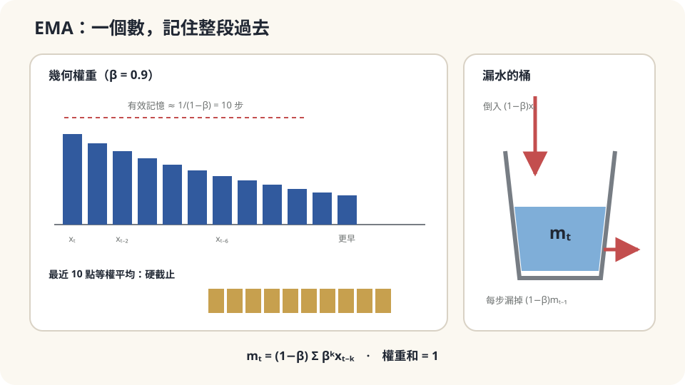

import Objectives from '../../../components/Objectives.astro';
import Prereq from '../../../components/Prereq.astro';
import Question from '../../../components/Question.astro';
import Answer from '../../../components/Answer.astro';
import QuizBlock from '../../../components/QuizBlock.astro';
import Option from '../../../components/Option.astro';
import Explanation from '../../../components/Explanation.astro';
import VizPlan from '../../../components/VizPlan.astro';
import Details from '../../../components/Details.astro';
import Bridge from '../../../components/Bridge.astro';
import Ref from '../../../components/Ref.astro';
import UsedBy from '../../../components/UsedBy.astro';

# 追一隻自己也在跑的狗：移動目標、EMA 與 Stop-Gradient

<Objectives>
- **寫出 exponential moving average $m_t=\beta m_{t-1}+(1-\beta)x_t$，說出它等價於「對過去以幾何權重加權平均」、有效記憶長度約 $1/(1-\beta)$。** 算出它對雜訊的壓縮與對移動目標的滯後。
- **說出 bootstrap 為什麼容許「全部一起不動」的平凡解。** 分清 stop-gradient 與慢速目標各自改變什麼。
- **對一個「追蹤會動的量」的情境判斷該用多大的 $\beta$、說出這個判斷依賴的假設（目標的速度、雜訊的大小、是否有 bootstrap）。** 用模擬驗證與破壞它。
</Objectives>

<Prereq items={frontmatter.prereqs} />

## 一隻不肯停的狗

公園裡一隻狗在跑。你戴著一個定位手環的接收器，每秒收到它一個位置——但手環很便宜，每個讀數都有大約 3 公尺的隨機誤差。你想知道狗**現在**在哪，好走過去接它。

最直接的做法：相信最新的那個讀數。結果是你每秒都被 3 公尺的雜訊甩來甩去，方向一直改。第二種做法：把過去十秒的讀數平均。雜訊被壓下去了，但狗跑得快——十秒前它在二十公尺外，你的平均永遠指向它**已經離開**的地方，你一直追過頭。

有沒有一種介於兩者之間的做法？它要「記得」多久？請先用直覺回答：如果狗跑得更快，你該記得更久還是更短？如果雜訊更大呢？寫下你有多確定。

<Question id="Q1">
翻成數學。「狗的真實位置」與「讀數」各是什麼？「記得多久」可以用一個什麼樣的規則寫出來，讓它不需要真的存十秒的資料？

<Answer>
課堂上會先把真實位置寫成 $\mu_t$（一條會動的曲線），讀數寫成 $x_t=\mu_t+\varepsilon_t$，$\varepsilon_t$ 是均值 0、標準差 $\sigma\approx3$ 公尺、彼此獨立的雜訊。我們想要的估計 $m_t$ 要同時滿足兩件矛盾的事：接近 $\mu_t$（跟得緊）、又不被 $\varepsilon_t$ 甩動（雜訊小）。

「記得多久」若用「存最近 $k$ 個讀數取平均」來寫，要存 $k$ 個數、每秒重算。有一個更簡潔的規則，只存**一個**數：

$$
m_t=\beta\,m_{t-1}+(1-\beta)\,x_t,\qquad\beta\in[0,1).
$$

每秒把「上一刻的估計」與「這一刻的讀數」按 $\beta:(1-\beta)$ 混合。$\beta=0$ 是「只信最新讀數」，$\beta\to1$ 是「幾乎不更新」。這叫 **exponential moving average**（EMA）。它「記得多久」由 $\beta$ 一個數決定——下一節會把這個「多久」算出來。
</Answer>
</Question>

## 一桶會漏的水

把 $m_t$ 想成一桶水的水位。每秒倒進 $(1-\beta)$ 桶新水（今天的讀數 $x_t$），同時舊水只留下 $\beta$ 的比例。一週前倒進去的水，現在只剩 $\beta^{7\times86400}$——早就漏光了；一秒前的還剩 $\beta$。所以水位是**過去所有讀數的加權平均，權重按時間往回幾何遞減**：越近的越重，越遠的越輕，沒有一個硬的截止點。

$\beta$ 控制漏得多快。$\beta=0.9$ 時，十秒前的水只剩 $0.9^{10}\approx35\%$，二十秒前剩 $12\%$——「有效記憶」大約十秒。$\beta=0.99$ 時有效記憶約一百秒。這比「存最近 $k$ 個」好在兩件事：只要一個數的儲存空間，而且沒有「第 $k$ 個算、第 $k+1$ 個不算」那種突然的切換。



*圖：EMA 只保留一個狀態，卻等價於對整段過去施加幾何遞減權重。*

## 一個係數，兩個代價

把遞迴展開（代入 $m_{t-1}$，再代入 $m_{t-2}$，…）：

$$
m_t=(1-\beta)\sum_{k=0}^{\infty}\beta^k\,x_{t-k},\qquad(1-\beta)\sum_{k\ge0}\beta^k=1 .
$$

權重和為 1，所以它是一個合法的加權平均。有效記憶長度取權重的平均延遲：$\sum_k k\,(1-\beta)\beta^k=\beta/(1-\beta)\approx1/(1-\beta)$。

現在把兩個代價算出來。代入 $x_t=\mu_t+\varepsilon_t$，EMA 是線性的，所以 $m_t=\underbrace{(1-\beta)\sum_k\beta^k\mu_{t-k}}_{\text{對真實位置的追蹤}}+\underbrace{(1-\beta)\sum_k\beta^k\varepsilon_{t-k}}_{\text{雜訊}}$。

**雜訊的代價。** 第二項是獨立零均值雜訊的加權和，變異數是權重平方和乘 $\sigma^2$（<Ref to="math-random-walk-brownian"/> 的「變異數相加」）：

$$
\mathrm{Var}(\text{雜訊項})=\sigma^2(1-\beta)^2\sum_k\beta^{2k}=\sigma^2\,\frac{(1-\beta)^2}{1-\beta^2}=\sigma^2\,\frac{1-\beta}{1+\beta}.
$$

$\beta=0.9$：雜訊標準差變成 $\sigma\sqrt{0.1/1.9}\approx0.23\sigma$，3 公尺壓到 0.7 公尺。$\beta$ 越接近 1 壓得越多。

**滯後的代價。** 若狗以等速 $v$ 跑，$\mu_{t-k}=\mu_t-vk$，第一項變成 $\mu_t-v\,(1-\beta)\sum_k k\beta^k=\mu_t-v\,\frac{\beta}{1-\beta}$。**EMA 永遠指向狗「有效記憶長度」之前的位置**，落後 $v\beta/(1-\beta)$。$\beta=0.9$、狗每秒跑 2 公尺：落後 18 公尺。

兩個代價往相反方向動：

$$
\underbrace{\sigma^2\frac{1-\beta}{1+\beta}}_{\beta\uparrow\ \text{變小}}\qquad\text{vs}\qquad\underbrace{\Big(v\frac{\beta}{1-\beta}\Big)^2}_{\beta\uparrow\ \text{變大}} .
$$

**$\beta$ 是「跟多緊」與「多平滑」之間唯一的設定。** 狗跑得快（$v$ 大）就該把 $\beta$ 調小、記得短；雜訊大（$\sigma$ 大）就該調大、記得長。最佳的 $\beta$ 讓兩項加起來最小——它有 closed form，但更重要的是它**由 $v$ 與 $\sigma$ 的比值決定**，不是一個放諸四海皆準的常數。

<Details summary="有偏的起點、Adam 的修正、與 Polyak averaging">
遞迴從 m₀ = 0 開始時，m_t = (1−β)Σ_\{k\<t\} βᵏ x_\{t−k\} 的權重和是 1 − βᵗ \< 1——前面幾步的估計被系統性地拉向 0。Adam [3] 的「bias correction」就是把 m_t 除以 (1 − βᵗ)，讓權重和回到 1；t 大了以後這個修正自動消失。

另一個常見的用法是把 EMA 套在**一串會收斂的估計**上（Polyak & Juditsky [2]）：如果 x_t 本身是某個演算法的第 t 步迭代、它在真值附近抖動，那 EMA 把抖動壓掉、留下更穩的答案——這時「目標會動」的問題反而是好事：目標最終不動了，滯後也就消失。實務上把 β 設成 0.999 甚至更接近 1 的「權重平均」就是這個用法。
</Details>

## 一個更危險的情境：追的是自己的影子

上面的狗有一個好性質：它的位置 $\mu_t$ **不會因為你怎麼估而改變**。現在換一個情境。

你在訓練一個估計器 $f_\theta$，它的訓練目標是**由它自己的輸出定義的**——例如「$f_\theta(\text{今天})$ 應該接近 $f_\theta(\text{明天})$ 的某個變換」。這種「用自己的預測當作自己的目標」叫 **bootstrap**。強化學習裡的 Q-learning（$Q(s,a)$ 的目標是 $r+\gamma\max Q(s',\cdot)$）、自監督學習裡「兩個視角的表徵要一致」的方法（BYOL [4]）都是這種結構。

它有一個致命的平凡解：**讓 $f_\theta$ 輸出常數**。常數對常數，目標與預測完全一致，loss 為零，但什麼都沒學到。狗的比喻裡，這相當於狗的位置是由你的估計定義的——你站著不動，狗就「在你腳下」。

兩個技術一起避開這個坑：

1. **Stop-gradient。** 計算目標時把它當成**常數**，不讓梯度流過去：$\mathcal L=\|f_\theta(a)-\mathrm{sg}[f(b)]\|^2$。這樣「把目標移過來」這條捷徑被切斷了，只剩「把預測移過去」。
2. **慢速目標（EMA target）。** 目標不用當前的 $\theta$，用它的 EMA $\bar\theta_t=\beta\bar\theta_{t-1}+(1-\beta)\theta_t$，$\beta$ 很接近 1（0.99–0.999）。目標網路是一個「落後、平滑」的自己——就是這一篇的 EMA，但這裡**滯後是想要的**：它讓目標在幾百步內幾乎不動，把一個「追自己」的問題變回「追一隻跑得很慢的狗」。DQN [5] 用的「target network 每隔 $C$ 步複製一次」是同一個想法的硬截止版。

兩者的分工：stop-gradient 決定**梯度往哪個方向流**（只更新預測端），EMA 決定**目標動多快**。少了前者，最速下降會直接把目標拉向預測；少了後者，目標每步都跳、訓練震盪。

## 直覺對了，數字現在有了

回答起點問題。狗跑得快 → $\beta$ 該**調小**（記得短，落後 $v\beta/(1-\beta)$ 才不會太大）；雜訊大 → $\beta$ 該**調大**（雜訊標準差是 $\sigma\sqrt{(1-\beta)/(1+\beta)}$）。兩者衝突時，最佳 $\beta$ 由 $v/\sigma$ 決定：狗每秒 2 公尺、雜訊 3 公尺時，把總誤差 $\sigma^2\frac{1-\beta}{1+\beta}+\big(v\frac{\beta}{1-\beta}\big)^2$ 對 $\beta$ 掃一遍，最小值落在 $\beta\approx0.35$ 附近（落後約 1.1 公尺、雜訊約 2.1 公尺；$\beta=0.5$ 則是落後 2 公尺、雜訊 1.7 公尺，總誤差差不多）；狗若停下來（$v=0$），最佳 $\beta\to1$。

這個判斷依賴的假設：**狗的速度大致穩定**（等速假設；急轉彎時任何 $\beta$ 都會在轉彎處落後一段）、**雜訊獨立且零均值**（若手環有系統性偏差，EMA 會忠實地保留它）、以及**目標不受估計影響**。最後一點失效時——目標由估計者定義——就要把 stop-gradient 與慢速目標拿出來。

## 跑一次，讓狗急轉彎一次，然後追自己的影子一次

```python
import numpy as np
rng = np.random.default_rng(0)
T, v, sigma = 200, 2.0, 3.0
mu = v * np.arange(T)                                   # 狗等速直線
x  = mu + sigma * rng.standard_normal(T)                # 帶雜訊的讀數
def ema(x, beta):
    m = np.empty_like(x); m[0] = x[0]
    for t in range(1, T): m[t] = beta*m[t-1] + (1-beta)*x[t]
    return m
for beta in [0.0, 0.5, 0.9]:
    m = ema(x, beta); err = m[50:] - mu[50:]
    print(beta, err.mean().round(1), err.std().round(2),     # 實測 滯後 / 雜訊
          (-v*beta/(1-beta)), (sigma*np.sqrt((1-beta)/(1+beta))).round(2))   # 理論 滯後 / 雜訊
# 破壞 1：狗在 t=100 急轉彎（速度反向）
mu2 = np.where(np.arange(T) < 100, mu, 2*mu[100] - mu)
m = ema(mu2 + sigma*rng.standard_normal(T), 0.9); print(np.abs(m - mu2)[100:130].max().round(1))   # 轉彎後最大偏差約 18 公尺、再花約 10 步追回
# 破壞 2：追自己的影子——目標 = 自己的輸出，沒有 stop-gradient
theta = 5.0
for _ in range(100): target = theta; theta -= 0.1 * 2*(theta - target)   # 梯度為零，theta 永遠不動：平凡解
print(theta)
```

前三行：$\beta=0.9$ 時實測落後 $-17.9$ 公尺、雜訊 $0.63$ 公尺，與理論值 $v\beta/(1-\beta)=18$、$\sigma\sqrt{0.1/1.9}=0.69$ 吻合；$\beta=0.5$ 落後 2、雜訊 1.7。急轉彎：$\beta=0.9$ 的 EMA 在轉彎後的最大偏差約 18 公尺——轉彎前它落後 18 公尺、轉彎那一刻反而「超前」18 公尺，然後要花約 $1/(1-\beta)=10$ 步才追回來；「等速」的假設破了，公式的滯後項在那幾秒失效。最後那個「追自己的影子」：目標就是自己，梯度恆為零，$\theta$ 停在 5——loss 是零，什麼也沒學。

<iframe loading="lazy" src="/personal_website/notes/research_areas/mathematical-foundations/m5-optimization/m5-2-1.html" class="demo-frame" title="EMA 平滑、滯後與移動目標互動示範" style="height: 900px; width: 100%; border: none;"></iframe>

**互動 demo：改 β、訊號速度與噪聲，觀察平滑和滯後如何互相交換。**

## 檢查理解

<QuizBlock id="m5-2-a">
你要在手機上顯示「目前的網速」。網速本身每秒都在變、量測也有雜訊，而且使用者受不了數字一秒跳一次。你該用：
<Option>只顯示最新一次量測。</Option>
<Option correct>對量測做 EMA，$\beta$ 取中等值（例如 0.8–0.9）：把跳動壓下去，代價是顯示的數字落後真實網速幾秒——對「看個大概」的用途，這個滯後可以接受。</Option>
<Option>取開機以來所有量測的平均。</Option>
<Explanation>
最新一次量測就是 $\beta=0$，雜訊全部顯示出來。開機以來的平均是 $\beta\to1$ 的極限，網速從 100 Mbps 掉到 10 Mbps 時它幾分鐘都反應不過來——滯後無限大。中等的 $\beta$ 是兩個代價的折衷；「幾秒」的滯後量可以用 $\beta/(1-\beta)$ 算出來。
</Explanation>
</QuizBlock>

<QuizBlock id="m5-2-b">
狗的定位手環有一個 +2 公尺的**固定**偏差（每個讀數都往東偏 2 公尺）。EMA 的估計會：
<Option>把偏差平均掉，因為 EMA 會消除雜訊。</Option>
<Option correct>忠實地保留這 2 公尺的偏差——EMA 是線性的，常數的期望還是常數；它只壓縮零均值的隨機部分，對系統性偏差無能為力。</Option>
<Option>把偏差放大 $1/(1-\beta)$ 倍。</Option>
<Explanation>
$m_t=(1-\beta)\sum_k\beta^k(\mu_{t-k}+2+\varepsilon_{t-k})$，$+2$ 那一項的權重和是 1，原封不動留下。「消除雜訊」的假設是雜訊零均值；偏差不是雜訊。放大 $1/(1-\beta)$ 倍是把「權重和」與「有效記憶長度」搞混了——權重和永遠是 1。
</Explanation>
</QuizBlock>

<QuizBlock id="m5-2-c">
一個 bootstrap 式的訓練把 EMA 目標的 $\beta$ 從 0.99 改成 0.5。最可能發生的是：
<Option>訓練變快，因為目標更新更即時。</Option>
<Option>沒有影響，$\beta$ 只影響雜訊。</Option>
<Option correct>目標幾乎跟著當前參數一起動，「慢速目標」的保護消失，訓練容易震盪、甚至滑向「大家一起不動」的平凡解——這裡滯後是我們想要的，不是代價。</Option>
<Explanation>
在追狗的情境裡滯後是代價；在 bootstrap 的情境裡，目標**就是自己**，滯後正是把「追自己」變成「追一隻慢狗」的機制。$\beta=0.5$ 的有效記憶只有兩步，目標與預測幾乎同步，stop-gradient 雖然切斷了梯度捷徑，但目標的快速漂移仍讓訓練失去錨點。
</Explanation>
</QuizBlock>

<UsedBy slug={frontmatter.slug} />

<Bridge to="math-generator-gradient">
本篇把「追一個會動的目標」寫成 EMA：一個係數換兩個代價（滯後 $v\beta/(1-\beta)$、雜訊 $\sigma\sqrt{(1-\beta)/(1+\beta)}$），並看到當目標是自己定義的時候，stop-gradient 與慢速目標如何避開「大家一起不動」的平凡解。接著換一種控制：你手上有一台把亂數變成產品的機器，只看得到它吐出來的樣本，卻想調整它讓產品的**分佈**接近某個目標——要對什麼微分、梯度長什麼樣？
</Bridge>

## 參考文獻

1. Brown, R. G. *Smoothing, Forecasting and Prediction of Discrete Time Series.* Prentice-Hall, 1963.（exponential smoothing 的系統性整理；滯後與平滑的取捨。）
2. Polyak, B. T., Juditsky, A. B. [*Acceleration of Stochastic Approximation by Averaging.*](https://doi.org/10.1137/0330046) SIAM Journal on Control and Optimization 30(4), 1992.（對迭代序列做平均可以壓掉抖動——展開框裡的用法。）
3. Kingma, D. P., Ba, J. [*Adam: A Method for Stochastic Optimization.*](https://arxiv.org/abs/1412.6980) ICLR 2015.（EMA 的 bias correction $m_t/(1-\beta^t)$。）
4. Grill, J.-B. et al. [*Bootstrap Your Own Latent: A New Approach to Self-Supervised Learning.*](https://arxiv.org/abs/2006.07733) NeurIPS 2020.（EMA 目標網路 + stop-gradient 避開平凡解的代表性例子。）
5. Mnih, V. et al. [*Human-level Control through Deep Reinforcement Learning.*](https://doi.org/10.1038/nature14236) Nature 518, 2015.（target network：每隔 $C$ 步複製一次的「硬截止」版慢速目標。）
