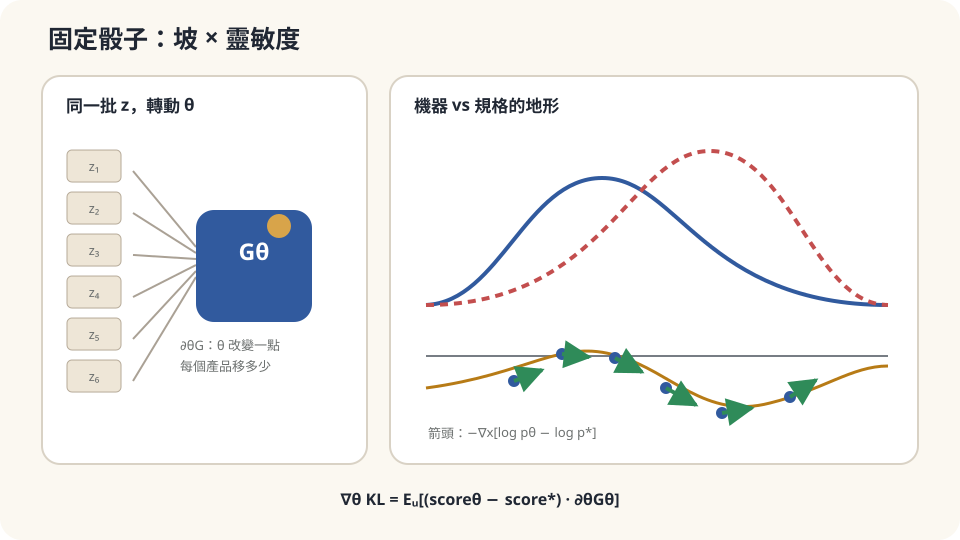

import Objectives from '../../../components/Objectives.astro';
import Prereq from '../../../components/Prereq.astro';
import Question from '../../../components/Question.astro';
import Answer from '../../../components/Answer.astro';
import QuizBlock from '../../../components/QuizBlock.astro';
import Option from '../../../components/Option.astro';
import Explanation from '../../../components/Explanation.astro';
import VizPlan from '../../../components/VizPlan.astro';
import Details from '../../../components/Details.astro';
import Bridge from '../../../components/Bridge.astro';
import Ref from '../../../components/Ref.astro';
import UsedBy from '../../../components/UsedBy.astro';

# 只看得到樣本，怎麼調機器：對 Generator 微分

<Objectives>
- **把「從 $p_\theta$ 抽樣」改寫成 $x=G_\theta(z)$、$z$ 來自固定分佈（reparameterization）。** 說出為什麼這一步讓「對 $\theta$ 微分」變得可能。
- **用一維四行推導寫出 $\nabla_\theta\,\mathrm{KL}(p_\theta\,\|\,p^*)=\mathbb E_z\big[\big(\nabla_x\log p_\theta(x)-\nabla_x\log p^*(x)\big)\,\partial_\theta G_\theta(z)\big]$。** 說出那一項為零的期望是哪一項、為什麼。
- **對一個「只能看樣本、要調分佈」的情境判斷這條公式能不能直接用、缺了什麼（$p^*$ 的 $\nabla\log$、$p_\theta$ 的 $\nabla\log$ 各從哪來）。** 用一維模擬驗證。
</Objectives>

<Prereq items={frontmatter.prereqs} />

## 一台把亂數變成產品的機器

想像一台機器把亂數 $z$ 加工成產品 $x=G_\theta(z)$。在生成模型裡，這台機器是我們能微分的程式：訓練時知道 $z$ 與 $G_\theta$，但不一定知道成品的密度 $p_\theta(x)$。

客戶給了你一個目標：產品的**分佈**要像某個規格 $p^*$——不是每個產品都一樣，而是整體的散佈要對。你可以調整機器的參數 $\theta$。這些參數應該往哪個方向更新？

若把同一份亂數固定住，再稍微改變 $\theta$，我們就能看出產品如何移動。**能不能從這些樣本的移動，算出整個分布差距的梯度？** 這就是下面要做的事。

<Question id="Q1">
翻成數學。「產品的分佈」是 $\theta$ 的什麼函數？「跟規格的差距」用哪個量寫？直接對它微分會卡在哪裡？

<Answer>
產品 $x=G_\theta(z)$，$z\sim p_z$（骰子的分佈，固定、與 $\theta$ 無關）。產品的分佈 $p_\theta$ 是 $p_z$ 經 $G_\theta$ 的 pushforward——同一把骰子、不同的 $\theta$，吐出不同的分佈。差距用 <Ref to="math-kl"/> 的 KL：

$$
L(\theta)=\mathrm{KL}(p_\theta\,\|\,p^*)=\mathbb E_{x\sim p_\theta}\big[\log p_\theta(x)-\log p^*(x)\big].
$$

（方向是 $\mathrm{KL}(p_\theta\|p^*)$：對「機器把產品放在規格幾乎不允許的地方」罰得重——這正是「不要生出不合規格的產品」要的方向。）

直接微分要處理兩件事：抽樣分布 $p_\theta$ 隨參數改變，被積函數的 $\log p_\theta(x)$ 也隨參數改變。單純呼叫黑箱抽樣器，沒有提供樣本如何隨參數移動的資訊；重參數化提供的正是這條路徑。它不是唯一的梯度估計方式。

解開第一個結的方法，就是這一篇的物件：**把隨機性搬到 $\theta$ 外面**。$x\sim p_\theta$ 與「$z\sim p_z$ 然後 $x=G_\theta(z)$」是同一件事，但第二種寫法裡隨機的只有 $z$，它不依賴 $\theta$；$\theta$ 只出現在一個普通的、可微的函數 $G_\theta$ 裡。這叫 **reparameterization**（重參數化）。
</Answer>
</Question>

## 固定骰子，只調整參數

想像你把機器內部的骰子換成一疊**預先擲好**的紙條：$z_1,z_2,\dots,z_N$。現在機器不再隨機——同一張紙條、同一個 $\theta$，永遠吐出同一個產品 $G_\theta(z_i)$。讓參數改變一點，每個產品都往某個方向動一點，動多少由 $\partial_\theta G_\theta(z_i)$ 決定：**參數對第 $i$ 個產品的靈敏度**。

現在「分佈的差距」怎麼變？每個產品 $x_i$ 站在一個地形上：地形的高度是 $\log p_\theta(x)-\log p^*(x)$——「機器認為這裡多常出現」減「規格認為這裡該多常出現」。產品站在**高處**（機器放太多、規格要太少）時，把它往地形**低處**推會讓差距變小。往低處推的方向是 $-\nabla_x\big[\log p_\theta-\log p^*\big]$（<Ref to="math-gradient"/>），而參數變動能把它推動的方向是 $\partial_\theta G$。兩者的內積，對所有紙條平均，就是梯度。

所以整條公式的畫面是：**每個樣本站在「機器分佈 vs 規格」的地形上，地形的坡告訴它該往哪走，參數的靈敏度告訴我們調整哪些參數能讓它那樣走。**



*圖：固定雜訊後，每個樣本所在位置的 score 差，透過 generator 靈敏度變成參數梯度。*

## 在一維上把它算出來

先看一維、$\theta$ 是實數的情況。假設 $G_\theta$ 可微，$p_\theta,p^*$ 有適當的光滑密度、KL 有限，且可交換微分與積分。還需要 $p_\theta$ 的 support 不隨 $\theta$ 改變，或已正確處理邊界項。重參數化後：

$$
L(\theta)=\mathbb E_{z}\Big[\log p_\theta\big(G_\theta(z)\big)-\log p^*\big(G_\theta(z)\big)\Big].
$$

期望現在是對固定的 $p_z$ 取的，可以直接把 $\partial_\theta$ 搬進去（<Ref to="math-total-derivative"/> 的微分穿過積分）。被積函數裡 $\theta$ 出現在兩處：$G_\theta$ 裡、以及 $p_\theta$ 的下標裡。用 chain rule 全部展開：

$$
\begin{aligned}
\partial_\theta L
&=\mathbb E_z\Big[\underbrace{\big(\partial_x\log p_\theta-\partial_x\log p^*\big)\big(G_\theta(z)\big)\cdot\partial_\theta G_\theta(z)}_{\text{(A) 沿 }x\text{ 的坡}\times\text{靈敏度}}
\;+\;\underbrace{\big(\partial_\theta\log p_\theta\big)\big(G_\theta(z)\big)}_{\text{(B) 下標裡的 }\theta}\Big].
\end{aligned}
$$

(B) 的 $\partial_\theta$ 是**固定 $x$** 時對密度參數的偏導數，不是沿 $G_\theta(z)$ 的 total derivative。在上面的假設下，它的期望是零：

$$
\mathbb E_z\big[\partial_\theta\log p_\theta(G_\theta(z))\big]=\mathbb E_{x\sim p_\theta}\big[\partial_\theta\log p_\theta(x)\big]=\int p_\theta\,\frac{\partial_\theta p_\theta}{p_\theta}\,dx=\partial_\theta\!\int p_\theta\,dx=\partial_\theta1=0.
$$

（第一個等號只是把 $G_\theta(z)$ 換回名字 $x$；最後一步又是微分穿過積分。）所以

$$
\boxed{\;\partial_\theta\,\mathrm{KL}(p_\theta\|p^*)=\mathbb E_{z}\Big[\big(\partial_x\log p_\theta(x)-\partial_x\log p^*(x)\big)\Big|_{x=G_\theta(z)}\cdot\partial_\theta G_\theta(z)\Big].\;}
$$

多維時，令 $J_\theta G\in\mathbb R^{d\times m}$（樣本 $d$ 維、參數 $m$ 維），公式是 $\nabla_\theta L=\mathbb E_z[(J_\theta G)^\top(s_\theta-s^*)]$，其中 $s=\nabla_x\log p$。這樣得到的梯度才是 $m$ 維。

讀一遍每個符號。$\nabla_x\log p(x)$ 是密度的**對數梯度**——有時叫 **score function**，它指向「密度上升最快」的方向，並且**不需要知道 normalizing constant**：$\log(\tilde p/Z)$ 對 $x$ 微分時 $\log Z$ 消失（<Ref to="math-gradient"/> 裡 $\nabla\log$ 的意義）。$\partial_\theta G_\theta(z)$ 是參數的靈敏度，由機器本身給。整條公式說：**梯度 $=$ 在每個樣本處，機器的 score 減規格的 score，乘上靈敏度，取平均。**

<Details summary="為什麼 (B) 消失這件事重要：兩種估計量與變異數">
另一條路是 score-function estimator：對不含 $\theta$ 的 $f$，$\partial_\theta\mathbb E_{p_\theta}[f]=\mathbb E_{p_\theta}[f\,\partial_\theta\log p_\theta]$。它使用的是參數方向的 score，與正文的 $\nabla_x\log p$ 不同；離散輸出也能用。哪一種估計量變異數較小，取決於問題與控制變異數的方法，不是普遍的大小關係 [3]。

Roeder、Wu 與 Duvenaud [4] 分析去掉零均值項 (B) 的估計量。去掉它仍然 unbiased，但不能只因為 $\mathbb E[B]=0$ 就斷定變異數一定下降：$\mathrm{Var}(A+B)=\mathrm{Var}(A)+\mathrm{Var}(B)+2\mathrm{Cov}(A,B)$。特別在 $p_\theta=p^*$ 時，(A) 每個樣本都為零，去掉 (B) 才能消除這個來源的抖動。
</Details>

## 公式能用，但缺一樣東西

回答起點問題。要更新參數，你需要在每個產品 $x_i=G_\theta(z_i)$ 處算三樣東西：

1. **$\partial_\theta G_\theta(z_i)$**——機器的靈敏度。機器是你自己的，可微就有。
2. **$\nabla_x\log p^*(x_i)$**——規格的 score。若客戶給的規格是一條公式（例如「常態、均值 5、標準差 1」），直接算。若客戶只給了**一批合規格的樣本**、沒有公式——這是現實中最常見的情形——這一項**你沒有**。從樣本估一個分佈的 score 是一個獨立的問題（score matching [5]），要另外訓一個模型。
3. **$\nabla_x\log p_\theta(x_i)$**——機器自己的 score。這也不是免費的：你知道 $G_\theta$，但**你不知道 $p_\theta$ 的密度**——pushforward 的密度要算 $G_\theta^{-1}$ 的 Jacobian，一般的 $G$ 做不到。所以這一項也要另外估：拿機器吐出來的樣本、訓一個 score 模型。

所以這條公式需要兩個 score 的資訊，但不一定需要兩個額外的 neural networks：可能有解析公式，也可能用其他估計方法。若兩者都未知，估計它們是額外的工作。Normalizing constant 在對 $x$ 微分時被繞過，並不是被算出來；有梯度資訊仍不代表拿到了 likelihood 或 KL 的數值。

這個判斷依賴的假設：**$G_\theta$ 對 $\theta$ 可微、對 $z$ 是連續的**（產品若是離散的類別，reparameterization 就沒有直接版本，要用展開框裡的 score-function estimator 或其他 relaxation）；**兩個 score 估得夠準**（尤其在樣本稀疏的區域，估錯的 score 會把產品推向錯的方向）；以及 **KL 的方向**——$\mathrm{KL}(p_\theta\|p^*)$ 允許機器「漏掉」規格的某一塊（mode dropping），若客戶要求每一種合規格的產品都要出現，該用另一個方向或另一個距離。

## 一維跑一次，然後把 (B) 留著看它抖

一維、$G_\theta(z)=\theta+z$、$z\sim\mathcal N(0,1)$，所以 $p_\theta=\mathcal N(\theta,1)$；規格 $p^*=\mathcal N(5,1)$。此時一切都有 closed form：$\mathrm{KL}=(\theta-5)^2/2$，真梯度是 $\theta-5$。兩個 score：$\partial_x\log p_\theta(x)=-(x-\theta)$、$\partial_x\log p^*(x)=-(x-5)$，差是 $\theta-5$——與 $x$ 無關，每個樣本都給出精確的梯度；靈敏度 $\partial_\theta G=1$。

```python
import numpy as np
rng = np.random.default_rng(0)
theta, target, lr = 0.0, 5.0, 0.1
for step in range(60):
    z = rng.standard_normal(256)
    x = theta + z                                              # reparameterization：固定骰子 z，x 是 θ 的可微函數
    score_model  = -(x - theta)                                # ∇ₓ log p_θ(x)
    score_target = -(x - target)                               # ∇ₓ log p*(x)
    grad_A = np.mean((score_model - score_target) * 1.0)       # (A)：兩個 score 的差 × ∂G/∂θ
    grad_B = np.mean((x - theta))                              # (B)：∂_θ log p_θ 在樣本處 —— 期望為零、單樣本不為零
    theta -= lr * grad_A
    if step % 15 == 0: print(step, round(theta, 3), round(grad_A, 3), round(grad_B, 3))
print(theta)                                                   # → 5.0
```

$\theta$ 從 0 走到 5，`grad_A` 每步恰等於 $\theta-5$（因為兩個 score 的差不依賴 $x$，這個例子裡 (A) 沒有抽樣雜訊）。`grad_B` 每步在 $\pm0.06$ 附近抖——它的期望是零，但每一批都不是零；若把它加進更新，$\theta$ 收斂後仍會在 5 附近抖動，而只用 (A) 的版本在最佳點每一步都精確為零。

若改用有限樣本估出的 score，尾端資訊不足可能帶來偏差，結果需要另外檢查。也不能把「非線性 generator」直接等同「沒有解析密度」：例如 $\theta+|z|$ 仍有 shifted half-normal 密度，卻因 support 隨 $\theta$ 移動，不能直接沿用 (B) 為零的證明。低維 latent 映到高維空間時，甚至可能沒有環境空間的密度；這時必須先確認 KL 與 score 公式是否有定義。

<iframe loading="lazy" src="/personal_website/notes/research_areas/mathematical-foundations/m5-optimization/m5-3-1.html" class="demo-frame" title="Generator gradient 互動示範" style="height: 900px; width: 100%; border: none;"></iframe>

**互動 demo：切換生成器與規格資訊，逐步看 score 差如何推動 θ。**

## 檢查理解

<QuizBlock id="m5-3-a">
一個推薦系統的「機器」輸出的是**離散的**商品編號 $x\in\{1,\dots,K\}$，由 $\theta$ 決定各編號的機率。你想調 $\theta$ 讓輸出分佈接近某個目標。本篇的 reparameterization 公式：
<Option>直接可用，$G_\theta(z)$ 取 $\arg\max$ 即可。</Option>
<Option correct>不能直接用——$\arg\max$ 對 $\theta$ 的導數幾乎處處為零，「每個樣本怎麼動」在離散空間沒有意義；要改用 score-function estimator $\mathbb E[f(x)\,\partial_\theta\log p_\theta(x)]$，或對離散變數做連續的 relaxation。</Option>
<Option>可用，只要把 KL 換成別的距離。</Option>
<Explanation>
Pathwise derivative 需要可微的樣本路徑，argmax 的跳躍不符合這個前提。Score-function estimator 可以處理離散取值，但兩類估計量的 variance 沒有普遍的大小排序，還要看問題與 variance reduction。
</Explanation>
</QuizBlock>

<QuizBlock id="m5-3-b">
把 (B) 那一項 $\partial_\theta\log p_\theta$ 在樣本處的值留在梯度裡，不去掉。長期而言：
<Option>梯度會偏，收斂到錯的 $\theta$。</Option>
<Option correct>在上述正則條件下仍然 unbiased；本篇 Gaussian 例子中 (A) 沒有抽樣波動，保留 (B) 會多出波動，但一般情況的 variance 差別還要看 covariance。</Option>
<Option>沒有任何差別，autodiff 會自動處理。</Option>
<Explanation>
(B) 在適當假設下不引入偏差，但保留或去掉它的變異數差別還要看 covariance。在本篇 Gaussian 例子與完全匹配點，去掉它確實更穩；不能推廣成所有參數位置的保證。
</Explanation>
</QuizBlock>

<QuizBlock id="m5-3-c">
客戶只給了 200 個合規格的樣本，沒有公式。你用本篇的梯度公式調機器，發現產品分佈在規格的**主體**吻合得很好、但**尾端**明顯偏掉。最合理的診斷是：
<Option>學習率太大。</Option>
<Option>reparameterization 在尾端失效。</Option>
<Option correct>尾端樣本少，score 估計是值得先檢查的來源；但也要排除模型容量、未收斂與最佳化問題，不能只從終點偏差確定原因。</Option>
<Explanation>
有限樣本的尾端 score 是值得檢查的來源，但單從終點偏差不能排除學習率、模型容量或未收斂。應比較解析 toy case、score 估計品質與訓練穩定性，再判斷主要原因。
</Explanation>
</QuizBlock>

<UsedBy slug={frontmatter.slug} />

<Bridge to="math-warehouse-ot">
固定亂數後，我們能把樣本的移動接到參數梯度，但仍需要密度、score 與可交換微分的假設。下一個單元換一種比較分布的方式：不只看每個位置的機率，而問把一堆貨從一個擺法搬成另一個擺法，最少需要多少搬運成本？
</Bridge>

## 參考文獻

1. Kingma, D. P., Welling, M. [*Auto-Encoding Variational Bayes.*](https://arxiv.org/abs/1312.6114) ICLR 2014.（reparameterization trick 的出處之一。）
2. Rezende, D. J., Mohamed, S., Wierstra, D. [*Stochastic Backpropagation and Approximate Inference in Deep Generative Models.*](https://arxiv.org/abs/1401.4082) ICML 2014.（同時期獨立提出的「stochastic backpropagation」。）
3. Mohamed, S., Rosca, M., Figurnov, M., Mnih, A. [*Monte Carlo Gradient Estimation in Machine Learning.*](https://arxiv.org/abs/1906.10652) JMLR 21, 2020.（score-function 與 pathwise（reparameterization）兩類估計量的系統比較與變異數分析。）
4. Roeder, G., Wu, Y., Duvenaud, D. [*Sticking the Landing: Simple, Lower-Variance Gradient Estimators for Variational Inference.*](https://arxiv.org/abs/1703.09194) NeurIPS 2017.（把期望為零的 (B) 項去掉可以降低變異數。）
5. Hyvärinen, A. [*Estimation of Non-Normalized Statistical Models by Score Matching.*](https://jmlr.org/papers/v6/hyvarinen05a.html) JMLR 6, 2005.（只有樣本時如何估 $\nabla_x\log p$。）
