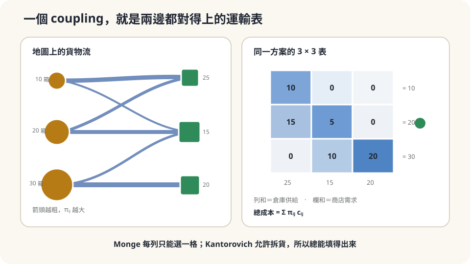

import Objectives from '../../../components/Objectives.astro';
import Prereq from '../../../components/Prereq.astro';
import Question from '../../../components/Question.astro';
import Answer from '../../../components/Answer.astro';
import QuizBlock from '../../../components/QuizBlock.astro';
import Option from '../../../components/Option.astro';
import Explanation from '../../../components/Explanation.astro';
import VizPlan from '../../../components/VizPlan.astro';
import Details from '../../../components/Details.astro';
import Bridge from '../../../components/Bridge.astro';
import Ref from '../../../components/Ref.astro';
import UsedBy from '../../../components/UsedBy.astro';

# 搬倉庫問題：Monge、Kantorovich 與 Coupling

<Objectives>
- **把「搬貨最省油」寫成兩個數學問題：Monge（每個來源只送一個目的地，找一個映射）與 Kantorovich（允許拆貨，找一張運輸表）。** 說出後者的三個約束。
- **說出 coupling 是一個兩邊 marginal 固定的 joint distribution。** 解釋它為什麼讓 Kantorovich 問題總有解，而 Monge 問題不一定。
- **對一個「配對／分配」的生活情境判斷該用哪種問法、說出答案依賴的假設（成本怎麼定、貨能不能拆）。** 用一個小例子算出最佳解與它省了多少。
</Objectives>

<Prereq items={frontmatter.prereqs} />

## 三個倉庫、三家店

你管三個倉庫，各有 10、20、30 箱貨；城市另一頭有三家店，各需要 25、15、20 箱。供給總和 60、需求總和 60，剛好。每條「倉庫→店」的路線有一個油錢（每箱），寫成一張 $3\times3$ 的表 $c_{ij}$。

你要決定：哪個倉庫的貨送去哪家店？目標是總油錢最少。

先用直覺回答兩個問題，並寫下有多確定。第一，「每個倉庫只送一家店、不拆」做得到嗎？第二，如果允許一個倉庫的貨拆開送兩三家店，會省更多嗎、還是一樣？

第一個問題在這組數字上答案是**做不到**——倉庫的箱數是 10、20、30，店的需求是 25、15、20，沒有任何一種「一對一」的分派能讓每家店剛好收到它要的數量。所以「不拆」在這裡根本不是一個合法的選項。第二個問題的答案比較微妙，這一篇後半會回來。

<Question id="Q1">
翻成數學。「一個分派方案」是什麼物件？「合法」的方案要滿足哪些條件？「總油錢」是這個物件的什麼函數？

<Answer>
課堂上第一個提出的物件通常是一個**映射**：$T(i)=$ 倉庫 $i$ 的貨全部送到店 $T(i)$。合法的條件是每家店收到的量剛好等於需求：$\sum_{i:\,T(i)=j}a_i=b_j$。成本是 $\sum_ia_i\,c_{i,T(i)}$。這是 **Monge** 1781 年的問法 [5]：找一個映射把土堆（déblais）搬成另一個形狀（remblais）。它的問題正如上面看到的——合法的 $T$ 可能**根本不存在**。

第二個物件放寬了「不拆」：用一張表 $\pi_{ij}\ge0$ 記「從倉庫 $i$ 送到店 $j$ 多少箱」。合法的條件變成兩組**邊際約束**：

$$
\sum_j\pi_{ij}=a_i\quad(\text{倉庫 }i\text{ 的貨全部送出}),\qquad
\sum_i\pi_{ij}=b_j\quad(\text{店 }j\text{ 剛好收到需求}).
$$

成本是 $\sum_{ij}\pi_{ij}c_{ij}$。這是 **Kantorovich** 1942 年的問法 [4]。它一定有合法解——把每個倉庫的貨按各店需求的比例拆開送（$\pi_{ij}=a_ib_j/60$）就是一個，只是不一定最省。

把數量都除以 60 變成比例：$a$ 是一個機率分佈（供給在哪裡）、$b$ 是另一個（需求在哪裡）、$\pi$ 是一個**聯合分佈**，它的兩個 marginal 恰好是 $a$ 與 $b$。這樣的 $\pi$ 叫 $a$ 與 $b$ 之間的一個 **coupling**（耦合）。「一個運輸方案」與「一個 coupling」是同一件事。
</Answer>
</Question>

## 一張兩邊都對得上的表

想像一張 $3\times3$ 的表格，右邊寫著每一列必須加起來的數（倉庫的箱數），下面寫著每一欄必須加起來的數（店的需求）。你的工作是往格子裡填非負的數，讓**每一列、每一欄都對得上**——這就是 coupling。表上每一格還標著油錢 $c_{ij}$；你要在所有填法裡找一張總油錢最少的。

Monge 的方案是這張表的特例：每一列**只有一格**不為零（整個倉庫送一家店）。當列和與欄和的數字不能這樣湊時，這種填法不存在；Kantorovich 允許一列裡有好幾格不為零，所以永遠填得出來。



*圖：Kantorovich coupling 是一張列和、欄和都對上的表；允許拆貨後任意同總量供需都有解。*

## Kantorovich 問題

**定義。** 給供給分佈 $a\in\mathbb R^m_{\ge0}$、需求分佈 $b\in\mathbb R^n_{\ge0}$（$\sum a_i=\sum b_j$）與成本矩陣 $c\in\mathbb R^{m\times n}$，

$$
\boxed{\;\mathrm{OT}(a,b)=\min_{\pi\in\Pi(a,b)}\ \sum_{i,j}\pi_{ij}\,c_{ij},\qquad
\Pi(a,b)=\Big\{\pi\ge0:\ \sum_j\pi_{ij}=a_i,\ \sum_i\pi_{ij}=b_j\Big\}.\;}
$$

$\Pi(a,b)$ 是所有 coupling 的集合。三個觀察：

1. **它是一個線性規劃。** 目標是 $\pi$ 的線性函數，約束是線性等式與非負——可以用標準的 LP 求解器算，$m,n$ 幾百時很快。
2. **可行集非空且有界。** $\pi=ab^\top/\!\sum a$（獨立 coupling）永遠在裡面；所有 $\pi_{ij}\le\min(a_i,b_j)$。所以最小值一定達到。
3. **最佳解落在角點上。** LP 的最佳解在可行集的頂點，而這個可行集（運輸多面體）的頂點最多只有 $m+n-1$ 個非零格子。三個倉庫三家店，最佳方案最多用五條路線——不會每格都拆。

**連續版本。** 把「倉庫」與「店」換成空間上的兩個機率分佈 $\mu,\nu$（例如兩座城市的人口密度），coupling 是 $\mathbb R^d\times\mathbb R^d$ 上的聯合分佈 $\pi$、marginal 是 $\mu,\nu$，成本是 $\int c(x,y)\,d\pi(x,y)$——同一個定義，把和換成積分。Monge 的版本是要求 $\pi$ 集中在某個映射 $T$ 的圖上：$y=T(x)$。

<Details summary="Monge 與 Kantorovich 什麼時候答案一樣">
Kantorovich 的最小值 ≤ Monge 的最小值，因為每個合法的 Monge 映射都是一個 coupling（π_\{ij\} = a_i·𝟙[T(i)=j]）。反過來不一定：允許拆貨可能省更多、也可能 Monge 根本無解。

但有兩種情形兩者相等。第一，**離散且所有 a_i、b_j 相等**（例如 n 個倉庫各一箱、n 個店各要一箱）：這時運輸多面體的頂點恰好是排列矩陣（Birkhoff–von Neumann 定理），LP 的最佳解就是一個一對一的分派——Kantorovich 自動給出 Monge 解。這就是 **assignment problem**，可以用匈牙利演算法在 O(n³) 內解。第二，**連續且 μ 沒有原子、成本是 |x−y|²**：Brenier 定理說最佳 coupling 一定集中在一個映射上（而且是某個 convex 函數的梯度）——後面的篇章會回來用這個結論。

一般離散情形（箱數不相等）兩者可以不同，本篇的例子就是：Monge 無解、Kantorovich 有解。
</Details>

## 算出來

取一張具體的油錢表（每箱）：

$$
c=\begin{pmatrix}4&6&9\\5&3&8\\7&5&2\end{pmatrix},\qquad a=(10,20,30),\qquad b=(25,15,20).
$$

（列是倉庫 1–3，欄是店 1–3。）用 LP 解，最佳方案是：倉庫 1 的 10 箱全送店 1；倉庫 2 的 20 箱拆成 5 送店 1、15 送店 2；倉庫 3 的 30 箱拆成 10 送店 1、20 送店 3。總油錢 $10\cdot4+5\cdot5+15\cdot3+10\cdot7+20\cdot2=220$。五條路線——正好 $m+n-1$。（這組數字剛好還有另一個同樣 220 的最佳解：倉庫 2 送 15 到店 1、5 到店 2，倉庫 3 送 10 到店 2、20 到店 3——LP 的最佳值唯一，最佳解不一定唯一。）

對照兩個直覺方案。「每家店從最便宜的倉庫拿」會讓店 1、2、3 分別想從倉庫 1、2、3 拿，但倉庫 1 只有 10 箱、店 1 要 25，湊不齊——它甚至不是一個合法方案。「按比例拆」（獨立 coupling $\pi_{ij}=a_ib_j/60$）合法但貴：總油錢 $\sum_{ij}a_ib_jc_{ij}/60\approx317$。最佳解省了三成。

回到起點的第二個問題——**拆貨會不會省更多**？在這組數字上，不拆是不合法的，所以問題本身要改成：「在所有合法的拆法裡，最佳解拆了多少？」答案是最少的拆法：三個倉庫裡兩個拆成兩份，沒有一個拆成三份。這是 LP 頂點的性質給的，不是巧合。

判斷依賴的假設：**成本是每箱固定的油錢、與送多少箱無關**（線性；若有卡車的固定出車費，問題變成非線性的，最佳解可能傾向不拆）；**貨是可分的**（一箱可以拆——若貨是一台鋼琴，只能回到 Monge）。

## 跑一次，然後把貨變成鋼琴

```python
import numpy as np
from scipy.optimize import linprog
a = np.array([10, 20, 30.]); b = np.array([25, 15, 20.])
c = np.array([[4, 6, 9], [5, 3, 8], [7, 5, 2.]])
m, n = c.shape
A_eq = np.zeros((m + n, m * n))
for i in range(m): A_eq[i, i*n:(i+1)*n] = 1            # 每列和 = a_i
for j in range(n): A_eq[m + j, j::n] = 1               # 每欄和 = b_j
res = linprog(c.ravel(), A_eq=A_eq, b_eq=np.r_[a, b], bounds=(0, None))
pi = res.x.reshape(m, n); print(pi.round(1)); print(res.fun)          # 最佳運輸表與 220
print((np.outer(a, b) / a.sum() * c).sum())                          # 獨立 coupling 的成本 ≈ 317
# 破壞可分性：貨是三台鋼琴（a = b = (1,1,1)）——Kantorovich 的解自動是一個排列（Monge 解）
res2 = linprog(c.ravel(), A_eq=A_eq, b_eq=np.r_[np.ones(3), np.ones(3)], bounds=(0, None))
print(res2.x.reshape(3, 3).round(2), res2.fun)                       # 排列矩陣，成本 4+3+2 = 9
```

前兩個輸出是上面手算的最佳表與 220；第三個是獨立 coupling 的 317。最後把 $a=b=(1,1,1)$——三台鋼琴、三家店各要一台——同一個 LP 的解**自動變成一個排列矩陣**（每列每欄恰一個 1）：倉庫 1→店 1、2→2、3→3，成本 9。這裡不需要另外要求「不拆」，展開框裡的 Birkhoff–von Neumann 定理已經保證了。

<iframe loading="lazy" src="/personal_website/notes/research_areas/mathematical-foundations/m6-optimal-transport/m6-0-1.html" class="demo-frame" title="運輸表與最小成本 coupling 互動示範" style="height: 900px; width: 100%; border: none;"></iframe>

**互動 demo：改供需與路線成本，求一張兩邊邊際都正確的最小成本表。**

## 檢查理解

<QuizBlock id="m6-0-a">
系上要把 40 位新生分到 4 位導師名下，每位導師 10 人；每位學生對每位導師有一個「不合適分數」。這是：
<Option correct>一個 Kantorovich 問題，而且因為每個學生是不可分的一個單位、每位導師的容量是整數，LP 的最佳解會自動是整數分派——實質上是 assignment problem 的推廣。</Option>
<Option>只能用 Monge 的問法，Kantorovich 不適用。</Option>
<Option>不是運輸問題，因為學生不是貨。</Option>
<Explanation>
「來源」是 40 個學生各 1 單位、「目的地」是 4 位導師各容量 10，成本是不合適分數——完全是運輸問題的形狀。供給全是 1、需求是整數時運輸多面體的頂點是整數矩陣，所以 LP 給出的最佳解不會把一個學生拆成 0.5 個給兩位導師。Kantorovich 不但適用，還比 Monge 好算。
</Explanation>
</QuizBlock>

<QuizBlock id="m6-0-b">
油錢表改成「每條路線出一趟卡車固定 100 元、每箱另加 $c_{ij}$ 元」。本篇的 LP 解法：
<Option>仍然直接適用，把 100 加到每個 $c_{ij}$ 即可。</Option>
<Option correct>不再直接適用——固定出車費讓成本對 $\pi_{ij}$ 不是線性的（用了這條路線就付 100，不管送幾箱），最佳解會傾向少開路線、少拆貨；這是一個帶固定成本的網路流問題，比 LP 難。</Option>
<Option>會讓 Monge 與 Kantorovich 的答案一定相同。</Option>
<Explanation>
「把 100 加進 $c_{ij}$」是把固定費當成每箱都付，會高估多箱路線的成本。真正的成本是 $\sum_{ij}\big(100\cdot\mathbf 1[\pi_{ij}>0]+c_{ij}\pi_{ij}\big)$，那個指標函數讓問題變成混合整數規劃。它確實會推向不拆，但不保證等於 Monge。本篇的線性假設是有代價的簡化。
</Explanation>
</QuizBlock>

<QuizBlock id="m6-0-c">
兩個城市各有人口分佈 $\mu$、$\nu$（連續密度）。「$\mu$ 與 $\nu$ 之間的一個 coupling」是：
<Option>一個把 $\mu$ 的每個點送到 $\nu$ 某個點的函數。</Option>
<Option correct>一個平面 $\mathbb R^d\times\mathbb R^d$ 上的聯合分佈 $\pi(x,y)$，它對 $y$ 積分回到 $\mu(x)$、對 $x$ 積分回到 $\nu(y)$——「從 $x$ 附近搬多少到 $y$ 附近」的連續版運輸表。</Option>
<Option>$\mu$ 與 $\nu$ 的乘積 $\mu(x)\nu(y)$。</Option>
<Explanation>
函數（映射）是 Monge 的物件，是 coupling 的特例（$\pi$ 集中在 $y=T(x)$ 的圖上）。乘積 $\mu\otimes\nu$ 是**一個**合法的 coupling（獨立 coupling，對應「按比例拆」），但不是「coupling」的定義——所有兩個 marginal 對得上的 $\pi$ 都算。
</Explanation>
</QuizBlock>

<UsedBy slug={frontmatter.slug} />

<Bridge to="math-w2">
本篇把「搬貨最省油」寫成一張兩邊都對得上的運輸表——coupling——並看到 Kantorovich 的問法永遠有解、是線性規劃、最佳解落在少數幾條路線上。有了「最省的搬法」，就可以反過來問：兩個分佈「差多少」，能不能用「把一個搬成另一個最少要花多少」來量？接著把這個量定義出來，並看它和其他「差多少」的量哪裡不同。
</Bridge>

## 參考文獻

1. Villani, C. [*Optimal Transport: Old and New.*](https://doi.org/10.1007/978-3-540-71050-9) Springer, 2009.（第 1 章：Monge 與 Kantorovich 問題的定義、coupling；第 4 章：最佳解的存在。）
2. Peyré, G., Cuturi, M. [*Computational Optimal Transport.*](https://arxiv.org/abs/1803.00567) Foundations and Trends in Machine Learning 11(5–6), 2019.（第 2 章：離散運輸問題、運輸多面體、assignment problem、Birkhoff–von Neumann；第 3 章：LP 求解。）
3. Santambrogio, F. [*Optimal Transport for Applied Mathematicians.*](https://doi.org/10.1007/978-3-319-20828-2) Birkhäuser, 2015.（第 1 章：從 Monge 到 Kantorovich 的放寬與其動機。）
4. Kantorovich, L. V. [*On the Translocation of Masses.*](https://doi.org/10.1007/s10958-006-0049-2) Doklady Akademii Nauk SSSR 37, 1942（英譯：Journal of Mathematical Sciences 133(4), 2006）.（允許拆貨的運輸問題原始出處。）
5. Monge, G. *Mémoire sur la théorie des déblais et des remblais.* Histoire de l'Académie Royale des Sciences de Paris, 1781.（「搬土堆」問題的原始出處。）
