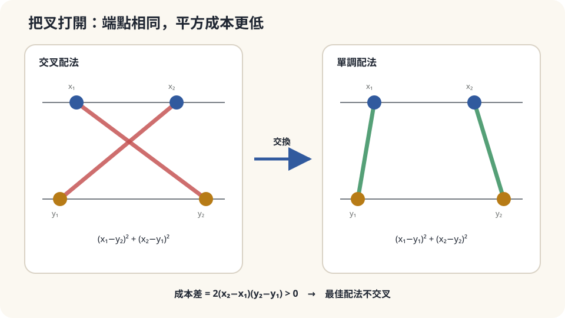

import Objectives from '../../../components/Objectives.astro';
import Prereq from '../../../components/Prereq.astro';
import Question from '../../../components/Question.astro';
import Answer from '../../../components/Answer.astro';
import QuizBlock from '../../../components/QuizBlock.astro';
import Option from '../../../components/Option.astro';
import Explanation from '../../../components/Explanation.astro';
import VizPlan from '../../../components/VizPlan.astro';
import Details from '../../../components/Details.astro';
import Bridge from '../../../components/Bridge.astro';
import Ref from '../../../components/Ref.astro';
import UsedBy from '../../../components/UsedBy.astro';

# 最省油的配法一定不交叉：一維的單調性與 Brenier

<Objectives>
- **用四行交換論證證明一維平方成本下的最佳配對不交叉。** 說出它為什麼等於排序後一對一，也就是 quantile 對 quantile。
- **寫出 quantile coupling 與 $W_2^2=\int_0^1\big(F_\mu^{-1}(u)-F_\nu^{-1}(u)\big)^2du$。** 分清一般 coupling 與來源無原子時的確定映射 $T=F_\nu^{-1}\circ F_\mu$。
- **對一個「配對」情境判斷「不交叉」是否是最佳解的必要性質、說出它依賴的假設（成本是平方距離、一維）。** 說出高維的對應——Brenier 定理：最佳映射是 convex 函數的 gradient。
</Objectives>

<Prereq items={frontmatter.prereqs} />

## 一條街上的倉庫與店

一條筆直的街，路北一排四個倉庫、路南一排四家店，各一箱貨、各要一箱。油錢是距離的平方（開得越遠越不划算，而且遠的懲罰加速）。每個倉庫只送一家店。怎麼配？

四個倉庫在位置 $x_1<x_2<x_3<x_4$，四家店在 $y_1<y_2<y_3<y_4$。共 $4!=24$ 種配法。

依序配看起來很自然，但「每個倉庫挑最近的店」不一定得到同一個答案，還可能搶到同一家店。**要比較的是整批成本，而不是某一件貨的距離。** 我們先只看兩條配反的路線：若交換它們的終點能降低成本，就不用列完 24 種配法。

<Question id="Q1">
翻成數學。「一種配法」是什麼物件？「交叉」是什麼意思？要證明「最佳配法不交叉」，最方便的證法是什麼？

<Answer>
一種配法是一個排列 $\sigma$：倉庫 $i$ 送店 $\sigma(i)$。成本 $\sum_i(x_i-y_{\sigma(i)})^2$。

「交叉」：存在兩個倉庫 $x_i<x_j$，它們的店卻反過來 $y_{\sigma(i)}>y_{\sigma(j)}$——左邊的倉庫送右邊的店、右邊的倉庫送左邊的店，兩條路線在街上交叉。

最方便的證法是**交換論證**（exchange argument）：假設某個配法裡有一對交叉，把這兩條路線的終點**交換**（讓 $x_i$ 改送 $y_{\sigma(j)}$、$x_j$ 改送 $y_{\sigma(i)}$），證明成本**嚴格下降**。那麼任何有交叉的配法都不是最佳的——最佳配法只能是那個唯一沒有交叉的：依序配。

這個證法的好處是**局部**的：只看兩條路線，不用管其他 $n-2$ 條。所以它對任何 $n$、任何位置都成立，「第二個倉庫離第三家店特別近」這種局部特徵完全無關。
</Answer>
</Question>

## 把叉打開

畫兩條交叉的路線：$x_1\to y_2$、$x_2\to y_1$（$x_1<x_2$、$y_1<y_2$）。把叉打開，改成 $x_1\to y_1$、$x_2\to y_2$。

兩種配法的四個端點相同，兩邊的供需也不變，只需要比較兩條路線的平方和。不能只憑「長路變短」判斷，因為端點可以在不同位置；下面直接展開平方，會看到成本差只剩兩組端點的間距乘積。



*圖：在一維平方成本與嚴格排序的端點下，交換配反的兩條路線會降低成本。*

## 四行交換論證，然後推到整條數線

**引理。** 若 $x_1<x_2$、$y_1<y_2$，則

$$
(x_1-y_1)^2+(x_2-y_2)^2\;<\;(x_1-y_2)^2+(x_2-y_1)^2 .
$$

**證明。** 展開兩邊，$x_1^2+x_2^2+y_1^2+y_2^2$ 相消，剩下

$$
-2x_1y_1-2x_2y_2\;<\;-2x_1y_2-2x_2y_1
\iff x_1y_2+x_2y_1<x_1y_1+x_2y_2
\iff 0<(x_2-x_1)(y_2-y_1).\qquad\square
$$

右邊兩個括號都是正的，成立。差值恰是 $2(x_2-x_1)(y_2-y_1)$——兩對點各自拉得越開，交換省得越多。

**定理（一維 assignment）。** $n$ 個倉庫 $x_1<\dots<x_n$、$n$ 家店 $y_1<\dots<y_n$，成本 $\sum(x_i-y_{\sigma(i)})^2$。唯一的最佳排列是 $\sigma=\mathrm{id}$（依序配）。

**證明。** 任何 $\sigma\ne\mathrm{id}$ 都有至少一對交叉（$i<j$ 但 $\sigma(i)>\sigma(j)$——這就是「排列有 inversion」）。對這一對套引理，交換後成本嚴格下降。所以 $\sigma$ 不是最佳的。$\square$

這個證明沒有用到 $n$ 有多大、點在哪裡。「第二個倉庫離第三家店特別近」不構成例外——若它送了第三家店，第三個倉庫就得送別家，一定造成一對交叉，交換就更便宜。

**推到一般一維分布。** 定義 generalized quantile $F^{-1}(u)=\inf\{x:F(x)\ge u\}$，抽 $U\sim\mathrm{Uniform}(0,1)$，再令 $(X,Y)=(F_\mu^{-1}(U),F_\nu^{-1}(U))$，就是 quantile 對 quantile 的最佳 coupling。兩端有有限二階矩時，下面的成本公式成立；只有來源無原子時，才可直接用下式的 deterministic map $T$：

$$
\boxed{\;T(x)=F_\nu^{-1}\big(F_\mu(x)\big),\qquad
W_2(\mu,\nu)^2=\int_0^1\big(F_\mu^{-1}(u)-F_\nu^{-1}(u)\big)^2\,du.\;}
$$

$T$ 是**單調遞增**的——這就是「不交叉」在連續世界的名字。一維的 $W_2$ **不需要解 LP**：排序（或算分位數）就是答案，$O(n\log n)$。這是上一篇程式裡「排序配對與 LP 給出完全相同的數」的原因。

<Details summary="高維怎麼辦：Brenier 定理（結論）">
在 ℝ^d、d ≥ 2，「不交叉」沒有直接的意義——兩條線段在空間裡通常根本不相交。交換論證的本質其實不是「不交叉」，而是那條不等式：對最佳 coupling 裡任兩對 (x₁,y₁)、(x₂,y₂)，都有 ⟨x₂−x₁, y₂−y₁⟩ ≥ 0（否則交換更便宜——同一個四行展開，內積取代乘積）。這叫 **cyclical monotonicity**（循環單調性）的兩點版本。

Brenier [2] 的二次成本定理需要兩端有限二階矩，且來源 μ 對 Lebesgue measure 絕對連續。此時最佳 coupling 由 $T=\nabla\varphi$ 誘導，$\varphi$ 是 convex，T 的唯一性是 μ-almost everywhere。這比「沒有 atom」更強；高維中沒有 atom 的來源仍可能集中在低維集合。Convex gradient 的單調性是上面兩點不等式的來源。

所以三句話對應：一維「不交叉」= 一維「T 遞增」= 高維「T 是 convex 函數的 gradient」。本系列只用結論；證明見 Villani [1] 第 9–10 章。
</Details>

## 直覺對了，而且沒有例外

回答起點問題。依序配就是最佳解，**沒有任何例外**——不是因為「感覺上很合理」，而是因為任何一對交叉都能交換得更省。「第二個倉庫離第三家店特別近」這個反例之所以看起來合理，是因為它只看了一條路線；交換論證看的是一對，而任何交叉的一對都能改善。

這個判斷依賴的假設：

- **成本是距離的平方**（或更一般地，是 $|x-y|$ 的 strictly convex 函數）。引理的最後一步用了 $(x_2-x_1)(y_2-y_1)>0$，那來自平方展開的交叉項。若成本是 $|x-y|$（線性），交叉與不交叉**成本可能相同**——一維 $W_1$ 的最佳解不唯一，「不交叉」仍是其中一個最佳解但不是唯一的。若成本是 concave 的（例如 $\sqrt{|x-y|}$，「長途有折扣」），結論**反過來**：最佳解傾向交叉，把貨集中送遠處。
- **一維**。高維的 Brenier 結論需要來源有密度及有限二階矩；單純「沒有原子」不夠。
- **一對一、等權**。不等權時是 Kantorovich 問題，一維的解仍是 quantile 對 quantile（允許拆的版本），但「排列」的語言要換成 coupling。

## 24 種配法全算一次，再把成本改成 $\sqrt{\ }$

```python
import numpy as np, itertools
x = np.array([0.0, 1.0, 2.5, 4.0]); y = np.array([5.0, 6.0, 6.2, 9.0])   # 四個倉庫全在四家店的左邊；倉庫 4 (x=4) 離店 1 (y=5) 最近
def cost(sig, p=2): return np.sum(np.abs(x - y[list(sig)])**p)
perms = list(itertools.permutations(range(4)))
best = min(perms, key=cost); print(best, cost(best))                    # (0,1,2,3)：依序配
print(sorted(cost(s) for s in perms)[:3])                               # 最佳值嚴格小於第二名
# 連續版：quantile 對 quantile 給的 W₂ 與 LP 一致（沿用上一篇的兩個 Gaussian）
rng = np.random.default_rng(0); a = np.sort(rng.normal(0, 1, 5000)); b = np.sort(rng.normal(3, 2, 5000))
print(np.sqrt(np.mean((a - b)**2)), np.sqrt(10))                        # ≈ 3.20 vs closed form 3.162
# 破壞假設：成本改成 concave 的 sqrt|x−y|——最佳解交叉
best_c = min(perms, key=lambda s: cost(s, p=0.5)); print(best_c)        # (3,2,1,0)：完全反過來，全部交叉
# 成本改成線性 |x−y|——最佳解不唯一
costs1 = [cost(s, p=1) for s in perms]; print(sum(abs(c - min(costs1)) < 1e-9 for c in costs1))   # 24：全部並列最佳
```

24 種配法裡最省的是 $(0,1,2,3)$——依序配——而且嚴格勝過第二名（88.69 對 89.29），即使倉庫 4 明明離店 1 最近。連續版：5000 個樣本排序配對給 3.20，與 closed form 3.16 在抽樣誤差內一致，沒有解任何 LP。把成本改成 $\sqrt{|x-y|}$（長途有折扣）：最佳排列變成 $(3,2,1,0)$——**完全反過來、全部交叉**，最左的倉庫送最右的店。改成 $|x-y|$：這組點裡所有倉庫都在所有店的左邊，24 種配法的線性成本**全部相等**（每條路線都是「往右走」，總長度一樣）——「不交叉」還在其中，但不再唯一。理論說了「平方」是關鍵，實驗確認換掉它結論就變。

<iframe loading="lazy" src="/personal_website/notes/research_areas/mathematical-foundations/m6-optimal-transport/m6-2-1.html" class="demo-frame" title="一維單調搬運互動示範" style="height: 900px; width: 100%; border: none;"></iframe>

**互動 demo：拖動端點、改成本次方，或親手逐次把交叉配法打開。**

## 檢查理解

<QuizBlock id="m6-2-a">
兩組各 100 個一維的數（例如兩個班的成績），你想算它們分佈之間的 $W_2$。最省事的做法是：
<Option>解一個 $100\times100$ 的線性規劃。</Option>
<Option correct>把兩組各自排序，逐位相減、平方、取平均、開根號——一維的最佳 coupling 就是 quantile 對 quantile，不需要 LP。</Option>
<Option>算兩組均值的差。</Option>
<Explanation>
LP 會給出同樣的答案，但 $O(n\log n)$ 的排序就夠了——這正是本篇證明的內容。均值差只是 $W_2^2$ 的第一項（<Ref to="math-w2"/> 的 closed form），漏掉了形狀差；它是 $W_2$ 的下界，不是 $W_2$。
</Explanation>
</QuizBlock>

<QuizBlock id="m6-2-b">
油錢改成「前 10 公里每公里 10 元、之後每公里 1 元」（concave：長途有折扣）。「最佳配法不交叉」這個結論：
<Option>仍然成立，不交叉是幾何性質、與成本無關。</Option>
<Option correct>不再成立——交換論證的最後一步用了成本的 convexity；concave 成本下把一長一短換成兩條中等長度反而更貴，最佳解傾向交叉、把貨集中送遠處。</Option>
<Option>變成「最佳配法一定全部交叉」。</Option>
<Explanation>
「不交叉」不是純幾何的，它是平方成本（更一般：strictly convex 成本）的後果。concave 時方向反過來，但「一定全部交叉」也不對——最佳解取決於具體位置，只是不再排除交叉。本篇程式的 $p=0.5$ 那一行就是這個現象。
</Explanation>
</QuizBlock>

<QuizBlock id="m6-2-c">
在二維平面上把一團點雲搬成另一團，成本是距離平方。「最佳映射」的正確描述是：
<Option>把每個點送到另一團裡離它最近的點。</Option>
<Option>兩團各自沿 $x$ 座標排序後一對一配。</Option>
<Option correct>若來源有密度、兩端有有限二階矩，Brenier 定理給出 $T=\nabla\varphi$ 的最佳映射，其中 $\varphi$ convex。</Option>
<Explanation>
送到最近的點未必滿足需求；沿一個座標排序也忽略其他座標。兩點交換得到的 monotonicity 是必要條件，但不是完整的 cyclical monotonicity，不能只靠這一條就推出 Brenier 定理。
</Explanation>
</QuizBlock>

<UsedBy slug={frontmatter.slug} />

<Bridge to="math-large-scale-ot">
本篇用四行交換論證證明一維、平方成本下最佳配法不交叉，因此就是 quantile 對 quantile——$W_2$ 在一維只要排序；高維的對應是 Brenier：最佳映射是 convex 函數的 gradient。但高維沒有排序可用，五萬個倉庫的 LP 又算不動。接著問：算不動的時候怎麼近似——把問題弄平滑（Sinkhorn），或只在小組內配對（minibatch）——各自偏在哪裡。
</Bridge>

## 參考文獻

1. Villani, C. [*Optimal Transport: Old and New.*](https://doi.org/10.1007/978-3-540-71050-9) Springer, 2009.（第 2 章：一維的 quantile 解與 cyclical monotonicity；第 9–10 章：Brenier 定理。）
2. Brenier, Y. [*Polar Factorization and Monotone Rearrangement of Vector-Valued Functions.*](https://doi.org/10.1002/cpa.3160440402) Communications on Pure and Applied Mathematics 44(4), 1991.（最佳映射是 convex 函數的 gradient。）
3. Santambrogio, F. [*Optimal Transport for Applied Mathematicians.*](https://doi.org/10.1007/978-3-319-20828-2) Birkhäuser, 2015.（第 2.1 節：一維的單調重排；第 1.3 節：Brenier 的結論與直覺。）
4. Peyré, G., Cuturi, M. [*Computational Optimal Transport.*](https://arxiv.org/abs/1803.00567) Foundations and Trends in Machine Learning 11(5–6), 2019.（第 2.6 節：一維情形與排序演算法。）
