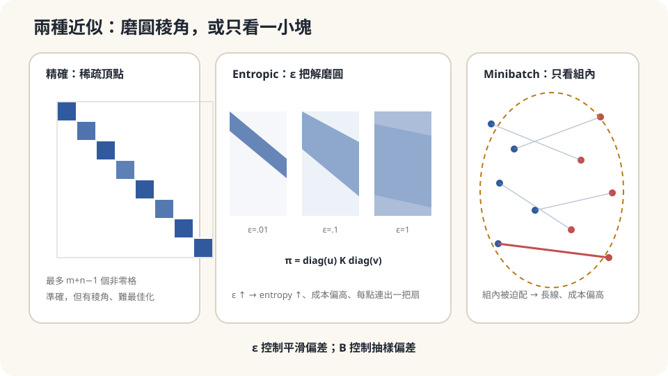

import Objectives from '../../../components/Objectives.astro';
import Prereq from '../../../components/Prereq.astro';
import Question from '../../../components/Question.astro';
import Answer from '../../../components/Answer.astro';
import QuizBlock from '../../../components/QuizBlock.astro';
import Option from '../../../components/Option.astro';
import Explanation from '../../../components/Explanation.astro';
import VizPlan from '../../../components/VizPlan.astro';
import Details from '../../../components/Details.astro';
import Bridge from '../../../components/Bridge.astro';
import Ref from '../../../components/Ref.astro';
import UsedBy from '../../../components/UsedBy.astro';

# 五萬個倉庫怎麼算：Sinkhorn 與 Minibatch 近似

<Objectives>
- **寫出 entropic OT 與最佳解 $\pi=\mathrm{diag}(u)K\mathrm{diag}(v)$ 的形狀。** 解釋 Sinkhorn 為什麼只要交替正規化列和欄。
- **說出 $\varepsilon$ 如何在精確 OT 與獨立 coupling 之間插值。** 解釋它為什麼讓運輸表更分散、原始運輸成本偏高。
- **說出 minibatch 近似的偏差方向：在小組內配對得到的距離期望高於真實 $W_2$、得到的配對比真實最佳配對「更亂」，且偏差隨 batch 變大而縮小。** 對一個大規模情境判斷該用哪種近似、驗證偏差的方向與大小。
</Objectives>

<Prereq items={frontmatter.prereqs} />

## 二十五億格的表

<Ref to="math-warehouse-ot"/> 的運輸表在三個倉庫、三家店時是九格，LP 一瞬間解完。現在倉庫與店各有五萬個：表有 $5\times10^4\times5\times10^4=2.5\times10^9$ 格。光是把成本矩陣存進記憶體就要二十 GB，LP 的複雜度更是 $n^3$ 量級——算不動。

而「五萬個」在現實裡很常見：五萬張圖片的特徵、五萬個顧客、五萬個粒子。你需要 $W_2$ 或最佳配對，但不可能精確算。

先用直覺想兩條路，並寫下你覺得各自會**偏在哪個方向**：（一）不要求「最省」，接受一個「差不多省、但好算」的搬法；（二）不要一次配五萬個，隨機抽兩百個倉庫、兩百家店，在小組裡配，多抽幾次取平均。第一條路的答案會比真實成本高還是低？第二條路算出來的距離會比真實 $W_2$ 大還是小？

<Question id="Q1">
翻成數學。「差不多省、但好算」可以怎麼寫成一個修改過的最佳化問題？「在小組裡配」估的是什麼量——它和 $W_2(\mu,\nu)$ 是同一個東西嗎？

<Answer>
課堂上第一條路的候選很多（貪婪配對、只看最近的幾家店…），但有一個修改特別乾淨：在成本上**加一個懲罰「太集中」的項**。運輸表 $\pi$ 越集中（每列只有一格不為零）越像精確解、越難算；越分散（接近獨立 coupling）越平滑。用 entropy $H(\pi)=-\sum\pi_{ij}\log\pi_{ij}$ 量「分散程度」，解

$$
\min_{\pi\in\Pi(a,b)}\ \sum_{ij}\pi_{ij}c_{ij}\;-\;\varepsilon\,H(\pi),\qquad\varepsilon>0 .
$$

這叫 **entropic optimal transport**。$\varepsilon$ 是「願意為了好算而多付多少油錢」的兌換率。它的最佳解會比精確解**分散**、成本**偏高**——這是第一條路的偏差方向，下面會證明。

第二條路：抽 $B$ 個倉庫、$B$ 家店，在小組裡精確解 $W_2$（$B$ 小到可以用 LP 或排序），對很多組取平均：$\mathbb E\big[W_2(\hat\mu_B,\hat\nu_B)\big]$，$\hat\mu_B$ 是 $B$ 個樣本的經驗分佈。它**不是** $W_2(\mu,\nu)$：一個小組裡的兩百個點根本代表不了整個分佈，硬要在組內把每個倉庫配到某家店，會被迫配到不該配的地方。這條路的偏差方向是：估出來的距離**高於** $W_2(\mu,\nu)$，配對比真實最佳配對**更亂**。
</Answer>
</Question>

## 把稜角磨圓，或只看一小塊

精確 OT 的解是運輸多面體的一個頂點——一個有稜角的東西，最多 $m+n-1$ 格不為零。要找到頂點得走 LP 那種組合式的路。

**Entropic OT 把稜角磨圓。** 加了 $-\varepsilon H(\pi)$ 之後，目標是 strictly convex 的，最佳解在多面體**內部**、每一格都嚴格大於零，而且有一個極簡的形狀：一個固定的矩陣 $K_{ij}=e^{-c_{ij}/\varepsilon}$，左右各乘一個對角縮放。要找到它，只要**輪流**把列和調成 $a$、把欄和調成 $b$——每一輪是一次矩陣乘向量。這就是 Sinkhorn。

**Minibatch 只看一小塊。** 五萬對五萬看不完，就看兩百對兩百。組內的問題小到能精確解。代價是每一組都在「以偏概全」：組裡剛好沒有某個區域的店，那個區域的倉庫就被迫送遠。



*圖：Sinkhorn 用 ε 磨圓稜角；minibatch 用 B 限制視野，兩者造成不同方向的偏差。*

## Sinkhorn

**解的形狀。** 對 entropic 問題寫 Lagrangian，對每個 $\pi_{ij}$ 微分令其為零：

$$
c_{ij}+\varepsilon(\log\pi_{ij}+1)-f_i-g_j=0
\quad\Longrightarrow\quad
\pi_{ij}=\underbrace{e^{(f_i-\varepsilon)/\varepsilon}}_{u_i}\;\underbrace{e^{-c_{ij}/\varepsilon}}_{K_{ij}}\;\underbrace{e^{g_j/\varepsilon}}_{v_j},
$$

$f,g$ 是列和、欄和兩組約束的 Lagrange multiplier。所以**最佳解一定是 $\pi=\mathrm{diag}(u)\,K\,\mathrm{diag}(v)$**：$K$ 由成本與 $\varepsilon$ 決定、只算一次；未知的只有 $m+n$ 個縮放因子 $u,v$，不是 $mn$ 個格子。

**Sinkhorn 演算法。** 把 $u,v$ 調到列和是 $a$、欄和是 $b$。兩個約束分開看各自是一行：

$$
\text{列和}=a:\ \ u_i=\frac{a_i}{(Kv)_i},\qquad
\text{欄和}=b:\ \ v_j=\frac{b_j}{(K^{\!\top}u)_j}.
$$

輪流做——固定 $v$ 解 $u$、固定 $u$ 解 $v$——每一步都精確滿足其中一組約束、稍微破壞另一組。Sinkhorn & Knopp [3] 證明它收斂到唯一的 $(u,v)$（差一個常數倍）；Cuturi [1] 把它帶進大規模 OT。每一輪是兩次矩陣乘向量，$O(mn)$；五萬對五萬時 $K$ 仍是 $2.5\times10^9$ 格，但不需要 LP 的組合搜尋，而且矩陣乘向量可以平行、可以用 GPU，幾十輪就收斂。

**$\varepsilon$ 兩端的極限。** $\varepsilon\to\infty$：$K\to$ 全 1 的矩陣，$\pi\to$ 獨立 coupling $ab^\top$——完全不看成本。$\varepsilon\to0$：$-\varepsilon H$ 消失，回到精確 OT（但 $K=e^{-c/\varepsilon}$ 的元素會下溢到 0，數值上要在 $\log$ 域做——展開框）。中間的 $\varepsilon$ 是取捨：越小越準、越大越快收斂、越穩定。

**偏差的方向。** 精確解 $\pi^*$ 的成本 $\langle\pi^*,c\rangle$ 是所有 coupling 裡最小的；entropic 解 $\pi_\varepsilon$ 是另一個 coupling，所以 $\langle\pi_\varepsilon,c\rangle\ge\langle\pi^*,c\rangle$——**entropic 解的運輸成本永遠不低於真實 OT**。它多付的成本換來的是 $H(\pi_\varepsilon)\ge H(\pi^*)$：拆得更散。

<Details summary="log 域的 Sinkhorn、Sinkhorn divergence、以及 ε 的偏差量級">
數值上 K = e^\{−c/ε\} 在 ε 小時會下溢（c/ε ≈ 700 就變成 0）。改在 log 域做：令 f = ε log u、g = ε log v，更新變成 f_i = ε log a_i − ε log Σ_j exp((g_j − c_\{ij\})/ε)，用 log-sum-exp 穩定計算。這是實務上的標準寫法。

entropic 成本 ⟨π_ε, c⟩ 與精確 OT 的差是 O(ε log(1/ε)) 量級（Peyré & Cuturi [2] 第 4.1 節）；ε → 0 時收斂但很慢。另外 entropic OT 有一個討厭的性質：把同一個分佈搬到自己，成本不是零（π_ε 會把質量拆散到鄰近的點）。Genevay et al. [5] 的修正是 **Sinkhorn divergence**：S_ε(μ,ν) = OT_ε(μ,ν) − ½OT_ε(μ,μ) − ½OT_ε(ν,ν)，把「搬到自己也有成本」的那部分扣掉；它在 μ = ν 時為零、對 ε 的偏差小得多，是拿 entropic OT 當「距離」用時的標準版本。
</Details>

## Minibatch 的偏差

抽 $B$ 個 $\mu$ 的樣本、$B$ 個 $\nu$ 的樣本，各成經驗分佈 $\hat\mu_B,\hat\nu_B$，算 $W_2(\hat\mu_B,\hat\nu_B)$，對抽樣取期望。兩件事可以說清楚。

**距離偏高。** 這可以證明：$\mathrm{OT}(\mu,\nu)=\min_\pi\langle\pi,c\rangle$ 對 $(\mu,\nu)$ 這一對是**jointly convex** 的（兩個 coupling 的凸組合仍是對應邊際凸組合的 coupling，所以最小值不會高於凸組合），而 $\mathbb E[\hat\mu_B]=\mu$、$\mathbb E[\hat\nu_B]=\nu$，<Ref to="math-jensen"/> 立刻給

$$
\mathbb E\big[W_2^2(\hat\mu_B,\hat\nu_B)\big]\;\ge\;W_2^2\big(\mathbb E\hat\mu_B,\mathbb E\hat\nu_B\big)=W_2^2(\mu,\nu).
$$

直覺是：組內的配對被「組裡只有這 $B$ 家店」的限制綁住，每個倉庫的最近選項比全體裡少，被迫送得更遠。極端例子：$\mu=\nu$，真實 $W_2=0$；但兩組獨立抽出的 $B$ 個點幾乎不會重合，$W_2(\hat\mu_B,\hat\nu_B)>0$ 嚴格成立，且在 $d$ 維以 $B^{-1/d}$ 的速率緩慢趨近零（經驗分佈的 $W_2$ 收斂速率，見 Peyré & Cuturi [2]）。所以 **minibatch $W_2$ 對「兩個分佈其實相同」的判斷有系統性偏差**，$B$ 越小、維度越高越嚴重 [4]。

**配對偏亂。** 把每一組內的最佳配對合起來，得到一個「minibatch coupling」$\bar\pi_B=\mathbb E[\pi^*_B]$。它是 $\mu,\nu$ 的合法 coupling（每組內邊際都對，平均後也對），所以它的成本 $\ge W_2^2$——又是「任何 coupling 給上界」。而且它**不是**一個映射：同一個倉庫在不同組裡會被配到不同的店，平均後一個 $x$ 對應到一片 $y$。$B\to\infty$ 時 $\bar\pi_B\to\pi^*$，$B=1$ 時 $\bar\pi_1=\mu\otimes\nu$（獨立 coupling）——**$B$ 在「精確 OT」與「完全隨機配」之間插值**，角色與 Sinkhorn 的 $\varepsilon$ 相同。

兩種近似殊途同歸：**都給出一個比精確解更分散的 coupling、成本偏高**；一個用 $\varepsilon$ 控制、一個用 $1/B$ 控制。

## 該用哪個

回答起點問題。第一條路（entropic）成本**偏高**、配對**偏散**，偏差由 $\varepsilon$ 控制，代價是 $O(mn)$ 的矩陣乘向量——五萬對五萬在 GPU 上可行，但 $K$ 要 $2.5\times10^9$ 格的記憶體（可以分塊）。第二條路（minibatch）成本**偏高**、配對**偏亂**，偏差由 $B$ 控制，記憶體只要 $B^2$，但每組的估計有隨機性、要多抽幾組平均。

選擇的判準：**你要的是「距離」還是「配對」？** 若要的是一個數字（兩個大點雲差多少），Sinkhorn divergence 加中等的 $\varepsilon$ 通常最好——偏差可控、無隨機性。若要的是「每個 $x$ 該配哪個 $y$」而且要在訓練迴圈裡每一步都算，minibatch 是唯一現實的選擇——這時你要清楚配對是「偏亂」的，$B$ 越大越接近真實 OT。

依賴的假設：Sinkhorn 的收斂需要 $K$ 沒有全零的列或欄（$\varepsilon$ 太小時會發生，要用 log 域）；minibatch 的偏差分析假設樣本獨立同分佈抽自 $\mu,\nu$。兩者的偏差方向（成本偏高）是嚴格的，但偏差的大小要靠實驗量。

## 縮小成兩千個，把三個數並排

```python
import numpy as np
from scipy.special import logsumexp
from scipy.optimize import linear_sum_assignment
rng = np.random.default_rng(0)
n, d = 2000, 2
X = rng.normal(0, 1, (n, d)); Y = rng.normal(0, 1, (n, d)) @ np.diag([2, 0.5]) + np.array([3, 0])
print(9 + (1-2)**2 + (1-0.5)**2)                                            # closed form W₂² = 10.25（μ=N(0,I)、ν=N((3,0), diag(4,¼))）
C = ((X[:, None, :] - Y[None, :, :])**2).sum(-1)                            # 2000×2000 成本矩陣
r, c = linear_sum_assignment(C); print(C[r, c].mean())                      # 2000 個樣本的精確 OT ≈ 10.73（抽樣誤差在上方）
def sinkhorn_log(C, eps, iters=1000):                                        # log 域的 Sinkhorn：輪流修列和、欄和
    m = C.shape[0]; loga = -np.log(m) * np.ones(m); f = np.zeros(m); g = np.zeros(m)
    for _ in range(iters):
        f = eps * (loga - logsumexp((g[None, :] - C) / eps, axis=1))       # 修列和
        g = eps * (loga - logsumexp((f[:, None] - C) / eps, axis=0))       # 修欄和
    logP = (f[:, None] + g[None, :] - C) / eps; P = np.exp(logP)
    return (P * C).sum(), -(P * logP).sum()
for eps in [0.05, 0.2, 1.0, 5.0]:
    cost, H = sinkhorn_log(C, eps); print(eps, round(cost, 2), round(H, 2))  # 成本 10.77 → 13.31 單調上升；entropy 上升
def minibatch_w2(C, B, reps=200):                                           # 小組內用 assignment 精確解
    vals = []
    for _ in range(reps):
        i = rng.choice(n, B, replace=False); j = rng.choice(n, B, replace=False)
        S = C[np.ix_(i, j)]; r, c = linear_sum_assignment(S); vals.append(S[r, c].mean())
    return np.mean(vals)
for B in [8, 32, 128, 512]: print(B, round(minibatch_w2(C, B), 2))         # 11.91 → 10.77：從上方逼近 10.73
# 破壞：μ = ν（真值 0）
Y2 = rng.normal(0, 1, (n, d)); C2 = ((X[:, None, :] - Y2[None, :, :])**2).sum(-1)
for B in [8, 512]: print('same', B, round(minibatch_w2(C2, B, 50), 3))     # 1.33、0.064：相同分佈被判成有差
```

三組數字並排。closed form 真值 $10.25$；用全部 2000 個樣本精確解 assignment 得 $10.73$（有限樣本的估計本身就偏高一點）。Sinkhorn 成本隨 $\varepsilon$ 從 $10.77$ 單調升到 $13.31$、entropy 從 $11.6$ 升到 $15.0$——**偏高、偏散**，而且 $\varepsilon=0.05$ 就已經在 $K=e^{-C/\varepsilon}$ 下溢的邊緣，所以程式直接寫成 $\log$ 域。minibatch 從 $B=8$ 的 $11.91$ 降到 $B=512$ 的 $10.77$，**從上方**逼近 $10.73$。

這裡有一個實作上很會騙人的地方，最好自己驗一次。把 `iters` 從 1000 降回 300，$\varepsilon=0.05$ 會給出 $10.49$——**比精確解 $10.73$ 還低**，直接違反上面那個「entropic 解的成本不低於真實 OT」。原因不是定理錯了，是那個 $P$ 還不是合法的 coupling：300 輪之後列邊際的 $L_1$ 誤差還有 $0.038$，質量沒有守好，成本自然可以被壓到下界以下。$\varepsilon$ 越小收斂越慢，所以**看到「比精確解還低」的第一件事是去檢查邊際**，不是去懷疑定理。

**刻意違反一個假設。** 把 $Y$ 換成與 $X$ 同分佈的另一組樣本（真值 $W_2=0$）：2000 對 2000 的精確解給 $0.02$，minibatch 在 $B=8$ 時給 $1.33$、$B=512$ 時給 $0.067$——它會把「兩個相同的分佈」判成「有差」，$B$ 越小越嚴重。再把 $\varepsilon$ 壓到 $10^{-3}$ 且改回普通域的 $K=e^{-C/\varepsilon}$：矩陣大量下溢成 0、`K @ v` 出現零、除法變成 `inf`——這就是為什麼要在 $\log$ 域做。

<iframe loading="lazy" src="/personal_website/notes/research_areas/mathematical-foundations/m6-optimal-transport/m6-3-1.html" class="demo-frame" title="Sinkhorn ε 與 minibatch B 互動示範" style="height: 900px; width: 100%; border: none;"></iframe>

**互動 demo：切換兩種近似並逐步更新，觀察 coupling、成本、entropy 與邊際誤差。**

## 檢查理解

<QuizBlock id="m6-3-a">
你用 Sinkhorn 算兩個點雲的距離，發現把**同一個**點雲跟自己比，算出來的成本不是零。這是：
<Option>程式有 bug。</Option>
<Option correct>entropic OT 的固有性質——$\varepsilon>0$ 時最佳解會把每個點的質量拆散到鄰近的點，搬到自己也要付成本；拿它當距離用時要改用 Sinkhorn divergence，把自我運輸的成本扣掉。</Option>
<Option>$\varepsilon$ 太小造成的數值誤差。</Option>
<Explanation>
精確 OT 搬到自己成本為零（coupling 取 $y=x$）；entropic 解在多面體內部、每格都為正，不可能集中在對角線上。$\varepsilon$ 越大這個「自我成本」越大，不是越小。Sinkhorn divergence $\mathrm{OT}_\varepsilon(\mu,\nu)-\tfrac12\mathrm{OT}_\varepsilon(\mu,\mu)-\tfrac12\mathrm{OT}_\varepsilon(\nu,\nu)$ 就是為此設計的。
</Explanation>
</QuizBlock>

<QuizBlock id="m6-3-b">
你要在訓練迴圈裡、每一步都拿到「這批 $x$ 該配哪些 $y$」的最佳配對，資料有百萬筆。現實的選擇是：
<Option>每一步對全部百萬筆解一次 LP。</Option>
<Option correct>minibatch：在每一批（例如 256 對 256）裡精確解 assignment，接受配對「偏亂」、成本偏高的代價；$B$ 越大越接近真實 OT，但記憶體與時間是 $B^2$。</Option>
<Option>用 $\varepsilon\to0$ 的 Sinkhorn 算全部百萬筆。</Option>
<Explanation>
百萬筆的 LP 或 Sinkhorn 每步都算不可行（$K$ 是 $10^{12}$ 格）。minibatch 是唯一現實的路，重點是**知道它偏在哪**：得到的配對是「組內最佳」而非「全體最佳」，同一個 $x$ 在不同批會配到不同 $y$，平均起來像一個比精確解更散的 coupling。
</Explanation>
</QuizBlock>

<QuizBlock id="m6-3-c">
把 Sinkhorn 的 $\varepsilon$ 調到很大、或把 minibatch 的 $B$ 調到 1，兩者的極限分別是：
<Option>兩者都趨近精確 OT。</Option>
<Option correct>兩者都趨近**獨立 coupling** $\mu\otimes\nu$——完全不看成本的隨機配對；精確 OT 在另一端（$\varepsilon\to0$、$B\to\infty$）。</Option>
<Option>Sinkhorn 趨近精確 OT，minibatch 趨近獨立 coupling。</Option>
<Explanation>
$\varepsilon\to\infty$ 時 $K\to$ 全 1，$\pi\to ab^\top$；$B=1$ 時每組只有一個 $x$ 一個 $y$、只能配在一起，平均後是 $\mu\otimes\nu$。兩個設定都在同一條線段的兩端之間插值，只是一個用平滑、一個用抽樣。
</Explanation>
</QuizBlock>

<UsedBy slug={frontmatter.slug} />

<Bridge>
Sinkhorn 用 $\varepsilon$ 把尖銳的最佳配對磨平，minibatch 則只在一小群樣本裡配對；兩者都把算不動的精確 OT 換成可以實際執行、但帶偏差的近似。

Mathematical Foundations 到這裡收束。留下來的不是一張公式清單，而是一個反覆使用的做法：先把生活問題翻成數學，說清楚公式依賴的假設，再刻意看它何時失效。之後在其他課程裡遇到陌生工具，就從篇末的 Used By 回來補上這一塊。
</Bridge>

## 參考文獻

1. Cuturi, M. [*Sinkhorn Distances: Lightspeed Computation of Optimal Transport.*](https://arxiv.org/abs/1306.0895) NeurIPS 2013.（把 entropic 正則化與 Sinkhorn 迭代帶進大規模 OT。）
2. Peyré, G., Cuturi, M. [*Computational Optimal Transport.*](https://arxiv.org/abs/1803.00567) Foundations and Trends in Machine Learning 11(5–6), 2019.（第 4 章：entropic OT、Sinkhorn 的推導與收斂、log 域實作、$\varepsilon$ 的偏差量級；第 8.5 節：經驗分佈的收斂速率。）
3. Sinkhorn, R., Knopp, P. [*Concerning Nonnegative Matrices and Doubly Stochastic Matrices.*](https://doi.org/10.2140/pjm.1967.21.343) Pacific Journal of Mathematics 21(2), 1967.（交替正規化收斂到唯一的對角縮放。）
4. Fatras, K., Zine, Y., Flamary, R., Gribonval, R., Courty, N. [*Learning with Minibatch Wasserstein: Asymptotic and Gradient Properties.*](https://arxiv.org/abs/1910.04091) AISTATS 2020.（minibatch OT 的偏差、$\mu=\nu$ 時不為零、隨 $B$ 的收斂。）
5. Genevay, A., Peyré, G., Cuturi, M. [*Learning Generative Models with Sinkhorn Divergences.*](https://arxiv.org/abs/1706.00292) AISTATS 2018.（Sinkhorn divergence：扣掉自我運輸成本。）
